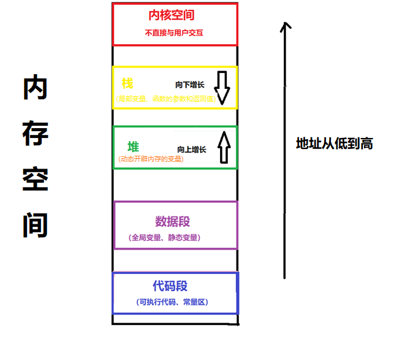
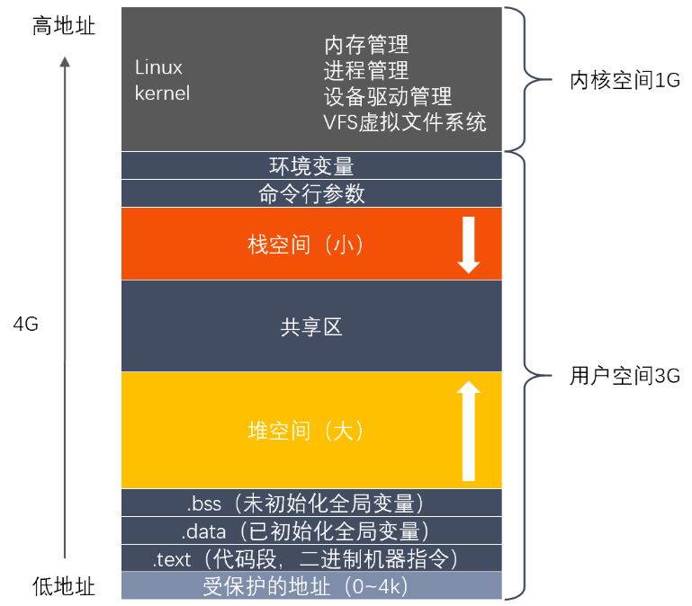
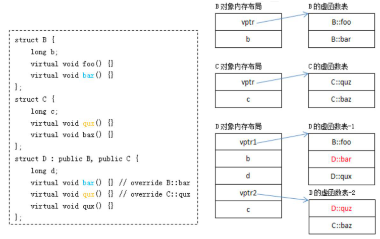

使用printf 时最好添加头文件 #include \<cstdio>

# C++八股 — C++基础

## 1 C++四种智能指针

- 为什么要使⽤智能指针：**智能指针其作用是管理⼀个指针，避免程序员申请的空间在函数结束时忘记释放，造成内存泄漏这种情况的发生**
- 然后使⽤智能指针可以很⼤程度上的避免这个问题，因为**智能指针就是⼀个类，当超出类的作用域时，类会自动调用析构函数，析构函数会自动释放资源。所以智能指针的作用原理就是在函数结束时自动释放内存空间，不需要手动释放内存空间**  

常⽤接⼝

```
T* get();
T& operator*();
T* operator->();
T& operator=(const T& val);
T* release();
void reset (T* ptr = nullptr);  
```

- T 是模板参数, 也就是传⼊的类型
- get() ⽤来获取 auto_ptr 封装在内部的指针, 即获取原⽣指针
- operator() 重载 , operator->() 重载了->, operator=()重载了=
- realease() 将 auto_ptr 封装在内部的指针置为 nullptr, 但并不会破坏指针所指向的内容, 函数返回的是内部指针置空之前的值
- 直接释放封装的内部指针所指向的内存, 如果指定了 ptr 的值, 则将内部指针初始化为该值 (否则将其设置为nullptr)

下⾯分别说⼀下哪四种：

- **auto_ptr**(C++98 的⽅案， C11 已抛弃)采⽤所有权模式

```
auto_ptr<std::string> p1 (new string ("hello"));
auto_ptr<std::string> p2;
p2 = p1; //auto_ptr 不会报错  
```

此时不会报错， p2剥夺 p1的所有权，但是当程序运⾏时访问 p1 将会报错。所以 auto_ptr 缺点是：**存在潜在的内存崩溃问题**

- **unique_ptr**(替换 auto_ptr)

unique_ptr实现独占式拥有或严格拥有概念，**保证同一时间内只有一个智能指针可以指向该对象。它对于避免资源泄露特别有用**，采⽤所有权模式，还是上⾯那个例⼦

```
unique_ptr<string> p3 (new string (auto));// #4
unique_ptr<string> p4;// #5
p4 = p3;// 此时会报错  
```

编译器认为 p4=p3非法，避免 p3 不再指向有效数据的问题。所以**unique_ptr 比 auto_ptr 更安全**

- **shared_ptr**(共享型，强引用)

shared_ptr 实现共享式拥有概念，多个智能指针可以指向相同对象，该对象和其相关资源会在“最后⼀个引用被销毁”时候释放。从名字 share 就可以看出资源可以被多个指针共享，它使用计数机制来表明资源被⼏个指针共享

可以通过成员函数 use_count()来查看资源的所有者个数，除了可以通过 new 来构造，还可以通过传⼊auto_ptr,unique_ptr,weak_ptr 来构造。当我们调⽤ release() 时，当前指针会释放资源所有权，计数减⼀。当计数等于0时，资源会被释放

**shared_ptr 是为解决 auto_ptr 在对象所有权上的局限性(auto_ptr 是独占的)，在使用引用计数的机制上提供可以共享所有权的智能指针**

-  **weak_ptr**(**弱引用**)

weak_ptr 是⼀种不控制对象⽣命周期的智能指针，指向⼀个 shared_ptr 管理的对象。进⾏该对象的内存管理的是强引⽤的 shared_ptr

weak_ptr 只是提供对管理对象的⼀个访问⼿段。 weak_ptr 设计的⽬的是为配合 shared_ptr ⽽引⼊的⼀种智能指针来协助 shared_ptr ⼯作，它只可以从⼀个 shared_ptr 或另⼀个 weak_ptr 对象构造,，它的构造和析构不会引起引⽤记数的增加或减少

weak_ptr 是⽤来**解决 shared_ptr 相互引用时的死锁问题**，如果说两个 shared_ptr 相互引⽤，那么这两个指针的引⽤计数永远不可能下降为0，也就是资源永远不会释放。它是对对象的⼀种弱引⽤，不会增加对象的引⽤计数，和 shared_ptr 之间可以相互转化，shared_ptr 可以直接赋值给它，它可以通过调⽤ lock 函数来获得shared_ptr

当两个智能指针都是shared_ptr类型的时候，析构时两个资源引⽤计数会减⼀，但是两者引⽤计数还是为 1，导致跳出函数时资源没有被释放(析构函数没有被调⽤)，解决办法：把其中⼀个改为weak_ptr就可以

## 2 C++内存分配情况



- **栈**：由编译器管理分配和回收，存放**局部变量和函数参数**
- **堆**：由程序员管理，需要⼿动 new malloc delete free 进⾏分配和回收，空间较⼤，但可能会出现内存泄漏和空闲碎⽚的情况
- **全局/静态存储区**：分为初始化和未初始化两个相邻区域，**存储初始化和未初始化的全局变量和静态变量**
- **常量存储区**：存储常量，⼀般不允许修改
- **代码区**：存放程序的⼆进制代码  



## 3 C++的指针参数传递和引用参数传递

- **指针参数传递本质上是值传递**，**传递的是⼀个地址值**。值传递过程中，被调函数的形式参数作为被调函数的局部变量处理，会在栈中开辟内存空间以存放由主调函数传递进来的实参值，从⽽形成实参的⼀个副本(替身)。**值传递的特点**是被调函数对形式参数的任何操作都是作为局部变量进⾏的，不会影响主调函数的实参变量的值（**形参指针变了，实参指针不会变**）
- **引用参数传递过程中，被调函数的形式参数也作为局部变量在栈中开辟内存空间，但这时存放的是由主调函数放进来的实参变量的地址**。被调函数对形参(本体)的任何操作都被处理成间接寻址，即**通过栈中存放的地址访问主调函数中的实参变量**(根据别名找到主调函数中的本体)。因此被调函数对形参的任何操作都会影响主调函数中的实参变量
- **引⽤传递和指针传递是不同的**，虽然他们都是在被调函数栈空间上的⼀个局部变量，但是任何对于引⽤参数的处理都会通过⼀个间接寻址的⽅式操作到主调函数中的相关变量。⽽对于指针传递的参数，如果改变被调函数中的指针地址，它将应⽤不到主调函数的相关变量。如果想通过指针参数传递来改变主调函数中的相关变量(地址)，那就得使⽤指向指针的指针或者指针引⽤
- **从编译的角度来讲**，程序在编译时分别将指针和引⽤添加到符号表上，符号表中记录的是变量名及变量所对应地址。指针变量在符号表上对应的地址值为指针变量的地址值，而引用在符号表上对应的地址值为引⽤对象的地址值(与实参名字不同，地址相同)。符号表⽣成之后就不会再改，因此指针可以改变其指向的对象(指针变量中的值可以改)，而引用对象则不能修改

## 4 const和static关键字(定义用途)

### 4.1 static关键字

> 作⽤：控制变量的存储⽅式和可⻅性  

**作用1 — 修饰局部变量**：⼀般情况下，对于局部变量在程序中是存放在栈区的，并且局部的⽣命周期在包含语句块执⾏结束时便结束。但是**如果⽤ static 关键字修饰的话，该变量便会存放在静态数据区，其生命周期会一直延续到整个程序执行结束**。但是要注意的是，虽然用static 对局部变量进行修饰之后，其生命周期以及存储空间发生变化，但其作⽤域并没有改变，作用域还是限制在其语句块

**作用2 — 修饰全局变量**：对于⼀个全局变量，它既可以在本⽂件中被访问到，也可以在同⼀个⼯程中其它源⽂件被访问(添加 extern进⾏声明即可)。**⽤ static 对全局变量进行修饰改变其作用域范围，由原来的整个工程可见变成本文件可见**

**作用3 — 修饰函数**：⽤static 修饰函数，情况和修饰全局变量类似，也是改变函数的作用域

**作用4 — 修饰类**：如果 C++ 中对类中的某个函数⽤ static 修饰，则表示该函数属于⼀个类⽽不是属于此类的任何特定对象；如果对类中的某个变量进⾏ static 修饰，则表示该变量以及所有的对象所有，存储空间中只存在⼀个副本，可以通过；类和对象去调⽤。(补充：**静态非常量数据成员，其只能在类外定义和初始化，在类内仅是声明而已**)

**作用5 — 类成员/类函数声明 static**

- 函数体内 static 变量的作⽤范围为该函数体，不同于 auto 变量，该变量的内存只被分配⼀次，因此其值在下次调⽤时仍维持上次的值
- 在**模块内的 static 全局变量可以被模块内所用函数访问**，但不能被模块外其它函数访问
- 在模块内的 static 函数只可被这⼀模块内的其它函数调⽤，这个函数的使⽤范围被限制在声明它的模块内
- 在类中的 static 成员变量属于整个类所拥有，对类的所有对象只有⼀份拷贝
- 在类中的 static 成员函数属于整个类所拥有，这个函数不接收 this 指针，因而只能访问类的 static 成员变量
- static 类对象必须要在类外进行初始化， static 修饰的变量先于对象存在，所以 static 修饰的变量要在类外初始化
- 由于 static 修饰的类成员属于类，不属于对象，因此 static 类成员函数是没有 this 指针， this 指针是指向本对象的指针，正因为没有 this 指针，所以 static 类成员函数不能访问非static 的类成员，只能访问static修饰的类成员
- static成员函数不能被 virtual 修饰， static 成员不属于任何对象或实例，所以加上 virtual 没有任何实际意义。静态成员函数没有 this 指针，虚函数的实现是为每⼀个对象分配⼀个 vptr 指针，而vptr 是通过 this 指针调用的，所以不能为 virtual；虚函数的调⽤关系， this->vptr->ctable->virtual function

### 4.2 const关键字

> 作用：含义及实现机制  

- **const 修饰基本数据类型**：基本数据类型，修饰符 const 可以⽤在类型说明符前，也可以⽤在类型说明符后，其结果是⼀样的。在使⽤这些常量的时候，只要不改变这些常量的值即可

- **const 修饰指针变量和引用变量**：如果 const 位于*的左侧，则 **const 就是⽤来修饰指针所指向的变量(常量指针)**，即**指针指向为常量**；如果 const 位于\*的右侧，则 **const 就是修饰指针本身(指针常量)**，即**指针本身是常量**

- **const 应用到函数中**：作为参数的 const 修饰符：调⽤函数的时候，⽤相应的变量初始化 const 常量，则在函数体中，按照 const 所修饰的部分进⾏常量化，保护了原对象的属性。 [注意]：参数 **const 通常⽤于参数为指针或引用的情况**; 作为函数返回值的 const 修饰符：声明了返回值后， const 按照"修饰原则"进⾏修饰，起到相应的保护作⽤

- **const 在类中的用法**： const 成员变量，只在某个对象⽣命周期内是常量，⽽对于整个类⽽⾔是可以改变的。因为类可以创建多个对象，不同的对象其 const 数据成员值可以不同。所以不能在类的声明中初始化 const 数据成员，因为类的对象在没有创建时候，编译器不知道 const 数据成员的值是什么。 const 数据成员的初始化只能在类的构造函数的初始化列表中进⾏。 const 成员函数： const 成员函数的主要⽬的是防⽌成员函数修改对象的内容。要注意， const 关键字和 static 关键字对于成员函数来说是不能同时使⽤的，因为 static 关键字修饰静态成员函数不含有 this 指针，即不能实例化， const 成员函数⼜必须具体到某⼀个函数

- **const 修饰类对象，定义常量对象**：常量对象只能调⽤常量函数，别的成员函数都不能调⽤

补充： const 成员函数中如果实在想修改某个变量，可以使⽤ mutable 进⾏修饰。成员变量中如果想建⽴在整个类中都恒定的常量，应该⽤类中的枚举常量来实现或者 static const

- **C ++ 中的 const类成员函数（用法和意义）**：常量对象可以调⽤类中的 const 成员函数，但不能调⽤⾮ const 成员函数； （原因：对象调⽤成员函数时，在形参列表的最前⾯加⼀个形参 this，但这是隐式的。 this 指针是默认指向调⽤函数的当前对象的，所以，很⾃然，this 是⼀个常量指针 test * const，因为不可以修改 this 指针代表的地址。但当成员函数的参数列表（即⼩括号）后加了 const 关键字（void print() const;），此成员函数为常量成员函数，此时它的隐式this形参为 const test *const，即不可以通过 this 指针来改变指向对象的值。⾮常量对象可以调⽤类中的 const 成员函数，也可以调⽤⾮ const 成员函数

## 5 C与C++的区别(函数/类/struct/class)

- **C++ 有新增的语法和关键字**，语法的区别有头⽂件的不同和命名空间的不同，**C++ 允许自己定义自己的空间**，C 中不可以。关键字方面比如 C++ 与 C 动态管理内存的⽅式不同， C++ 中在 malloc 和 free 的基础上增加new和delete，而且C++ 中在指针的基础上增加引⽤的概念，关键字例如 C++中还增加auto，explicit 体现显示和隐式转换上的概念要求，还有 dynamic_cast 增加类型安全方面的内容
- **函数方面C++ 中有重载和虚函数的概念**： **C++支持函数重载而C不支持**，是因为 C++ 函数的名字修饰与 C 不同，C++ 函数名字的修饰会将参数加在后⾯，例如， int func(int,double)经过名字修饰之后会变成_func_int_double，而C 中则会变成 _func，所以C++ 中会支持不同参数调用不同函数
- **C++ 还有虚函数概念，用以实现多态**
- **类方面， C的 struct 和 C++ 的类也有很大不同**： C++ 中的 struct 不仅可以有成员变量还可以成员函数，⽽且对于struct 增加权限访问的概念， **struct 的默认成员访问权限和默认继承权限都是 public， C++ 中除了 struct 还有class 表示类， struct 和 class 还有一点不同在于 class 的默认成员访问权限和默认继承权限都是 private**
- **C++ 中增加模板还重用代码，提供更加强大的 STL 标准库**
- C 是⼀种结构化的语⾔，重点在于算法和数据结构。 C 程序的设计⾸先考虑的是如何通过⼀个代码，⼀个过程对输⼊进⾏运算处理输出。⽽ **C++ ⾸先考虑的是如何构造⼀个对象模型，让这个模型能够契合与之对应的问题领域，这样就能通过获取对象的状态信息得到输出**
- **C 的 struct 更适合看成是⼀个数据结构的实现体，而C++ 的 class 更适合看成是⼀个对象的实现体**  

## 6 C++如何定义常量？常量存放在内存的哪个位置？

- 对于**局部常量**，存放在**栈区**
- 对于**全局常量**，编译期⼀般不分配内存，放在符号表中以提高访问效率
- **字面值常量**，比如字符串，放在**常量区** 

## 7 C++重载、重写、重定义的区别

### 7.1 重载

- 翻译自overload，**指同⼀可访问区内被声明的几个具有不同参数列表的同名函数**，依赖于C++函数名字的修饰会将参数加在后面，可以是参数类型，个数，顺序的不同。根据参数列表决定调用哪个函数，重载不关心函数的返回类型


### 7.2 重写

- 翻译自override，**派生类中重新定义父类中除函数体外完全相同的虚函数，注意被重写的函数不能是 static 的，一定要是虚函数，且其他一定要完全相同**。要注意，**重写和被重写的函数是在不同的类当中的，重写函数的访问修饰符是可以不同的，尽管 virtual 中是 private 的，派生类中重写可以改为 public**


### 7.3 重定义(隐藏)

- 派⽣类重新定义父类中相同名字的非virtual 函数，参数列表和返回类型都可以不同，即父类中除定义成 virtual 且完全相同的同名函数才不会被派生类中的同名函数所隐藏(重定义)


## 8 C++所有的构造函数

类的对象被创建时，编译系统为对象分配内存空间，并自动调用构造函数，由构造函数完成成员的初始化⼯作。即**构造函数的作用：初始化对象的数据成员**

- **无参数构造函数**： 即默认构造函数，如果没有明确写出⽆参数构造函数，编译器会⾃动⽣成默认的⽆参数构造函数，函数为空，什么也不做，如果不想使⽤⾃动⽣成的⽆参构造函数，必需要⾃⼰显示写出⼀个⽆参构造函数
- **一般构造函数**： 称重载构造函数，⼀般构造函数可以有各种参数形式，⼀个类可以有多个⼀般构造函数，前提是参数的个数或者类型不同，创建对象时根据传⼊参数不同调⽤不同的构造函数
- **拷贝构造函数**： 拷⻉构造函数的函数参数为对象本身的引⽤，⽤于根据⼀个已存在的对象复制出⼀个新的该类的对象，**⼀般在函数中会将已存在的对象的数据成员的值复制到新创建的对象中**。如果没有显示的写拷贝构造函数，则系统会默认创建⼀个拷贝构造函数，但当类中有指针成员时，最好不要使用编译器提供的默认的拷贝构造函数，最好自己定义并且在函数中执行深拷贝
- **类型转换构造函数**： 根据⼀个指定类型的对象创建⼀个本类的对象，也可以算是⼀般构造函数的⼀种，这里提出来，是想说有的时候不允许默认转换的话，要记得将其声明为 explict 的，来阻⽌⼀些隐式转换的发⽣
- **赋值运算符的重载**：注意，这个类似拷贝构造函数，将＝右边的本类对象的值复制给＝左边的对象，它不属于构造函数，＝左右两边的对象必需已经被创建。如果没有显示的写赋值运算符的重载，系统也会⽣成默认的赋值运算符，做⼀些基本的拷贝⼯作

```
A a1, A a2; a1 = a2;//调⽤赋值运算符
A a3 = a1;//调⽤拷⻉构造函数，因为进⾏的是初始化⼯作，a3 并未存在 
```

## 9 C++四种强制转换

C++ 的四种强制转换包括： **static_cast, dynamic_cast, const_cast, reinterpret_cast**

- **static_cast**：明确指出类型转换，**⼀般建议将隐式转换都替换成显示转换**，因为没有动态类型检查，上⾏转换(派⽣类->基类)安全，下⾏转换(基类->派⽣类)不安全，所以主要执行非多态的转换操作
- **dynamic_cast**：**专门用于派生类之间的转换**，type-id 必须是类指针，类引⽤或 void*，对于下⾏转换是安全的，当类型不⼀致时，转换过来的是空指针，⽽static_cast，当类型不⼀致时，转换过来的事错误意义的指针，可能造成⾮法访问等问题
- **const_cast**：**专门用于const属性的转换**，去除 const 性质，或增加 const 性质， 是四个转换符中唯⼀⼀个可以操作常量的转换符
- **reinterpret_cast(不使用)**：不到万不得已，不要使⽤这个转换符，⾼危操作。使⽤特点： 从底层对数据进⾏重新解释，依赖具体的平台，可移植性差； 可以将整形转 换为指针，也可以把指针转换为数组；可以在指针和引⽤之间进⾏肆⽆忌惮的转换

## 10 指针和引用的区别  

- 指针和引用都是⼀种内存地址的概念，区别为**指针是⼀个实体，引⽤只是⼀个别名**。在程序编译的时候，将指针和引⽤添加到符号表中
- 指针它指向⼀块内存，**指针的内容是所指向的内存的地址**，在编译的时候，则是将“指针变量名-指针变量的地址”添加到符号表中，所以说，指针包含的内容是可以改变的，允许拷贝和赋值，有 const 和非 const 区别，甚至可以为空，sizeof 指针得到的是指针类型的大小
- 对于引⽤来说，它只是⼀块内存的别名，在添加到符号表的时候，是将"引⽤变量名-引⽤对象的地址"添加到符号表中，符号表⼀经完成不能改变，所以引⽤必须⽽且只能在定义时被绑定到⼀块内存上，后续不能更改，也不能为空，也没有 const 和非const 区别
- sizeof 引用得到代表对象的大小。而sizeof 指针得到的是指针本身的大小。另外在参数传递中，指针需要被解引用后才可以对对象进⾏操作，而直接对引用进行的修改会直接作用到引用对象
- 作为参数时也不同，**传指针的实质是传值，传递的值是指针的地址；传引用的实质是传地址，传递的是变量的地址** 

## 11 野(wild)指针与悬空(dangling)指针有什么区别？如何避免？  

- **野指针(wild pointer)**：没有被初始化过的指针。⽤ gcc -Wall 编译, 会出现 used uninitialized 警告
- **悬空指针**：是指针最初指向的内存已经被释放的⼀种指针
- 无论是野指针还是悬空指针，都是指向无效内存区域(这里的无效指是"不安全不可控")的指针。 访问"不安全可控"(invalid)的内存区域将导致"Undefined Behavior"
- **如何避免使用野指针**？ 在平时的编码中，养成在定义指针后且在使⽤之前完成初始化的习惯或者使⽤智能指针

## 12 const修饰指针如何区分  

- 下面都是合法的声明，但是含义⼤不同


```
const int * p1;//指向整形的常量指针，它指向的值不能修改，指向的变量可以修改
int * const p2;//指向整形的指针常量，它指向的变量不能修改，但指向变量的值可以修改
const int *const p3;//指向整形常量的常量指针 。它既不能再指向别的常量，指向的值也不能修改
```

- 理解这些声明的技巧在于，**查看关键字const右边来确定什么被声明为常量，如果该关键字的右边是类型，则值是常量。如果关键字的右边是指针变量，则指针本身是常量**

### 12.1 常量指针(const *不能修改地址中的值)

- 语法：**const 数据类型 *变量名 — 不能通过解引用的方法修改内存地址中的值(使用原始的变量名可以修改值)**
- **指向的变量(对象)可以改变**(之前是指向变量a的，后来可以改为指向变量b)
- 一般用于**修饰函数的形参，表示不希望在函数里修改内存地址中的值**
- 如果用于形参，虽然指向的对象可以改变，但这么做没有任何意义
- 如果**形参的值不需要改变，建议加上const修饰**，程序可读性更好

### 12.2 指针常量(* const 指向对象不可改变 = 引用)

- 语法：**数据类型 * const 变量名 — 指向的变量（对象）不可改变**
- 在定义的同时必须初始化，否则没有意义
- **通过解引用的方法修改内存地址中的值**
- C++编译器把**指针常量**做一些特别的处理，有一个新的名字，叫**引用**

### 12.3 常指针常量

- 语法：**const 数据类型 * const 变量名 —— 指向的变量（对象）不可改变，不能通过解引用的方法修改内存地址中的值**
- **常引用**

## 13 简述函数指针  

从定义和用途两方面来说⼀下自己的理解：

- 首先是定义：**函数指针是指向函数的指针变量**。函数指针本身⾸先是⼀个指针变量，该指针变量指向⼀个具体的函数。这正如⽤指针变量可指向整型变量、字符型、数组⼀样，这⾥是指向函数
- 在编译时，每⼀个函数都有⼀个入口地址，该入口地址就是函数指针所指向的地址。有指向函数的指针变量后，可用该指针变量调用函数，就如同用指针变量可引用其他类型变量⼀样，在这些概念上是⼤体⼀致的
- 其次是用途：调用函数和做函数的参数，比如回调函数  

```
char * fun(char * p) {…} // 函数fun
char * (*pf)(char * p); // 函数指针pf
pf = fun; // 函数指针pf指向函数fun
pf(p); // 通过函数指针pf调⽤函数fun
```

## 14 堆和栈的区别

### 14.1 栈

- **由编译器进行管理，在需要时由编译器自动分配空间，在不需要时候自动回收空间，⼀般保存的是局部变量和函数参数**等
- 连续的内存空间，在函数调⽤的时候，⾸先⼊栈的主函数的下⼀条可执⾏指令的地址，然后是函数的各个参数
- ⼤多数编译器中，参数是**从右向左入栈**（原因在于采用这种顺序，是为让程序员在使⽤C/C++的“函数参数长度可变”这个特性时更方便。如果是从左向右压栈，第⼀个参数（即描述可变参数表各变量类型的那个参数）将被放在栈底，由于可变参的函数第⼀步就需要解析可变参数表的各参数类型，即第⼀步就需要得到上述参数，因此，将它放在栈底是很不方便的。）本次函数调用结束时，局部变量先出栈，然后是参数，最后是栈顶指针最开始存放的地址，程序由该点继续运行，不会产生碎片
- **栈是高地址向低地址扩展，空间较小**

### 14.2 堆

- **由程序员管理，需要手动new、malloc、delete、free进行分配和回收，如果不进行回收的话，会造成内存泄漏的问题**
- 不连续的空间，实际上系统中有⼀个空闲链表，当有程序申请的时候，系统遍历空闲链表找到第⼀个大于等于申请大小的空间分配给程序，⼀般在分配程序的时候，也会空间头部写入内存大小，方便 delete 回收空间大小。当然如果有剩余的，也会将剩余的插⼊到空闲链表中，这也是产生内存碎片的原因
- **堆是低地址向高地址扩展，空间较大，较为灵活**

## 15 函数传递参数的几种方式  

- **值传递**：**形参是实参的拷贝**，函数内部对形参的操作并不会影响到外部的实参
- **指针传递**： 值传递的⼀种方式，**形参是指向实参地址的指针**，**当对形参的指向操作时，就相当于对实参本身进行操作**
- **引用传递**： 实际**把引用对象的地址放在开辟的栈空间中，函数内部对形参的任何操作可以直接映射到外部的实参上面**  

## 16 new/delete, malloc/free区别(重点)

- 都可以用来**在堆上分配和回收空间**，**new /delete 是操作符，malloc/free 是库函数**

- 执行**new 实际上执行两个过程** 

  1.**分配未初始化的内存空(malloc)**

  2.**使用对象的构造函数对空间进行初始化，返回空间的首地址**

  如果在第⼀步分配空间中出现问题，则抛出 std::bad_alloc 异常，或被某个设定的异常处理函数捕获处理，如果在第⼆步构造对象时出现异常，则自动调用delete 释放内存

- 执行**delete 实际上也有两个过程**：

  1. **使用析构函数对对象进行析构** 
  2. **回收内存空间(free)**

- 可以看出 new 和 malloc 的区别， **new 得到的是经过初始化的空间，而malloc 得到的是未初始化的空间**，所以 **new 是 new ⼀个类型，而malloc 则是malloc一个字节长度的空间**。delete 和 free 同理， **delete不仅释放空间还析构对象，delete一个类型， free 一个字节长度的空间**

- 为什么有malloc/free 还需要 new/delete：因为对于非内部数据类型而言，光用malloc/free无法满足动态对象的要求。**对象在创建的同时需要自动执行构造函数，对象在消亡以前要自动执⾏析构函数**。由于 **mallo/free 是库函数而不是运算符，不在编译器控制权限之内，不能够把执行的构造函数和析构函数的任务强加于malloc / free，所以有new／ delete 操作符**  

## 17 volatile和extern关键字  

### 17.1 volatile 三个特性

- **易变性**：在汇编层⾯反映出来，就是两条语句，下⼀条语句不会直接使⽤上⼀条语句对应的 volatile 变量的寄存器内容，而是重新从内存中读取
- **不可优化性**： volatile 告诉编译器，不要对这个变量进⾏各种激进的优化，甚⾄将变量直接消除，保证程序员写在代码中的指令，⼀定会被执行
- **顺序性**：能够保证 volatile 变量之间的顺序性，编译器不会进⾏乱序优化

### 17.2 extern

- C 语⾔中，修饰符extern用在变量或者函数的声明前，用来说明 “此变量/函数是在别处定义的，要在此处引用”
- 注意 extern 声明的位置对其作用域也有关系，如果是在main 函数中进⾏声明的，则只能在 main 函数中调用，在其它函数中不能调用。其实要调用其它⽂件中的函数和变量，只需把该⽂件用 #include 包含进来即可，为啥要⽤extern？因为extern 会加速程序的编译过程，这样能节省时间
- 在 C++ 中 extern 还有另外⼀种作用，用于**指示 C 或者 C++函数的调用规范**。比如在 C＋＋ 中调用C 库函数，就需要在 C++ 程序中用extern “C” 声明要引⽤的函数。这是给链接器⽤的，告诉链接器在链接的时候用C 函数规范来链接。主要原因是C++和 C 程序编译完成后在目标代码中命名规则不同，用此来解决名字匹配的问题  

## 18 define和const区别(编译阶段、安全性、内存占用等)

- 对于define 来说， 宏定义实际上是在预编译阶段进行处理，没有类型，也就没有类型检查，仅仅做的是遇到宏定义进⾏字符串的展开，遇到多少次就展开多少次，而且这个简单的展开过程中，很容易出现边界效应，达不到预期的效果。因为 define 宏定义仅仅是展开，因此运⾏时系统并不为宏定义分配内存，但是从汇编的⻆度来讲，define 却以⽴即数的⽅式保留了多份数据的拷贝
- 对于const 来说，const 是在编译期间进⾏处理的，const 有类型，也有类型检查，程序运⾏时系统会为 const 常量分配内存，而且从汇编的⻆度讲，const 常量在出现的地⽅保留的是真正数据的内存地址，只保留⼀份数据的拷贝，省去不必要的内存空间。而且有时编译器不会为普通的 const 常量分配内存，而是直接将 const 常量添加到符号表中，省去读取和写⼊内存的操作，效率更⾼  

## 19 面向对象的三大特性，举例说明  

- C++ 面向对象的三大特征是：**封装、继承、多态**

### 19.1 封装

- 把客观事物封装成抽象的类，并且类可以把自己的数据和方法只让信任的类或者对象操作，对不可信的进行信息隐藏。**⼀个类就是⼀个封装了数据以及操作这些数据的代码的逻辑实体**。在⼀个对象内部，某些代码或某些数据可以是私有的，不能被外界访问。通过这种⽅式，对象对内部数据提供不同级别的保护，以防止程序中无关的部分意外的改变或错误的使用对象的私有部分

### 19.2 继承

- 指**可以让某个类型的对象获得另⼀个类型的对象的属性的⽅法。它⽀持按级分类的概念**。继承是指这样⼀种能力：它**可以使用现有类的所有功能，并无需重新编写原来的类的情况下对这些功能进行扩展**。通过继承创建的新类称为“子类”或者“派⽣类”，被继承的类称为“基类”、 “父类”或“超类”。继承的过程，就是从⼀般到特殊的过程。要实现继承可通过“继承”和“组合”来实现

- 继承概念的实现方式有两类

  **实现继承**：实现继承是指直接使用基类的属性和方法而无需额外编码的能力

  **接口继承**：接口继承是指仅使用属性和方法的名称、但是子类必需提供实现的能力

### 19.3 多态

- **向不同的对象发送同⼀个消息，不同对象在接收时会产生不同的行为**(即方法)。即⼀个接口，可以实现多种方法
- **多态与非多态的实质区别就是函数地址是早绑定还是晚绑定的**。如果函数的调用，在编译器编译期间就可以确定函数的调用地址，并产⽣代码，则是静态的，即地址早绑定。如果函数调用的地址不能在编译器期间确定，需要在运行时才确定，这就属于晚绑定

## 20  多态的实现 

- **多态其实⼀般就是指继承加虚函数实现的多态**，对于重载来说，实际上基于的原理是，编译器为函数⽣成符号表时的不同规则，重载只是⼀种语⾔特性，与多态无关，与面向对象无关，但这又是 C++中增加的新规则，所以也算属于 C++，所以如果非要说重载算是多态的⼀种，那就可以说： **多态可以分为静态多态和动态多态**
- **静态多态其实就是重载**，因为静态多态是指在编译时期就决定调用哪个函数，根据参数列表来决定
- **动态多态是指通过子类重写父类的虚函数来实现的**，因为是在运⾏期间决定调⽤的函数，所以称为动态多态
- ⼀般情况下我们不区分这两个时所说的多态就是指动态多态
- 动态多态的实现与虚函数表，虚函数指针相关
- 子类是否要重写父类的虚函数：**子类继承父类时，父类的纯虚函数必须重写，否则子类也是⼀个虚类不可实例化**。 定义纯虚函数是为实现⼀个接口，起到⼀个规范的作用，规范继承这个类的程序员必须实现这个函数  

## 21 虚函数相关(虚函数表，虚函数指针)，虚函数的实现原理 

- 首先说下， **C++中多态的表象，在基类的函数前加上 virtual 关键字，在派生类中重写该函数，运行时将会根据对象的实际类型来调用相应的函数**。如果对象类型是派⽣类，就调⽤派⽣类的函数，如果是基类，就调⽤基类的函数
- 实际上，**当⼀个类中包含虚函数时，编译器会为该类生成一个虚函数表，保存该类中虚函数的地址，同样派生类继承基类，派生类中自然一定有虚函数，所以编译器也会为派生类生成自己的虚函数表**。当我们定义⼀个派⽣类对象时，编译器检测该类型有虚函数，所以为这个派⽣类对象⽣成⼀个虚函数指针，指向该类型的虚函数表，这个虚函数指针的初始化是在构造函数中完成的
- 如果有⼀个基类类型的指针，指向派⽣类，那么当调⽤虚函数时，就会根据所指真正对象的虚函数表指针去寻找虚函数的地址，也就可以调⽤派⽣类的虚函数表中的虚函数以此实现多态
- 补充：如果基类中没有定义成 virtual，那么进⾏ Base B; Derived D; Base *p = D; p->function(); 这种情况下调用的则是 Base 中的 function()。因为基类和派⽣类中都没有虚函数的定义，那么编译器就会认为不⽤留给动态多态的机会，就事先进⾏函数地址的绑定（早绑定），详述过程就是，定义了⼀个派⽣类对象，⾸先要构造基类的空间，然后构造派⽣类的⾃身内容，形成⼀个派⽣类对象，那么在进⾏类型转换时，直接截取基类的部分的内存，编译器认为类型就是基类，那么（函数符号表［不同于虚函数表的另⼀个表］中）绑定的函数地址也就是基类中函数的地址，所以执⾏的是基类的函数

## 22  编译器处理虚函数表应该如何处理  

对于派⽣类来说，编译器建立虚函数表的过程其实⼀共是三个步骤：

- **拷贝基类的虚函数表，如果是多继承，就拷贝每个有虚函数基类的虚函数表**

- 当然还有⼀个基类的虚函数表和派生类自身的虚函数表共用⼀个虚函数表，也称为某个基类为派生类的主基类
- 查看派生类中是否有重写基类中的虚函数，如果有，就替换成已经重写的虚函数地址。查看派生类是否有自身的虚函数，如果有，就追加自身的虚函数到⾃身的虚函数表中
- Derived *pd = new D(); B *pb = pd; C *pc = pd; 其中 pb， pd， pc 的指针位置是不同的，要注意的是派生类的自身的内容要追加在主基类的内存块后



## 25 析构函数写成虚函数的原因

- **是为降低内存泄漏的可能性**。举例来说就是，⼀个基类的指针指向⼀个派生类的对象，在使用完毕准备销毁时，如果基类的析构函数没有定义成虚函数，那么编译器根据指针类型就会认为当前对象的类型是基类，调用基类的析构函数(该对象的析构函数的函数地址早就被绑定为基类的析构函数)，仅执行基类的析构，派生类的自身内容将无法被析构，造成内存泄漏
- 如果基类的析构函数定义成虚函数，那么编译器就可以根据实际对象，执行派⽣类的析构函数，再执行基类的析构函数，成功释放内存

## 26 构造函数为什么一般不定义为虚函数

- 虚函数调用只需要知道“部分的”信息，即只需要知道函数接口，而不需要知道对象的具体类型。但是我们要创建⼀个对象的话，是需要知道对象的完整信息的。特别是需要知道要创建对象的确切类型，因此，构造函数不应该被定义成虚函数
- 而且从目前编译器实现虚函数进行多态的方式来看，虚函数的调用是通过实例化之后对象的虚函数表指针来找到虚函数的地址进行调用的，如果说构造函数是虚的，那么虚函数表指针则是不存在的，⽆法找到对应的虚函数表来调⽤虚函数，那么这个调用实际上也是违反**先实例化后调用的准则**

## 27 构造函数或析构函数中调用虚函数会怎样

- 实际上是不应该在构造函数或析构函数中调用虚函数的，因为这样的调用其实并不会带来所想要的效果
- 举例来说就是，有⼀个动物的基类，基类中定义⼀个动物本身行为的虚函数 action_type()，在基类的构造函数中调用这个虚函数
- 派生类中重写这个虚函数，我们期望着根据对象的真实类型不同，⽽调用各自实现的虚函数，但实际上当我们创建⼀个派生类对象时，首先会创建派⽣类的基类部分，执行基类的构造函数，此时派生类的自身部分还没有被初始化，对于这种还没有初始化的东西， C++选择当它们还不存在作为⼀种安全的方法
- 就是说构造派生类的基类部分是，编译器会认为这就是⼀个基类类型的对象，然后调用基类类型中的虚函数实现，没有按照我们想要的方式进行，即对象在派生类构造函数执行前并不会成为⼀个派生类对象
- 在析构函数中也是同理，派⽣类执行析构函数后，派生类的自身成员呈现未定义的状态，那么在执行基类的析构函数中是不可能调用到派生类重写的方法的。所以说，不应该在构在函数或析构函数中调用虚函数，就算调用⼀般也不会达到我们想要的结果

## 28 析构函数的作用，如何起作用？

- 构造函数只是起初始化值的作用，但实例化⼀个对象的时候，可以通过实例去传递参数，从主函数传递到其他的函数里面，这样就使其他的函数里面有值。规则，只要你⼀实例化对象，系统⾃动回调⽤⼀个构造函数，就是你不写，编译器也自动调用⼀次
- 析构函数与构造函数的作用相反，用于撤销对象的⼀些特殊任务处理，可以是释放对象分配的内存空间。特点：析构函数与构造函数同名，但该函数前面加~
- 析构函数没有参数，也没有返回值，⽽且不能重载，在⼀个类中只能有⼀个析构函数。 当撤销对象时，编译器也会自动调用析构函数。 每⼀个类必须有⼀个析构函数，用户可以自定义析构函数，也可以是编译器自动⽣成默认的析构函数。⼀般析构函数定义为类的公有成员

## 29 构造函数的执行顺序？析构函数的执行顺序？

### 29.1 构造函数顺序

- **基类构造函数**：如果有多个基类，则构造函数的调⽤顺序是某类在类派⽣表中出现的顺序，⽽不是它们在成员初始化表中的顺序
- **成员类对象构造函数**：如果有多个成员类对象则构造函数的调⽤顺序是对象在类中被声明的顺序，不是它们出现在成员初始化表中的顺序
- **派生类构造函数**

### 29.2 析构函数顺序

- **调用派生类的析构函数**
- **调用成员类对象的析构函数**
- **调用基类的析构函数**

## 30 纯虚函数(应用于接口继承和实现继承)

实际上，纯虚函数的出现就是为让继承可以出现多种情况

- 有时希望**派生类只继承成员函数的接口**
- 有时又希望**派生类既继承成员函数的接口，又继承成员函数的实现，而且可以在派生类中可以重写成员函数以实现多态**
- 有时⼜希望**派生类在继承成员函数接口和实现的情况下，不能重写缺省的实现**

声明⼀个纯虚函数的目的就是为让派⽣类只继承函数的接⼝，而且派生类中必需提供⼀个这个纯虚函数的实现，否则含有纯虚函数的类将是抽象类，不能进行实例化

对于纯虚函数来说，其实是可以给它提供实现代码的，但是由于抽象类不能实例化，调用这个实现的**唯一方式是在派生类对象中指出其 class 名称来调用**

## 31 静态绑定和动态绑定的介绍

- 说起静态绑定和动态绑定，首先要知道静态类型和动态类型，**静态类型就是它在程序中被声明时所采用的类型，在编译期间确定。动态类型则是指“目前所指对象的实际类型”，在运行期间确定**
- **静态绑定又名早绑定，绑定的是静态类型，所对应的函数或属性依赖于对象的静态类型，发生在编译期间**
- **动态绑定又名晚绑定，绑定的是动态类型，所对应的函数或属性依赖于动态类型，发生在运行期间**
- 比如说virtual 函数是动态绑定的，非虚函数是静态绑定的，缺省参数值也是静态绑定。这⾥需要注意，我们不应该重新定义继承⽽来的缺省参数，因为即使我们重定义，也不会起到效果。因为⼀个基类的指针指向⼀个派生类对象，在派生类的对象中针对虚函数的参数缺省值进行重定义，但是缺省参数值是静态绑定的，静态绑定绑定的是静态类型相关的内容，所以会出现⼀种派⽣类的虚函数实现方式结合基类的缺省参数值的调用效果，这个与所期望的效果不同

## 32 深拷贝和浅拷贝的区别(举例说明深拷贝的安全性)

- 当出现类的等号赋值时，会调用拷贝函数，在未定义显示拷贝构造函数的情况下， 系统会调⽤默认的拷贝函数—即浅拷贝，它能够完成成员的复制。当数据成员中没有指针时，浅拷贝是可行的
- 但当数据成员中有指针时，如果采⽤简单的浅拷⻉，则两类中的两个指针指向同⼀个地址，当对象快要结束时，会调⽤两次析构函数，⽽导致指野指针的问题
- 所以，这时必需采⽤深拷⻉。深拷⻉与浅拷⻉之间的区别就在于**深拷⻉会在堆内存中另外申请空间来存储数据，从而也就解决来野指针的问题**。简⽽⾔之，当数据成员中有指针时，必需要⽤深拷⻉更加安全

## 33 什么情况下会调用拷贝构造函数(三种情况)

类的对象需要拷贝时，拷贝构造函数将会被调⽤，以下的情况都会调用拷贝构造函数：

- ⼀个对象**以值传递的方式传入函数体，需要拷贝构造函数创建⼀个临时对象压入到栈空间中**
- ⼀个对象**以值传递的方式从函数返回，需要执行拷贝构造函数创建⼀个临时对象作为返回值**
- ⼀个对象需要**通过另外⼀个对象进行初始化**

## 34 为什么拷贝构造函数必需时引用传递，不能是值传递？

**为了防止递归调用**：当⼀个对象需要以值方式进行传递时，编译器会⽣成代码调用它的拷贝构造函数生成⼀个副本，如果类 A 的拷贝构造函数的参数不是引用传递，而是采用值传递，那么就又需要为创建传递给拷贝构造函数的参数的临时对象，而又⼀次调用类 A 的拷贝构造函数，这就是⼀个无限递归

## 35 结构体内存对齐方式和为什么要进行内存对齐？

⾸先我们来说⼀下结构体中内存对齐的规则

- 对于结构体中的各个成员，第⼀个成员位于偏移为 0 的位置，以后的每个数据成员的偏移量必须是min(#pragma pack() 制定的数，数据成员本身长度) 的倍数
- 在所有的数据成员完成各自对齐之后，结构体或联合体本身也要进行对齐，整体长度是 min(#pragma pack()制定的数，长度最长的数据成员的长度) 的倍数

那么内存对齐的作用是什么呢？

- 经过内存对齐之后， CPU 的内存访问速度⼤⼤提升。因为 CPU 把内存当成是⼀块⼀块的，块的大小可以是2， 4， 8， 16 个字节，因此 CPU 在读取内存的时候是⼀块⼀块进⾏读取的，块的大小称为内存读取粒度。比如说 CPU 要读取⼀个 4 个字节的数据到寄存器中（假设内存读取粒度是 4），如果数据是从 0 字节开始的，那么直接将 0-3 四个字节完全读取到寄存器中进行处理即可
- 如果数据是从 1 字节开始的，就首先要将前 4 个字节读取到寄存器，并再次读取 4-7 个字节数据进⼊寄存器，接着把 0 字节， 5， 6， 7 字节的数据剔除，最后合并 1， 2， 3， 4 字节的数据进入寄存器，所以说，当内存没有对齐时，寄存器进行很多额外的操作，大大降低 CPU 的性能
- 还有⼀个就是，有的 CPU 遇到未进⾏内存对齐的处理直接拒绝处理，不是所有的硬件平台都能访问任意地址上的任意数据，某些硬件平台只能在某些地址处取某些特定类型的数据，否则抛出硬件异常。所以内存对齐还有利于平台移植

## 36 内存泄漏的定义，如何检测与避免？

- 定义：**内存泄漏简单的说就是申请⼀块内存空间，使用完毕后没有释放掉**。 它的⼀般表现⽅式是**程序运行时间越长，占用内存越多，最终用尽全部内存，整个系统崩溃**。由程序申请的⼀块内存，且没有任何⼀个指针指向它，那么这块内存就泄漏

如何检测内存泄漏

- ⾸先可以通过观察猜测是否可能发⽣内存泄漏， **Linux 中使用 swap 命令观察还有多少可⽤的交换空间，在一两分钟内键入该命令三到四次，看看可用的交换区是否在减少**
- 还可以使用其他⼀些 /usr/bin/stat ⼯具如 netstat、 vmstat 等。如发现波段有内存被分配且从不释放，⼀个可能的解释就是有个进程出现内存泄漏
- 当然有用于内存调试，内存泄漏检测以及性能分析的软件开发⼯具 valgrind 这样的工具来进行内存泄漏的检测

## 37 平衡二叉树、高度平衡二叉树（AVL）

- ⼆叉树：任何节点最多只允许有两个子节点，称为左子节点和右子节点，以递归的方式定义⼆叉树为，**⼀个二叉树如果不为空，便是由⼀个根节点和左右两个子树构成，左右子树都可能为空**

- ⼆叉搜索树：⼆叉搜索树可以提供对数时间的元素插入和访问。节点的放置规则是：任何节点的键值⼀定大于其左子树的每⼀个节点的键值，并小于其右子树中的每⼀个节点的键值。因此⼀直向左走可以取得最小值，⼀直向右走可以得到最大值

  **插入**：**从根节点开始，遇键值较大则向左，遇键值较小则向右，直到尾端，即插入点**

  **删除**：**如果删除点只有⼀个子节点，则直接将其子节点连至父节点。如果删除点有两个子节点，以右子树中的最小值代替要删除的位置**

- 平衡⼆叉树：其实对于树的平衡与否没有⼀个绝对的标准， **“平衡”的大致意思是没有任何⼀个节点过深，不同的平衡条件会造就出不同的效率表现**。以及不同的实现复杂度。有数种特殊结构例如 AVL-tree, RB-tree, AA-tree，均可以实现平衡⼆叉树

- AVL-tree ：高度平衡的平衡⼆叉树(严格的平衡⼆叉树) AVL-tree 是要求任何节点的左右子树高度相差最多为 1的平衡⼆叉树。 **当插入新的节点破坏平衡性的时候，从下往上找到第一个不平衡点，需要进行单旋转，或者双旋转进行调整**

## 38 红黑树(RB-tree)

红⿊树的定义

- 性质1：每个节点要么是黑色，要么是红色
- 性质2：根节点是黑色
- 性质3：每个叶子节点(NIL)是黑色
- 性质4：每个红色结点的两个子结点⼀定都是黑色
- 性质5：任意⼀结点到每个叶子结点的路径都包含数量相同的黑结点

## 39 define、const、typedef、inline 使用方法？  

### 39.1 const与#define的区别

- const定义的常量是变量带类型，而#define 定义的只是个常数不带类型
- define只在预处理阶段起作用，简单的文本替换，而const 在编译、链接过程中起作用
- define只是简单的字符串替换没有类型检查。而const是有数据类型的，是要进行判断的，可以避免⼀些低级错误
- define预处理后，占用代码段空间，const占用数据段空间
- const不能重定义，而define 可以通过 #undef 取消某个符号的定义，进行重定义
- define独特功能，比如可以用来防止文件重复引用

### 39.2 #define和别名typedef的区别

- 执⾏时间不同：typedef 在编译阶段有效，typedef 有类型检查的功能。#define是宏定义，发生在预处理阶段，不进行类型检查
- 功能差异：typedef 用来定义类型的别名，定义与平台无关的数据类型，与 struct 的结合使⽤等。\#define 不只是可以为类型取别名，还可以定义常量、变量、编译开关等
- 作用域不同：#define 没有作用域的限制，只要是之前预定义过的宏，在以后的程序中都可以使用。而typedef 有自己的作用域

### 39.3 define与inline的区别

- **\#define是关键字，inline是函数**
- **宏定义在预处理阶段进行文本替换， inline函数在编译阶段进行替换**
- **inline函数有类型检查，相比宏定义比较安全**  

## 40 预处理，编译，汇编，链接程序的区别

⼀段⾼级语⾔代码经过四个阶段的处理形成可执⾏的⽬标⼆进制代码。
预处理器→编译器→汇编器→链接器：最难理解的是编译与汇编的区别。
这⾥采⽤《深⼊理解计算机系统》的说法。

- **预处理阶段**：写好的高级语言的程序文本比如 hello.c，预处理器根据 #开头的命令，修改原始的程序，如\#include<stdio.h> 将把系统中的头文件插入到程序⽂本中，通常是以 .i 结尾的⽂件
- **编译阶段**：编译器将 hello.i 文件翻译成文本文件 hello.s，这个是汇编语言程序。高级语⾔是源程序。所以注意概念之间的区别。汇编语⾔程序是⼲嘛的？每条语句都以标准的文本格式确切描述⼀条低级机器语言指令。不同的高级语言翻译的汇编语言相同
- **汇编阶段**：汇编器将 hello.s 翻译成机器语言指令。把这些指令打包成可重定位目标程序，即 .o文件。hello.o是⼀个⼆进制⽂件，它的字节码是机器语言指令，不再是字符。前面两个阶段都还有字符
- **链接阶段**：比如 hello 程序调用printf 程序，它是每个 C 编译器都会提供的标准库 C 的函数。这个函数存在于⼀个名叫 printf.o 的单独编译好的目标⽂件中，这个文件将以某种方式合并到 hello.o 中。链接器就负责这种合并。得到的是可执行目标文件

## 41 fork、wait，exec函数

- 父进程产生子进程使用fork 拷贝出来⼀个父进程的副本，此时只拷贝父进程的页表，两个进程都读同⼀块内存
- 当有进程写的时候使用写实拷贝机制分配内存，exec函数可以加载⼀个elf 文件去替换父进程，从此父进程和子进程可以运行不同的程序
- fork 从父进程返回子进程的 pid，从子进程返回0，调用wait 的父进程将会发生阻塞，直到有子进程状态改变，执行成功返回 0，错误返回 -1
- exec 执行成功则子进程从新的程序开始运行，无返回值，执行失败返回 -1

## 42 动态编译与静态编译

- **静态编译**：编译器在编译可执行文件时，把需要用到的对应动态链接库中的部分提取出来，连接到可执行文件中去，使可执行文件在运行时不需要依赖于动态链接库
- **动态编译**：可执行文件需要附带⼀个动态链接库，在执行时，需要调⽤其对应动态链接库的命令。所以其优点一方面是缩小执行文件本身的体积，另一方面是加快编译速度，节省系统资源。缺点是哪怕是很简单的程序，只用到链接库的⼀两条命令，也需要附带⼀个相对庞⼤的链接库，⼆是如果其他计算机上没有安装对应的运行库，则用动态编译的可执行文件就不能运行

## 43 动态链接和静态链接区别

- 静态连接库就是把 (lib) ⽂件中用到的函数代码直接链接进目标程序，程序运行的时候不再需要其它的库文件。动态链接就是把调⽤的函数所在⽂件模块（DLL）和调用函数在文件中的位置等信息链接进⽬标程序，程序运行的时候再从 DLL 中寻找相应函数代码，因此需要相应 DLL 文件的支持
- 静态链接库与动态链接库都是共享代码的方式，如果采⽤静态链接库，则无论你愿不愿意，lib 中的指令都全部被直接包含在最终⽣成的 EXE文件中。但是若使用DLL，该DLL不必被包含在最终 EXE文件中，EXE文件执行时可以“动态”地引用和卸载这个与 EXE 独立的 DLL ⽂件
- 静态链接库和动态链接库的另外⼀个区别在于静态链接库中不能再包含其他的动态链接库或者静态库，⽽在动态链接库中还可以再包含其他的动态或静态链接库。
- 动态库就是在需要调⽤其中的函数时，根据函数映射表找到该函数然后调⼊堆栈执⾏。如果在当前⼯程中有多处对dll⽂件中同⼀个函数的调⽤，那么执⾏时，这个函数只会留下⼀份拷⻉。但如果有多处对 lib ⽂件中同⼀个函数的调⽤，那么执⾏时该函数将在当前程序的执⾏空间⾥留下多份拷⻉，⽽且是⼀处调⽤就产⽣⼀份拷⻉。

## 44 动态联编与静态联编

- 在 C++ 中，联编是指⼀个计算机程序的不同部分彼此关联的过程。按照联编所进行的阶段不同，可以分为静态联编和动态联编
- 静态联编是指联编⼯作在编译阶段完成的，这种联编过程是在程序运行之前完成的，又称为早期联编。要实现静态联编，在编译阶段就必须确定程序中的操作调用(如函数调用)与执行该操作代码间的关系，确定这种关系称为束定，在编译时的束定称为静态束定。静态联编对函数的选择是基于指向对象的指针或者引⽤的类型。其优点是效率高，但灵活性差
- 动态联编是指联编在程序运行时动态地进行，根据当时的情况来确定调⽤哪个同名函数，实际上是在运行时虚函数的实现。这种联编又称为晚期联编或动态束定。动态联编对成员函数的选择是基于对象的类型，针对不同的对象类型将做出不同的编译结果
- C++中⼀般情况下的联编是静态联编，但是当涉及到多态性和虚函数时应该使⽤动态联编。动态联编的优点是灵活性强，但效率低。动态联编规定，只能通过指向基类的指针或基类对象的引⽤来调⽤虚函数，其格式为：指向基类的指针变量名->虚函数名（实参表）或基类对象的引⽤名.虚函数名（实参表）

实现动态联编三个条件：

- 必须把动态联编的⾏为定义为类的虚函数
- 类之间应满足子类型关系，通常表现为⼀个类从另⼀个类公有派⽣⽽来
- 必须先使⽤基类指针指向⼦类型的对象，然后直接或间接使⽤基类指针调⽤虚函数； 

# C++八股 — 类和数据抽象

## 1 什么是类的继承？

**类与类之间的关系**

- has-A 包含关系，⽤以描述⼀个类由多个部件类构成，实现 has-A 关系⽤类的成员属性表示，即**⼀个类的成员属性是另⼀个已经定义好的类**
- use-A，⼀个类使⽤另⼀个类，**通过类之间的成员函数相互联系，定义友元或者通过传递参数的⽅式来实现**
- is-A，继承关系，关系具有传递性

**继承的相关概念**

- **继承就是⼀个类继承另⼀个类的属性和方法**，这个新的类包含上⼀个类的属性和方法，被称为子类或者派生类，被继承的类称为父类或者基类

**继承的特点**

- 子类拥有父类的所有属性和⽅法，子类可以拥有父类没有的属性和方法，子类对象可以当做⽗类对象使用

**继承中的访问控制**

- public、 protected、 private
- 继承中的构造和析构函数
- 继承中的兼容性原则  

## 2 什么是组合？

- ⼀个类里面的数据成员是另⼀个类的对象，即内嵌其他类的对象作为⾃⼰的成员。创建组合类的对象：首先创建各个内嵌对象，难点在于构造函数的设计。创建对象时既要对基本类型的成员进⾏初始化，⼜要对内嵌对象进行初始化
- 创建组合类对象，构造函数的执⾏顺序：**先调用内嵌对象的构造函数，然后按照内嵌对象成员在组合类中的定义顺序，与组合类构造函数的初始化列表顺序无关**。然后执⾏组合类构造函数的函数体，析构函数调⽤顺序相反

## 3 构造函数析构函数可否抛出异常

- C++ 只会析构已经完成的对象，对象只有在其构造函数执⾏完毕才算是完全构造妥当。在构造函数中发⽣异常，控制权转出构造函数之外。因此，在对象 b 的构造函数中发⽣异常，对象b的析构函数不会被调⽤。因此会造成内存泄漏
- ⽤auto_ptr对象来取代指针类成员，便对构造函数做了强化，免除抛出异常时发⽣资源泄漏的危机，不再需要在析构函数中⼿动释放资源
- 如果控制权基于异常的因素离开析构函数，⽽此时正有另⼀个异常处于作⽤状态， C++ 会调⽤ terminate 函数让程序结束
- 如果异常从析构函数抛出，⽽且没有在当地进⾏捕捉，那个析构函数便是执⾏不全的。如果析构函数执⾏不全，就是没有完成他应该执⾏的每⼀件事情

## 4 类如何实现只能静态分配和只能动态分配

- 前者是把 new、 delete 运算符重载为 private 属性
- 后者是把构造、析构函数设为 protected 属性，再用子类来动态创建

建⽴类的对象有两种⽅式：

- 静态建⽴，静态建⽴⼀个类对象，就是由编译器为对象在栈空间中分配内存；
- 动态建⽴， A *p = new A(); 动态建⽴⼀个类对象，就是使⽤ new 运算符为对象在堆空间中分配内存。这个过程分为两步，第⼀步执⾏ operator new() 函数，在堆中搜索⼀块内存并进⾏分配；第⼆步调⽤类构造函数构造对象；
- 只有使⽤ new 运算符，对象才会被建⽴在堆上，因此只要限制 new 运算符就可以实现类对象只能建⽴在栈上。可以将 new 运算符设为私有

## 5 何时需要成员初始化列表？过程是什么？

- **初始化⼀个引用成员变量时**
- **初始化⼀个 const 成员变量时**
- **当调用⼀个基类的构造函数，而构造函数拥有一组参数时**
- 当调⽤⼀个成员类的构造函数，而它拥有⼀组参数
- 编译器会⼀⼀操作初始化列表，以适当顺序在构造函数之内安插初始化操作，并且在任何显示⽤户代码前。 list中的项⽬顺序是由类中的成员声明顺序决定的，不是初始化列表中的排列顺序决定的

## 6 程序员定义的析构函数被扩展的过程？

- 析构函数函数体被执行
- 如果 class 拥有成员类对象，而后者拥有析构函数，那么它们会以其声明顺序的相反顺序被调用
- 如果对象有⼀个 vptr，现在被重新定义
- 如果有任何直接的上⼀层⾮虚基类拥有析构函数，则它们会以声明顺序被调用
- 如果任何虚基类拥有析构函数

## 7 构造函数的执行算法？

- 在派⽣类构造函数中，所有的虚基类及上⼀层基类的构造函数调用
- 对象的 vptr 被初始化
- 如果有成员初始化列表，将在构造函数体内扩展开来，这必须在 vptr 被设定之后才做
- 执⾏程序员所提供的代码

## 8 构造函数的扩展过程？

- 记录在成员初始化列表中的数据成员初始化操作会被放在构造函数的函数体内，并与成员的声明顺序为顺序
- 如果⼀个成员并没有出现在成员初始化列表中，但它有⼀个默认构造函数，那么默认构造函数必须被调⽤
- 如果 class 有虚表，那么它必须被设定初值
- 所有上⼀层的基类构造函数必须被调⽤
- 所有虚基类的构造函数必须被调⽤

## 9 哪些函数不能是虚函数

- **构造函数**：构造函数初始化对象，派⽣类必须知道基类函数做了什么，才能进行构造。当有虚函数时，每⼀个类有⼀个虚表，每⼀个对象有⼀个虚表指针，虚表指针在构造函数中初始化
- **内联函数**：内联函数表示在编译阶段进⾏函数体的替换操作，⽽虚函数意味着在运⾏期间进行类型确定，所以内联函数不能是虚函数
- **静态函数**：静态函数不属于对象属于类，静态成员函数没有this指针，因此静态函数设置为虚函数没有任何意义
- **友元函数**：友元函数不属于类的成员函数，不能被继承。对于没有继承特性的函数没有虚函数的说法
- **普通函数**：普通函数不属于类的成员函数，不具有继承特性，因此普通函数没有虚函数

# C++八股 — STL容器和算法

## 1 C++的STL介绍(内存管理,allocator,函数,实现机理,多线程实现等)


STL 一共提供六⼤组件，包括**容器，算法，迭代器，仿函数，配接器和配置器**，彼此可以组合套用。**容器通过配置器取得数据存储空间，算法通过迭代器存取容器内容，仿函数可以协助算法完成不同的策略变化，配接器可以应用于容器、 仿函数和迭代器**

- **容器**：各种数据结构，如 vector， list， deque， set， map，⽤来存放数据， 从实现的⻆度来讲是⼀种类模板
- **算法**：各种常⽤的算法，如 sort(插⼊，快排，堆排序)， search(⼆分查找)， 从实现的⻆度来讲是⼀种方法模板
- **迭代器**：从实现的⻆度来看，迭代器是⼀种将 operator*,operator->,operator++, operator--等指针相关操作赋予重载的类模板，所有的 STL 容器都有自己的迭代器
- **仿函数**：从实现的⻆度看，仿函数是⼀种重载operator()的类或者类模板。 可以帮助算法实现不同的策略
- **配接器**：⼀种⽤来修饰容器或者仿函数或迭代器接⼝的东⻄
- **配置器**：负责空间配置与管理，从实现的⻆度讲，配置器是⼀个实现了动态空间配置、空间管理，空间释放的类模板

扩展： 内存管理 allocator

- SGI设计双层级配置器，第⼀级配置器直接使用malloc()和 free()完成内存的分配和回收。第⼆级配置器根据需求量的大小选择不同的策略执⾏
- 对于第⼆级配置器，如果需求块大小大于 128bytes，则直接转而调用第⼀级配置器，使用malloc()分配内存。如果需求块小于128bytes，第⼆级配置器中维护16 个⾃由链表，负责 16 种小型区块的次配置能力
- 即当有小于128bytes 的需求块要求时，⾸先查看所需需求块大小所对应的链表中是否有空闲空间，如果有则直接返回，如果没有，则向内存池中申请所需需求块⼤⼩的内存空间，如果申请成功，则将其加⼊到⾃由链表中。如果内存池中没有空间，则使⽤ malloc() 从堆中进⾏申请，且申请到的大小是需求量的⼆倍(或⼆倍＋ n 附加量)，⼀倍放在⾃由空间中，⼀倍（或⼀倍＋ n）放⼊内存池中
- 如果 malloc()也失败，则会遍历⾃由空间链表，四处寻找“尚有未⽤区块，且区块够⼤”的 freelist，找到⼀块就挖出⼀块交出。如果还是没有，仍交由 malloc()处理，因为 malloc() 有 out-of-memory 处理机制或许有机会释放其他的内存拿来⽤，如果可以就成功，如果不⾏就报 bad_alloc 异常

STL 中序列式容器的实现：
**vector**

- 动态空间，随着元素的加⼊，它的内部机制会自行扩充空间以容纳新元素。vector 维护的是⼀个连续的线性空间，而且普通指针就可以满⾜要求作为 vector 的迭代器（RandomAccessIterator）
- vector 的数据结构中其实就是三个迭 代器构成的，⼀个指向⽬前使⽤空间头的 iterator，⼀个指向⽬前使⽤空间尾的iterator，⼀个指向⽬前可⽤空间尾的 iterator。当有新的元素插⼊时，如果⽬前容量够⽤则直接插⼊，如果容量不够，则容量扩充⾄两倍，如果两倍容量不足， 就扩张至足够大的容量
- 扩充的过程并不是直接在原有空间后⾯追加容量，而是**重新申请⼀块连续空间，将原有的数据拷贝到新空间中，再释放原有空间，完成⼀次扩充**。需要注意的是，每次扩充是重新开辟的空间，所以扩充后，原有的迭代器将会失效

**list**

- 与 vector 相⽐， list 的好处就是每次插⼊或删除⼀个元素，就配置或释放⼀个空间，⽽且原有的迭代器也不会失效。 STL list 是⼀个双向链表，普通指针已经不能满⾜ list 迭代器的需求，因为 list 的存储空间是不连续的。 list 的迭代器必需具备前移和后退功能，所以 list 提供的是 BidirectionalIterator。 list 的数据结构中只要⼀个指向 node节点的指针就可以了。

**deque**

- vector 是单向开⼝的连续线性空间， **deque 则是⼀种双向开⼝的连续线性空间**。所谓双向开⼝，就是deque ⽀持从头尾两端进⾏元素的插⼊和删除操作。相⽐于 vector 的扩充空间的⽅式， deque 实际上更加贴切的实现动态空间的概念。 deque 没有容量的概念，因为它是动态地以分段连续空间组合⽽成，随时可以增加⼀段新的空间并连接起来
- 由于要维护这种整体连续的假象，并提供随机存取的接⼝(即也提供 RandomAccessIterator)，避开了“重新配置，复制，释放”的轮回，代价是复杂的迭代器结构。也就是说除⾮必要，我们应该尽可能 的使⽤ vector，⽽不是deque
- 那么我们回过来具体说 deque 是如何做到维护整体连续的假象的， deque 采⽤⼀块所谓的 map 作为主控，这⾥的 map 实际上就是⼀块⼤⼩连续的空间，其中每⼀个元素，我们称之为节点 node，都指向了另⼀段连续线性空间称为缓冲区，缓冲区才是 deque 的真正存储空间主体
- SGI STL 是允许我们指定 缓冲区的⼤⼩的，默认 0 表示使⽤ 512bytes 缓冲区。当 map 满载时，我们选⽤ ⼀块更⼤的空间来作为 map，重新调整配置。 deque 另外⼀个关键的就是它的 iterator 的设计， deque 的 iterator 中有四个部分， cur 指向缓冲区现⾏元素， first 指向缓冲区的头， last 指向缓冲区的尾（有时会包含备⽤空间）， node指向管控中⼼。所以总结来说， deque的数据结构中包含了，指向第⼀个节点的iterator start， 和指向最后⼀个节点的 iterator finish，⼀块连续空间作为主控 map，也需要记住 map 的⼤⼩，以备判断何时配置更⼤的 map

**stack**

- ⼀种先进后出的数据结构，只有⼀个出⼝， stack 允许从最顶端新增元素，移除最顶端元素，取得最顶端元素。deque 是双向开⼝的数据结构，所以使⽤ deque 作为底部结构并封闭其头端开⼝，就形成了⼀个 stack

**queue**

- ⼀种先进先出的数据结构，有两个出⼝，允许从最底端加⼊元素，取得最顶端元素，从最底端新增元素，从最顶端移除元素。 deque 是双向开⼝的数据结构，若以 deque 为底部结构并封闭其底端的出⼝，和头端的⼊⼝，就形成了⼀个 queue。（其实 list 也可以实现 deque）

**heap**

- 堆并不属于 STL 容器组件，它是个幕后英雄，扮演 priority_queue 的助⼿， priority_queue 允许⽤户以任何次序将任何元素推⼊容器内，但取出时⼀定是从优先权最⾼（数值最⾼）的元素开始取。⼤根堆（binary max heap）正具有这样的性质，适合作为 priority_queue 的底层机制
- ⼤根堆，是⼀个满⾜每个节点的键值都⼤于或等于其⼦节点键值的⼆叉树（具体实现是⼀个 vector，⼀块连续空间，通过维护某种顺序来实现这个⼆叉树），新加⼊元素时，新加⼊的元素要放在最下⼀层为叶节点，即具体实现是填补在由左⾄右的第⼀个空格（即把新元素插⼊在底层 vector 的 end()），然后执⾏⼀个所谓上溯的程序：将新节点拿来与 ⽗节点⽐较，如果其键值⽐⽗节点⼤，就⽗⼦对换位置，如此⼀直上溯，直到不需要对换或直到根节点为⽌。当取出⼀个元素时，最⼤值在根节点，取⾛根节点，要割舍最下层最右边的右节点，并将其值重新安插⾄最⼤堆，最末节点放⼊根节点后，进⾏⼀个下溯程序：将空间节点和其较⼤的节点对调，并持续下⽅，直到叶节点为止

**priority_queue**

- 底层时⼀个 vector，使⽤ heap 形成的算法，插⼊，获取 heap 中元素的算法，维护这个 vector，以达到允许⽤户以任何次序将任何元素插⼊容器内，但取出时⼀定是从优先权最⾼（数值最⾼）的元素开始取的⽬的
- slist： STL list 是⼀个双向链表， slist 是⼀个单向链表

## 2 vector 使用的注意点及其原因，频繁对 vector 调用push_back() 性能影响(重点)

使⽤注意点：

- 注意插⼊和删除元素后迭代器失效的问题
- 清空 vector 数据时，如果保存的数据项是指针类型，需要逐项 delete，否则会造成内存泄漏

频繁调用push_back()影响：

- 向 vector 的尾部添加元素，很有可能引起整个对象存储空间的重新分配，重新分配更⼤的内存，再将原数据拷贝到新空间中，再释放原有内存，这个过程是耗时耗⼒的，**频繁对 vector 调用push_back()会导致性能的下降**
- 在 C++11 之后， vector 容器中添加新的⽅法： emplace_back() 和 push_back() ⼀样的是都是在容器末尾添加⼀个新的元素进去，不同的是 emplace_back() 在效率上相比较于 push_back() 有⼀定的提升
- emplace_back() 函数在原理上比push_back() 有了⼀定的改进，包括在内存优化⽅⾯和运⾏效率⽅⾯。内存优化主要体现在使⽤**就地构造(直接在容器内构造对象，不用拷贝⼀个复制品再使用)+强制类型转换**的⽅法来实现，在运⾏效率⽅⾯，由于省去拷⻉构造过程，因此也有⼀定的提升

## 3 map 和 set 有什么区别，分别又是怎么实现？

- map 和 set 都是 C++ 的关联容器，其底层实现都是红⿊树(RB-Tree)
- 由于 map 和 set 所开放的各种操作接⼝， RB-tree 也都提供了，所以⼏乎所有的 map 和 set 的操作⾏为，都只是转调 RB-tree 的操作⾏为

**map 和 set 区别**在于：

- map 中的元素是 key-value（关键字—值）对：关键字起到索引的作⽤，值则表示与索引相关联的数据； set与之相对就是关键字的简单集合， set 中每个元素只包含⼀个关键字
- set 的迭代器是 const 的，不允许修改元素的值； map允许修改value，但不允许修改key。其原因是因为map和set是根据关键字排序来保证其有序性的，如果允许修改key的话，那么⾸先需要删除该键，然后调节平衡，再插⼊修改后的键值，调节平衡，如此⼀来，严重破坏了map和set的结构，导致iterator失效，不知道应该指向改变前的位置，还是指向改变后的位置。所以STL中将set的迭代器设置成const，不允许修改迭代器的值；⽽map的迭代器则不允许修改key值，允许修改value值
- map⽀持下标操作， set不⽀持下标操作。 map可以⽤key做下标， map的下标运算符[ ]将关键码作为下标去执⾏查找，如果关键码不存在，则插⼊⼀个具有该关键码和mapped_type类型默认值的元素⾄map中，因此下标运算符[ ]在map应⽤中需要慎⽤， const_map不能⽤，只希望确定某⼀个关键值是否存在⽽不希望插⼊元素时也不应该使⽤， mapped_type类型没有默认值也不应该使⽤。如果find能解决需要，尽可能⽤find

## 4 说说 STL 迭代器删除元素

- 这个主要考察的是**迭代器失效**的问题
- **对于序列容器 vector， deque来说，使⽤ erase(itertor) 后，后边的每个元素的迭代器都会失效**，但是后边每个元素都会往前移动⼀个位置，但是 erase 会返回下⼀个有效的迭代器；对于关联容器 map set 来说，使⽤了 erase(iterator) 后，当前元素的迭代器失效，但是其结构是红⿊树，删除当前元素的，不会影响到下⼀个元素的迭代器，所以在调⽤ erase 之前，记录下⼀个元素的迭代器即可
- 对于 list 来说，它使⽤不连续分配的内存，并且它的 erase ⽅法也会返回下⼀个有效的 iterator，因此上⾯两种正确的⽅法都可以使⽤

## 5 说下 STL 中迭代器的作用，有指针为何还要迭代器

### 5.1 迭代器

- Iterator（迭代器）模式⼜称 Cursor（游标）模式，⽤于提供⼀种⽅法顺序访问⼀个聚合对象中各个元素, 而又不需暴露该对象的内部表示。或者这样说可能更容易理解： Iterator模式是运⽤于聚合对象的⼀种模式，通过运⽤该模式，使得我们可以在不知道对象内部表示的情况下，按照⼀定顺序（由iterator提供的⽅法）访问聚合对象中的各个元素
- 由于Iterator模式的以上特性：与聚合对象耦合，在⼀定程度上限制了它的⼴泛运⽤，⼀般仅⽤于底层聚合⽀持类，如STL的list、 vector、 stack 等容器类及ostream_iterator等扩展iterator

### 5.2 迭代器和指针的区别

- 迭代器不是指针，是类模板，表现的像指针。他只是模拟了指针的⼀些功能，通过重载了指针的⼀些操作符， ->、\*、 ++、 --等。迭代器封装了指针，是⼀个“可遍历STL（ Standard Template Library）容器内全部或部分元素”的对象， 本质是封装了原⽣指针，是指针概念的⼀种提升（lift），提供了⽐指针更⾼级的⾏为，相当于⼀种智能指针，他可以根据不同类型的数据结构来实现不同的++， --等操作
- 迭代器返回的是对象引⽤⽽不是对象的值，所以cout只能输出迭代器使⽤*取值后的值⽽不能直接输出其⾃身

### 5.3 迭代器产生原因

- Iterator类的访问⽅式就是把不同集合类的访问逻辑抽象出来，使得不⽤暴露集合内部的结构⽽达到循环遍历集合的效果

## 6 STL resize 和 reserve 的区别

- resize()：改变当前容器内含有元素的数量(size())，eg: vectorv、v.resize(len)，v的size变为len。如果原来v的size⼩于len，那么容器新增(len-size)个元素，元素的值为默认为0。当v.push_back(3)之后，则是3是放在v的末尾，即下标为len，此时容器是size为len+1
- reserve()：改变当前容器的最⼤容量(capacity) ，它不会⽣成元素，只是确定这个容器允许放⼊多少对象，如果reserve(len)的值⼤于当前的capacity()，那么会重新分配⼀块能存len个对象的空间，然后把之前v.size()个对象通过 copy construtor 复制过来，销毁之前的内存 

# C++八股 — 情景设计

## 1 HelloWorld 程序开始到打印到屏幕上的全过程?

- ⽤户告诉操作系统执行HelloWorld 程序（通过键盘输⼊等）
- 操作系统：找到 HelloWorld 程序的相关信息，检查其类型是否是可执⾏⽂件，并通过程序⾸部信息，确定代码和数据在可执⾏⽂件中的位置并计算出对应的磁盘块地址
- 操作系统：创建⼀个新进程，将 HelloWorld 可执行文件映射到该进程结构，表示由该进程执行HelloWorld程序
- 操作系统：为HelloWorld 程序设置cpu上下⽂环境，并跳到程序开始处
- 执行HelloWorld 程序的第⼀条指令，发生缺页异常
- 操作系统：分配⼀页物理内存，并将代码从磁盘读⼊内存，然后继续执行HelloWorld 程序
- HelloWorld 程序执行puts 函数(系统调用)，在显示器上写⼀字符串
- 操作系统：找到要将字符串送往的显示设备，通常设备是由⼀个进程控制的，所以操作系统将要写的字符串送给该进程
- 操作系统：控制设备的进程告诉设备的窗⼝系统，它要显示该字符串，窗⼝系统确定这是⼀个合法的操作，然后将字符串转换成像素，将像素写⼊设备的存储映像区
- 视频硬件将像素转换成显示器可接收和⼀组控制数据信号
- 显示器解释信号，激发液晶屏
- 我们在屏幕上看到HelloWorld

## 2 手写实现智能指针类

```
template<typename T>
class SharedPtr {
private:
	size_t* m_count_;
	T* m_ptr_;
public:
	//构造函数
	SharedPtr(): m_ptr_(nullptr),m_count_(new size_t) {}
	SharedPtr(T* ptr): m_ptr_(ptr),m_count_(new size_t) { 	  m_count_ = 1;}
	//析构函数
	~SharedPtr() {
		-- (*m_count_);
		if (*m_count_ == 0) {
			delete m_ptr_;
			delete m_count_;
			m_ptr_ = nullptr;
			m_count_ = nullptr;
		}
	}
	//拷⻉构造函数
	SharedPtr(const SharedPtr& ptr) {
		m_count_ = ptr.m_count_;
		m_ptr_ = ptr.m_ptr_;
		++(*m_count_);
	}
	//拷⻉赋值运算
	void operator=(const SharedPtr& ptr) 	       			{SharedPtr(std::move(ptr)); }
	//移动构造函数
    SharedPtr(SharedPtr&& ptr) : m_ptr_(ptr.m_ptr_), m_count_(ptr.m_count_) { ++
    (*m_count_); }
    //移动赋值运算
    void operator=(SharedPtr&& ptr){ SharedPtr(std::move(ptr)); }
    //解引⽤
    T& operator*() { return *m_ptr_; }
    //箭头运算
    T* operator->() { return m_ptr_; }
    //重载bool操作符
    operator bool() {return m_ptr_ == nullptr;}
    T* get() { return m_ptr_;}
    size_t use_count() { return *m_count_;}
    bool unique() { return *m_count_ == 1; }
    void swap(SharedPtr& ptr) { std::swap(*this, ptr); }
    };
```

## 3 手写字符串函数 strcat，strcpy， strncpy， memset， memcpy实现

```
//把 src 所指向的字符串复制到 dest，注意：dest定义的空间应该⽐src⼤
char* strcpy(char *dest,const char *src) {
    char *ret = dest;
    assert(dest!=NULL);//优化点1：检查输⼊参数
    assert(src!=NULL);
    while(*src!='\0')
    *(dest++)=*(src++);
    *dest='\0';//优化点2：⼿动地将最后的'\0'补上
    return ret;
}
//考虑内存重叠的字符串拷⻉函数 优化的点
char* strcpy(char *dest,char *src) {
    char *ret = dest;
    assert(dest!=NULL);
    assert(src!=NULL);
    memmove(dest,src,strlen(src)+1);
    return ret;
}
//把 src 所指向的字符串追加到 dest 所指向的字符串的结尾。
char* strcat(char *dest,const char *src) {
    //1. 将⽬的字符串的起始位置先保存，最后要返回它的头指针
    //2. 先找到dest的结束位置,再把src拷⻉到dest中，记得在最后要加上'\0'
    char *ret = dest;
    assert(dest!=NULL);
    assert(src!=NULL);
    while(*dest!='\0')
    	dest++;
    while(*src!='\0')
    	*(dest++)=*(src++);
    *dest='\0';
    return ret;
}
//把 str1 所指向的字符串和 str2 所指向的字符串进⾏⽐较。
//该函数返回值如下：
//如果返回值 < 0，则表示 str1 ⼩于 str2。
//如果返回值 > 0，则表示 str1 ⼤于 str2。
//如果返回值 = 0，则表示 str1 等于 str2。
int strcmp(const char *s1,const char *s2) {
    assert(s1!=NULL);
    assert(s2!=NULL);
    while(*s1!='\0' && *s2!='\0') {
    	if(*s1>*s2)
    		return 1;
    	else if(*s1<*s2)
    		return -1;
    	else {
    		s1++,s2++;
    	}
    }
    //当有⼀个字符串已经⾛到结尾
    if(*s1>*s2)
    	return 1;
    else if(*s1<*s2)
    	return -1;
    else
    	return 0;
}
//在字符串 str1 中查找第⼀次出现字符串 str2 的位置，不包含终⽌符 '\0'。
char* strstr(char *str1,char *str2) {
    char* s = str1;
    assert(str1!='\0');
    assert(str2!='\0');
    if(*str2=='\0')
    	return NULL;//若str2为空，则直接返回空
    while(*s!='\0') {//若不为空，则进⾏查询
        char* s1 = s;
        char* s2 = str2;
        while(*s1!='\0'&&*s2!='\0' && *s1==*s2)
        	s1++,s2++;
        if(*s2=='\0')
        	return str2;//若s2先结束
        if(*s2!='\0' && *s1=='\0')
        	return NULL;//若s1先结束⽽s2还没结束，则返回空
        s++;
    }
    return NULL;
}
//模拟实现memcpy函数 从存储区 str2 复制 n 个字符到存储区 dst。
void* memcpy(void* dest, void* src, size_t num) {
    void* ret = dest ;
    size_t i = 0 ;
    assert(dest != NULL ) ;
    assert(src != NULL) ;
    for(i = 0; i<num; i++) {
        //因为void* 不能直接解引⽤，所以需要强转成char*再解引⽤
        //此处的void*实现了泛型编程
        *(char*) dest = *(char*) src ;
        dest = (char*)dest + 1 ;
        src = (char*) src + 1 ;
    }
    return ret ;
}
//考虑内存重叠的memcpy函数 优化的点
void* memmove(void* dest, void* src, size_t num) {
    char* p1 = (char*)dest;
    char* p2 = (char*)src;
    if(p1<p2) {//p1低地址p2⾼地址
    	for(size_t i=0; i!=num; ++i)
    		*(p1++) = *(p2++);
    }
    else {
    //从后往前赋值
    	p1+=num-1;
    	p2+=num-1;
    	for(size_t i=0; i!=num; ++i)
    		*(p1--) = *(p2--);
    }
    return dest;
}
```

## 4 C++模板是什么，底层怎么实现的？

- 编译器并不是把函数模板处理成能够处理任意类的函数；编译器从函数模板通过具体类型产⽣不同的函数；编译器会对函数模板进⾏两次编译：在声明的地⽅对模板代码本身进⾏编译，在调⽤的地⽅对参数替换后的代码进⾏编译
- 这是因为函数模板要被实例化后才能成为真正的函数，在使⽤函数模板的源⽂件中包含函数模板的头⽂件，如果该头⽂件中只有声明，没有定义，那编译器⽆法实例化该模板，最终导致链接错误

## 5 写个函数在main函数执行前先运行

```
//第⼀种： gcc扩展，标记这个函数应当在main函数之前执⾏。同样有⼀个__attribute((destructor))，标记函数应当在程序结束之前（main结束之后，或者调⽤了exit后）执⾏;
__attribute((constructor))void before() {
	printf("before main 1\n");
}
//第⼆种：全局 static 变量的初始化在程序初始阶段，先于 main 函数的执⾏
int test1(){
	cout << "before main 2" << endl;
	return 1;
}
static int i = test1();
// 第三种：知乎⼤⽜ Milo Yip 的回答利⽤ lambda 表达式
int a = []() {
	cout << "before main 3" << endl;
	return 0;
}();
int main(int argc, char** argv) {
	cout << "main function" <<endl;
	return 0;
}
```

输出

```
before main 1
before main 2
before main 3
main function
```

## 6 fork 函数

```
#Fork：创建⼀个和当前进程映像⼀样的进程可以通过 fork() 系统调⽤：
#include <sys/types.h>
#include <unistd.h>
pid_t fork(void);  
```

- 成功调用fork() 会创建⼀个新的进程，它几乎与调用 fork() 的进程⼀模⼀样，这两个进程都会继续运⾏。在⼦进程中，成功的 fork( ) 调⽤会返回0。在⽗进程中 fork() 返回⼦进程的 pid
- 如果出现错误，fork() 返回⼀个负值
- 最常⻅的 fork() ⽤法是创建⼀个新的进程，然后使⽤ exec() 载⼊⼆进制映像，替换当前进程的映像。这种情况下，派⽣（fork）新的进程，⽽这个⼦进程会执⾏⼀个新的⼆进制可执⾏⽂件的映像。这种“派⽣加执⾏”的⽅式是很常⻅的
- 在早期的 Unix 系统中，创建进程⽐较原始。当调⽤ fork 时，内核会把所有的内部数据结构复制⼀份，复制进程的⻚表项，然后把⽗进程的地址空间中的内容逐⻚的复制到⼦进程的地址空间中。但从内核⻆度来说，逐⻚的复制⽅式是⼗分耗时的。现代的 Unix 系统采取更多的优化，例如 Linux，采⽤写时复制的⽅法，而不是对⽗进程空间进程整体复制

## 7 ++i 和 i++ 的区别

- ++i(前置加加)**先自增 1再返回**，i++ (后置加加)**先返回 i 再⾃增1**
- 前置加加不会产⽣临时对象，后置加加必须产⽣临时对象，临时对象会导致效率降低

++i 实现

```
int& int::operator++ (){
	*this +=1；
	return *this；
}
```

i++ 实现

```
const int int::operator（int） {
	int oldValue = *this；
	++（*this）；
	return oldValue；
}
```

## 8 简述printf实现原理

- 在C/C++中，对函数参数的扫描是从后向前的。C/C++的函数参数是通过压⼊堆栈的方式来给函数传参数的(堆栈是⼀种先进后出的数据结构)
- 最先压入的参数最后出来，在计算机的内存中，数据有 2 块，⼀块是堆，⼀块是栈(函数参数及局部变量在这里)，而栈是从内存的高地址向低地址生长的，控制生长的就是堆栈指针，最先压⼊的参数是在最上⾯，就是说在所有参数的最后⾯，最后压⼊的参数在最下面，结构上看起来是第⼀个，所以最后压入的参数总是能够被函数找到
- 因为它就在堆栈指针的上方。 printf的第⼀个被找到的参数就是那个字符指针，就是被双引号括起来的那⼀部分，函数通过判断字符串⾥控制参数的个数来判断参数个数及数据类型，通过这些就可算出数据需要的堆栈指针的偏移量

## 9 大端小端，如何检测

- ⼤端模式：是指数据的⾼字节保存在内存的低地址中，⽽数据的低字节保存在内存的高地址端
- 小端模式，是指数据的⾼字节保存在内存的⾼地址中，低位字节保存在在内存的低地址端
- 直接读取存放在内存中的⼗六进制数值，取低位进⾏值判断

```
int a = 0x12345678;
int *c = &a;
c[0] == 0x12 ⼤端模式
c[0] == 0x78 ⼩段模式
```

**⽤共同体来进⾏判断**

- union 共同体所有数据成员是共享⼀段内存的，后写⼊的成员数据将覆盖之前的成员数据，成员数据都有相同的⾸地址。 Union 的大小为最⼤数据成员的大小
- union 的成员数据共⽤内存，并且⾸地址都是低地址⾸字节。 int i= 1时：⼤端存储1放在最高位，小端存储1放在最低位。当读取char ch时，是最低地址首字节，大小端会显示不同的值

## 10 分别写出bool，int，float，指针类型的变量 a 与“零”的比较语句 

```
bool:if ( !a ) or if(a)
int: if ( a == 0)
float: const EXPRESSION EXP = 0.000001 if ( a <= EXP && a >= -EXP)
pointer : if ( a != NULL) or if(a == NULL)
```

- ⽆论是 float 还是 double 类型的变量，都有精度限制。所以⼀定要避免将浮点变量⽤“==”或“！ =”与数字比较，应该设法转化成“>=”或“<=”形式

## 11 回调函数的作用

- 当发⽣某种事件时，系统或其他函数将会⾃动调⽤你定义的⼀段函数
- 回调函数就相当于⼀个中断处理函数，由系统在符合你设定的条件时⾃动调⽤。为此需要做三件事： 1 声明； 2 定义； 3 设置触发条件，就是在函数中把回调函数名称转化为地址作为⼀个参数，以便于系统调用
- 回调函数就是⼀个通过函数指针调⽤的函数。如果你把函数的指针(地址)作为参数传递给另⼀个函数，当这个指针被⽤为调⽤它所指向的函数时，就说这是回调函数 
- 因为可以把调⽤者与被调⽤者分开。调⽤者不关⼼谁是被调⽤者，所有它需知道的，只是存在⼀个具有某种特定原型、某些限制条件（如返回值为int）的被调⽤函数  

# C++八股 — C++11特性

[C++11新特性](https://harttle.land/2015/10/08/cpp11.html) 

C++11 的特性主要包括下面几个方面：

- 提⾼运行效率的语言特性：右值引用、泛化常量表达式
- 原有语法的使用性增强：初始化列表、统⼀的初始化语法、类型推导、范围 for 循环、 Lambda 表达式、 final和 override、构造函数委托
- 语⾔能力的提升：空指针 nullptr、 default 和 delete、长整数、静态 assert
- C++ 标准库的更新：智能指针、正则表达式、哈希表等  

## 1 空指针 nullptr  

- nullptr 出现的⽬的是为了替代 NULL
- 在某种意义上来说，传统 C++ 会把 NULL、 0 视为同⼀种东⻄，这取决于编译器如何定义 NULL，有些编译器会将NULL 定 义为 ((void*)0)，有些则会直接将其定义为 0。 C++ 不允许直接将 void * 隐式转 换到其他类型，但如果NULL 被定义为 ((void*)0)，那么当编译 char *ch = NULL; 时， NULL 只好被定义为 0。⽽这依然会产⽣问题，将导致了 C++ 中重载特性 会发⽣混乱，考虑：  

```
void func(int);
void func(char *);
```

- 对于这两个函数来说，如果 NULL ⼜被定义为了 0 那么 func(NULL) 这个语句将 会去调⽤ func(int)，从⽽导致代码违反直观
- 为了解决这个问题， C++11 引⼊了 nullptr 关键字，专门用来区分空指针和0。 nullptr 的类型为nullptr_t，能够隐式的转换为任何指针或成员指针的类型，也能和他们进⾏相等或者不等的比较
- 当需要使⽤ NULL 时候，养成直接使⽤ nullptr 的习惯  

## 2 Lambda表达式

- Lambda 表达式实际上就是提供⼀个类似匿名函数的特性，⽽匿名函数则是在需要⼀个函数，但⼜不想费力去命名⼀个函数的情况下去使⽤的
- 利⽤ lambda 表达式可以编写内嵌的匿名函数，⽤以替换独⽴函数或者函数对象，并且使代码更可读
- 从本质上来讲， lambda 表达式只是⼀种语法糖，因为所有其能完成的⼯作都可以⽤其它稍微复杂的代码来实现，但是它简便的语法却给 C++ 带来了深远的影响
- 从⼴义上说， lamdba 表达式产⽣的是函数对象。在类中，可以重载函数调⽤运算符()，此时类的对象可以将具有类似函数的⾏为，我们称这些对象为函数对象（Function Object）或者仿函数（Functor） 。相⽐ lambda表达式，函数对象有自己独特的优势
- **lambda 表达式⼀般是从方括号[]开始，然后结束于花括号{}**，花括号⾥⾯就像定义函数那样，包含lamdba 表达式体，⼀个最简单的例子如下：

```
// 定义简单的lambda表达式
auto basicLambda = [] {cout << "Hello, world!" << endl; };
basicLambda(); // 输出： Hello, world!
```

- 上面是最简单的 lambda 表达式，没有参数。如果需要参数，那么就要像函数那样，放在圆括号⾥⾯，如果有返回值，返回类型要放在->后⾯，即拖尾返回类型，当然你也可以忽略返回类型， lambda会帮你⾃动推断出返回类型：

```
// 指明返回类型，托尾返回类型
auto add = [](int a, int b) -> int { return a + b; };
// ⾃动推断返回类型
auto multiply = [](int a, int b) { return a * b; };
int sum = add(2, 5); // 输出： 7
int product = multiply(2, 5); // 输出： 10
```

- 最前边的 [] 是 lambda 表达式的⼀个很重要的功能，就是闭包
- 先说明⼀下 lambda 表达式的⼤致原理：每当你定义⼀个 lambda 表达式后，编译器会⾃动⽣成⼀个匿名类(这个类当然重载了（）运算符)，我们称为闭包类型（closure type）
- 那么在运⾏时，这个 lambda 表达式就会返回⼀个匿名的闭包实例，其实⼀个右值。所以上⾯的 lambda 表达式的结果就是⼀个个闭包实例
- 闭包的⼀个强大之处是其可以通过传值或者引⽤的⽅式捕捉其封装作⽤域内的变量，前⾯的⽅括号就是用来定义捕捉模式以及变量，我们⼜将其称为 lambda 捕捉块。例⼦如下：

```
int main() {
    int x = 10;
    auto add_x = [x](int a) { return a + x; }; // 复制捕捉x,lambda表达式⽆法修改此变量
    auto multiply_x = [&x](int a) { return a * x; }; // 引⽤捕捉x， lambda表达式可以修改此变量
    cout << add_x(10) << " " << multiply_x(10) << endl;
    // 输出： 20 100
    return 0;
}
```

捕获的方式可以是引⽤也可以是复制，但是具体说来会有以下几种情况来捕获其所在作用域中的变量：  

- []：默认不捕获任何变量
- [=]：默认以值捕获所有变量
- [&]：默认以引⽤捕获所有变量
- [x]：仅以值捕获x，其它变量不捕获
- [&x]：仅以引⽤捕获x，其它变量不捕获
- [=, &x]：默认以值捕获所有变量，但是x是例外，通过引⽤捕获
- [&, x]：默认以引⽤捕获所有变量，但是x是例外，通过值捕获
- [this]：通过引⽤捕获当前对象(其实是复制指针)
- [*this]：通过传值⽅式捕获当前对象  

⽽ lambda 表达式⼀个更重要的应⽤是其可以⽤于函数的参数，通过这种⽅式可以实现回调函数。 其实，最常⽤的是在STL算法中，⽐如你要统计⼀个数组中满⾜特定条件的元素数量，通过 lambda 表达式给出条件，传递给
count_if 函数：

```
int val = 3;
vector<int> v {1, 8, 5, 3, 6, 10};
int count = std::count_if(v.beigin(), v.end(), [val](int x) { return x > val; });
// v中⼤于3的元素数量
```

最后给出 lambda 表达式的完整语法：

```
[ capture-list ] ( params ) mutable(optional) constexpr(optional)(c++17) exception
attribute -> ret { body }
// 可选的简化语法
[ capture-list ] ( params ) -> ret { body }
[ capture-list ] ( params ) { body }
[ capture-list ] { body }  
```

- capture-list：捕捉列表，这个不⽤多说，前⾯已经讲过，它不能省略
- params：参数列表，可以省略(但是后⾯必须紧跟函数体)
- mutable：可选，将 lambda 表达式标记为 mutable 后，函数体就可以修改传值⽅式捕获的变量
- constexpr：可选， C++17 ，可以指定 lambda 表达式是⼀个常量函数
- exception：可选，指定 lambda 表达式可以抛出的异常
- attribute：可选，指定 lambda 表达式的特性
- ret：可选，返回值类型
- body：函数执行体  

## 3 右值引用

- C++03 及之前的标准中，右值是不允许被改变的，实践中也通常使⽤ const T& 的⽅式传递右值。然⽽这是效率低下的做法，例如：

```
Person get(){
    Person p;
    return p;
}
Person p = get();
```

- 上述获取右值并初始化 p 的过程包含Person 的3个构造过程和2个析构过程。 这是 C++ 广受诟病的⼀点，但C++11 的右值引⽤特性允许对右值进行修改。 借此可以实现 move语义 ，即**从右值中直接拿数据过来初始化或修改左值， ⽽不需要重新构造左值后再析构右值**。⼀个 move 构造函数是这样声明的：

```
class Person{
    public:
    Person(Person&& rhs){...}
    ...
};
```

## 4 泛化的常量表达式constexpr

还记得刚开始学习 C++ 给你的苦恼吗？

```
int N = 5;
int arr[N];
```

- 编译器会报错： error: variable length array declaration not allowed at file scope int arr[N]; 但 N 就是5，不过编译器不知道这⼀点，于是我们需要声明为 const int N = 5 才可以。但C++11的泛化常数给出解决⽅案：

```
constexpr int N = 5; // N 变成了⼀个只读的值
int arr[N]; // OK
```

- constexpr 告诉编译器这是⼀个编译期常量，甚⾄可以把⼀个函数声明为编译期常量表达式

```
constexpr int getFive(){ return 5; }
int arr[getFive() + 1];
```

## 5 初始化列表

- 接下来⼏个特性属于原有语⾔特性的使⽤性增强。这意味着这些操作原来也是可以实现的， 不过现在语法上更加简洁。比如首先要介绍的初始化列表，而C++11 提供initializer_list 来接受变长的对象初始化列表：

```
class A{
public:
	A(std::initializer_list<int> list);
};
A a = {1, 2, 3};
```

注意初始化列表特性只是现有语法增强，并不是提供了动态的可变参数。该列表只能静态地构造。

## 6 统一的初始化语法

- 不同的数据类型具有不同的初始化语法。如何初始化字符串？如何初始化数组？如何初始化多维数组？如何初始化对象？
- C++11给出统⼀的初始化语法：均可使⽤“{}-初始化变量列表”：

```
X x1 = X{1,2};
X x2 = {1,2}; // 此处的'='可有可⽆
X x3{1,2};
X* p = new X{1,2};

struct D : X {
	D(int x, int y) :X{x,y} { /* … */ };
};

struct S {
    int a[3];
    // 对于旧有问题的解决⽅案
    S(int x, int y, int z) :a{x,y,z} { /* … */ };
};
```

## 7 类型推导

- C++ 提供auto和decltype来静态推导类型，在我们知道类型没有问题但⼜不想完整地写出类型的时候， 便可以使⽤静态类型推导

```
for(vector<int>::const_iterator it = v.begin(); it != v.end(); ++it);
// 可以改写为
for(auto it = v.begin(); it != v.end(); ++it);
```

- 虽然写起来和动态语⾔(如JavaScript的 var )很像，但C++仍然是强类型的，会执⾏静态类型检查的语⾔。这只是语法上的简化，并未改变C++的静态类型检查

- decltype 用于获取⼀个表达式的类型，而不对表达式进⾏求值(类似于 sizeof )。 decltyp(e) 规则如下：

1. 若 e 为⼀个⽆括号的变量、函数参数、类成员，则返回类型为该变量/参数/类成员在源程序中的声明类型

2. 否则的话，根据表达式的值分类(value categories)设 T 为 e 的类型：

- 若 e 是⼀个左值(lvalue，即“可寻址值”)，返回 T& 
- 若 e 是⼀个临终值(xvalue)，则返回值为 T&& 
- 若 e 是⼀个纯右值(prvalue)，则返回值为 T 

```
const std::vector<int> v(1);
const int&& foo(); // 返回临终值：⽣命周期已结束但内存还未拿⾛

auto a = v[0]; // a 为 int
decltype(v[0]) b = 0; // b 为 const int&
// 即 vector<int>::operator[](size_type) const 的返回值类型

auto c = 0; // c, d 均为 int
auto d = c;
decltype(c) e; // e 为 int，即 c 的类型
decltype((c)) f = e; // f 为 int&，因为 c 是左值
decltype(0) g; // g 为 int，因为 0 是右值
```

## 8 基于范围的for循环

Boost 中定义很多"范围"，很多标准库函数都使⽤范围⻛格的实现。这⼀概念被C++11提出来：

```
int arr[5];
std::vector<int> v;

for(int x: arr);
for(const int& x: arr);
for(int x: v);
for(auto &x: v);
```

## 9 构造函数委托

- 在 C# 和 Java 中，⼀个构造函数可以调⽤另⼀个来实现代码复⽤，但 C++⼀直不允许这样做
- 现在可以了，这使得**构造函数可以在同⼀个类中⼀个构造函数调⽤另⼀个构造函数，从⽽达到简化代码的⽬的**

```
class myBase {
    int number; string name;
    myBase( int i, string& s ) : number(i), name(s){}
public:
    myBase( ) : myBase( 0, "invalid" ){}
    myBase( int i ) : myBase( i, "guest" ){}
    myBase( string& s ) : myBase( 1, s ){ PostInit(); }
};
```

## 10 final 和 override 

C++ 借由虚函数实现运⾏时多态，但 C++ 的虚函数⼜很多脆弱的地⽅：

- ⽆法禁⽌⼦类重写它。可能到某⼀层级时，我们不希望⼦类继续来重写当前虚函数
- 容易不⼩⼼隐藏⽗类的虚函数。⽐如在重写时，不小心声明⼀个签名不⼀致但有同样名称的新函数。

C++11 提供final 来禁⽌虚函数被重写/禁止类被继承， override 来显示地重写虚函数。 这样编译器给我们不小心的⾏为提供更多有⽤的错误和警告

```
struct Base1 final { };
struct Derived1 : Base1 {}; // 编译错： Base1不允许被继承

struct Base2 {
    virtual void f1() final;
    virtual void f2();
};、

struct Derived2 : Base2 {
    virtual void f1(); // 编译错： f1不允许重写
    //编译错：⽗类中没有void f2(int)
    virtual void f2(int) override;
};
```

## 11 default 和 delete

- 我们知道编译器会为类⾃动⽣成⼀些⽅法，比如构造和析构函数(完整的列表见Effective C++: Item 5)
- 现在我们可以显式地指定和禁⽌这些⾃动行为

```
struct classA {
    classA() = defauult; // 声明⼀个⾃动⽣成的函数
    classA(T value);
    void *operator new(size_t) = delete; // 禁⽌⽣成new运算符
};
```

- 在上述 classA 中定义classA(T value) 构造函数，因此编译器不会默认⽣成⼀个⽆参数的构造函数， 如果我们需要可以手动声明或者直接 = default

## 12 静态 assertion

C++ 提供两种方式来 **assert** ：**⼀种是 assert 宏，另⼀种是预处理指令 #error** 。 前者在运行期起作⽤，而后者是预处理期起作⽤。它们对模板都不好使，因为**模板是编译期的概念**。 static_assert 关键字的使用方式如下：

```
template< class T >
struct Check {
static_assert( sizeof(int) <= sizeof(T), "T is not big enough!" ) ;
} ;
```

## 13 智能指针  

- 介绍 C++11对于C++ 标准库的变更。 C++11把TR1 并⼊进来，废弃C++98 中auto_ptr ，同时将**shared_ptr 和 uniq_ptr 并入std 命名空间**
- 智能指针在 [Effective C++: Item 13] 中已经有不少讨论。给⼀个例⼦

```
int main(){
    std::shared_ptr<double> p_first(new double);
    {
        std::shared_ptr<double> p_copy = p_first;
        *p_copy = 21.2;
    } // p_copy 被销毁，⾥⾯的 double 还有⼀个引⽤因此仍然保持
    return 0; // p_first 及其⾥⾯的 double 销毁
}
```

## 14 正则表达式  

这个任何⼀门现代的编程语⾔都会提供的特性终于进标准：  

```
const char *reg_esp = "[ ,.\\t\\n;:]";
std::regex rgx(reg_esp) ;
std::cmatch match ;
const char *target = "Polytechnic University of Turin " ;

if( regex_search( target, match, rgx ) ) {
    const size_t n = match.size();
    for( size_t a = 0 ; a < n ; a++ ) {
        string str( match[a].first, match[a].second ) ;
        cout << str << "\n" ;
    }
}
```

## 15 增强的元组

在 C++ 中本已有⼀个 pair 模板可以定义⼆元组， C++11更进⼀步地提供边⻓参数的 tuple 模板：  

```
typedef std::tuple< int , double, string > tuple_1 t1;
typedef std::tuple< char, short , const char * > tuple_2 t2 ('X', 2, "Hola!");
t1 = t2 ; // 隐式类型转换
```

## 16 哈希表

C++ 的 map , multimap , set , multiset 使⽤红⿊树实现， 插⼊和查询都是 O(lgn) 的复杂度，但 C++11 为这四种模板类提供(底层哈希实现)以达到 O(1) 的复杂度：  

|       散列表类型        | 有⽆关系值 | 接受相同键值 |
| :---------------------: | :--------: | :----------: |
|   std::unordered_set    |     否     |      否      |
| std::unordered_multiset |     否     |      是      |
|   std::unordered_map    |     是     |      否      |
| std::unordered_multimap |     是     |      是      |
