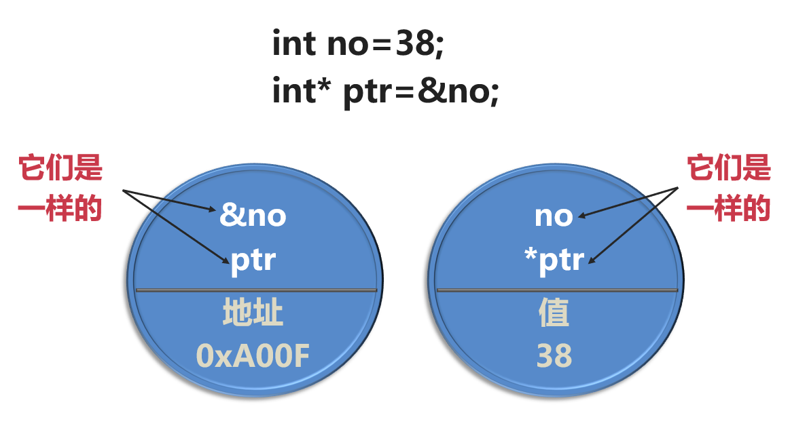
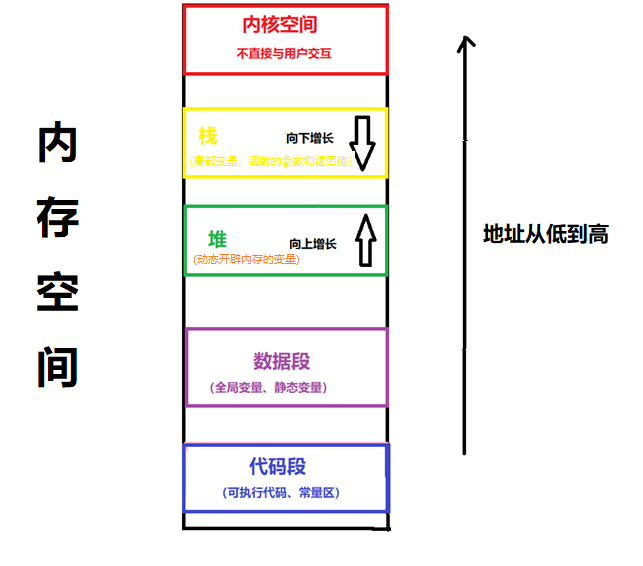

# 清空方式

```c++
清空方式
m_name.clear(); string型
m_age = 0; int型
memset(m_memo, 0, sizeof(m_memo)); char数组
m_ptr = nullptr; nullptr表示指针为空，int*指针
```

# 长度函数

**char 数组求长度用strlen函数, int 数组用siezof(a)/sizeof(a[0]), string类型用size()函数**

# 01 程序的注释、变量和常量

## 1. 准备开发环境

## 2. 第一个C++程序

- std::cout 向控制台输出内容的指令，只能小写，不能用大写
- <<            输出的运算符
- "   "           字符串内容的边界符，半角
- Hello World!     输出字符串的内容，可以是中文、英文和任意符号，半角的双引号除外
- \n               输出一个换行
- ;                 C++语句结束的标志，半角

```
#include <iostream>// 包含头文件

// main函数，程序从这里开始执行，每个程序只能有一个main函数
int main()
{
    // 在控制台输出一首诗。\n表示换行
    std::cout << "\n\n                        我是一只傻傻鸟\n";
    std::cout << "                   生活美好如鲜花，不懂享受是傻瓜；\n";
    std::cout << "                   傻呀傻呀傻呀傻，不如小鸟和乌鸦。\n";
    std::cout << "                   芳草地啊美如画，谁要不去是傻瓜；\n";
    std::cout << "                   我是一只傻傻鸟，独在枯枝丫上趴。\n";

    // 在控制台输出Hello，并且换行
    std::cout << "Hello\n";
}
```

## 3. C++输出数据

### 3.1 数据分类

数据有数字、字符和字符串三种类型。

- 数字：直接书写，如：100、18.52、0、9；
- 字符：用半角的单引号包含的一个符号，如：'A'、'Z'、'0'、'9'、'~'、'+'，汉字和全角的标点符号不是字符；
- 字符串：用半角的双引号包含的多个符号，如："Hello World"、"我是一只傻鸟"、"西施"、"100"、"X"

### 3.2 输出数据

- std::cout：可以输出各种类型的数据
- <<： 操作符可以拼接多个数据项
- std::endl：可以用于换行
- using namespace std：指定缺省的命名空间

```
#include <iostream>
using namespace std;// 指定缺省的命名空间

int main()
{
    // 用多个数据项输出超女信息，姓名：西施；年龄：25；体重：48.5；性别：X
    // std::cout << "姓名：西施；年龄：25；体重：48.5；性别：X\n";
    cout << "姓名：" << "西施" << "；年龄：" << 25 << "；体重：" << 48.5 
                    << "；性别：" << 'X' << endl;
}
```

## 4. 程序的注释

> 运行程序: Ctrl + F5 或调试 >“开始执行(不调试)”菜单
> 调试程序: F5 或调试 >“开始调试”菜单
>
> 添加注释：Ctrl + k + c
> 取消注释：Ctrl + k + u

**入门使用技巧:** 

1. 使用解决方案资源管理器窗口添加/管理文件
2. 使用团队资源管理器窗口连接到源代码管理
3. 使用输出窗口查看生成输出和其他消息
4. 使用错误列表窗口查看错误
5. 转到“项目”>“添加新项”以创建新的代码文件，或转到“项目”>“添加现有项”以将现有代码文件添加到项目
6. 将来，若要再次打开此项目，请转到“文件”>“打开”>“项目”并选择 .sln 文件

```
#include <iostream>
using namespace std;// 指定缺省的命名空间,可以省略std::

int main()
{
    // 用多个数据项输出超女信息，姓名：西施；年龄：25；体重：48.5；性别：X
    // std::cout << "姓名：西施；年龄：25；体重：48.5；性别：X\n";
    cout << "姓名：" << "西施" << "；年龄：" << 25 << "；体重：" << 48.5
        << "；性别：" << 'X' << endl;// 换行使用endl或者\n
    cout << "Hello World!\n";// 输出字符串
    cout << 100;// 输出数字
    cout << 'X';// 输出字符
    /*
    姓名：西施；年龄：25；体重：48.5；性别：X
    Hello World!
    100X
    */
}
```

## 5. 使用变量

### 5.1 声明变量

变量是内存变量的简称，用于存放数据

- 变量在使用之前要先声明。语法：**数据类型 变量名**
- C++常用的数据类型有五种：整数（int）、浮点数（float和double）、字符（char）、字符串（string）和布尔（bool）
- 变量在声明的时候可以赋初始值。语法：**数据类型 变量名 = 值**

### 5.2 变量赋值

- 变量的赋值。语法：**变量名 = 值**
- 布尔型变量输出的时候，如果**值是true，将显示1，false显示0**

```
#include <iostream>         // 包含头文件
using namespace std;        // 指定缺省的命名空间

// main函数，程序从这里开始执行，每个程序只能有一个main函数
int main()
{
    // 变量
	// 整数（int）、浮点数（float和double）、字符（char）、字符串（string）和布尔（bool）
    
    // 超女基本信息：姓名、年龄、体重、性别、颜值
    // 声明变量，存放超女基本信息的数据项
    // string name;int age; double weight; char sex; bool yz;
    string name = "西施";     // 姓名
    int age = 25;            // 年龄
    double weight = 48.6;    // 体重（kg）
    char sex = 'X';          // 性别：X-女；Y-男
    bool yz = false;         // 颜值：true-漂亮；false-不漂亮

    cout << "姓名：" << name << "，年龄：" << age << "，体重：" << weight
        << "，性别：" << sex << "，颜值：" << yz << endl;

    name = "冰冰";            // 字符串有双引号包含
    age = 23;                // 整数直接书写
    weight = 50.5;           // 浮点数直接书写
    sex = 'X';               // 字符用单引号包含
    yz = true;               // 布尔型取值只能是true和false，或1和0

    cout << "姓名：" << name << "，年龄：" << age << "，体重：" << weight
        << "，性别：" << sex << "，颜值：" << yz << endl;

    /*一年有12个月
    圆周率的值是：3.14159
    一个星期有7天
    姓名：西施，年龄：25，体重：48.6，性别：X，颜值：0
    姓名：冰冰，年龄：23，体重：50.5，性别：X，颜值：1
    */
}
```

## 6. 使用常量

常量是程序中固定不变的数据，包括宏常量和const修饰的变量

### 6.1 宏常量

一般在main函数的上面声明，用大写命名。语法：**#define 常量名 值**

### 6.2 const修饰的变量

在程序的任何地方都可以声明。语法：**const 数据类型 常量名 = 值**

### 6.3 常量特点

- **程序中不允许改变常量的值，否则编译的时候会报错**

```
#include <iostream>         // 包含头文件
using namespace std;        // 指定缺省的命名空间

#define MONTHS 12               // 一年中的月份数
#define PI  3.14159             // 圆周率

// main函数，程序从这里开始执行，每个程序只能有一个main函数
int main()
{
	// const修饰的常量，在程序的任何地方都可以声明。const 数据类型 常量名 = 值
	const int days = 7;          // 一个星期中的天数

	cout << "一年有" << MONTHS << "个月 " << endl;
	cout << "圆周率的值是：" << PI << endl;

	cout << "一个星期有" << days << "天\n";
}
```

## 7. 标识符命名规则

### 7.1 C++命名规则

C++规定给标识符（变量、常量、函数、结构体、类等）命名时，必须遵守以下规则。

- 在名称中**只能使用字母字符、数字和下划线**
- 名称的**第一个字符不能是数字**
- 名称**区分大写字符与小写字符**
- **不能将C++关键字用作名称**
- 以下划线和大写字母打头的名称被保留给编译器及其使用的资源使用，如果违反了这一规则，会导致行为的不确定性
- C++对名称的长度没有限制，但有些平台可能有长度限制（64字符）
- **C++提倡有一定含义的名称（望名知义）**

### 7.2 关键字

关键字也叫保留字，是C++预先保留的标识符。每个C++关键字都有特殊的含义，用于声明类型、对象、函数、命名空间等，程序中不能声明与关键字同名的标识符。

| asm        | do           | if               | return      | typedef  |
| ---------- | ------------ | ---------------- | ----------- | -------- |
| auto       | **double**   | inline           | short       | typeid   |
| **bool**   | dynamic_cast | **int**          | signed      | typename |
| break      | else         | long             | sizeof      | union    |
| case       | enum         | mutable          | static      | unsigned |
| catch      | explicit     | **namespace**    | static_cast | using    |
| char       | export       | new              | struct      | virtual  |
| class      | extern       | operator         | switch      | void     |
| **const**  | **false**    | private          | template    | volatile |
| const_cast | **float**    | protected        | this        | wchar_t  |
| continue   | for          | public           | throw       | while    |
| default    | friend       | register         | **true**    |          |
| delete     | goto         | reinterpret_cast | try         |          |

## 8. C++用std::cin输入数据

程序输入数据的方式有多种

- 从**控制台的界面**中输入（网页、PC桌面程序、APP程序）
- 从**文件**中读取
- 从**数据库**中读取
- 从**网络**中读取

**用std::cin输入数据。语法：std::cin>>变量名**

注意：

- **布尔型变量的值在计算机内部用1（true）和0（false）**存储
- 程序中可书写true和false，也可以书写1和0，其它值将强制转换成1
- 用cin输入时可以填1和0，其它值也强制转换成1
- 用cout输出时只显示1和0，不显示true和false
- 如果输入的数据与变量的数据类型不匹配，会导致行为的不确定性

```
#include <iostream>         // 包含头文件
using namespace std;        // 指定缺省的命名空间

// main函数，程序从这里开始执行，每个程序只能有一个main函数
int main()
{
    string name;          // 姓名
    cout << "请输入超女的姓名：";// 没有换行
    cin >> name;// 输入
    cout << "输入的超女姓名是：" << name << endl;

    int age;               // 年龄
    cout << "请输入超女的年龄：";
    cin >> age;
    cout << "输入的超女年龄是：" << age << endl;

    double weight;        // 体重（kg）
    cout << "请输入超女的体重（kg）：";
    cin >> weight;
    cout << "输入的超女体重是：" << weight << endl;

    char sex;              // 性别：X-女；Y-男
    cout << "请输入超女的性别（X-女；Y-男）：";
    cin >> sex;
    cout << "输入的超女性别是：" << sex << endl;

    bool yz;               // 颜值：true-漂亮；false-不漂亮，如果输入true则返回是0
    cout << "请问输入超女的颜值（1-漂亮；0-不漂亮）：";
    cin >> yz;
    cout << "输入的超女颜值是：" << yz << endl;
}
```

# 02 算数运算与关系运算

## 1. 算数运算

| **运算符** |        **描述**        |
| :--------: | :--------------------: |
|   **+**    |      两个数相加。      |
|   **-**    |    一个数减另一个数    |
|   *****    |       两个数相乘       |
|   **/**    |      分子除以分母      |
|   **%**    | 取模运算，整除后的余数 |

注意：

- 整数进行除法运算时，如果分母为0，程序将异常退出
- **浮点数进行除法运算时，如果分母为0.0，将得到inf（infinite，无穷大）**
- **两个整数进行除法运算时，将舍去小数部分，得到一个整数**
- 整数与浮点数进行除法运算时，得到的结果是浮点数
- 进行除法运算时，在整数前面加(float)或(double)可以将整数转换为float或double类型
- **取模运算只能用于整数（分母也不能为0）**

## 2. 自增与自减

|  **运算符**  |             **描述**              |
| :----------: | :-------------------------------: |
| **++变量名** | 先把变量的值加1，然后再执行表达式 |
| **变量名++** |   先执行表达式，再把变量的值加1   |
| **--变量名** | 先把变量的值减1，然后再执行表达式 |
| **变量名--** |    先执行表达式，再把变量的减1    |

## 3. 赋值运算

| **运算符** |           **示例**            |                           **描述**                           |
| :--------: | :---------------------------: | :----------------------------------------------------------: |
|   **=**    | c = a + b; 将把a + b的值赋给c |                把右边操作数的值赋给左边操作数                |
|   **+=**   |   c += a; 相当于 c = c + a;   | 加且赋值运算符，把右边操作数加上左边操作数的结果赋值给左边操作数 |
|   **-=**   |   c -= a; 相当于 c = c - a;   | 减且赋值运算符，把左边操作数减去右边操作数的结果赋值给左边操作数 |
|   ***=**   |   c *= a; 相当于 c = c * a;   | 乘且赋值运算符，把右边操作数乘以左边操作数的结果赋值给左边操作数 |
|   **/=**   |   c /= a; 相当于 c = c / a;   | 除且赋值运算符，把左边操作数除以右边操作数的结果赋值给左边操作数 |
|   **%=**   |   c %= a; 相当于 c = c % a;   | 求余数且赋值运算符，求两个操作数的模赋值给左边操作数，浮点数不适用取余数 |

- **字符串（string）只能使用等号（=）赋值，不能使用其它的赋值运算符**
- **浮点数不能使用 %= 运算符**
- **等号(=)赋值运算符可以连续使用**
- 如果赋值运算符两边操作数的数据类型不同，C++将自动转换数据类型，可能会损失精度，也可能超出取值范围，如果转换不成功，编译时会报错

```
#include <iostream>         // 包含头文件
using namespace std;        // 指定缺省的命名空间

// main函数，程序从这里开始执行，每个程序只能有一个main函数
int main()
{
    int a = 10;
    int c = 20;

    // c += a;           // c = c+a;
    // c -= a;           // c = c-a;
    // c *= a;           // c = c * a;
    // c /= a;           // c = c / a;
    // c %= a;           // c = c % a;
    // cout << "c = " << c << endl;

    a = c = 30;
    cout << "a=" << a<<endl;   // 30
    cout << "c=" << c << endl; // 30
}
```

## 4. C++11初始化赋值

- **把值写在小括号中，等于号可以省略**（C++标准）

```
int a = (15);  // 声明变量a，初始化值为15
int b(20);     // 声明变量b，初始化值为20
```

- **把值写在花括号中，等于号也可以省略**（C++11标准），统一初始化列表

```
int a = {15};  // 声明变量a，初始化值为15
int b{20};     // 声明变量b，初始化值为20
```

- 在Linux平台下，编译需要加**-std=c++11**参数

```
#include <iostream>         // 包含头文件
using namespace std;        // 指定缺省的命名空间

// main函数，程序从这里开始执行，每个程序只能有一个main函数
int main()
{
    // C++标准，把值写在小括号中，等于号可以省略（C++标准）
    int a = 10;
    int b = (10);
    int c(10); // 声明变量c，初始化值为20

    // C++11标准，把值写在花括号中，等于号也可以省略（C++11标准），统一初始化列表
    int e = {10};
    int f{10};

    // 均输出为10
    cout << "a = " << a << endl;
    cout << "b = " << b << endl;
    cout << "c = " << c << endl;
    cout << "e = " << e << endl;
    cout << "f = " << f << endl;
}
```

## 5. 关系运算

用于比较两个表达式的值，运算的结果为1-true和0-false.

| **关系** | **数学的表示** | **C++表示** |
| :------: | :------------: | :---------: |
|   等于   |       =        |     ==      |
|  不等于  |       ≠        |     !=      |
|   小于   |       <        |      <      |
| 小于等于 |       ≤        |     <=      |
|   大于   |       >        |      >      |
| 大于等于 |       ≥        |     >=      |

注意：

- 关系运算符的两边可以是数值，也可以是表达式
- 加括号是一个好习惯
- 用std::cout输出关系运算表达式时，关系表达式要加括号
- 关系运算**适用于字符串（string）**，**字符串常用的关系运算是==和!=**，其它的基本上不用

```
#include <iostream>         // 包含头文件
using namespace std;        // 指定缺省的命名空间

// main函数，程序从这里开始执行，每个程序只能有一个main函数
int main()
{
    int a = 7;
    int b = 7;
    bool result;

    result = a <= b-3;            // a和b先做比较（关系）运算，然后再赋值给result。

    cout << "result=" << result << endl;    // 关系运算表达式需要括号，算术运算表达式可以不用括号。0

    string str1 = "西施";
    string str2 = "西瓜";
    cout << (str1 == str2) << endl; // 加括号
}
```

## 6. 逻辑运算

| **运算符** |   **术语**   | **示例** |                         **结果**                         |
| :--------: | :----------: | :------: | :------------------------------------------------------: |
|     &&     |    逻辑与    |   a&&b   |           如果a和b都为真，则结果为真，否则为假           |
|    \|\|    |    逻辑或    |  a\|\|b  | 如果a和b中有一个为真，则结果为真，二者都为假时，结果为假 |
|     !      | 逻辑非（反） |    !a    |        如果a为假，则!a为真； 如果a为真，则!a为假         |

- 逻辑运算符的两边可以是数值，也可以是表达式
- 用std::cout输出逻辑运算表达式时，逻辑表达式要加括号
- 在实际开发中，**逻辑运算的多重组合是重点**

```
#include <iostream>         // 包含头文件
using namespace std;        // 指定缺省的命名空间

// main函数，程序从这里开始执行，每个程序只能有一个main函数
int main()
{
    bool a = false;
    bool b = true;
    // bool c = a && b;   // 如果a和b都为真，则结果为真，否则为假 // 1
    // bool c = a || b;      // 如果a和b中有一个为真，则结果为真，二者都为假时，结果为假
    bool c = !a;          // 如果a为假，则!a为真； 如果a为真，则!a为假

    // cout << "c = " << c << endl;
    // cout << "a&&b = " << (a && b) << endl;
    // cout << "a||b = " << (a || b) << endl;
    cout << "!a=" << c << endl;
    
    // 超女必须满足四个条件：年龄25岁以下，身高165以上、体重50公重以下，颜值要漂亮
    int age = 23;
    int height = 168;
    double weight = 48.8;
    bool yz = true;

    cout << "result = "<<(age < 25 && height > 165 && weight < 50 && yz == true) << endl;
}
```

## 7. 逗号运算

把一行语句中的多个表达式连接起来，程序将从左到右执行表达式。

语法：表达式一,表达式二,……,表达式n;

**逗号运算常用于声明多个变量**

```
int a,b;      // 声明变量a和b
int a = 10,b = 20;  // 声明变量a和b并初始化
```

也可以用于其它语句中，但是，逗号运算符是所有运算符中级别最低的，以下两个表达式的效果是不同的

```
int a,b; 
b = a = 2,a*2; 
b = (a = 2,a*2);// 先让a等于2，再让a*2，再赋值给b
```

```
#include <iostream>         // 包含头文件
using namespace std;        // 指定缺省的命名空间

// main函数，程序从这里开始执行，每个程序只能有一个main函数
int main()
{
    /*int a = 10, b = 20;
    cout << "a = " << a << endl;
    cout << "b = " << b << endl;*/

    int a, b;
    // b = a = 2, a * 2;
    b = (a = 2, a * 2);
    cout << "a = " << a << endl;
    cout << "b = " << b << endl;
}
```

## 8. 运算的优先级(重点)

一个表达式可以包含多个运算符，运算符的优先级决定了表达式各部分的执行顺序。

例如，按照运算规则， *的优先级比+高，所以的b * c将先执行：a + b * c;

如果想让a + b先执行，则必须使用括号：(a + b) * c;

如果一个表达式中操作符的优先级相同，那么它们的**结合律**（associativity）决定了它们的执行顺序（从左到右或从右到左）。例如，算术运算的组合方式是从左到右，赋值运算则是从右到左。如下：

| **表达式** | **结合律** | **组合方式** |
| :--------: | :--------: | :----------: |
| **a/b%c**  |  从左到右  |   (a/b)%c    |
| **a=b=c**  |  从右到左  |   a=(b=c)    |

下表是全部运算符的优先级和结合律：

| **优先级** | **运算符** |  **名称或含义**  |        **使用形式**        | **结合方向** |
| :--------: | :--------: | :--------------: | :------------------------: | :----------: |
|     1      |     []     |       下标       |        地址[表达式]        |    左到右    |
|     1      |     ()     |      圆括号      | （表达式）/函数名(形参表)  |    左到右    |
|     1      |     .      | 成员选择（对象） |        对象.成员名         |    左到右    |
|     1      |     ->     | 成员选择（指针） |      对象指针->成员名      |    左到右    |
|     2      |     -      |    负号运算符    |          -表达式           |    右到左    |
|     2      |   (类型)   |   强制类型转换   |      (数据类型)表达式      |    右到左    |
|     2      |     ++     |  前置自增运算符  |          ++变量名          |    右到左    |
|     2      |     ++     |  后置自增运算符  |          变量名++          |    右到左    |
|     2      |     --     |  前置自减运算符  |          --变量名          |    右到左    |
|     2      |     --     |  后置自减运算符  |          变量名--          |    右到左    |
|     2      |     *      |    取值运算符    |         *指针变量          |    右到左    |
|     2      |     &      |   取地址运算符   |          &变量名           |    右到左    |
|     2      |     !      |   逻辑非运算符   |          !表达式           |    右到左    |
|     2      |     ~      |  按位取反运算符  |          ~表达式           |    右到左    |
|     2      |   sizeof   |    长度运算符    |       sizeof(表达式)       |    右到左    |
|     3      |     /      |        除        |       表达式/表达式        |    左到右    |
|     3      |     *      |        乘        |       表达式*表达式        |    左到右    |
|     3      |     %      |   余数（取模）   |   整型表达式/整型表达式    |    左到右    |
|     4      |     +      |        加        |       表达式+表达式        |    左到右    |
|     4      |     -      |        减        |       表达式-表达式        |    左到右    |
|     5      |     <<     |       左移       |            变量            |    左到右    |
|     5      |     >>     |       右移       |        变量>>表达式        |    左到右    |
|     6      |     >      |       大于       |       表达式>表达式        |    左到右    |
|     6      |     >=     |     大于等于     |       表达式>=表达式       |    左到右    |
|     6      |     <      |       小于       |           表达式           |    左到右    |
|     6      |     <=     |     小于等于     |           表达式           |    左到右    |
|     7      |     ==     |       等于       |       表达式==表达式       |    左到右    |
|     7      |     !=     |      不等于      |      表达式!= 表达式       |    左到右    |
|     8      |     &      |      按位与      |       表达式&表达式        |    左到右    |
|     9      |     ^      |     按位异或     |       表达式^表达式        |    左到右    |
|     10     |     \|     |      按位或      |       表达式\|表达式       |    左到右    |
|     11     |     &&     |      逻辑与      |       表达式&&表达式       |    左到右    |
|     12     |    \|\|    |      逻辑或      |      表达式\|\|表达式      |    左到右    |
|     13     |     ?:     |    条件运算符    | 表达式1?  表达式2: 表达式3 |    右到左    |
|     14     |     =      |    赋值运算符    |        变量=表达式         |    右到左    |
|     14     |     /=     |     除后赋值     |        变量/=表达式        |    右到左    |
|     14     |     *=     |     乘后赋值     |        变量*=表达式        |    右到左    |
|     14     |     %=     |    取模后赋值    |        变量%=表达式        |    右到左    |
|     14     |     +=     |     加后赋值     |        变量+=表达式        |    右到左    |
|     14     |     -=     |     减后赋值     |        变量-=表达式        |    右到左    |
|     14     |    <<=     |    左移后赋值    |            变量            |    右到左    |
|     14     |    >>=     |    右移后赋值    |       变量>>=表达式        |    右到左    |
|     14     |     &=     |   按位与后赋值   |        变量&=表达式        |    右到左    |
|     14     |     ^=     |  按位异或后赋值  |        变量^=表达式        |    右到左    |
|     14     |    \|=     |   按位或后赋值   |       变量\|=表达式        |    右到左    |
|     15     |     ,      |    逗号运算符    |      表达式,表达式,…       |    左到右    |

- 如果不确定运算符的优先级，可以加括号
- 多用括号，让代码的可读性更好

```
#include <iostream>         // 包含头文件
using namespace std;        // 指定缺省的命名空间

int main()
{
    int a, b, c;
    c = 10;          // 赋值表达式的值为赋值符号右边的值
    cout << "(c = 10) = " << (c = 10) << endl;

    a = b = c = 10;  // 赋值运算的结合律是从右到左
    
    int a, b, c, d;

	a = 4, b = 2, c = 5;

	d = a * (b / c);     // 算术运算的结合律是从左到右

	cout << "d = " << d << endl;
}
```

# 03 条件分支语句

## 1. if语句的基本结构

语法：

```
if (表达式)
{
  // 表达式为真时执行的语句
}
else {
  // 表达式为假时执行的语句
}
```

- if (表达式)之间的空格可以不写
- 表达式必须使用括号
- 表达式可以是具体的值
- 表达式一般是关系运算和逻辑运算表达式，也可以是赋值运算或其它的表达式
- **不要把if（变量名==值）写成if（变量名=值）**
- 整个if语句可以没有else分支
- if或else分支花括号内的代码如果只有一行，花括号可以不写；如果一行也没有，花括号一定要写；如果有多行，花括号一定要写，**如果不写，除了第一行，其它的代码将不是if语句的一部分**
- **if (表达式)和else后不能加分号，因为分号表示空语句**（C++用分号作为一条语句结束的标志。如果在C++程序中不小心多写了一个分号，那么该分号会被当成一条空语句）

```
#include <iostream>         // 包含头文件
using namespace std;        // 指定缺省的命名空间

int main()
{
	// C++用分号作为一条语句结束的标志
	// 如果在C++程序中不小心多写了一个分号，那么该分号也许会被视作一个空语句

	// 判断超女的颜值，如果漂亮，在控制台输出“晋级下一轮”，否则输出“冲关失败”
	// 1）声明一个bool型变量，用于存放超女的颜值数据
	bool yz;

	// 2）显示输入超女颜值的提示信息
	cout << "请输入超女的颜值（1-漂亮；0-不漂亮）：";

	// 3）输入超女的颜值数据，存放在变量中
	cin >> yz;

	// 4）用if语句判断超女的颜值，如果漂亮，显示“晋级下一轮”，否则显示“冲关失败”
	if (yz == true)
	{
		cout << "小姐姐很漂亮哟！" << endl;
		cout << "恭喜您，晋级下一轮！" << endl;
	}
	else
	{
		cout << "对不起，冲关失败！" << endl;
		cout << "推荐一个美容院，......" << endl;
	}
}
```

## 2. 嵌套使用if语句

if语句可以嵌套使用，实现多级（层）的条件判断（最多127层）

语法：

```
if (表达式一)
{ 
  if (表达式二) 
  {
	  // 表达式二为真时执行的语句
  }
   else
   {
      // 表达式二为假时执行的语句
  }
}
else
{
     // 表达式一为假时执行的语句
}
```

示例程序

```
#include <iostream>         // 包含头文件
using namespace std;        // 指定缺省的命名空间

int main()
{
	// 超女选秀：1）性别（X-女，Y-男）；2）颜值（1-漂亮，0-不漂亮）；3）身材（1-火辣，2-丰满，3-苗条）

	// 声明三个变量，存放超女的性别、颜值和身材数据。
	char sex;        // 性别（X-女，Y-男），字符类型
	bool yz;         // 颜值（1-漂亮，0-不漂亮）
	int  sc;         // 身材（1-火辣，2-丰满，3-苗条）

	// 显示“请输入超女的性别（X-女，Y-男）：”的提示文字
	cout << "请输入超女的性别（X-女，Y-男）：";

	// 输入超女的性别，存放在变量中。
	cin >> sex;

	// 判断超女的性别，如果是女，流程继续，否则程序结束
	if (sex == 'X') // 字符
	{
		// 显示“请输入超女的颜值（1-漂亮，0-不漂亮）：”的提示文字
		cout << "请输入超女的颜值（1-漂亮，0-不漂亮）：";

		// 输入超女的颜值，存放在变量中
		cin >> yz;

		// 判断超女的颜值，如果是漂亮，流程继续，否则程序结束
		if (yz == true)     // 漂亮-1
		{
			// 显示“请输入超女的身材（1-火辣，2-丰满，3-苗条）：”的提示文字
			cout << "请输入超女的身材（1-火辣，2-丰满，3-苗条）：";

			// 输入超女的身材，存放在变量中
			cin >> sc;

			// 判断超女的身材，如果是火辣，显示“晋级成功”，如果是丰满，显示“待定”，程序结束
			if (sc == 1)        // 1-火辣
			{
				cout << "晋级成功！" << endl;
			}
			else if (sc == 2)  // 2-丰满
			{
				cout << "晋级成功！" << endl;
			}
			else		      // 3-苗条
			{
				cout << "待定！" << endl;
			}
		}
	}
}
// 简洁写法
/*
if (sc == 1) cout << "火辣\n";
else if (sc == 2) cout << "丰满\n";
else cout << "苗条\n";
*/
```

## 3. 嵌套if语句注意事项

嵌套使用if语句时候，会出现if与else的配对问题

- C++编译器处理该问题的原则是：else总是与前面最近if 配对

- 如果要改变这种配对关系，可以使用花括号来确定新的配对关系

```
if (sex == 'X')
		if (yz == true)
			cout << "sex == X,yz == true\n";
		else
			cout << "sex == Y,yz == true or false\n";
```

- 以上代码中的else与第二个if配对，如果想让它与第一个if配对，代码如下

```
if (sex == 'X')
	{
		if (yz == true)
			cout << "sex == X,yz == true\n";
	}
	else
		cout << "sex == Y,yz == true or false\n";
```

## 4. 多条件的if语句(else if)

语法：

```
if (表达式一)
{ 
  // 表达式一为真时执行的语句
}
else if (表达式二)
{
  // 表达式二为真时执行的语句
}
else if (表达式三)
{
  // 表达式三为真时执行的语句
}
...
else if (表达式n)
{
  // 表达式n为真时执行的语句
}
else
{
  // 全部表达式都不为真时执行的语句
}
```

- 多条件的if语句本质上是嵌套的if语句
- 最多只能有127个条件分支
- 最后一个else可以没有

```
#include <iostream>         // 包含头文件
using namespace std;        // 指定缺省的命名空间

int main()
{
	// 超女的身材：1-火辣；2-丰满；3-苗条；4-强壮；5-肥胖；>5-未知
	// 声明存放超女身材数据的变量
	int sc;
	
	// 显示“请输入身材的代码（1-火辣；2-丰满；3-苗条；4-强壮；5-肥胖；>5-未知）：”的提示文字
	cout << "请输入身材的代码（1-火辣；2-丰满；3-苗条；4-强壮；5-肥胖；其它表示未知）：";

	// 输入超女身材的代码，存放在变量中
	cin >> sc;

	// 用多条件的if语句，判断身材代码，显示身材的中文描述
	if (sc == 1)     cout << "火辣!\n";
	else if (sc == 2) cout << "丰满!\n";
	else if (sc == 3) cout << "苗条!\n";
	else if (sc == 4) cout << "强壮!\n";
	else if (sc == 5) cout << "肥胖!\n";
	else			 cout << "未知!\n";
}
```

## 5. if语句逻辑表达式

- 采用**括号、对齐、空格、换行**有助于更清晰的表达复杂的逻辑表达式

```
#include <iostream>         // 包含头文件
using namespace std;        // 指定缺省的命名空间

int main()
{
	// 超女的数据：年龄（16-50岁），身高（150cm-190cm），身材（火辣；丰满；苗条）
	//	颜值（漂亮；一般；歪瓜裂枣）
	// 晋级的标准：年龄25-30岁，身高165cm-175cm，身材火辣，颜值漂亮或者一般
	
	// 已准备好的超女数据。
	int age = 28;
	int height = 170;
	string sc = "火辣";
	string yz = "漂亮";

	if (  (age > 25 && age < 30) &&         // 年龄
		  (height > 165 && height < 175) && // 身高
		  (sc == "火辣") &&                  // 身材
		  (yz == "漂亮"||yz == "一般"))      // 颜值
	{
		cout << "晋级成功！\n";
	}
}
```

## 6. 三目运算

语法： 表达式一 ? 表达式二 : 表达式三

先计算表达式一的值，如果为真，整个表达式的结果为表达式二的值，如果为假，整个表达式的结果为表达式三的值

```
int a,b,c;
a = 7;
b = 6;
c = (a > b)?a:b;
```

等同于

```
if (a > b) c = a;
else c = b;
```

三目运算表达式可以嵌套使用，但过于复杂的三目运算表达式不方便理解，比如判断year是不是闰年，是则返回1，不是返回0

```
int year;
year = (year%100 == 0)?(year%400 == 0?1:0):(year%4 == 0?1:0)
```

- 普通年能被4整除且不能被100整除的为闰年
- 世纪年能被400整除的是闰年
- 对于数值很大的年份，这年如果能整除3200，并且能整除172800则是闰年。如172800年是闰年，86400年不是闰年

## 7. switch语句

switch也是一种选择结构的语句，可以代替简单的多条件的if语句。

语法：

```
switch (表达式)
{
  case 值一: 
  语句一; 
  break;

  case 值二: 
  语句二; 
  break;
  ......
  
  case 值n: 
  语句n; 
  break;

  default: 
  上述条件都不满足时执行的语句;
}
```

- **case后面必须是整数和字符，或者是结果为整数和字符的表达式，但不能使用变量**
- default不是必须的，当没有default时，如果全部的case匹配失败，那么就什么都不执行
- **每个分支不要漏写break;语句**

# 04 循环语句

## 1. while循环语句

语法：

```
while (表达式)
{
  语句块
}
```

先计算表达式的值，如果为真就执行语句块，执行完语句块后，回到循环首部再次计算表达式的值，如果为真又执行一次语句块……，这个过程会一直重复，直到表达式的值为假时不再执行语句块

- 如果表达式的值永远为真，那么将进入死循环，所以在循环中应该有改变表达式的值的方法
- 如果循环体中的语句块只有一行代码，大括号可以不书写
- 有疑问先放一边，在以后的课程中，会介绍循环的各种使用方法

```
#include <iostream>         // 包含头文件
using namespace std;        // 指定缺省的命名空间

int main()
{
	// 有十个超女，编号是1-10，在控制台输出这十个超女的编号
	int no = 1;           // 超女的编号

	while (no <= 10)
	{
		cout << "这是第" << no<< "名超女的编号\n";
		no++;
	}
}
```

## 2. 循环的跳转(break-continue重点)

- break和continue两个关键字用于控制循环体中代码的执行流程
- **break跳出(中止)当前循环语句**
- **continue回到当前循环语句的首部**

```
#include <iostream>         // 包含头文件
using namespace std;        // 指定缺省的命名空间

int main()
{
	// 程序运行后一直工作，逐个输入超女的数据，判断是否晋级，如果到了休息时间，就把程序停下来
	// 超女选秀的流程：1）如果漂亮，直接晋级；2）不漂亮也行，身材火辣的也可以晋级
	bool once = true;      // 是否为第一次执行循环

	while (true)           // 保证可以一直循环
	{
		if (once == false)
		{
			// a）显示“是否继续下一名超女选秀（1-继续，0-结束）：”的提示文字
			cout << "是否继续下一名超女选秀（1-继续，0-结束）：";

			// b）输入是否继续的决定，存放在变量中
			bool exist; 
			cin >> exist;

			// c）判断输入的决定，如果是结束，流程跳出循环
			if (exist == false) break;
		}

		once = false;     // 表示第一次循环已经被执行过

		// 1）显示“请输入超女的颜值（1-漂亮，0-不漂亮）：”的提示文字
		cout << "请输入超女的颜值（1-漂亮，0-不漂亮）：";

		// 2）输入超女的颜值，存放在变量中。
		bool yz; 
		cin >> yz;

		// 3）判断超女的颜值，如果漂亮，显示“晋级成功”，流程跳转到循环的首部
		if (yz == true)
		{
			cout << "晋级成功\n";  
			continue;// 跳转到第17行，cout << "是否继续下一名超女选秀（1-继续，0-结束）
		}

		// 4）显示“请输入超女的身材（1-火辣，0-不辣）：”的提示文字
		cout << "请输入超女的身材（1-火辣，0-不辣）：";

		// 5）输入超女的身材，存放在变量中
		bool sc; 
		cin >> sc;

		// 6）判断超女的身材，如果火辣，显示“晋级成功”
		if (sc == true) 
			cout << "晋级成功\n";
	}
}
```

**break:**

- 当 `break` 语句被执行，整个循环立即终止，程序流程将跳出循环体，继续执行循环之后的代码。
- 在 `for` 循环中，执行 `break` 会导致循环提前结束，不再继续迭代，即使循环条件仍然为真。
- 通常用于在满足某个条件时提前结束循环。

```
for (int i = 0; i < 10; i++) {
    if (i == 5) {
        break;  // 当 i 等于 5 时，提前结束循环
    }
    // 循环体内的其他代码
}
```

**continue:**

- 当 `continue` 语句被执行，程序流程将**跳过当前迭代的剩余部分，直接进入下一次迭代**。
- 在 `for` 循环中，执行 `continue` 会使循环进入下一次迭代，而循环条件会重新被检查。
- 通常用于在某个条件下跳过当前迭代，但不结束整个循环。

```
for (int i = 0; i < 10; i++) {
    if (i % 2 == 0) {
        continue;  // 当 i 是偶数时，跳过当前迭代，进入下一次迭代。比如i是2则跳出循环，i++变成3
    }
    // 循环体内的其他代码，只有在 i 是奇数时才会执行
}
```

总结：

- `break` 用于提前结束整个循环
- `continue` 用于跳过当前迭代，继续下一次迭代

## 3. for循环语句

语法：

```
for (语句一 ; 表达式 ; 语句二)
{
  语句块
}
```

1. 循环开始的时候，先执行语句一，在整个循环过程中语句一只会被执行一次
2. 计算表达式的值，如果为真，就执行一次循环体中的语句块
3. 执行完语句块后，执行一次语句二
4. 重复第2步和第3步，直到表达式的值不为真才结束for循环。

注意：

- 不要纠结for循环与while循环的区别，它们本质上没有区别
- for循环一般需要一个相当于计数器的变量，在语句一中对它进行初始化，在语句二中进行计数操作
- 在for循环的语句一中，可以声明计数器变量
- 在for循环中，语句一、表达式和语句二都可以为空，for (;;)等同于while (true)
- **continue和break两个关键字可以用在for循环体中**

```
#include <iostream>         // 包含头文件
using namespace std;        // 指定缺省的命名空间

int main()
{
	// 有十个超女，编号是1-10，在控制台输出这十个超女的编号

	for (int no = 1; no <= 10; no++)
	{
		cout << "这是第" << no << "名超女的编号\n";
	}
}
```

## 4. 嵌套使用循环

```
#include<iostream>         // 包含头文件
using namespace std;        // 指定缺省的命名空间

int main()
{
	// 超女分4个小组，每个小组有3名超女，在控制台显示每个超女的小组编号和组内编号
	// 用一个循环，显示4个小组的信息
	for (int ii = 1; ii <= 4; ii++)
	{
		// 再用一个循环，显示一组中3名超女的信息
		for (int jj = 1; jj <= 3; jj++)
		{
			cout << "这是第" << ii << "个小组的第" << jj << "名超女\n";
		}
		cout << endl;// 内部循环结束空一行
	}

	// 在控制台输出九九乘法表
	for (int ii = 1; ii <= 9; ii++)  // 表示行数
	{
		for (int jj = 1; jj <= ii; jj++)  // 表示每行多少个
		{
			cout << jj << " * " << ii << " = " << ii * jj << "\t";
		}
		cout << endl;
	}
}
```

## 5. do...while循环语句

语法：

```
do
{
  语句块
} while (表达式);
```

功能与while语句类似，不同的是：

- 进入循环时，先执行一次语句块，再计算表达式的值
- 循环的首部书写在循环的尾部，(表达式)后面还有一个分号

# 05 函数基础

## 1. 函数的声明与定义(void类型)

- **void类型return后不写0，直接写return**

把任务分工到其它的函数中，**main函数只负责程序的核心流程，具体的任务由其它函数完成**。这种思想就是模块化编程。

声明和定义函数的语法：

```
返回值的数据类型 函数名(参数一的数据类型 参数一, 参数二的数据类型 参数二,……)
{
  实现函数功能的代码。
  return 返回值;
}
```

- **函数的声明：让编译器知道函数的存在，包括返回值的数据类型、函数名和参数列表**
- **函数的定义：函数的实现过程**

若干要点如下

1. 函数的声明和定义，如果书写在一起，一般放在**main函数的上面**，如果分开，一般在**main函数的上面声明，在main函数的下面定义**
2. 如果**函数的声明和定义分开书写，函数的声明后面一定要有分号，函数的定义后面一定不能写分号**
3. 在同一个程序中，**函数只需要声明和定义一次，也可以多次声明，但只能定义一次**
4. **函数的声明必须和函数的定义一致(返回值的数据类型、函数名和参数列表)**，如果函数名和参数列表不同，表示它们不是同一个函数
5. **return语句返回值的数据类型必须与函数的声明一致**
6. 在函数体中，return语句可以多次使用
7. 如果函数的重点是实现功能，不关心返回值，**返回值的数据类型填void，return语句后面就空着**
8. 函数可以没有任何参数
9. 函数名是标识符，必须满足标识符的命名规则
10. 在函数的声明和函数的定义中，参数命名可以不同，但是没必要这么书写

```
#include <iostream>         // 包含头文件
using namespace std;        // 指定缺省的命名空间

// 下面三句都是函数的声明，声明后面一定要写封号";"
// 写一个函数，给它两个整数，让它比较两个整数的大小，返回较大的那个整数，return返回的是int型
int max(int a, int b);     // 函数声明后面的分号不能少，函数声明在main之前，要加";"

// 写一个函数，给它一个字符串，让它在控制台显示出来
void print(string str);

// 写一个函数，在控制台输出九九乘法表，没有返回值和参数
void printmt();

int main()
{
}

// 下面三个都是函数的定义
int max(int a, int b)      // 函数定义后面不能加分号
{
	if (a > b) return a;

	return b;
}

void print(string str)
{
	cout << str << endl;

	return;    // return 返回的是void类型
}

void printmt()    // 函数中可以没有参数
{
	// 在控制台输出九九乘法表
	for (int ii = 1; ii <= 9; ii++)
	{
		for (int jj = 1; jj <= ii; jj++)
		{
			cout << jj << "*" << ii << "=" << ii * jj << " ";
		}

		cout << endl;
	}

	return; // void类型return后面不要写0
}
```

## 2. 函数的调用(重点)

```
语法：函数名(参数一,参数二,……)
```

- **声明函数的代码必须放在调用之前，定义函数的代码可以放在调用之后**
- **调用函数的时候，参数列表必须与函数的声明一致（参数的个数、书写的顺序和数据类型）**
- 不管在什么地方，都不能调用main函数，但在普通函数中，可以调用其它的普通函数
- 调用函数的代码可以独占一条语句，也可以用于表达式（赋值运算、算术运算、关系运算、函数的参数）
- 如果函数用于表达式中，返回值的数据类型要匹配（否则可能会被隐式转换或编译错误）
- 如果函数有返回值，可以不关心它，忽略它

```
#include <iostream>         // 包含头文件
using namespace std;        // 指定缺省的命名空间

// 函数声明放在main之前，调用一定放在定义之前
// 写一个函数，给它两个整数，让它比较两个整数的大小，返回较大的那个整数
int max(int a, int b);     // 函数声明后面的分号不能少

// 写一个函数，给它两个参数：no-超女编号，str-表白的内容
void print(int no, string str);   

// 写一个函数，在控制台输出九九乘法表
void printmt();

int main()
{
	int ii = max(5, 8);
	cout << "max(5,8) = " << ii << endl;// 返回较大的值

	print(8, "请借给我五分钱吧。");

	printmt();// 先声明再定义
}

int max(int a, int b)      // 函数定义后面不能加分号
{
	if (a > b) return a;
	
	return b;
}

void print(int no, string str) // 后面是字符串类型
{
	cout << "亲爱的" << no << "号：" << str << endl;

	return;
}

void printmt()
{
	// 在控制台输出九九乘法表。
	for (int ii = 1; ii <= 9; ii++)
	{
		for (int jj = 1; jj <= ii; jj++)
		{
			cout << ii << "*" << jj << " = " << ii * jj << "\t";
		}

		cout << endl;
	}
	return;// void类型return后面不要写0
}
```

## 3. 变量的作用域

作用域是指程序中变量存在（或生效）的区域，超过该区域变量就不能被访问。

变量分**全局变量和局部变量**两种，全局变量在整个程序中都可以访问，局部变量只能在函数或语句块的内部才能访问。

C++中定义变量的场景主要有五种：

1. **全部函数外面定义的是全局变量**
2. **头文件中定义的是全局变量**
3. **函数和语句块内部定义的是局部变量**
4. **函数的参数是该函数的局部变量**
5. **函数内部用static修饰的是静态局部变量**

### 3.1 全局变量

- 在整个程序生命周期内均有效，在定义位置之后的**任意函数中都能访问**
- **全局变量在主程序退出时由系统收回内存空间**

### 3.2 局部变量

- **函数或语句块内部的语句使用**，函数或语句块外部是不可用的
- **局部变量在函数返回或语句块结束时由系统收回内存空间**

### 3.3 静态局部变量(static重点)

- 用**static修饰的局部变量**生命周期和程序相同，并且只会被初始化一次，如果static int b++，则b在函数内部会执行+1操作
- 其作用域为局部，当**定义它的函数或语句块结束时，其作用域随之结束**
- 当程序想要**使用全局变量的时候应该先考虑使用static**（考虑到数据安全性）

### 3.4 注意事项(难点)

- **全局变量和静态局部变量自动初始化为0**
- 局部变量不会自动初始化，其值是不确定的，程序中应该有**初始化局部变量的代码**，否则编译可能会报错（不同的编译器不一样）
- 局部变量和全局变量的名称可以相同，**在某函数或语句块内部，如果局部变量名与全局变量名相同，就会屏蔽全局变量而使用局部变量，如果想使用全局变量，可以在变量名前加两个冒号（::）**
- for循环初始化语句中定义的变量的作用域是for语句块

```
#include<iostream>
using namespace std;

/*
1.在全部函数(包括main函数)外面定义的是全局变量
2.在头文件中定义的是全局变量
3.在函数和语句块内部定义的是局部变量
4.函数的参数是该函数的局部变量
5.函数内部用static修饰的是静态局部变量
*/

int aa;// 全局变量
void func1(int s);
void func2();

int main()
{
    aa = 10;
    func1(40);// 无论这里func1()括号值为多少，都以函数的设定值为输出值
    cout << endl;

    cout << "main aa = " << aa << endl;// 第3步
    cout << endl;

    func2();
    cout << endl;

    func2();
    cout << endl;

    func2();
}

void func1(int s)
{
    s = 30;// 函数的参数和其他局部变量没有任何区别，这里s不会报错
    cout << "s = " << s << endl;
    int xx = 19;
    cout << "xx = " << xx << endl;// 局部变量只能在内部使用
    cout << "func1 aa = " << aa++ << endl;// 第1步，aa是全局变量
}

void func2()
{
    cout << "func2 aa = " << aa++ << endl;// 第2步，aa是全局变量
    int a = 10;
    static int b = 10;// static修饰的局部变量生命周期和程序相同，并且只会被初始化一次
    cout << "func2 a = " << a++ << endl;// 一直输出10，a是局部变量
    cout << "func2 b = " << b++ << endl;// b是static静态局部变量，每次输出都会加1
}

/*
s = 30
xx = 19
func1 aa = 10

main aa = 11

func2 aa = 11
func2 a = 10
func2 b = 10

func2 aa = 12
func2 a = 10
func2 b = 11

func2 aa = 13
func2 a = 10
func2 b = 12
*/
```

## 4. 函数的参数传递(重点)

调用函数的时候，调用者把数值赋给函数的参数

- **实参：**调用者程序中书写的在**函数名括号中的参数**(一般在主函数main里面)，可以是常量、变量和表达式
- **形参：**函数的参数列表

在函数定义的代码中，**修改形参的值，不会影响实参**

```
#include <iostream>         // 包含头文件
using namespace std;        // 指定缺省的命名空间

/*
1.调用函数的时候，调用者把数值赋给了函数的参数
2.实参：调用者程序中书写在函数名括号中的参数，可以是常量、变量和表达式
3.形参：函数的参数列表
4.在函数定义的代码中，修改形参的值，不会影响实参
*/

void func(int no, string str);    // 声明向超女表白的函数

int main()
{
	int bh = 3;      // 超女的编号
	string message = "我是一只傻傻鸟"; // 向超女表白的内容

	func(bh, message);  // 调用向超女表白的函数，括号是实参，结果是5号，而不是上面的3号
	// 在子函数中修改形参的值，只会影响到这个函数，不会影响到外面，不会影响实参
	cout << "亲爱的" << bh << "号：" << message << endl;// 亲爱的3号：我是一只傻傻鸟
	func(7, "小姐姐好漂亮哟"); // 调用向超女表白的函数

	/*
	func(bh,message) —— 调用这个函数的流程相当于执行花括号的代码
	{
		int no = 7;
		string str = "小姐姐好漂亮哟";
		no = 5; 
		str = "我有一只小小鸟";
		// 函数的形参是函数的局部变量，修改值只会影响到函数本身，不会影响实参
		cout << "亲爱的" << no << "号：" << str << endl;
	}
	*/
}

void func(int no, string str)    // 向超女表白的函数，里面的是形参
{
	no = 5; 
	str = "我有一只小小鸟";// 函数修改形参的值，只会影响到函数内部，不会影响外面
	cout << "亲爱的" << no << "号：" << str << endl;
}

/*
亲爱的5号：我有一只小小鸟
亲爱的3号：我是一只傻傻鸟
亲爱的5号：我有一只小小鸟，里面形参设定不影响外面的实参
*/
```

## 5. 函数分文件编写(重点)

- **头文件（\*.h）**：需要包含的头文件，**声明全局变量，函数的声明，数据结构和类的声明**等
- **源文件（\*.cpp）**：函数的定义、类的定义

主程序：main函数，程序的核心流程，需要用#include "头文件名"把头文件包含进来。

编译：Windows是集成开发环境，不需要写编译指令。

在Linux系统下，把全部的源文件一起编译，如：**g++ -o demo demo.cpp tools.cpp girls.cpp**

```
/*demo.cpp/
#include "tools.h" // 包含头文件tools.h，min和max函数在里面
#include "girls.h" // 包含头文件girls.h，print函数在里面

int main()
{
	cout << "max(5,8) = " << max(5, 8) << endl;
	cout << "min(5,8) = " << min(5, 8) << endl;
	print(3, "我是一只傻傻鸟");
}

/*girls.cpp*/
#include "girls.h"

void print(int no, string str)   // 函数定义
{
	cout << "亲爱的" << no << "号：" << str << endl;
}

/*tools.cpp*/
#include "tools.h" // 函数定义

int max(int a, int b)    // 比较两个数的大小，返回较大者
{
	return a > b ? a : b;
}

int min(int a, int b)    // 比较两个数的大小，返回较小者
{
	return a < b ? a : b;
}

/*girls.h*/ 函数声明
#pragma once

#include <iostream>         // 包含头文件
using namespace std;        // 指定缺省的命名空间

void print(int no, string str);   // 表白神器

/*tools.h*/ 函数声明
#pragma once

#include <iostream>         // 包含头文件
using namespace std;        // 指定缺省的命名空间

int max(int a, int b);    // 比较两个数的大小，返回较大者
int min(int a, int b);    // 比较两个数的大小，返回较小者
```

## 6. 在VS中调试程序

- F9设置/取消断点
- F5/F10开始调试
- Shift+F5放弃调试
- F10逐过程执行
- F11逐语句执行（可进入函数内部）
- 局部变量窗口显示了变量的值，也可以修改

## 7. 递归函数

一个函数可以调用另一个函数，如果函数调用了自己，就像故事中提到了同样的故事一样，把函数在运行时调用自己的情况叫做递归。

递归函数中一定要**有递归终止的条件**，否则是死递归

```
#include <iostream>         // 包含头文件
using namespace std;        // 指定缺省的命名空间

int f(int x)                            // 递归函数
{
	if (x == 0) return 0;    // 递归终止的条件!!!

	return x + f(x - 1);     // 在函数体中调用了自己
}
/*
3 + f(2)
	2 + f(1)
		1 + f(0)
*/
int main()
{
	// 100 + 99 + 98 +....+ 1 + 0: 最后的0因为if (x == 0) return 0
	cout << "f(10) = " << f(10) << endl;// 先用F10开始调试再用F11进入函数里面   
	// 嵌套的调用函数  进入函数的过程是递去  函数返回的过程是归来

	// 计算从1加到100的和：100 + 99 + 98 +....+ 1 
	int sum = 0;         //  存放累加的值
	for (int ii = 1; ii <= 100; ii++)
		sum = sum + ii;

	cout << "sum = " << sum << endl;
}
```

# 06 C++数据类型(上)

## 1. sizeof关键字(重点)

sizeof运算符用于**求数据类型或变量占用的内存空间**

- 用于数据类型：**sizeof(数据类型)**

- 用于变量：**sizeof(变量名) 或 sizeof 变量名**

- **字符串（string）不是C++的基本数据类型，用sizeof求它占用内存的大小没有意义**

- **string类型32位系统固定为28字节，string类型64位系统固定为40字节**
- **指针类型32位系统固定4字节，64位系统固定8字节**


```
#include <iostream>         // 包含头文件
using namespace std;        // 指定缺省的命名空间

int main()
{
	/*
	用于数据类型：sizeof(数据类型)
	用于变量：sizeof(变量名) 或 sizeof 变量名
	C++常用的数据类型：整数（int）、浮点数（float和double）、字符（char）和布尔（bool）
	*/

	cout << "sizeof(int) = " << sizeof(int) << endl;// 4
	cout << "sizeof(float) = " << sizeof(float) << endl;// 4
	cout << "sizeof(double) = " << sizeof(double) << endl;// 8
	cout << "sizeof(long double) = " << sizeof(long double) << endl;// 8
	cout << "sizeof(char) = " << sizeof(char) << endl;// 1
	cout << endl;

	// 32位系统string固定为28字节，64位系统string固定为40字节
	cout << "sizeof(string) = " << sizeof(string) << endl;
	cout << "sizeof(bool) = " << sizeof(bool) << endl;// 1
	cout << "sizeof(int*) = " << sizeof(int*) << endl;// 4/8字节，32位/64位。指针类型的内存大小不变
	cout << "sizeof(char*) = " << sizeof(char*) << endl;// 4/8字节，32位/64位
	cout << "sizeof(bool*) = " << sizeof(bool*) << endl;// 4/8字节，32位/64位
	cout << "sizeof(string*) = " << sizeof(string*) << endl;// 4/8字节，32位/64位
	cout << endl;

	int i;	 cout << "sizeof(int) = " << sizeof i << endl;// 4
	float f; cout << "sizeof(float) = " << sizeof f << endl;// 4
	double d;cout << "sizeof(double) = " << sizeof d << endl;// 8
	long double e; cout << "sizeof(long double) = " << sizeof e << endl;// 8
	char c;  cout << "sizeof(char) = " << sizeof c << endl;// 1
	bool b;  cout << "sizeof(bool) = " << sizeof b << endl;// 1
	cout << endl;

	/*
	short 2字节 -32768~32768
	unsigned short 2字节 0~65535
	*/
	cout << "sizeof(short) = " << sizeof(short) << endl;// 短的 2
	cout << "sizeof(unsigned short) = " << sizeof(unsigned short) << endl;// 无符号短的 2
	cout << "sizeof(int) = " << sizeof(int) << endl;// 4
	cout << "sizeof(unsigned int) = " << sizeof(unsigned int) << endl;// 4
	cout << "sizeof(long) = " << sizeof(long) << endl;// 长的 4
	cout << "sizeof(unsigned long) = " << sizeof(unsigned long) << endl;// 无符号长的 4
	cout << endl;

	// 字符型（char）占用的内存空间是1个字节，书写用单引号包含，必须用单引号
	// 在内存中，不存放字符本身，而是存放与它对应的编码，即ASCII码
	char a = 'X';// 双引号表示字符串
	cout << "a = " << a << endl;// 输出为X
	cout << "a = " << (int)a << endl;// 输出为88
	cout << "sizeof(a) = " << sizeof(a) << endl;// 1，因为是char类型
	cout << endl;

	int h = 'X';// 双引号表示字符串
	cout << "h = " << h << endl;// 输出为88，h为int类型
	cout << "h = " << (char)h << endl;// 输出为X
	cout << "sizeof(a) = " << sizeof(h) << endl;// 4，因为是int类型

	// 'X' -> 88  01011000   'a'->97   01100001   '3'->51    00110011
	char g = 88;
	cout << "g = " << g << endl;// 结果是X
}
```

## 2. 整型的基本概念

- C++用int关键字来声明整型变量（int 是 integer 的简写）
- 在声明整型变量的时候，可以在int关键字之前加signed、unsigned、short和long四种修饰符

- **signed**：有符号的，可以表示正数和负数
- **unsigned**：无符号的，只能表示正数，例如超女的身高和体重等
- **short**：短的，取值范围小，占用内存少
- **long**：长的，取值范围大，占用内存多。

|    类型简写    |      类型全称      |       长度       |                  取值范围                  |
| :------------: | :----------------: | :--------------: | :----------------------------------------: |
|     short      |  signed short int  |      2字节       |                -32768~32767                |
| unsigned short | unsigned short int |      2字节       |                  0~65535                   |
|      int       |     signed int     |      4字节       |           -2147483648~2147483647           |
|    unsigned    |    unsigned int    |      4字节       |                0~4294967295                |
|      long      |  signed long int   | 8字节(linux系统) | -9223372036854775808~  9223372036854775807 |
| unsigned long  | unsigned long int  |      8字节       |           0~18446744073709551615           |

注意：

整数的取值范围与计算机操作系统和C++语言编译器有关，没有一个固定的数值，我们可以根据它占用的内存大小来推断它的取值范围。

一个位的取值是 0 1 1=2^1-1

两个位的取值是 00 01 10 11 3=2^2-1

三个位的取值是 000 001 …… 111 7=2^3-1

1. 一个字节有8个位，表示的数据的取值范围是2^8-1，即255
2. 如果占用的内存是两个字节，无符号型取值范围是2^8ⅹ2^8-1
3. 如果占用的内存是四个字节，无符号型取值范围是2^8ⅹ2^8ⅹ2^8ⅹ2^8-1
4. 如果占用的内存是八个字节，无符号型取值范围是2^8ⅹ2^8ⅹ2^8ⅹ2^8ⅹ2^8ⅹ2^8ⅹ2^8ⅹ2^8-1
5. 如果是有符号，取值范围减半，因为符号占一个位
6. 计算机用最高位1位来表达符号（0-正数，1-负数），unsigned修饰过的正整数不需要符号位，在表达正整数的时候比signed修饰的正整数取值大一倍。

- 给整型变量赋值不能超出它的取值范围，否则能产生不可预后的后果。在实际开发中，为了防止超出取值范围，应该保证有足够的空间。

## 3. 整数的书写

- 二进制由 0 和 1 两个数字组成，书写时必须以**0b或0B（不区分大小写）开头**

```
int a = 0b101;      // 换算成十进制为 5
int b = -0b110010;  // 换算成十进制为 -50
int c = 0B100001;   // 换算成十进制为 33
```

- 八进制由 0~7 八个数字组成，书写时必须以0开头（注意是数字 0，不是字母 o）

```
int a = 015;      // 换算成十进制为 13
int b = -0101;    // 换算成十进制为 -65
int c = 0177777;  // 换算成十进制为 65535
```

- 十六进制由数字 0~9、字母 A~F 或 a~f（不区分大小写）组成，书写时必须以0x或0X（不区分大小写）开头

```
int a = 0X2A;   // 换算成十进制为 42
int b = -0XA0;  // 换算成十进制为 -160
int c = 0xffff;   // 换算成十进制为 65535
```

- **在C++中，不要在十进制数前面加0，会被编译器当成八进制**
- 不要随便删掉别人程序中整数前面的0，它不是多余的

## 4. C++11的long long类型

- **VS中，long是4字节，32位**。-2147483648~2147483647
- **Linux中，long是8字节，64位**  -9223372036854775808~9223372036854775807
- C++11标准增了long long类型的整数，**至少64位，且至少与long一样长**
- **VS中，long long是8字节，64位** -9223372036854775808~9223372036854775807
- **Linux中，long和long long类型都是8字节，64位**

## 5. 浮点数

C++浮点型分三种：float（单精度）、double（双精度）、long double（扩展精度）

三者的区别是表示有效数字的范围不同。

|  数据类型   |   占用空间   |      有效数字范围       |
| :---------: | :----------: | :---------------------: |
|    float    |    4字节     |  7位有效数字      8位   |
|   double    |    8字节     | 15～16位有效数字   17位 |
| long double | 不少于double | 不低于double      17位  |

注意：

- **VS和Linux中，long double占用的内存空间分别是8和16字节**
- **有效数字包括了小数点前面和后面的数字**
- **C++缺省显示6位有效数字，如果要显示更多的有效数字，可以用printf()函数**
- 浮点数的存储方法和整数不一样，比较复杂，如无必要，不用研究。（百度“为什么浮点数的小数位很多”、“为什么浮点数不精确”）
- 实际开发中，**用整数代替浮点数，整数的运算更快，精度更高**。9223372036854775807

```
#include <stdio.h>    // 使用printf函数需要包含这个头文件
#include <iostream>   // 包含头文件
using namespace std;  // 指定缺省的命名空间

int main()
{
    // float 7位有效数字；double 15～16位有效数字；long double	不低于double
    float aa = 1234.45f;    cout << "aa=" << aa << endl;
    double bb = 12345123056789.45;    cout << "bb=" << bb << endl;
    long double cc = 12345126789.459;    cout << "cc=" << cc << endl;

    printf("aa = %lf\n", aa);// lf是double的格式字符
    printf("bb = %lf\n", bb);
    printf("cc = %lf\n", cc);
}
```

## 6. 字符型的基本概念

- **字符型（char）占用的内存空间是1个字节，书写用单引号包含，必须用单引号**

- **在内存中，不存放字符本身，而是存放与它对应的编码，即ASCII码**

ASCII（American Standard Code for Information Interchange，美国信息交换标准代码）是现今最通用的单字节编码方案，包含了33个控制字符（具有特殊含义无法显示的字符）和95个可显示字符

'X' -> 88 01011000  'a'->97  01100001  '3'->51  00110011

### 6.1 ASCII 控制字符

| 十进制 |   符号   |  中文解释  | 十进制 | 符号 |   中文解释   |
| :----: | :------: | :--------: | :----: | ---- | :----------: |
| **0**  | **NULL** | **空字符** |   16   | DLE  | 数据链路转义 |
|   1    |   SOH    |  标题开始  |   17   | DC1  |  设备控制 1  |
|   2    |   STX    |  正文开始  |   18   | DC2  |  设备控制 2  |
|   3    |   ETX    |  正文结束  |   19   | DC3  |  设备控制 3  |
|   4    |   EOT    |  传输结束  |   20   | DC4  |  设备控制 4  |
|   5    |   ENQ    |    询问    |   21   | NAK  |   拒绝接收   |
|   6    |   ACK    |  收到通知  |   22   | SYN  |   同步空闲   |
|   7    |   BEL    |     铃     |   23   | ETB  |  传输块结束  |
|   8    |    BS    |    退格    |   24   | CAN  |     取消     |
|   9    |    HT    | 水平制表符 |   25   | EM   |   介质中断   |
| **10** |  **LF**  | **换行键** |   26   | SUB  |     替换     |
|   11   |    VT    | 垂直制表符 |   27   | ESC  |    换码符    |
|   12   |    FF    |   换页键   |   28   | FS   |  文件分隔符  |
| **13** |  **CR**  | **回车键** |   29   | GS   |   组分隔符   |
|   14   |    SO    |    移出    |   30   | RS   |  记录分离符  |
|   15   |    SI    |    移入    |   31   | US   |  单元分隔符  |

### 6.2 ASCII 可显示字符(32~127)

| 十进制 | 符号 |   中文解释   | 十进制 | 符号 |  中文解释  |
| :----: | :--: | :----------: | :----: | :--: | :--------: |
|   32   |      |     空格     |   80   |  P   | 大写字母 P |
|   33   |  !   |    感叹号    |   81   |  Q   | 大写字母 Q |
|   34   |  "   |    双引号    |   82   |  R   | 大写字母 R |
|   35   |  #   |     井号     |   83   |  S   | 大写字母 S |
|   36   |  $   |    美元符    |   84   |  T   | 大写字母 T |
|   37   |  %   |    百分号    |   85   |  U   | 大写字母 U |
|   38   |  &   |      与      |   86   |  V   | 大写字母 V |
|   39   |  '   |    单引号    |   87   |  W   | 大写字母 W |
|   40   |  (   |    左括号    |   88   |  X   | 大写字母 X |
|   41   |  )   |    右括号    |   89   |  Y   | 大写字母 Y |
|   42   |  *   |     星号     |   90   |  Z   | 大写字母 Z |
|   43   |  +   |     加号     |   91   |  [   |  左中括号  |
|   44   |  ,   |     逗号     |   92   |  \   |    斜线    |
|   45   |  -   |     减号     |   93   |  ]   |  右中括号  |
|   46   |  .   | 句点或小数点 |   94   |  ^   |  音调符号  |
|   47   |  /   |    反斜线    |   95   |  _   |   下划线   |
|   48   |  0   | 数字0的符号  |   96   |  `   |   重音符   |
|   49   |  1   | 数字1的符号  |   97   |  a   | 小写字母 a |
|   50   |  2   | 数字2的符号  |   98   |  b   | 小写字母 b |
|   51   |  3   | 数字3的符号  |   99   |  c   | 小写字母 c |
|   52   |  4   | 数字4的符号  |  100   |  d   | 小写字母 d |
|   53   |  5   | 数字5的符号  |  101   |  e   | 小写字母 e |
|   54   |  6   | 数字6的符号  |  102   |  f   | 小写字母 f |
|   55   |  7   | 数字7的符号  |  103   |  g   | 小写字母 g |
|   56   |  8   | 数字8的符号  |  104   |  h   | 小写字母 h |
|   57   |  9   | 数字9的符号  |  105   |  i   | 小写字母 i |
|   58   |  :   |     冒号     |  106   |  j   | 小写字母 j |
|   59   |  ;   |     分号     |  107   |  k   | 小写字母 k |
|   60   |  <   |     小于     |  108   |  l   | 小写字母 l |
|   61   |  =   |     等号     |  109   |  m   | 小写字母 m |
|   62   |  >   |     大于     |  110   |  n   | 小写字母 n |
|   63   |  ?   |     问号     |  111   |  o   | 小写字母 o |
|   64   |  @   | 电子邮件符号 |  112   |  p   | 小写字母 p |
|   65   |  A   |  大写字母 A  |  113   |  q   | 小写字母 q |
|   66   |  B   |  大写字母 B  |  114   |  r   | 小写字母 r |
|   67   |  C   |  大写字母 C  |  115   |  s   | 小写字母 s |
|   68   |  D   |  大写字母 D  |  116   |  t   | 小写字母 t |
|   69   |  E   |  大写字母 E  |  117   |  u   | 小写字母 u |
|   70   |  F   |  大写字母 F  |  118   |  v   | 小写字母 v |
|   71   |  G   |  大写字母 G  |  119   |  w   | 小写字母 w |
|   72   |  H   |  大写字母 H  |  120   |  x   | 小写字母 x |
|   73   |  I   |  大写字母 I  |  121   |  y   | 小写字母 y |
|   74   |  J   |  大写字母 J  |  122   |  z   | 小写字母 z |
|   75   |  K   |  大写字母 K  |  123   |  {   |  左大括号  |
|   76   |  L   |  大写字母 L  |  124   |  \|  |    竖线    |
|   77   |  M   |  大写字母 M  |  125   |  }   |  右大括号  |
|   78   |  N   |  大写字母 N  |  126   |  ~   |   波浪号   |
|   79   |  O   |  大写字母 O  |  127   |      |    删除    |

- 32是空格
- 48～57是0到9十个阿拉伯数字
- 65～90是26个大写英文字母
- 97～122号是26个小写英文字母
- 其余的是一些标点符号、运算符号等
- 第127个字符表示的是键盘上的删除键

### 6.3 字符的本质

- **字符的本质是整数**，取值范围是0～127
- 在书写的时候可以用单引号包含，也可以用整数
- 如果书写的时候用单引号包含，程序执行的时候，将把符号解释为对应的整数
- 显示的时候，把整数解释为对应的符号，也可以直接显示整数
- 可以与整数进行任何运算，运算的时候，书写方式可以用字符，也可以用整数

```
#include <iostream>     // 包含头文件
using namespace std;    // 指定缺省的命名空间

int main()
{
    // 字符型（char）占用的内存空间是1个字节，书写用单引号包含
    int a = 'X';
    cout << "a = " << a << endl;// 显示符号对应的数字
    cout << "sizeof(a) = " << sizeof(a) << endl;
    // 1234567   00000000 00010010  11010110  10000111
    // 'X' -> 88   'a'->97   '3'->51
}
```

## 7. 转义字符(重点)

在C++程序中，使用转义字符的原因有两个：

- 控制字符没有符号，无法书写，只能用其它的符号代替
- 某些符号已被C++征用，语义冲突，只能用其它的符号代替

| ASCII码值 | 转义字符 |                   含义                    |
| :-------: | :------: | :---------------------------------------: |
|   **0**   |  **\0**  | **空，给字符型变量赋值时可以直接书写0。** |
|  **10**   |  **\n**  | **换行(LF) ，将当前位置移到下一行开头。** |
|  **13**   |  **\r**  |   **回车(CR) ，将当前位置移到本行开头**   |
|   **9**   |  **\t**  |  **水平制表(HT) （跳到下一个TAB位置）**   |
|  **92**   |  **\\**  |                 **斜线**                  |
|  **34**   |  **\"**  |      **双引号，书写字符时不必转义**       |
|  **39**   |  **\'**  |     **单引号，书写字符串中不必转义**      |
|     7     |    \a    |                   警报                    |
|     8     |    \b    |      退格(BS) ，将当前位置移到前一列      |
|    12     |    \f    |     换页(FF)，将当前位置移到下页开头      |
|    11     |    \v    |               垂直制表(VT)                |

```
#include <iostream>         // 包含头文件
using namespace std;        // 指定缺省的命名空间

int main()
{
    // 字符型（char）占用的内存空间是1个字节，书写用单引号包含
    char a = '\'';
    cout << "a=" << a << endl;

    // 换行符 ASCII值是10  书写用\n
    cout << "我是一'只傻傻鸟！\n";

    // 水平制表符用于对齐输出的内容
    cout << "1\t西施\n";
    cout << "100\t西瓜\n";
    cout << "10000\t冰冰\n";
}
```

## 8. C++11的原始字面量

原始字面量（值）可以直接表示字符串的实际含义，不需要转义和连接。

语法：R"(字符串的内容)"

R"xxx(字符串的内容)xxx"

```
#include <iostream>         // 包含头文件
using namespace std;        // 指定缺省的命名空间

int main()
{
    // 使用转义的方法，这里双斜杠表示出来效果是单斜杠，所以这里不能用单斜杠
    string path = "C:\\Program Files\\Microsoft OneDrive\\tail\\nation";
    cout << "path is " << path << endl;

    // 使用C++11原始字面量
    // 方式1
    string path1 = R"abcd(C:\Program Files\Microsoft OneDrive\tail\nation)abcd";
    cout << "path1 is " << path1 << endl;

    // 方式2
    string path2 = R"(C:\Program Files\Microsoft OneDrive\tail\nation)";
    cout << "path2 is " << path2 << endl;

    // 使用单斜杠连接字符串
    string str1 = " <no>0001</no>\
        <name>西施</name>\
        <sc>火树银花</sc>\
        <yz>沉鱼</yz>\
        <age>23</age>\
        <weight>48.5</weight>\
        <height>170</height>";
    cout << str1 << endl;
    string str2 = R"(
        <no>0001</no>
        <name>西施</name>
        <sc>火树银花</sc>
        <yz>沉鱼</yz>
        <age>23</age>
        <weight>48.5</weight>
        <height>170</height>)";
    cout << str2 << endl;// 可以连接多行字符串
}
```

## 9. string字符串型(难点)

- **C++风格字符串：string 变量名 = "字符串的内容" **
- **C风格字符串：char 变量名[] = "字符串的内容" **
- **C风格字符串的本质是字符数组，C++风格字符串的本质是类，它封装C风格字符串**

C++风格字符串的常用操作：

- **赋值**：变量名 = "字符串的内容" ;
- **拼接**：变量名 = 变量名 + "字符串的内容一" + "字符串的内容二" + ...... + "字符串的内容n" ;

如果字符串的内容都是常量，不要写加号（+），如果内容很长，可以分成多行书写。

- 比较：支持==、!=、>和<关系运算符，常用的是==和!=。

```
#include <iostream>         // 包含头文件
using namespace std;        // 指定缺省的命名空间

int main()
{
	string str = "西施";    // 声明字符串变量并初始化

	str = "美女西施";        // 对字符串变量重新赋值

	cout << "请输入超女姓名："; // 输出提示文字内容
	cin >> str;       // 从控制台输入数据，保存在变量str中

	if (str == "冰冰")  cout << "我喜欢\n";       // 用==可以判断两个字符串是否相同

	if (str != "冰冰") cout << "我不玩了\n";      // 用!=可以判断两个字符串是否不相同

	string str1 = "姓名：" + str + "，这是我现女友";     // 用+可以拼接多个字符串
	cout << str1 << endl;

	// 如果字符串的内容都是常量，不要写加号（+），如果内容很长，可以分成多行书写
	string str2 = "超女姓名：" "幂幂" "，这是我的前女友";// 效果和下面的相同
	string str3 = "超女姓名："
			      "幂幂"
				  "，这是我的前女友";

	cout << str2 << endl;
	cout << str3 << endl;
}
```

结果

```
请输入超女姓名：冰冰
我喜欢
超女姓名：幂幂，这是我的前女友
超女姓名：幂幂，这是我的前女友
```

## 10. 布尔型

- 在C和C++中，关系运算和逻辑运算的结果有两种：真和假。**C语言用0表示假，非0表示真**
- 为了提高代码的可读性，**C++新增 bool 类型，占用1字节的内存，用true表示真，false表示假**
- **bool类型本质上是1字节的整数（unsigned char），取值只有1和0**
- 程序中书写的时候可以用true和false，编译器把它们解释为1和0
- 如果对bool型变量赋非0的值，将转换成1
- 用cin输入和cout输出的时候，仍是1和0，不会被解释为true和false

```
#include <iostream>         // 包含头文件
using namespace std;        // 指定缺省的命名空间

int main()
{
	bool b = 1;

	cout << "b + b=" << b + b << endl;    // 将显示2
	
	// 如果对bool型变量赋非0的值，将转换成1
	b = 30;
	cout << "b = " << b << endl;        // 将显示1

	// 找到布尔变量b的内存，把里面的数据强制为8
	char* c = (char *) & b; 
	*c = 8;
	cout << "b=" << b << endl;        // 将显示8
}
```

# 07 C++数据类型(下)

## 1. 数据类型的转换(重点)

### 1.1 自动类型转换

不同数据类型的差别在于取值范围和精度，数据的取值范围越大，精度越高。

**整型从低到高：char -> short -> int -> long -> long long**

**浮点型从低到高：float -> double -> long double**

自动类型转换的规则如下：

- 如果一个表达式中出现不同类型操作数的混合运算，**较低类型将自动向较高类型转换**
- 当**表达式中含有浮点型操作数时，所有操作数都将转换为浮点型**
- 赋值运算的**右值类型与左值类型不一致时，将右值类型提升/降低为左值类型**
- 赋值运算右值超出左值类型的表示范围，把该右值截断后赋给左值，所得结果可能毫无意义

### 1.2 强制类型转换

为了让程序设计更灵活，转换的目的更清晰，C++提供**强制类型转换的方法，也称之为显式转换**

强制类型转换的语法：**(目标类型)表达式或目标类型(表达式)**

注意：

- 如果使用强制转换，表示程序员已有明确的目的
- 如果转换的行为不符合理，后果由程序员承担
- 如果采用强制类型转换，编译的告警信息将不再出现
- **类型转换运算符的优先级比较高，如果没把握就加括号**

```
#include <iostream>         // 包含头文件
using namespace std;        // 指定缺省的命名空间

int main()
{
	char a = 30;
	int  b = 102400;
	long long c = 15000000000001;

	// 如果一个表达式中出现了不同类型操作数的混合运算，较低类型将自动向较高类型转换
	// 就是将a和b转换成longlong类型
	cout << "a + b + c = " << a + b + c << endl;

	// 当表达式中含有浮点型操作数时，所有操作数都将转换为浮点型
	cout << "8/5 = " << ((double)8) / 5 << endl;// 强制转换

	// 赋值运算的右值类型与左值类型不一致时，将右值类型提升/降低为左值类型
	// 赋值运算右值超出了左值类型的表示范围，把该右值截断后赋给左值，所得结果可能毫无意义
	int d = 'X';
	cout << d << endl;// 结果是88
	int f = (int)23.59;        // 降低精度
	cout << "f = " << f << endl;

	unsigned int e = (unsigned int)4294967295 + 10;       // 值被截断，从高位截断
	cout << "e = " << e << endl;
	// 4294967295 11111111111111111111111111111111 未超出范围，不会被截断
	// 4294967296 000100000000000000000000000000000000 左边的0001被截断
	// 4294967297 000100000000000000000000000000000001
}
```

## 2. 数据类型别名typedef

创建数据类型的别名有两个目的：

- **为名称复杂的类型创建别名，方便书写和记忆**
- **创建与平台无关的数据类型，提高程序的兼容性**

**语法：typedef 原数据类型名 别名;**

**C++11还可以用using关键字创建数据类型的别名**

**语法：using 别名 = 原数据类型名;**

```
#include <iostream>         // 包含头文件
using namespace std;        // 指定缺省的命名空间

int main()
{
	/*
	在VS中，short是两个字节，int是四个字节，long也是四个字节，long long是八个字节
	*/
	typedef short         int16_t;    // 16位的整数
	typedef int           int32_t;    // 32位的整数
	typedef long long     int64_t;    // 64位的整数

	// 在Linux中，short是两个字节，int是四个字节，long是八个字节，long long也是八个字节
	typedef short         int16_t;    // 16位的整数
	typedef int           int32_t;    // 32位的整数
	typedef long          int64_tt;   // 64位的整数

	typedef unsigned int uint;
	typedef long long llong;
	typedef unsigned long long ullong;

	uint a = 1024;
	llong b = 545785;
	ullong c = 1234589665;

	cout << "sizeof(a)" << sizeof(uint) << ", a = " << a << endl;
	cout << "sizeof(b)" << sizeof(llong) << ", b = " << b << endl;
	cout << "sizeof(c)" << sizeof(ullong) << ", c = " << c << endl;
	// 在程序源代码中，只使用别名int16_t、int32_t、int64_t，不使用原名
	/*
	sizeof(a)4, a = 1024
	sizeof(b)8, b = 545785
	sizeof(c)8, c = 1234589665
	*/
}
```

# 08 指针与内存(上)

## 1. 指针的基本概念

### 1.1 变量地址(&、void*、int\*)

变量是内存变量的简称，在C++中，每定义一个变量，系统就会给变量分配一块内存，内存是有地址的。C++用**运算符&获取变量在内存中的起始地址**

**语法：&变量名(获取变量地址)**


- 字符串不能使用&，(void*)&显示十六进制地址，(int)&显示十进制地址

```
	int a;
	char b;
	bool c;
	string d;

	// 1.变量的地址
	// C++用运算符&获取变量在内存中的起始地址
	cout << "变量a的地址是：" << &a << endl;
	cout << "变量b的地址是：" << &b << endl;// 出错，因为cout显示地址会把地址当字符串输出，字符串不能使用&
	cout << "变量c的地址是：" << &c << endl;
	cout << "变量d的地址是：" << &d << endl;
	cout << endl;

	// 方法1 加(void*)十六进制显示地址
	cout << "变量a的地址是：" << (void*)&a << endl;
	cout << "变量b的地址是：" << (void*)&b << endl;
	cout << "变量c的地址是：" << (void*)&c << endl;
	cout << "变量d的地址是：" << (void*)&d << endl;
	cout << endl;

	// 方法2 加(int)十进制显示地址
	cout << "变量a的地址是：" << (int)&a << endl;
	cout << "变量b的地址是：" << (int)&b << endl;
	cout << "变量c的地址是：" << (int)&c << endl;
	cout << "变量d的地址是：" << (int)&d << endl;
	cout << endl;
```

### 1.2 指针变量

- 指针变量简称指针，它是一种特殊的变量，专用于**存放变量在内存中的起始地址**


- **语法：数据类型 *变量名**

- 自定义数据类型指针存放自定义数据类型变量的地址

- **语法：指针 = &变量名;**

- 数据类型必须是合法的C++数据类型（int、char、double或其它自定义的数据类型）


- 星号*与乘法中使用的星号是相同的，在这个场景中，**星号用于表示这个变量是指针**

```
	int a;
	char b;
	bool c;
	string d;
	// 2. 指针变量

	// 声明四个指针，把每个变量地址赋给指针
	int* pa = &a;// 指针pa指向变量a，pa的基类型是int
	char* pb = &b;
	bool* pc = &c;
	string* pd = &d;
	cout << "变量a的地址是：" << (long long)&a << endl;
	cout << "变量b的地址是：" << (long long)&b << endl;
	cout << "变量c的地址是：" << (long long)&c << endl;
	cout << "变量d的地址是：" << (long long)&d << endl;
	cout << endl;

    // pa的值就是变量地址
	cout << "变量a的地址是：" << (long long)pa << endl;// 指针存放变量地址
	cout << "变量b的地址是：" << (long long)pb << endl;
	cout << "变量c的地址是：" << (long long)pc << endl;
	cout << "变量d的地址是：" << (long long)pd << endl;
	cout << endl;

	// 64位的操作系统中，不管是什么类型的指针，占用的内存都是8字节，32位系统是4字节
	cout << sizeof(pa) << endl;// 4
	cout << sizeof(pb) << endl;// 4
	cout << sizeof(pc) << endl;// 4
	cout << sizeof(pd) << endl;// 4
	cout << endl;

	cout << sizeof(int*) << endl;// 4
	cout << sizeof(char*) << endl;// 4
	cout << sizeof(bool*) << endl;// 4
	cout << sizeof(string*) << endl;// 4，不是8，这里运行使用的是X86而不是X64
	cout << endl;
```

### 1.3 指针赋值

不管是整型、浮点型、字符型，还是其它的数据类型的变量，它的地址都是一个十六进制数。

- 整型指针存放整数型变量的地址
- 字符型指针存放字符型变量的地址
- 浮点型指针存放浮点型变量的地址
- **自定义数据类型指针存放自定义数据类型变量的地址**

**语法：指针 = &变量名;**

- 对指针的赋值操作通俗的被称为“指向某变量”，被指向的变量的数据类型称为“基类型”
- 如果指针的数据类型与基类型不符，编译会出现警告。但是，可以强制转换它们的类型

### 1.4 指针占用的内存(8字节-64位)

指针也是变量，是变量就要占用内存空间

- **64位的操作系统中，不管是什么类型的指针，占用的内存都是8字节(64位)，32位系统是4字节**

在C++中，**指针是复合数据类型，复合数据类型是指基于其它类型而定义的数据类型**，在程序中，int是整型类型，int\*是整型指针类型，int\*可以用于声明变量，可以用于sizeof运算符，可以用于数据类型的强制转换，总的来说，把int*当成一种数据类型即可

## 2. 使用指针(重点)

- **声明指针变量后，在没有赋值之前，里面是乱七八糟的值，这时候不能使用指针**
- **指针存放变量的地址，因此指针名表示的是地址（就像变量名可以表示变量的值一样）**
- \*运算符被称为**间接值**或**解除引用（解引用）**运算符，将它用于指针，可以得到该地址的内存中存储的值，*也是乘法符号，C++根据上下文来确定所指的是乘法还是解引用。

**变量和指向变量的指针就像同一枚硬币的两面**



- 声明一个普通变量，声明时指出数据类型和变量名（符号名），系统在内部跟踪该内存单元
- 声明一个指针变量，**存储的值是地址**，而不是值本身，程序直接访问该内存单元

```
	// 3. 使用指针
	int m = 3;
	int* p = &m;
	cout << "m = " << m << endl;// 3
	cout << "*p = " << *p << endl;// 3，指针解引用效果和变量名相同

	// 指针的数据类型必须与它指向的变量数据类型相同
	// 变量和指向变量的指针就像同一枚硬币的两面
	*p = 8;// 效果同a = 8
	cout << "m = " << m << endl;// 8
	cout << "*p = " << *p << endl;// 8
	cout << "sizeof(int*) = " << sizeof(int*) << endl;// 4个字节
	cout << "&m = " << &m << endl;// 地址相同
	cout << "p = " << p << endl;
```

## 3. 指针用于函数的参数(地址传递-重点)

- **地址传递**：如果把**函数的形参声明为指针**，调用的时候**把实参的地址传进去，形参中存放的是实参的地址，在函数中通过解引用的方法直接操作内存中的数据，可以修改实数的值**，这种方法被通俗的称为**地址传递**或**传地址**
- **值传递**：函数的形参是普通变量


传地址的意义如下：

- 可以在函数中修改实参的值
- **减少内存拷贝，提升性能**

调用函数的时候，调用者把数值赋给函数的参数

- 实参：调用者程序中书写的在函数名括号中的参数
- 形参：函数的参数列表

- 指针类型数据结构在64位系统大小为8字节，32位系统大小为4字节
- 32位系统string固定为28字节，64位系统string固定为40字节

```
#include <iostream>         // 包含头文件
using namespace std;        // 指定缺省的命名空间

void func(int* no, string* str)    // 向超女表白的函数
{
	cout << "亲爱的" << *no << "号：" << *str << endl;
	*no = 8;
	*str = "我有一只小小鸟。";
}

// 写一个函数，从3名超女的身高数据中，选出最高的和最矮的
void func1(int a, int b, int c, int* max, int* min)
{
	// 指针解引用写法 = 变量名
	*max = a > b ? a : b;          // 取a和b中的大者
	*min = a < b ? a : b;          // 取a和b中的小者
	*max = *max > c ? *max : c;   // 取*max和c中的大者
	*min = *min < c ? *min : c;   // 取*min和c中的大者
}

int main()
{
	/*
	亲爱的3号：我是一只傻傻鸟。
	亲爱的8号：我有一只小小鸟。
	先输入bh = 3,message = "傻傻鸟"，再在func()中修改为bh = 8,message = "小小鸟"
	*/
	
	int bh = 3;      // 超女的编号
	string message = "我是一只傻傻鸟。";//向超女表白的内容
	cout << "sizeof(message) = " << sizeof(message) << endl;// 28字节(32位系统)，40字节(64位系统)

	func(&bh, &message);         // 调用向超女表白的函数
	/* 下面程序效果等同于func(&bh, &message)
	{
		int *no = &bh; // int* 8字节(64位系统)
		string *str = &message;
		
		cout << "亲爱的" << *no << "号：" << *str << endl;
		
		*no = 8;
		*str = "我有一只小小鸟";
	}*/

	cout << "亲爱的" << bh << "号：" << message << endl;// 在函数中修改了bh和message值

	// 从3名超女的身高数据中，选出最高的和最矮的
	int a = 180, b = 170, c = 175, m, n;// 变量声明
	func1(a, b, c, &m, &n);
	cout << "m = " << m << ",n = " << n << endl;
}
    /*
	sizeof(message) = 28
	亲爱的3号：我是一只傻傻鸟
	亲爱的8号：我有一只小小鸟
	m = 180,n = 170
	*/
```

## 4. 用const修饰指针(难点)

### 4.1 常量指针(const *不能修改地址中的值)

- 语法：**const 数据类型 *变量名 —— 不能通过解引用的方法修改内存地址中的值（使用原始的变量名可以修改值）**
- **指向的变量（对象）可以改变**（之前是指向变量a的，后来可以改为指向变量b）
- 一般用于**修饰函数的形参，表示不希望在函数里修改内存地址中的值**
- 如果用于形参，虽然指向的对象可以改变，但这么做没有任何意义
- 如果**形参的值不需要改变，建议加上const修饰**，程序可读性更好

### 4.2 指针常量(* const 指向对象不可改变 = 引用)

- 语法：**数据类型 * const 变量名 —— 指向的变量（对象）不可改变**
- 在定义的同时必须初始化，否则没有意义
- 可以通过解引用的方法修改内存地址中的值
- C++编译器把**指针常量**做了一些特别的处理，改头换面之后，有一个新的名字，叫**引用**

### 4.3 常指针常量

- 语法：**const 数据类型 * const 变量名 —— 指向的变量（对象）不可改变，不能通过解引用的方法修改内存地址中的值**
- 常引用

### 4.4 总结

- 常量指针：const 数据类型 *变量名，**指针指向可以改，指针指向的值不可以更改**
- 指针常量(引用)：数据类型 * const 变量名，**指针指向不可以改，指针指向的值可以更改**
- 常指针常量：**指针指向不可以改，指针指向的值不可以更改**
- **记忆秘诀：\*表示指针，指针在前先读指针；指针在前指针就不允许改变**

```
#include <iostream>         // 包含头文件
using namespace std;        // 指定缺省的命名空间

// 下面的形参加const表示在函数中不能通过对形参使用解引用的方法修改实参的值，否则会报错
void func(const int* no, const string* str)    // 向超女表白的函数
{
	// *no = 8; // 常量指针不能改变值，修改值的操作是错误的
	// *str = "我有一只小小鸟"; 
	cout << "亲爱的" << *no << "号：" << *str << endl;
}

int main()
{
	int a = 3, b = 8;

	// 1. 常量指针的语法：const 数据类型* 变量名
	// 不能通过解引用的方法修改内存地址中的值（用原始的变量名是可以修改的）
	const int* p = &a;
	a = 13;
	cout << "a = " << a << ",*p = " << *p << endl;// 13 13
	// *p = 10;会报错，无法修改值
    a = 10; // 使用原始的变量名可以修改!!!
	cout << "a = " << a << ",*p = " << *p << endl;// 10 10
	p = &b; // 指向的变量可以改变（之前是指向变量a的，后来可以改为指向变量b）
	cout << "b = " << b << ",*p = " << *p << endl;// 8 8

	// 2. 指针常量语法：数据类型* const 变量名;
	// 指向的变量（对象）不可改变；在定义的同时必须初始化；可以通过解引用的方法修改内存地址中的值
	int f = 6;
	int* const m = &f;
	*m = 13;
	cout << "f = " << f << ",*m = " << *m << endl;// 13 13
	*m = 15;// 可以通过解引用方式修改值，但不能修改指向的变量
	cout << "f = " << f << ",*m = " << *m << endl;// 15 15

	/*
	int bh = 3;      // 超女的编号。
	string message = "我是一只傻傻鸟。";//向超女表白的内容
	
	func(&bh, &message);     // 调用向超女表白的函数

	cout << "亲爱的" << bh << "号：" << message << endl;
	*/
}
```

## 5. void关键字(重点)

在C++中，void表示为**无类型**，主要有三个用途：

- **函数的返回值用void，表示函数没有返回值**

```
void func(int a,int b)
{
  // 函数体代码
  return;
}
```

- **函数的参数填void，表示函数不需要参数**（或者让参数列表空着）

```
int func(void)
{
  // 函数体代码
  return 0;
}
```

- **函数的形参用void \*，表示接受任意数据类型的指针**

注意：

- 不能用void声明变量，它不能代表一个真实的变量，但是**用void *可以声明变量**
- **不能对void 指针直接解引用（需要转换成其它类型的指针）**
- **其它类型的指针赋值给void*指针不需要转换**
- **void *指针赋值给其它类型的指针需要转换**

```
#include <iostream>         // 包含头文件
using namespace std;        // 指定缺省的命名空间

// 只关心地址本身，不关心里面的内容，用void *可以存放任意类型的地址

// 方式1：显示变量的十六进制地址的函数：varname-变量名，p-变量的地址
void func(string varname, void* p)// 这里是void*类型
{
	cout << varname << "的地址是：" << p << endl;
	
	// 解引用*显示变量的值，char b = 'X'是字符型，必须先转换成字符型指针，再解引用。只有字符型直接&求地址，会出错。对于int a=89，可以直接*p求出值
	cout << varname << "的值是：" << *(char*)p << endl;
}

// 方式2：显示变量的十进制地址
void func1(string varname, int* p)
{
	cout << varname << "的地址是：" << p << endl;
}

// 方式3：显示变量的十六进制地址
void func2(string varname, void* p)
{
	cout << varname << "的地址是：" << p << endl;
}

int main()
{
	int  a = 89;
	char b = 'X';

	cout << "a的地址是：" << &a << endl;
	cout << "b的地址是：" << &b << endl;// 字符型直接&求地址，会出错，求地址使用func()函数方式

	// 方式1
	/*
	a的地址是：00BAF874
	a的值是：Y
	b的地址是：00BAF86B
	b的值是：X
	*/
	func("a", &a);
	func("b", &b);

	// 方式2
	func1("a", &a);
	func1("b", (int*)&b);// 需要强制转换

	// 方式3
	func2("b", &b);// 不需要强制转换

	// 方式4：显示变量的十六进制地址
	int  c = 89;
	char d = 'X';

	cout << "c的地址是：" << (void*)&c << endl;
	cout << "d的地址是：" << (void*)&d << endl;// 加(void*)就不会报错
}
```

# 09 指针与内存(下)

## 1. C++内存模型(重点)

- 在 C++ 中，程序运行时，内存主要分成四个区，分别是**栈、堆、数据段**和**代码段**



- **栈：**存储**局部变量、函数参数和返回值，系统自动管理**
- **堆：**存储**动态开辟内存的变量**，**手动释放**
- **数据段：**存储**全局变量和静态变量**
- **代码段：**存储**可执行程序的代码和常量**（例如字符常量），此存储区**不可修改**

**栈和堆的主要区别：**

- 管理方式不同：**栈是系统自动管理的，在出作用域时，将自动被释放；堆需手动释放，若程序中不释放，程序结束时由操作系统回收**
- 空间大小不同：**堆内存的大小受限于物理内存空间；而栈就小得可怜，一般只有8M（可以修改系统参数)**
- 分配方式不同：**堆是动态分配；栈有静态分配和动态分配（都是自动释放）**
- 分配效率不同：栈是系统提供的数据结构，计算机在底层提供了对栈的支持，进栈和出栈有专门的指令，效率比较高；**堆是由C++函数库提供的，堆用链表管理**
- 是否产生碎片：对于**栈来说，进栈和出栈都有着严格的顺序（先进后出），不会产生碎片**；**而堆频繁的分配和释放，会造成内存空间的不连续，容易产生碎片，太多的碎片会导致性能的下降**
- 增长方向不同：**栈向下增长，以降序分配内存地址；堆向上增长，以升序分配内存地址**

## 2. 动态内存分配new和delete(重点)

使用**堆区**的内存有四个步骤：

1. 声明一个指针
2. 用**new运算符向系统申请一块内存**，让**指针指向这块内存**
3. 通过**对指针解引用的方法，像使用变量一样使用这块内存**
4. 如果这块内存不用了，用**delete运算符释放它**

- 申请内存的语法：**new 数据类型(初始值)**;  C++11支持{}
- 如果申请成功，返回一个地址；如果申请失败，返回一个空地址（暂时不考虑失败的情况）
- 释放内存的语法：delete 地址;  释放内存不会失败（还钱不会失败）
- **new int[] 是创建一个int型数组**，数组大小是在[]中指定，int * p = new int[3]; 申请一个动态整型数组，数组的长度为[]中的值
- **new int()是创建一个int型数**，并且用()括号中的数据进行初始化,例如：int* p = new int(10); p指向一个值为10的int数
- 动态创建一维数组的语法：**数据类型 *指针 = new 数据类型[数组长度];**
- 释放一维数组的语法：**delete [] 指针**;

注意：

- **动态分配出来的内存没有变量名(无变量名)，只能通过指向它的指针来操作内存中的数据**
- **如果动态分配的内存不用了，必须用delete释放它，否则有可能用尽系统的内存**
- 动态分配的内存生命周期与程序相同，程序退出时，如果没有释放，系统将自动回收
- 即使**指针的作用域已失效，所指向的内存也不会释放，多个指针可以指向同一区域**
- 用指针跟踪已分配的内存时，不能跟丢

```
#include <iostream>         // 包含头文件
using namespace std;        // 指定缺省的命名空间

int main()
{
	/*
	申请内存的语法：new 数据类型(初始值); C++11支持{}
	释放内存的语法：delete 地址;

	1.new int[] 是创建一个int型数组，数组大小是在[]中指定，int* p = new int[3];
	 申请一个动态整型数组，数组的长度为[]中的值
	 
	2.new int()是创建一个int型数，并且用()括号中的数据进行初始化, int* p = new int(10);
	  p指向一个值为10的int数
	*/

	// 动态分配的内存不用了，必须用delete释放它，否则有可能用尽系统的内存
	int* p = new int(5);// 后面的数据类型和指针的一致, 数值为5，[]表示申请多少个数
	cout << "*p = " << *p << endl;// 5
	*p = 8;
	cout << "*p = " << *p << endl;// 8
	delete p;
	
	/*	for (int ii = 1; ii > 0; ii++)
	{
		int* p = new int[100000];     // 一次申请100000个整数，这个语法以后再讲
		cout << "ii = "<< ii <<",p = " << p << endl;
	}*/
}
```

## 3. 二级指针(难点)

- **指针**是**指针变量**的简称，也是**变量**，是**变量**就有**地址**
- **指针**用于存放**普通变量**的**地址**
- **二级指针**用于存放**指针变量**的**地址**

声明二级指针的语法：**数据类型\** 指针名;**

- 使用指针有两个目的：1.传递地址；2.存放动态分配的内存的地址
- 在函数中，如果**传递普通变量的地址，形参用指针**；**传递指针的地址，形参用二级指针**
- 把普通变量的地址传入函数后可以在函数中修改变量的值；**把指针的地址传入函数后可以在函数中指针的值**

```
#include <iostream>         // 包含头文件
using namespace std;        // 指定缺省的命名空间

void func(int** pp)
{
	// *pp 表示 p，int* p = new int(10) p指向一个值为10的int数，所以p等同于*pp
	*pp = new int(3);// *pp表示p的值，指针p指向新的内存
	cout << "pp = " << pp << "\t*pp = " << *pp << "\t**pp = " << **pp << endl;
}

int main()
{
	/*
	ii = 8
	ii的地址是：006FFB88
	*/
	int ii = 8;               
	cout << "ii值 = " << ii << endl;
	cout << "ii的地址是：" << &ii << endl;
	cout << endl;

	/*
	pii = 006FFB88
	pii的地址是：006FFB7C
	*pii = 8
	*/
	int* pii = &ii; // &pii表示指针的地址，pii表示变量ii的地址         
	cout << "pii值 = " << pii << endl;
	cout << "pii的地址是：" << &pii << endl;
	cout << "*pii = " << *pii << endl;
	cout << endl;

	/*
	ppii = 006FFB7C
	ppii的地址是：006FFB70
	*ppii = 006FFB88
	**ppii = 8
	*/
	int** ppii = &pii; // 二级指针 
	cout << "ppii值 = " << ppii << endl;
	cout << "ppii的地址是：" << &ppii << endl;
	cout << "*ppii = " << *ppii << endl;
	cout << "**ppii = " << **ppii << endl;
	cout << endl;

	// 把内存的地址赋给p，*p初始值为0，函数中修改指针p的值，把p的地址传给函数
	
	/* 
	pp = 00B9FC14  *pp = 011F6AE0  **pp = 3
	p = 011F6AE0  *p = 3
	*/
	int* p = 0;// p指向的int型值为0
	func(&p);//  pp = 00B9FC14  *pp = 011F6AE0  **pp = 3
	/*{ 解释func(&p)
		int** pp = &p; pp存放指针p的地址，*pp找地址p所在的值
		*pp = new int(3); 这里*pp表示指针p的值，不是p的地址，pp才表示p的地址
		cout << "pp = " << pp << ",*pp = " << *pp << endl;
	}*/
	cout << "p = " << p << "\t*p = " << *p << endl;// p = 011F6AE0  *p = 3
	cout << endl;

	int* m = 0;// 必须初始化为0，其他数字都无法对指针进行初始化
	{
		int* mm = m;// mm是m的拷贝，数值为0
		mm = new int(3);
		cout << "mm = " << mm << "\t*mm = " << *mm << endl;
	}
	// 如果对空指针解引用，程序会崩溃，m=0或者NULL都表示空指针
	// cout << "m = " << m << "\t*m = " << *m << endl;// 这里m = 0，*m没有
	delete m;
	cout << "delete ok\n";
}
```

## 4. 空指针

- 在C和C++中，用**0或NULL都可以表示空指针**。声明指针后，在赋值之前，**让它指向空，表示没有指向任何地址**

### 4.1 使用空指针后果

- **如果对空指针解引用，程序会崩溃**
- **如果对空指针使用delete运算符，系统将忽略该操作，不会出现异常。所以，内存被释放后，也应该把指针指向空** 
- **在函数中，应该有判断形参是否为空指针的代码，目的是保证程序的健壮性**

为什么空指针访问会出现异常？

- NULL指针分配的分区：其范围是从 0x00000000到0x0000FFFF。这段空间是空闲的，对于空闲的空间而言，没有相应的物理存储器与之相对应，所以对这段空间来说，任何读写操作都是会引起异常的。空指针是程序无论在何时都没有物理存储器与之对应的地址。为了保障“无论何时”这个条件，需要人为划分一个空指针的区域，固有上面NULL指针分区

### 4.2 C++11的nullptr

- 用0和NULL表示空指针会产生歧义，C++11建议用nullptr表示空指针，也就是(void*)0
- NULL在C++中就是0，这是因为在C++中void* 类型是不允许隐式转换成其他类型的，所以之前C++中用0来代表空指针，但是在重载整形的情况下，会出现上述的问题。所以，C++11加入了nullptr，可以保证在任何情况下都代表空指针，而不会出现上述的情况，因此，建议用nullptr替代NULL吧，而NULL就当做0使用。

**注意：在Linux平台下，如果使用nullptr，编译需要加-std=c++11参数**

```
#include <iostream>         // 包含头文件
using namespace std;        // 指定缺省的命名空间

void func(int* no, string* str)    // 向超女表白的函数
{
	if ((no == 0) || (str == 0)) return;// 空指针就返回，程序不会崩溃
	// 超女编号和表白内容是空指针，解引用就是非法操作，程序崩溃
	cout << "亲爱的" << *no << "号：" << *str << endl;
}

int main()
{
	/*
	int bh = 3;      // 超女的编号
	 string message = "我是一只傻傻鸟";// 向超女表白的内容
	*/
	int* bh = 0;   //  new int(3)，为0表示空指针
	string* message = 0; //  new string("我是一只傻傻鸟");

	func(bh, message);         // 调用向超女表白的函数
	delete bh; 
	delete message;
}
```

## 5. 野指针

野指针就是指针指向的不是一个有效（合法）的地址。在程序中，如果访问野指针，**可能**会造成程序的崩溃。

**出现野指针的情况主要有三种**：

1. 指针在定义的时候，如果没有进行初始化，它的值是不确定的（乱指一气）
2. 如果用指针指向了动态分配的内存，内存被释放后，指针不会置空，但是，指向的地址已失效
3. 指针指向的变量已超越变量的作用域（变量的内存空间已被系统回收），让指针指向了函数的局部变量，或者把函数的局部变量的地址作为返回值赋给了指针

**规避方法**：

1. **指针在定义的时候，如果没地方指，就初始化为nullptr**
2. **动态分配的内存被释放后，将其置为nullptr**
3. **函数不要返回局部变量的地址**

- 野指针的危害比空指针要大很多，在程序中，如果访问野指针，**可能**会造成程序的崩溃。是可能，不是一定，程序的表现是**不稳定**，增加了调试程序的难度

## 6. 函数指针和回调函数(难点)

**函数的二进制代码存放在内存四区中的代码段**，**函数的地址是它在内存中的起始地址**。如果把函数的地址作为参数传递给函数，就可以在函数中灵活的调用其它函数

使用函数指针的三个步骤：

1. **声明函数指针**
2. **让函数指针指向函数的地址**
3. **通过函数指针调用函数**

### 6.1 声明函数指针

声明普通指针时，必须**提供指针的类型**。同样，**声明函数指针时，也必须提供函数类型**，**函数的类型**是指**返回值**和**参数列表**（函数名和形参名不是，就是说函数名相同也可能是相同函数）

假设函数的原型是：

```
int func1(int bh,string str);
int func2(int no,string message);
int func3(int id,string info);
bool func4(int id,string info);
bool func5(int id);
```

函数指针的声明是：

```
int  (*pfa)(int,string);
bool (*pfb)(int,string);
bool (*pfc)(int);
```

- **pfa、pfb、pfc是函数指针名，必须用括号，否则就成了返回指针的函数**

### 6.2 函数指针赋值(函数名=地址)

- **函数名就是函数的地址**
- **函数指针的赋值：函数指针名 = 函数名;**

```
#include <iostream>         // 包含头文件
using namespace std;        // 指定缺省的命名空间

void func(int no, string str)// 表白函数
{
	cout << "亲爱的" << no << "号：" << str << endl;
}

int main()
{
	int bh = 3;                      // 超女的编号
	string message = "我是一只傻傻鸟"; // 向超女表白的内容
	
	// 一般函数调用
	func(bh, message);

	// 函数指针
	void (*pfunc)(int, string);// 声明表白函数的函数指针
	pfunc = func; // 对函数指针赋值，语法是函数指针名 = 函数名，C++中函数名就是函数的地址
	pfunc(bh, message); // 用函数指针名调用函数。C++用法
	(*pfunc)(bh, message); // 用函数指针名调用函数。C语言
}
```

### 6.3 函数指针调用(回调难点)

- **(*函数指针名)(实参)**;
- **函数指针名(实参)**;

### 6.4 示例

```
#include <iostream>         // 包含头文件
using namespace std;        // 指定缺省的命名空间

void zs(int a)         // 张三的个性化表白函数
{
	cout << "a = " << a << " 我要先翻三个跟斗再表白\n";   // 个性化表白的代码
}

void ls(int a)         // 李四的个性化表白函数
{
	cout << "a = " << a << " 我有一只小小鸟\n";  
}

// 个性化表白函数，代入值
void show(void (*pf)(int), int b)	// 函数指针调用函数
{
	cout << "表白之前的准备工作已完成\n";// 表白之前的准备工作
	pf(b); // 用函数指针名调用个性化表白函数，这里pf相当于zs和ls函数
	cout << "表白之后的收尾工作已完成\n";// 表白之后的收尾工作
}

int main()
{
	show(zs, 3);          // 张三要表白
	cout << endl;
	show(ls, 4);          // 李四要表白
}
```

# 10 数组(上)

## 1. 一维数组的基本概念(重点)

数组是一组数据类型相同的变量，可以存放一组数据

### 1.1 创建数组

- 声明数组的语法：**数据类型 数组名[数组长度]**;
- 注意：数组长度必须是整数，可以是常量，也可以是**变量和表达式**
- C90规定必须用常量表达式指明数组的大小，C99允许使用整型非常量表达式。经测试，在VS中可以用用整型非常量表达式，不能用变量；但是，**Linux中还可以用变量**

### 1.2 数组的使用

- 通过下标访问数组中元素，数组下标从0开始
- 数组中每个元素的特征和使用方法与单个变量完全相同
- 语法：**数组名[数组下标]**

注意：

- 数组下标也必须是整数，可以是常量，也可以是**变量**
- 合法的数组下标取值是：**0~(数组长度-1)**。

### 1.3 占用内存sizeof()

- 数组在内存中占用的空间是连续的
- **sizeof(数组名)可以得到整个数组占用内存空间的大小（只适用于C++基本数据类型）**
- 计算的是字节，int每个大小4字节，加入有5个，则sizeof大小为4*5=20个字节

### 1.4 数组的初始化

声明的时候初始化：

```
数据类型 数组名[数组长度] = { 值1，值2，值3, ...... , 值n};
数据类型 数组名[ ] = { 值1，值2，值3, ...... , 值n};
数据类型 数组名[数组长度] = { 0 }; // 把全部的元素初始化为0
数据类型 数组名[数组长度] = { };  // 把全部的元素初始化为0
```

- 如果{}内不足数组长度个数据，剩余数据用0补全，但是，不建议这么用，你可能在数组中漏了某个值。如果想把数组中全部的元素初始化为0，可以在{}内只填一个0或什么也不填
- C++11标准可以不写等于号

### 1.5 清空数组memset()

- 用**memset()函数可以把数组中全部的元素清零**（只适用于C++基本数据类型）
- 函数原型：**void *memset(void *s, int c, size_t n);**
- 在**Linux**下，使用memcpy()函数需要包含头文件**#include <string.h>**

```
清空方式
m_name.clear(); string型
m_age = 0; int型
memset(m_memo, 0, sizeof(m_memo)); char数组
m_ptr = nullptr; nullptr表示指针为空，int*指针
```

### 1.6 复制数组memcpy()

- 用**memcpy()函数把数组中全部的元素复制到另一个相同大小的数组**（只适用于C++基本数据类型）
- 函数原型：**void *memcpy(void *dest, const void *src, size_t n);**
- 在Linux下，使用memcpy()函数需要包含头文件**#include <string.h>**

### 1.7 示例

```
#include <iostream>         // 包含头文件
using namespace std;        // 指定缺省的命名空间

int main()
{
	int bh[] = { 3,6,1,6,7,4,3,5,6,7,8,322,2,3,9 };            // 超女编号
	string name[3];    // 超女姓名

	cout << "数组bh占用的内存空间是：" << sizeof(bh) << endl;// 60字节，4*15
	
	// 每个字符串数组大小为28字节
	cout << "字符串name占用的内存空间是：" << sizeof(name) << endl;// 84 = 28 * 3

	for (int ii = 0; ii < sizeof(bh) / sizeof(int); ii++)
	{
		cout << "bh[" << ii << "] = " << bh[ii] << endl;
	}
	cout << endl;

	// 清零 函数原型：void *memset(void *s, int c, size_t n)
	memset(bh, 0, sizeof(bh));
	for (int ii = 0; ii < sizeof(bh) / sizeof(int); ii++)
	{
		cout << "bh[" << ii << "] = " << bh[ii] << endl;// 显示都是0
	}
	cout << endl;

	// 复制 函数原型：void *memcpy(void *dest, const void *src, size_t n);
	int bh1[sizeof(bh)/sizeof(int)];   // 数组长度必须是整数，可以是常量，也可以是变量和表达式
	memcpy(bh1, bh, sizeof(bh));    // 把数组bh中的内容复制到bh1

	for (int ii = 0; ii < sizeof(bh1) / sizeof(int); ii++)
	{
		cout << "bh1[" << ii << "] = " << bh1[ii] << endl;
	}
}
```

## 2. 一维数组和指针(重点)

### 2.1 指针的算术

- 一个整型变量加1后，其值将增加1
- **指针变量（地址的值）加1后，增加的量等于它指向的数据类型的字节数**

### 2.2 数组的地址(void*)&

1. **数组在内存中占用的空间是连续的**
2. C++将数组名解释为数组第0个元素的地址
3. **数组第0个元素的地址和数组首地址的取值是相同的**
4. **数组第n个元素的地址是：数组首地址+n**
5. C++编译器把  **数组名[下标]** 解释为  ***(数组首地址+下标)**，数组名即数组首地址

### 2.3 数组的本质

- 数组是占用连续空间的一块内存，**数组名被解释为数组第0个元素的地址**。C++操作这块内存有两种方法：**数组解释法和指针表示法，它们是等价的**

### 2.4 数组名不一定会被解释为地址

- 在多数情况下，**C++将数组名解释为数组的第0个元素的地址**，但是，**将sizeof运算符用于数据名时，将返回整个数组占用内存空间的字节数**
- 可以修改指针的值，但数组名是常量，不可修改

### 2.5 示例

```
#include <iostream>         // 包含头文件
using namespace std;        // 指定缺省的命名空间
/*
数组第n个元素的地址是：数组首地址+n
C++编译器把  数组名[下标]  解释为  *(数组首地址+下标)
C++编译器把  地址[下标]  解释为  *(地址+下标)
*/
int main()
{
第一部分
	char a;      cout << "sizeof(char) = " << sizeof(char) << endl;     // 1字节
	short b;    cout << "sizeof(short) = " << sizeof(short) << endl;   // 2字节
	int c;        cout << "sizeof(int) = " << sizeof(int) << endl;       // 4字节
	double d;   cout << "sizeof(double) = " << sizeof(double) << endl; // 8字节
	cout << endl;

	// 只关心地址本身，不关心里面的内容，用void *可以存放任意类型的地址，用十六进制表示地址
	cout << "a的地址是：" << (void*)&a << endl;
	
	// 指针变量（地址的值）加1后，增加的量等于它指向的数据类型的字节数
	// 不是(void*)&a + 1，要的是地址加1(增加一个数据类型大小)再转成void*
	cout << "a的地址+1是：" << (void*)(&a + 1) << endl;// 地址加1，char是1个字节
	cout << "b的地址是：" << (void*)&b << endl;
	cout << "b的地址+1是：" << (void*)(&b + 1) << endl;// 地址加2，short是2个字节
	cout << "c的地址是：" << (void*)&c << endl;
	cout << "c的地址+1是：" << (void*)(&c + 1) << endl;// 地址加4，int是4个字节
	cout << "d的地址是：" << (void*)&d << endl;
	cout << "d的地址+1是：" << (void*)(&d + 1) << endl;// 地址加8，double加8个字节
	cout << endl;

第二部分
	double p[5];// p = &p = &p[0] 均表示数组的首地址
	cout << "p的值是：" << (long long)p << endl;// p的值是数组的首地址
	cout << "&p的值是：" << (long long)&p << endl;// 数组名p的地址是p[0]地址
	cout << "p[0]的地址是：" << (long long)&p[0] << endl;// 地址增加8，因为double是8字节
	cout << "p[1]的地址是：" << (long long)&p[1] << endl;
	cout << "p[2]的地址是：" << (long long)&p[2] << endl;
	cout << "p[3]的地址是：" << (long long)&p[3] << endl;
	cout << "p[4]的地址是：" << (long long)&p[4] << endl;

	double* q = p;// 指针q存的是数组p的首地址，q是数组指针，q等于&p，q的值就是p元素的地址
	cout << "q的值是：" << (long long)q << endl;
	cout << "q + 0的值是：" << (long long)(q + 0) << endl;// 地址增加8，因为double是8字节，同p[0]
	cout << "q + 1的值是：" << (long long)(q + 1) << endl;// 同p[1]
	cout << "q + 2的值是：" << (long long)(q + 2) << endl;
	cout << "q + 3的值是：" << (long long)(q + 3) << endl;
	cout << "q + 4的值是：" << (long long)(q + 4) << endl;
	cout << endl;

第三部分
	int t[5] = { 3 , 6 , 5 , 8 , 9 };
	// 用数组表示法操作数组
	cout << "t[0]的值是：" << t[0] << endl;
	cout << "t[1]的值是：" << t[1] << endl;
	cout << "t[2]的值是：" << t[2] << endl;
	cout << "t[3]的值是：" << t[3] << endl;
	cout << "t[4]的值是：" << t[4] << endl;
	cout << endl;
	for (int ii = 0; ii < 5;ii++)
	{
		cout << "t[" << ii << "]的值是：" << t[ii] << endl;
	}
	cout << endl;

	// &t[2]输出第2个元素的地址
	cout << (&t[2])[0] << endl;// 第2个元素的地址[0]解释为*(第2个元素地址+0)，结果5，即t[2]
	cout << (&t[2])[1] << endl;// 第2个元素的地址[1]解释为*(第2个元素地址+1)，结果8，即t[3]
	cout << (&t[2])[2] << endl;// 第2个元素的地址[2]解释为*(第2个元素地址+2)，结果9，即t[4]
	// 效果上下相同
	int* r = &t[2];
	cout << r[0] << endl; // 5
	cout << r[1] << endl; // 8
	cout << r[2] << endl; // 9
	cout << endl;

	// 用指针表示法操作数组
	int* m = t;
	cout << "*(m + 0)的值是：" << *(m + 0) << endl;
	cout << "*(m + 1)的值是：" << *(m + 1) << endl;
	cout << "*(m + 2)的值是：" << *(m + 2) << endl;
	cout << "*(m + 3)的值是：" << *(m + 3) << endl;
	cout << "*(m + 4)的值是：" << *(m + 4) << endl;
	cout << endl;
	for (int ii = 0; ii < 5; ii++)
	{
		cout << "*(m + " << ii << ")的值是：" << *(m + ii) << endl; 
		// C++编译器把  地址[下标]  解释为  *(地址+下标)，把整型指针p当作数组名使用
		cout << "m[" << ii << "]的值是：" << m[ii] << endl;// 结果和*(m+ii)一样
	}
	cout << endl;

	char h[20];// 申请20字节的内存
	// 让整型指针g指向h，然后把这块内存当作整型数组来使用，一个int型变量占4个字节，20字节存5个int
	int* g = (int*)h;// 强制转换
	for (int ii = 0; ii < 5; ii++)
	{
		g[ii] = ii + 300;
	}
	for (int ii = 0; ii < 5; ii++)
	{
		cout << "*(g + " << ii << ")的值是：" << *(g + ii) << endl;
	}
}
```

结果

```
sizeof(char) = 1
sizeof(short) = 2
sizeof(int) = 4
sizeof(double) = 8

a的地址是：008FF81F
a的地址+1是：008FF820
b的地址是：008FF810
b的地址+1是：008FF812
c的地址是：008FF804
c的地址+1是：008FF808
d的地址是：008FF7F4
d的地址+1是：008FF7FC

p的值是：9435076
&p的值是：9435076
p[0]的地址是：9435076
p[1]的地址是：9435084
p[2]的地址是：9435092
p[3]的地址是：9435100
p[4]的地址是：9435108

q的值是：9435076
q + 0的值是：9435076
q + 1的值是：9435084
q + 2的值是：9435092
q + 3的值是：9435100
q + 4的值是：9435108

t[0]的值是：3
t[1]的值是：6
t[2]的值是：5
t[3]的值是：8
t[4]的值是：9

t[0]的值是：3
t[1]的值是：6
t[2]的值是：5
t[3]的值是：8
t[4]的值是：9

*(m + 0)的值是：3
*(m + 1)的值是：6
*(m + 2)的值是：5
*(m + 3)的值是：8
*(m + 4)的值是：9

*(m + 0)的值是：3
m[0]的值是：3
*(m + 1)的值是：6
m[1]的值是：6
*(m + 2)的值是：5
m[2]的值是：5
*(m + 3)的值是：8
m[3]的值是：8
*(m + 4)的值是：9
m[4]的值是：9

*(g+0)的值是：300
*(g+1)的值是：301
*(g+2)的值是：302
*(g+3)的值是：303
*(g+4)的值是：304
```

## 3. 一维数组用于函数的参数(重点)

### 3.1 指针的数组表示

在C++内部，用指针来处理数组。**数组名表示首地址，第2个地址可以是后面任意一个数组的地址**

- C++编译器把**数组名[下标]** 解释为  ***(数组首地址+下标)**
- C++编译器把**地址[下标]** 解释为  ***(地址+下标)**

### 3.2 一维数组用于函数的参数

- 一维数组用于函数的参数时，**只能传数组的地址，并且必须把数组长度也传进去**，除非数组中有最后一个元素的标志

书写方法有两种： 

```
void func(int* arr, int len);
void func(int arr[], int len);
```

- 在函中，可以用数组表示法，也可以用指针表示法
- 在函数中，不要对指针名用sizeof运算符，它不是数组名


### 3.3 示例

```
#include <iostream>         // 包含头文件
using namespace std;        // 指定缺省的命名空间

void func(int arr[], int len)// void func(int *arr,int len)
{
	// func函数中，arr是指针，对指针用sizeof运算结果永远是8(64位)
	// len = sizeof(arr)/sizeof(int);这样写不对，这里的arr默认的是指针，不是数组名
	for (int ii = 0; ii < len; ii++)
	{
		cout << "arr[" << ii << "]的值是：" << arr[ii] << endl; // 用数组表示法操作指针
		// 地址[下标]  解释为  *(地址+下标)，数组名[下标]  解释为  *(数组首地址+下标)
		cout << "*(arr + " << ii << ")的值是：" << *(arr + ii) << endl;   
	}
}

int main()
{
	int a[] = { 2,8,4,6,7,1,9 };
	// a是数组名，对数组名用sizeof运算不会把它解释为地址，sizeof返回的是整个数组a占用内存空间的大小
	func(a, sizeof(a) / sizeof(int));// 把数组传给函数，必须指定数组的长度
}
```

## 4. 用new动态创建一维数组(重点,加[])

- 普通数组在栈上分配内存，栈很小；如果需要存放更多的元素，必须在**堆上分配内存**
- **动态创建一维数组的语法：数据类型* 指针 = new 数据类型[数组长度]**
- **释放一维数组的语法：delete [] 指针**

注意：

- 动态创建的数组没有数组名，**不能用sizeof运算符**
- 可以用数组表示法和指针表示法两种方式使用动态创建的数组
- 必须**使用delete[]来释放动态数组的内存**（不能只用delete）
- **不要用delete[]来释放不是new[]分配的内存**
- 不要用delete[]释放同一个内存块两次（否则等同于操作野指针）
- **对空指针用delete[]是安全的**（释放内存后，应该把指针置空nullptr）
- 声明普通数组的时候，数组长度可以用变量，相当于在栈上动态创建数组，并且不需要释放
- 如果内存不足，调用new会产生异常，导致程序中止；如果在new关键字后面加(std::nothrow)选项，则返回nullptr，不会产生异常
- 为什么用delete[]释放数组的时候，不需要指定数组的大小？因为系统会自动跟踪已分配数组的内存

```
#include <iostream>         // 包含头文件
using namespace std;        // 指定缺省的命名空间

/*
动态创建一维数组的语法：数据类型 *指针 = new 数据类型[数组长度]
释放一维数组的语法：delete [] 指针，后面必须加[]
*/

int main()
{
	// 如果要处理大量数据，必须在堆上动态分配内存
	int* arr = new int[8];   // 创建8个元素的整型数组

	for (int ii = 0; ii < 8; ii++)
	{
		arr[ii] = 100 + ii; // 数组表示法              		  cout << "arr[" << ii << "]=" << *(arr + ii) << endl;  // 指针表示法，arr[ii]等同于*(arr+ii)
	}

	delete[]arr;// 不能只用delete，后面必须加[]

	int* a = new(std::nothrow)int[1000000];// 如果申请的数组太大，会给出提示
	if (a == nullptr)
	{
		cout << "分配内存失败\n" << endl;
	}
	else
	{
		a[1000001] = 8;
		delete[]a;
	}
}
```

## 5. 一维数组的排序qsort(void关键字)

- qsort()函数用于**对各种数据类型的数组进行排序**

函数的原型：

```
void qsort(void *base, size_t nmemb, size_t size, int (*compar)(const void *, const void *));
```

- 第一个参数：**数组的起始地址**
- 第二个参数：**数组元素的个数（数组长度）**
- 第三个参数：**数据类型元素的大小：sizeof(数组的数据类型)**
- 第四个参数：**回调函数的地址**

**回调函数决定排序的顺序**，声明如下：

```
int compar(const void *p1, const void *p2);
```

1. 如果函数的返回值< 0 ，那么p1所指向元素会被排在p2所指向元素的前面
2. 如果函数的返回值==0，那么p1所指向元素与p2所指向元素的顺序不确定
3. 如果函数的返回值> 0 ，那么p1所指向元素会被排在p2所指向元素的后面

```
void qsort(void *base, size_t nmemb, size_t size, int (*compar)(const void *, const void *));
```

qsort()函数的其它细节：

- 形参中的地址用void是为了支持任意数据类型，在回调函数中必须具体化
- 为什么需要第三个形参size_t size？
- **size_t是C标准库中定义的，在64位系统中是8字节无符号整型**（unsigned long long），typedef unsigned long long size_t
- 排序的需求除了升序和降序，还有很多不可预知的情况，只能用回调函数

```
#include <iostream>         // 包含头文件
using namespace std;        // 指定缺省的命名空间

// void的关键字demo23
int compasc(const void* p1, const void* p2)         // 升序的回调函数
{
	return *((int*)p1) - *((int*)p2);// *(int*)p1这样写也可以 
}

int compdesc(const void* p1, const void* p2)       // 降序的回调函数
{
	return *((int*)p2) - *((int*)p1);// p1>p2则p1在p2后面
}

int main()
{
	int a[8] = { 4,2,7,5,8,6,1,3 };

	qsort(a, sizeof(a)/sizeof(int), sizeof(int), compasc); // 对数组a进行升序排序

	for (int ii = 0; ii < 8; ii++)
	{
		cout << "a[" << ii << "]=" << a[ii] << endl;
	}
	cout << endl;
	/*
	数组的起始地址
    数组元素的个数（数组长度）
    数据类型元素的大小：sizeof(数组的数据类型)
    回调函数的地址
	*/
	qsort(a, sizeof(a)/sizeof(int), sizeof(int), compdesc); // 对数组a进行降序排序

	for (int ii = 0; ii < 8; ii++)
	{
		cout << "a[" << ii << "]=" << a[ii] << endl;
	}
}
```

## 6. 一维数组的查找 — 折半查找

- 折半查找也叫二分查找，**只适用于已排序的数组**（升序降序都可以）


下面是算法过程


```
#include <iostream>         // 包含头文件
using namespace std;        // 指定缺省的命名空间

// 折半查找也叫二分查找，只适用于已排序的数组（升序降序都可以）

// 在arr中查找key，成功返回key在arr中的数组下标，失败返回-1
int search(int arr[], int len, int key)
{
// 初始化：low = 0，high = 数组长度 - 1
	int low = 0, high = len - 1, mid;    

	while (low <= high)
	{
		mid = (low + high) / 2;     // 计算mid指针的位置

		if (arr[mid] == key) return mid;  // 查找成功
		else if (arr[mid] > key) high = mid - 1;  // 继续在前半区查找
		else low = mid + 1;   // 继续在后半区查找
	}
	return -1; // 查找失败
}

int main()
{
	int a[10] = { 7,9,12,16,21,25,30,35,41,48 };    // 必须是已排好序的数组

	if (search(a, 10, 30) >= 0) cout << "在数组a中查找30成功\n";
	else cout << "在数组a中查找30失败\n";
}
```

# 11 数组(下)

## 1. C风格字符串(难点-'\0'结尾)

- C++的string使用方便，容量不够能自动扩展，不用担心内存问题，内存越界和野指针问题。String是C++的类，封装C风格的字符串。某些场景，C风格字符串更高效。C标准库，linux系统和开源库都是C语言
- C语言约定：**如果字符型(char)数组的末尾包含空字符\0(即0)，那么该数组中的内容就是一个字符串。string对象都是以’\0’结尾的，string是C++风格字符串**


- **因为字符串需要用0结尾，所以在声明字符数组的时候，要预留多一个字节用来存放0**

```
char name[21]; // 声明一个最多存放20个英文字符或十个中文的字符串，一个中文字符占用两个字节
```

### 1.1 初始化方法

- **字符数组会在最后加'\0'结尾变成字符串**

```
char name[11];//可以存放10个字符，没有初始化，里面是垃圾值
char name[11] = "hello";// 初始内容为hello，系统会自动添加0
char name[]  = { "hello" };// 初始内容为hello，系统会自动添加0，数组长度是6
char name[11] = { "hello" };// 初始内容为hello，系统会自动添加0
char name[11]  { "hello" };// 初始内容为hello，系统会自动添加0。C++11标准
char name[11] = { 0 };  //把全部的元素初始化为0
```

### 1.2清空字符串memset(重点)

```
memset(name,0,sizeof(name));//把全部的元素置为0，name是char数组
m_name.clear(); string型清空
name[0] = 0; // 不规范，有隐患，不推荐
```

### 1.3 字符串复制或赋值strcpy()

```
char *strcpy(char* dest, const char* src);
```

- 功 能：**参数src字符串拷贝至参数dest所指的地址**
- 返回值：**返回参数dest的字符串起始地址**
- **复制完字符串后，会在dest后追加0**
- 如果参数dest所指的内存空间不够大，会导致数组的越界

### 1.4 字符串复制或赋值strncpy()

```
char * strncpy(char* dest,const char* src, const size_t n);
```

- 功能：**src前n个字符的内容复制到dest中**
- 返回值：**dest字符串起始地址**
- **如果src字符串长度小于n，则拷贝完字符串后，在dest后追加0，直到n个**
- **如果src的长度大于等于n，就截取src的前n个字符，不会在dest后追加0，导致后面乱码**
- **复制之前使用memset函数清零，再进行复制操作**memset(name,0,sizeof(name))
- 如果参数dest所指的内存空间不够大，会导致数组的越界

### 1.5 获取字符串的实际长度strlen()

```
size_t strlen( const char* str);
```

- 功能：**计算字符串的有效长度，不包含0**
- 返回值：**返回字符串的字符数**
- **strlen()函数计算的是字符串的实际长度，遇到0结束**

### 1.6 字符串拼接strcat()

```
char *strcat(char* dest,const char* src);
```

- 功能：**src字符串拼接到dest所指的字符串尾部**
- 返回值：返回dest字符串起始地址
- dest最后原有的结尾字符0会被覆盖掉，并在连接后的字符串的尾部再增加一个0
- **如果参数dest所指的内存空间不够大，会导致数组的越界**

### 1.7 字符串拼接strncat()

```
char *strncat (char* dest,const char* src, const size_t n);
```

- 功能：**src字符串的前n个字符拼接到dest所指的字符串尾部**
- 返回值：**返回dest字符串的起始地址**
- 如果n大于等于字符串src的长度，那么将src全部追加到dest的尾部，如果n小于字符串src的长度，只追加src的前n个字符
- **strncat会将dest字符串最后的0覆盖掉，字符追加完成后再追加0**
- 如果参数dest所指的内存空间不够大，会导致数组的越界

### 1.8 字符串比较strcmp()和strncmp()

```
int strcmp(const char *str1, const char *str2 );
```

- 功能：**比较str1和str2的大小**
- 返回值：相等返回0，str1大于str2返回1，str1小于str2返回-1

```
int strncmp(const char *str1,const char *str2 ,const size_t n);
```

- 功能：**比较str1和str2前n个字符的大小**
- 返回值：相等返回0，str1大于str2返回1，str1小于str2返回-1
- 两个字符串比较的方法是比较字符的ASCII码的大小，从两个字符串的第一个字符开始，如果分不出大小，就比较第二个字符，如果全部的字符都分不出大小，就返回0，表示两个字符串相等。
- 在实际开发中，**程序员一般只关心字符串是否相等**，不关心哪个字符串更大或更小

### 1.9 查找字符串strchr()和strrchr()

```
const char *strchr(const char *s, int c);
```

- 返回在字符串s中第一次出现c的位置，如果找不到，返回0

```
const char *strrchr(const char *s, int c);
```

- 返回在字符串s中最后一次出现c的位置，如果找不到，返回0

### 1.10 用于string表达式

可把C风格的字符串用于包含string类型的赋值拼接等表达式中

### 1.11 注意事项

1. 字符串的结尾标志是0，按照约定，在处理字符串的时候，会从起始位置开始搜索0，一直找下去，找到为止(不会判断数组是否越界)
2. 结尾标志0后面的都是垃圾内容
3. **字符串在每次使用前都要初始化**，减少入坑的可能，**是每次，不是第一次**
4. 不要在子函数中对字符指针用sizeof运算，所以不能在子函数中对传入的字符串进行初始化，除非字符串的长度也作为参数传入到子函数中
5. 在VS中，如果要使用C标准的字符串操作函数，要在源代码文件的**最上面加 \#define _CRT_SECURE_NO_WARNINGS**

### 1.12 示例

```
#define _CRT_SECURE_NO_WARNINGS
#include <iostream>         // 包含头文件
using namespace std;        // 指定缺省的命名空间

int main()
{
	// 字符数组 + '\0' = 字符串，字符串以\0结束
	// C语言：如果字符型（char）数组的末尾包含了空字符\0（也就是0），那么该数组中的内容就是一个字符串
	string str = "XYZ";
	cout << "str[0] = " << str[0] << endl;// X
	cout << "str[0] = " << (int)str[0] << endl;// 显示ASCII码,88
	cout << "str[1] = " << str[1] << endl;// Y
	cout << "str[1] = " << (int)str[1] << endl;// 89
	cout << "str[2] = " << str[2] << endl;// Y
	cout << "str[2] = " << (int)str[2] << endl;// 90
	cout << "str[3] = " << str[3] << endl;// 空白，不显示
	cout << "str[3] = " << (int)str[3] << endl;// 0

	// 1.字符串初始化方法
	char Name[5] = "XYZ";// 可以存放10个字符，没有初始化，里面是垃圾值
	cout << "Name = " << Name << endl;// XYZ
	cout << "Name[0] = " << Name[0] << endl;// X
	cout << "Name[0] = " << (int)Name[0] << endl;// 88 ASCII码
	cout << "Name[1] = " << Name[1] << endl;
	cout << "Name[1] = " << (int)Name[1] << endl;
	cout << "Name[2] = " << Name[2] << endl;
	cout << "Name[2] = " << (int)Name[2] << endl;
	cout << "Name[3] = " << Name[3] << endl;
	cout << "Name[3] = " << (int)Name[3] << endl;
	cout << "Name[4] = " << Name[4] << endl;
	cout << "Name[4] = " << (int)Name[4] << endl;
	/*
	char Name[11] = "hello";     // 初始内容为hello，系统会自动添加0
	char Name[] = {"hello"};     // 初始内容为hello，系统会自动添加0，数组长度是6
	char Name[11] = {"hello"};   // 初始内容为hello，系统会自动添加0
	char Name[11]{"hello"};      // 初始内容为hello，系统会自动添加0，C++11标准
	char Name[11] = {0};         // 把全部的元素初始化为0，相当于清空字符串
	*/
	
	// 2.清空字符串：memset(name,0,sizeof(name));把全部的元素置为0(推荐)
	char name[11];// 声明一个最多存放10个英文字符或5个中文的字符串
	memset(name, 0, sizeof(name));
	// name[0] = 0;不规范，有隐患，不推荐
	
	// 3.字符串复制或赋值 strcpy()
	// 将参数src字符串拷贝至参数dest所指的地址：char *strcpy(char* dest,const char* src)
	strcpy(name, "hello");// 最上面增加#define _CRT_SECURE_NO_WARNINGS

	// 4.字符串复制或赋值strncpy()
	// 把src前n个字符的内容复制到dest：char *strncpy(char* dest,const char* src,const size_t n);
	strncpy(name, "hello", 8);// hello复制到name后，自动补齐3个0
	// 假如不清零的话，hel复制后会出现乱码，复制前清零memset(name, 0, sizeof(name))(重点)
	strncpy(name, "hello", 3);
	cout << "name = " << name << endl;
}
```

## 2. 二维数组

一维数组的数学概念是线性表，二维数组的数学概念是矩阵

### 2.1 创建二维数组

声明二维数组的语法：数据类型 数组名\[行数][列数];

注意：数组长度必须是整数，可以是常量，也可以是**变量和表达式**。

C90规定必须用常量表达式指明数组的大小，C99允许使用整型非常量表达式。经测试，在VS中可以用用整型非常量表达式，不能用变量；但是，Linux中还可以用变量

### 2.2 二维数组使用

- 可以通过行下标和列下标访问二维数组中元素，下标从0开始
- 二维数组中每个元素的特征和使用方法与单个变量完全相同

语法：数组名\[行下标][列下标]

注意：

- 二维数组下标也必须是整数，可以是常量，也可以是**变量**
- 合法的行下标取值是：**0~(行数-1)**
- 合法的列下标取值是：**0~(列数-1)**

### 2.3 二维数组占用内存

用sizeof(数组名)可以得到整个二维数组占用内存空间的大小（只适用于C++基本数据类型），二维数组在内存中占用的空间是连续的

### 2.4 二维数组的初始化

声明的时候初始化：

```
数据类型 数组名[行数][列数] = { {数据1，数据2 } ，{数据3，数据4 },...... };

数据类型 数组名[行数][列数] = { 数据1，数据2，数据3，数据4, ......};

数据类型 数组名[ ][列数] = { 数据1，数据2，数据3，数据4,......};

数据类型 数组名[行数][列数] = { 0 };//全部的元素初始化为0

数据类型 数组名[行数][列数] = { }; //全部的元素初始化为0
```

- 如果{}内不足数组长度个数据，剩余数据用0补全，但是，不建议这么用，你可能在数组中漏了某个值。如果想把数组中全部的元素初始化为0，可以在{}内只填一个0或什么也不填
- C++11标准可以不写等于号

### 2.5 清空二维数组memset()

- 用memset()函数可以把二维数组中全部的元素清零，C++风格的字符串string不适合这种方法。（只适用于C++基本数据类型）
- 函数原型：void *memset(void *s, int c, size_t n);
- **在Linux下，使用memcpy()函数需要包含头文件#include <string.h>**

### 2.6 复制二维数组memcpy()

- 用memcpy()函数可以把二维数组中全部的元素复制到另一个相同大小的**数组（没说多少维）**。（只适用于C++基本数据类型）
- 函数原型：void *memcpy(void *dest, const void *src, size_t n);
- **在Linux下，使用memcpy()函数需要包含头文件#include <string.h>**

### 2.7 示例

```
#include <iostream>         // 包含头文件
using namespace std;        // 指定缺省的命名空间

int main()
{
	// int bh[2][3] = { {11,12,13},{21,22,23} }; 
	// 声明一个两行三列的二维数组，存放超女的编号。
	// int bh[2][3] = { 11,12,13,21,22,23 };
	int bh[][3] = { 11,12,13,21,22,23 };
	int bh1[6] = { 0 };
	memcpy(bh1, bh, sizeof(bh));// 把bh复制给bh1，二维复制给一维
	// memcpy(bh1, bh, 12);// 这样就只复制12个字节，即bh前三个元素，每个int是4字节，12/4=3个元素
	for (int ii = 0; ii < 6; ii++)
	{
		cout << "bh1[" << ii << "] = " << bh1[ii] << endl;
	}
	// memset(bh, 0, sizeof(bh));// 清空操作

	/*
	for (int ii = 0; ii < 2; ii++)
	{
		for (int jj = 0; jj < 3; jj++)
		{
			cout << "bh[" << ii << "][" << jj << "]" << bh[ii][jj];
		}
		cout << endl;
	}
	*/

	// 显示二维数组每个元素地址
	for (int ii = 0; ii < 2; ii++)  // 第一层循环表示行数，循环继续的条件是计数器小于行数
	{
		for (int jj = 0; jj < 3; jj++)  // 第二层循环表示列数，循环继续的条件是计数器小于列数
		{
	// 处理二维数组的每个元素，每个元素占用的空间是4字节(int型)，地址上每个加4
			cout << "&bh[" << ii << "][" << jj << "] = " << (long long)&bh[ii][jj] << "  "; 
		}
		cout << endl;// 每处理一行数据后，输出一个换行
	}

	int* p = (int*)bh;// 二维数组的数组名是首地址

	for (int ii = 0; ii < 6; ii++)
	{
		cout << "p[" << ii << "] = " << p[ii] << endl;     // 数组表示法
		cout << "*(p + " << ii << ")的值是：" << *(p + ii) << endl;// 指针表示法
	}
}
```

结果如下

```
bh1[0] = 11
bh1[1] = 12
bh1[2] = 13
bh1[3] = 21
bh1[4] = 22
bh1[5] = 23
&bh[0][0] = 17233732  &bh[0][1] = 17233736  &bh[0][2] = 17233740
&bh[1][0] = 17233744  &bh[1][1] = 17233748  &bh[1][2] = 17233752
p[0] = 11
*(p + 0)的值是：11
p[1] = 12
*(p + 1)的值是：12
p[2] = 13
*(p + 2)的值是：13
p[3] = 21
*(p + 3)的值是：21
p[4] = 22
*(p + 4)的值是：22
p[5] = 23
*(p + 5)的值是：23
```

## 3. 二维数组用于函数的参数(重点)

```
int* p;   // 整型指针
int* p[3]; // 一维整型指针数组，元素是3个整型指针（p[0]、p[1]、p[2]）
int* p();  // 函数p的返回值类型是整型的地址
int (*p)(int ,int);  // p是函数指针，函数的返回值是整型
```

### 3.1 行指针(数组指针)(难点)

声明行指针的语法：

```
数据类型 (*行指针名)[行的大小]; // 行的大小即数组长度
```

类型

```
int (*p1)[3];//p1行指针，用于指向数组长度为3的int型数组
int (*p2)[5];//p2行指针，用于指向数组长度为5的int型数组
double (*p3)[5]; // p3是行指针，用于指向数组长度为5的double型数组
```

- **一维数组名被解释为数组第0个元素的地址。对一维数组名取地址得到的是数组的地址，是行地址**。int* p1[5]是指针数组，而不是行指针(数组指针)，所以加小括号。指针数组和数组指针有很大区别的！！！

### 3.2 二维数组名是行地址(重点)

```
int bh[2][3] = { {11,12,13},{21,22,23} };
```

- **bh是二维数组名，该数组有2元素，每一个元素本身又是一个数组长度为3的整型数组**
- **bh解释为数组长度为3的整型数组类型的行地址**
- **如果存放bh的值，要用数组长度为3的整型数组类型的行指针即int (*p)[3] = bh**

```
int bh[4][2][3];
```

- bh是三维数组名，该数组有4元素，每一个元素本身又是一个2行3列的二维数组
- bh被解释为2行3列的二维数组类型的二维地址
- **如果存放bh的值，要用2行3列的二维数组类型的二维指针即int (*p)\[2][3]=bh**

### 3.3 二维数组传递给函数(难点-重要)

如果要把bh传给函数，函数的声明如下：

```
void func(int (*p)[3],int len);// 原因如上
void func(int p[][3],int len);
```

### 3.4 示例(重点)

```
#include <iostream>         // 包含头文件
using namespace std;        // 指定缺省的命名空间

// void func(int(*p)[3], int len)
void func(int p[][3], int len) // 写法和上面效果相同，int(*p)[3]和int p[][3]都表示行指针
{
	for (int ii = 0; ii < len; ii++)// 行数
	{
		for (int jj = 0; jj < 3; jj++)// 列数
			cout << "p[" << ii << "][" << jj << "] = " << p[ii][jj] << "  ";
		cout << endl;
	}
}

void func1(int(*p)[2][3])
{
	int ii = 1;
	// 遍历三维数组p，给它的每个元素赋值
	for (int a = 0; a < 4; a++)
		for (int b = 0; b < 2; b++)
			for (int c = 0; c < 3; c++)
				p[a][b][c] = ii++;
}

int main()
{
	int a[10];
	int* p1 = a;// 把第1个元素地址赋给p1
	// p2行指针，用于指向数组长度为10的int型数组
	int(*p2)[10] = &a;// 必须把p2转换成行指针，&a是对整个数组操作，不是对元素操作

	// a和&a表示的两个地址值相同，a表示第0个元素地址，&a表示数组a的地址
	cout << "数组a第0个元素的地址：" << a << endl;
	cout << "数组a的地址：" << &a << endl;

	cout << "数组a第0个元素的地址+1：" << a + 1 << endl;// 地址的增加量是4，即4个字节，int是4字节
	cout << "数组a的地址+1：" << &a + 1 << endl;// 地址的增加量是40，40个字节，数组长度40字节
	cout << endl;

	// bh1被解释为数组长度为3的整型数组类型的行地址
	// 如果存放bh1的值，要用数组长度为3的整型数组类型的行指针
	int bh1[2][3] = { {11,12,13},{21,22,23} };
	int(*p)[3] = bh1;// 行指针
	func(bh1, 2);
	cout << endl;

	// 多维数组
	int bh2[4][2][3];// 假设有4个超女方阵，每个方阵有2行，每行有3个超女
	memset(bh2, 0, sizeof(bh2));// 清空bh2
	func1(bh2);// 
	for (int a = 0; a < 4; a++)
	{
		for (int b = 0; b < 2; b++)
		{
			for (int c = 0; c < 3; c++)
				cout << bh2[a][b][c] << "\t";
			cout << endl;    // 每显示一行后，输出一个换行符
		}
		cout << endl;    // 每显示一个方阵后，输出两个换行符
	}
}
```

结果

```
数组a第0个元素的地址：00D3F8D4
数组a的地址：00D3F8D4
数组a第0个元素的地址+1：00D3F8D8
数组a的地址+1：00D3F8FC

p[0][0] = 11  p[0][1] = 12  p[0][2] = 13
p[1][0] = 21  p[1][1] = 22  p[1][2] = 23

1       2       3
4       5       6

7       8       9
10      11      12

13      14      15
16      17      18

19      20      21
22      23      24
```

# 12 结构体、共同体与枚举

## 1. 结构体的基本概念

- 结构体是用户自定义的类型，可以将多种数据的表示合并到一起，描述一个完整的对象
- 使用结构体有两个步骤：1）定义结构体描述（类型）；2）创建结构体变量

### 1.1 定义结构体

定义结构体描述的语法：

```
struct 结构体名

{
成员一的数据类型  成员名一;
成员二的数据类型  成员名二;
成员三的数据类型  成员名三;
......
成员n的数据类型 成员名n;
};
```

- 结构体名是标识符
- 结构体的成员可以是任意数据类型
- 定义结构体描述的代码可以放在程序的任何地方，一般放在main函数的上面或头文件中
- 结构体成员可以用C++的类（如string），但是不提倡
- C++中，结构体中可以有函数，但是不提倡
- C++11中，定义结构体的时候可以指定缺省值

### 1.2 创建结构体变量

创建结构体变量的语法：

```
struct 结构体名 结构体变量名;
```

也可以为结构体成员赋初始值

```
struct 结构体名 结构体变量名={成员一的值, 成员二的值,......, 成员n的值};
```

- C++11可以不写等于号
- **如果大括号内未包含任何东西或只写一个0，全部的成员都将被设置为0(工作应用更多)。**

```
struct 结构体名 结构体变量名={0};
```

注意：

- 在C++中，struct关键字可以不写
- 可以在定义结构体的时候创建结构体变量

### 1.3 使用结构体

- 在C++程序中，**用成员运算符（.）来访问结构体的每个成员**。结构体中的每个成员具备普通变量的全部特征。

语法：

```
结构体变量名.结构体成员名;
```

### 1.4 占用内存大小sizeof()

- 用**sizeof运算符可以得到整个结构体占用内存的大小**
- 注意：**整个结构体占用内存的大小不一定等于全部成员占用内存之和**
- **内存对齐：#pragma pack(字节数)**
- 合理使用内存对齐规则，某些节省内存的做法可能毫无意义

### 1.5 清空结构体memset()

- 创建的结构体变量如果没有初始化，成员中有垃圾值，VS中编译会报错，Linux就不会
- 用**memset()函数可以把结构体中全部的成员清零**(不知道赋什么值)。（只适用于C++基本数据类型）
- bzero()函数也可以。类似**memset(&girl, 0, sizeof(struct st_girl))**;
- 如果是一般结构体memset(&girl,0,sizeof(girl))，这里是st_girl girl。假如是结构体指针memset(stgirl,0,sizeof(st_girl))，这里st_girl* stgirl = new st_girl

### 1.6 复制结构体memcpy()

- 用memcpy()函数把结构体中全部的元素复制到另一个相同类型的结构体（只适用于C++基本数据类型）
- 也可以直接用等于号（只适用于C++基本数据类型）

### 1.7 示例

```
#include <iostream>        // 包含头文件
using namespace std;       // 指定缺省的命名空间
#pragma pack(8)            // 内存对齐：#pragma pack(字节数)
// #pragma pack(1)   假如(1)则成员变量之间没有空隙，sizeof(stgirl)就是35，而不是28

// 超女基本信息结构体st_girl，存放了超女全部的数据项。结构体放在main函数上面，在整个程序都可以使用
struct st_girl
{
    char name[21];        // 姓名，字符数组的长度为21，可以存放20个字符，10个汉字，21字节
    int age;              // 年龄，4字节
    double weight;        // 体重（kg），8字节
    char sex;             // 性别：X-女；Y-男，1字节
    bool yz;              // 颜值：true-漂亮；false-不漂亮，1字节
}stgirl = { "西施",26,33.8,'X',true }; // 方式1赋值

/* 
struct st_girl
    {
        string name = "西施";
        int age = 25;              // 年龄
        double weight = 48.6;        // 体重（kg）
        char sex = 'X';         // 性别：X-女；Y-男
        bool yz = true;//颜值：true-漂亮；false-不漂亮
    };

struct st_girl stgirl;// 申明结构体变量stgirl，C++中strcut可以不写，C中必须写
*/

int main()
{
    // 方式2赋值
    // st_girl stgirl{ "西施",26,33.8,'X',true };   
    // 创建结构体变量，C++11标准可以不写等号stgirl=

    // 48字节，不是35字节，整个结构体占用内存的大小不一定等于全部成员占用内存之和
    cout << "sizeof(st_girl) = " << sizeof(st_girl) << endl;

    st_girl stgirl1;// 创建结构体变量stgirl1
    memset(&stgirl1, 0, sizeof(stgirl1));//清空结构体stgirl1
    // bzero(&stgirl, sizeof(stgirl));// 清空结构体，需要添加头文件#include<string.h>
    stgirl1 = stgirl;// 将stgirl赋值给stgirl1

    // 结构体变量名.结构体成员名 stgirl是结构体变量名，name等是成员名
    cout << "姓名：" << stgirl.name << "，年龄：" << stgirl.age << "，体重：" << stgirl.weight
        << "，性别：" << stgirl.sex << "，颜值：" << stgirl.yz << endl;
    cout << endl;
    cout << "姓名：" << stgirl1.name << "，年龄：" << stgirl1.age << "，体重：" << stgirl1.weight
        << "，性别：" << stgirl1.sex << "，颜值：" << stgirl1.yz << endl;
}
```

结果

```
sizeof(st_girl) = 48
姓名：西施，年龄：26，体重：33.8，性别：X，颜值：1

姓名：西施，年龄：26，体重：33.8，性别：X，颜值：1
```

## 2. 结构体指针(重难点)

结构体是一种自定义的数据类型，用结构体可以创建结构体变量

### 2.1 基本语法

在C++中，用不同类型的指针存放不同类型变量的地址，这一规则也适用于结构体。如下：

```
struct st_girl girl;  // 声明结构体变量girl
struct st_girl* pst=&girl;//声明结构体指针，指向结构体变量girls
```

**通过结构体指针访问结构体成员**，有两种方法：

```
(*指针名).成员变量名  // (*pst).name和(*pst).age 
```

或者：

```
指针名->成员变量名  // pst->name和*pst->age
```

```
第一种方法中，圆点.的优先级高于*，(*指针名)两边的括号不能少。如果去掉括号写成*指针名.成员变量名，那么相当于*(指针名.成员变量名)，意义就完全不一样。
```

- 在第二种方法中，->是一个新的运算符。上面的两种方法是等效的，程序员通常采用第二种方法，更直观。
- 注意：与数组不一样，结构体变量名没有被解释为地址

### 2.2 用于函数的参数

- 如果**要把结构体传递给函数，实参取结构体变量的地址，函数的形参用结构体指针**
- 如果不希望在函数中修改结构体变量的值，可以对形参加const约束

### 2.3 用于动态分配内存

- 用结构体指针指向动态分配的内存的地址

### 2.4 示例

```
#define _CRT_SECURE_NO_WARNINGS  // 如果要使用C标准库的字符串函数，需要加上这一行代码
#include <iostream>              // 包含头文件
using namespace std;             // 指定缺省的命名空间

struct st_girl
{
    char name[21];           // 姓名
    int age;                 // 年龄
    double weight;           // 体重（kg）
    char sex;                // 性别：X-女；Y-男
    bool yz;                 // 颜值：true-漂亮；false-不漂亮
};

void func(const st_girl* pst)  // 常量指针，指向内容不变(只读变量)，指向的对象可以变化
{
    cout << "姓名：" << pst->name << "，年龄：" << pst->age << "，体重：" << pst->weight
        << "，性别：" << pst->sex << "，颜值：" << pst->yz << endl;
    // pst->age = 18;// 修改会报错，加const使得实参无法在函数中修改
}

int main()
{
    /*
    st_girl stgirl = {"西施",26,33.8,'X',true};// 创建结构体变量
    cout << "姓名：" << stgirl.name << "，年龄：" << stgirl.age << "，体重：" << stgirl.weight
        << "，性别：" << stgirl.sex << "，颜值：" << stgirl.yz << endl;
        
    st_girl* pst = &stgirl;// 两种方式pst->和（*pst）效果一样
    cout << "姓名：" << (*pst).name << "，年龄：" << (*pst).age << "，体重：" << (*pst).weight
        << "，性别：" << pst->sex << "，颜值：" << pst->yz << endl;// 结果和上面一样
        
    func(&stgirl);
    memset(&stgirl, 0, sizeof(stgirl));结构体变量清空
    */

    st_girl* stgirl = new st_girl({ "西施",26,33.8,'X',true });// 结构体指针，指定初始值
    // st_girl* stgirl = new st_girl({ 0 });初始化为0
    
    cout << "姓名：" << stgirl->name << "，年龄：" << stgirl->age << "，体重：" << stgirl->weight
        << "，性别：" << stgirl->sex << "，颜值：" << stgirl->yz << endl;

    func(stgirl);

    cout << "姓名：" << stgirl->name << "，年龄：" << stgirl->age << "，体重：" << stgirl->weight
        << "，性别：" << stgirl->sex << "，颜值：" << stgirl->yz << endl;

// 结构体指针清空，不同于结构体变量是sizeof(stgirl)，这里使用sizeof()里面是结构名st_girl
    memset(stgirl, 0, sizeof(st_girl));
    delete stgirl;// 动态分配的内存(new)要手动释放
}
```

## 3. 结构体数组(重点)

- 结构体可以被定义成数组变量，本质上与其它类型的数组变量没有区别

- 声明结构体数组的语法

```
struct 结构体类型 数组名[数组长度]
```

- 初始化结构体数组，要结合使用初始化数组的规则和初始化结构体的规则

```
struct st_girl girls[2]={{"西施",26,43.8,'X',true},{"西瓜",25,52.8,'X',false}};
```

- 使用结构体数组可以用数组表示法，也可以用指针表示法

```
#define _CRT_SECURE_NO_WARNINGS// C标准字符串操作函数加这一行
#include <iostream>         // 包含头文件
using namespace std;        // 指定缺省的命名空间

// 超女基本信息结构体st_girl，存放了超女全部的数据项
struct st_girl
{
    char name[21];        // 姓名，C风格字符串
    int age;              // 年龄
    double weight;        // 体重（kg）
    char sex;             // 性别：X-女；Y-男
    bool yz;              // 颜值：true-漂亮；false-不漂亮
};

int main()
{
    // st_girl stgirl = {"西施",26,33.8,'X',true};  // 创建结构体变量
    st_girl girls[3];// 创建3个超女信息
    memset(girls, 0, sizeof(girls)); // 清空整个数组

    strcpy((girls + 0)->name, "西施"); // 结构体数组的每个元素赋值，姓名是C风格的字符串，赋值用strcpy函数
    (girls + 0)->age = 25; // 指针表示法
    // girls[0].age = 25; // 数组表示法
    girls[0].weight = 45; 
    girls[0].sex = 'X'; 
    girls[0].yz = true;
    girls[1] = { "西瓜",2,10.6,'Y',false };// C++11标准的语法
    *(girls + 2) = { "冰冰",23,50.3,'X',true };

    for (int ii = 0; ii < 3; ii++)
    {
        cout << "姓名：" << (girls + ii)->name << "，年龄：" << (girls + ii)->age << "，体重：" << girls[ii].weight
            << "，性别：" << girls[ii].sex << "颜值：" << girls[ii].yz << endl;
    }
}
```

结果

```
姓名：西施，年龄：25，体重：45，性别：X颜值：1
姓名：西瓜，年龄：2，体重：10.6，性别：Y颜值：0
姓名：冰冰，年龄：23，体重：50.3，性别：X颜值：1
```

## 4. 结构体嵌入数组和结构体(难点)

```
#include <iostream>         // 包含头文件
using namespace std;        // 指定缺省的命名空间

// 结构体嵌套数组
// 超女基本信息结构体st_girl，存放超女全部的数据项
struct st_girl
{
    char name[21];         // 姓名，C风格字符串
    // int score[3];        
    int  score[2][3] = { 11,12,13,21,22,23 };//存放评委的打分
    int age;              // 年龄
    double weight;        // 体重（kg）
    char sex;             // 性别：X-女；Y-男
    bool yz;              // 颜值：true-漂亮；false-不漂亮
};

// 超女基本信息结构体st_girl1，存放超女全部的数据项，嵌套结构体
struct st_girl1 
{
    char name[21];          // 姓名
    int age;                // 年龄
    double weight;          // 体重（kg）
    char sex;               // 性别：X-女；Y-男
    bool yz;                // 颜值：true-漂亮；false-不漂亮
    struct st_pet pet;      // 宠物，嵌套结构体
};

// 结构体嵌套结构体
struct st_pet               // 宠物结构体
{
    char name[21];          // 宠物的名字
    char type[21];          // 宠物的物种
};

void func(st_girl* pst)  // 结构体指针
{
    for (int ii = 0; ii < 2; ii++)
        for (int jj = 0; jj < 3; jj++)
            cout << "pst->score[" << ii << "][" << jj << "] = " << pst->score[ii][jj] << endl;
}

int main()
{
    // 结构体嵌入数组
    st_girl girl;

    // 把结构体的地址传给函数，函数的形参用指针接收结构体的地址
    func(&girl);

    /* 与第8行相对应
    for (int ii = 0; ii < 3; ii++) girl.score[ii] = 100 + ii;
    for (int ii = 0; ii < 3; ii++) cout <<"girl.score["<<ii<<"] =" << girl.score[ii] << endl;
    */

    // 结构体嵌入结构体
    st_girl1 girl1 = { "西施",23,50.5,'X',true,{"宝宝","鸭子"} };
    cout << "姓名：" << girl1.name << "的宠物是一只" << girl1.pet.type << "，名字叫" << girl1.pet.name << endl;

    girl1 = { "西瓜",25,51.5,'X',true,{"贝贝","天鹅"} };     // C++11标准的语法
    cout << "姓名：" << girl1.name << "的宠物是一只" << girl1.pet.type << "，名字叫" << girl1.pet.name << endl;

    girl1.pet = { "小白","狗" };    // C++11标准的语法
    cout << "姓名：" << girl1.name << "的宠物是一只" << girl1.pet.type << "，名字叫" << girl1.pet.name << endl;
}
```

结果

```
pst->score[0][0] = 11
pst->score[0][1] = 12
pst->score[0][2] = 13
pst->score[1][0] = 21
pst->score[1][1] = 22
pst->score[1][2] = 23
姓名：西施的宠物是一只鸭子，名字叫宝宝
姓名：西瓜的宠物是一只天鹅，名字叫贝贝
姓名：西瓜的宠物是一只狗，名字叫小白
```

## 5. 结构体中的指针(难点)

结构体的成员可以使指针，**如果结构体中的指针指向的是动态分配的内存地址：**

- 对结构体用sizeof运算可能没有意义
- 对结构体用memset()函数可能会造成内存泄露
- **C++的字符串string中有一个指针，指向动态分配内存的地址**。原理：如果当前的内存只有10个字节，若要存20字节的内容，会把当前10字节的内存释放掉，再重新分配20字节出来，这里不需要用memset函数进行清空，用的话会出乱码

```
struct string
{
   char *ptr;  // 指向动态分配内存的地址
}
```

示例

```
// 下面伪代码描述QQ后台服务器数据结构和处理流程
/*
struct st_message         // QQ报文/消息结构体
{
	int srcqq;            // 发送方的QQ号码
	int dstqq;            // 接收方的QQ号码
	char context[1024];   // 消息内容
};

int main()
{
	st_message message;   // 创建QQ报文/消息结构体变量

	while (true)
	{
		memset(message, 0, sizeof(message));   // 清空QQ报文/消息结构体
		// 接收QQ报文/消息
		// 处理QQ报文/消息
		// 把QQ报文/消息发送给接收方
	}
	// 其它代码
}
*/

#include <iostream>         // 包含头文件
using namespace std;        // 指定缺省的命名空间

struct st_t
{
	int  a;
	int* p;
};

struct st_girl
{
	string name;      // 超女姓名
};

int main()
{
	st_t stt;                  // 创建结构体变量
	memset(&stt, 0, sizeof(st_t));// 未动态分配内存之前，清空结构体变量需要&
	stt.a = 3;
	stt.p = new int[100];     // 动态创建一个长度为100的整型数组，让指针stt.p指向数组的地址

	cout << "sizeof(stt) = " << sizeof(stt) << endl;// 8——32位，16——64位
	// a是普通变量，p是指针，存放动态分配出来的内存地址
	cout << "调用前：stt.a = " << stt.a << ",stt.p = " << stt.p << endl;
	// memset(&stt, 0, sizeof(st_t));// 动态分配内存之后不能用memset清空结构体，只能逐个处理
	stt.a = 0;      // 清空成员a
	// 不要使用sizeof(stt.p)，p是指针，这样结果在64为系统中sizeof(stt.p)永远等于8
	memset(stt.p, 0, 100 * sizeof(int));    // 清空成员p指向的内存中的内容
	cout << "调用后：stt.a = " << stt.a << ",stt.p = " << stt.p << endl;

	// 释放一维数组的语法：delete [] 指针;p是数组
	delete[] stt.p;                // 释放动态分配的内存

	/*
	struct st_girl
	{
		string name;      
	};
	*/
	// 结构体成员是string类型st_girl
	st_girl girl;                           // 创建结构体变量
	girl.name = "西施";
	cout << "girl.name = " << girl.name << endl;
	// memset(&girl, 0, sizeof(girl));// 使用这个的话，导致第2行显示乱码

	girl.name = "好大的西瓜";
	cout << "girl.name = " << girl.name << endl;
}
```

## 6. 简单链表

**如果结构体中有一个本结构体的指针，它就是链表**

```
struct st_girl

{
   int no;
   string name;
   struct st_girl *next;
};
```


```
#include <iostream>         // 包含头文件
using namespace std;        // 指定缺省的命名空间

struct st_girl              // 超女单链表
{
	int      no;            // 超女编号
	string name;            // 超女姓名
	struct st_girl* next;   // 指针存储下一个节点的地址，如果本节点是最后一条记录，填nullptr
};

int main()
{
	// head链表头指针，用于存放链表第一个节点的地址，必须的
	// tail链表尾指针，用于存放链表最后一个节点的地址，非必须
	// head头指针存放链表第1个节点的地址0x302，tail尾指针存放链表最后一个节点的地址0x087，tmp临时指针
	st_girl* head = nullptr, * tail = nullptr, * tmp = nullptr; // 初始化为空

	// 链表新增一个节点就分配内存，删除一个节点就释放内存
	/*tmp是指针，所以用->
	tmp = new st_girl;
	tmp->no = 1; // 为新分配的内存赋值的传统写法
	tmp->name = "西施";
	tmp->next = nullptr;
	*/

	// 链表的每一个节点都是动态分配出来的内存，无静态说法
	// 分配第一个节点，new一块内存，让临时的指针tmp指向这块内存
	tmp = new st_girl({ 1, "西施", nullptr });  // 新分配的next一般为空
	head = tail = tmp;// 头指针和尾指针均指向tmp

	tmp = new st_girl({ 6, "冰冰", nullptr });  // 分配第二个节点
	tail->next = tmp;					 // 把上一个节点(现在tail指向的节点)next指针指向新节点
	tail = tmp;                            // 移动尾指针，尾指针指向刚分配出来的新节点

	tmp = new st_girl({ 3, "幂幂", nullptr });  // 分配第三个节点
	tail->next = tmp;                  // 把上一个节点的next指针指向新节点
	tail = tmp;                            // 移动尾指针，让尾指针指向刚分配出来的新节点

	// 遍历链表
	tmp = head;             // 从头节点开始，沿着next指针往后找，直到next指针为空
	while (tmp != nullptr)
	{
		cout << "no = " << tmp->no << " name = " << tmp->name << " tmp->next = " << tmp->next << endl;
		tmp = tmp->next;   // 顺着next指向往后面找
	}

	// 释放链表
	while (head != nullptr)
	{
		tmp = head;         // 让临时节点指向头节点
		head = head->next;  // 头节点后移
		delete tmp;         // 删除临时节点
	}
}
```

## 7. 共同体

定义共同体的语法：

```
union 共同体名

{
成员一的数据类型  成员名一;
成员二的数据类型  成员名二;
成员三的数据类型  成员名三;
......
成员n的数据类型 成员名n;
};
```

**共同体能够存储不同的数据类型**，但是，在同一时间只能存储其中的一种类型。

注意：

- 共同体占用内存的大小是它最大的成员占用内存的大小（内存对齐，就是8字节(64位)的整数倍）
- 全部的成员使用同一块内存
- 共同体中的值为最后被赋值的那个成员的值
- 匿名共同体没有名字，可以在定义的时候创建匿名共同体变量，也可以嵌入结构体中

```
struct st_girl    // 定义超女结构体。

{
   int no;       // 超女编号。
   union       // 定义匿名共同体udata。
   {
      int   a;
      double b;
      char  c[21];
   };
};
```

- 当数据项使用两种或者多种格式(但不会同时使用)，可节省空间。就是说共同体常用于节省内存（嵌入式系统）
- 用于回调函数的参数(相当于支持多种数据类型)

```
#include <iostream>      // 包含头文件
using namespace std;     // 指定缺省的命名空间

union udata              // 定义共同体udata
{
	int    a;// 4字节
	double b;// 8字节
	char   c[21];// 21字节
};

struct st_girl       // 定义超女结构体
{
	int no;          // 超女编号

	union            // 定义匿名共同体udata
	{
		int    a;
		double b;
		char   c[21];
	};
};

int main()
{
	udata data;

	// 共同体占用内存的大小是它最大的成员占用内存的大小(21字节)，需要内存对齐，就是8字节(64位)的整数倍
	cout << "sizeof(data) = " << sizeof(data) << endl;// 24字节

	cout << "data.a的地址是：" << (void*)&data.a << endl;//(void*)求地址
	cout << "data.b的地址是：" << (void*)&data.b << endl;
	cout << "data.c的地址是：" << (void*)&data.c << endl;

	data.b = 30;
	cout << "data.a = " << data.a << endl;// 0
	cout << "data.b = " << data.b << endl;// 30
	cout << "data.c = " << data.c << endl;// 显示为空
	cout << endl;


	st_girl girl;
	cout << "girl.a的地址是：" << (void*)&girl.a << endl;
	cout << "girl.b的地址是：" << (void*)&girl.b << endl;
	cout << "girl.c的地址是：" << (void*)&girl.c << endl;

	girl.b = 30;
	cout << "girl.a = " << girl.a << endl;
	cout << "girl.b = " << girl.b << endl;
	cout << "girl.c = " << girl.c << endl;
}
```

## 8. 枚举

枚举是一种创建符号常量的方法。

枚举的语法：

```
enum 枚举名 { 枚举量1 , 枚举量2 , 枚举量3, ......, 枚举量n };
```

例如：

```
enum colors { red , yellow , blue };
```

   这条语句完成了两项工作：

- 让colors成了一种新的枚举类型的名称，可以用它创建枚举变量
- 将red、yellow、blue作为符号常量，默认值是整数的0、1、2

注意：

- 用枚举创建的变量取值只能在枚举量范围之内
- 枚举的作用域与变量的作用域相同
- 可以显式的设置枚举量的值（必须是整数）

```
enum colors {red=1,yellow=2,blue=3};
```

- 可以只显式的指定某些枚举量的值（枚举量的值可以重复）值为10,11,12；0,8,9

```
enum colors {red = 10,yellow,blue};
enum colors {red,yellow = 8,blue};
```

- 可以将整数强制转换成枚举量，语法：枚举类型(整数)

```
#include <iostream>         // 包含头文件
using namespace std;        // 指定缺省的命名空间

/*语法
枚举的语法：
enum 枚举名 { 枚举量1 , 枚举量2 , 枚举量3, ......, 枚举量n };
例如：enum colors { red , yellow , blue };
*/
int main()
{
	enum colors { red = 0, yellow = 1, blue = 2, other = 3 };  // 创建枚举类型colors

	cout << "red = " << red << ",yellow = " << yellow << ",blue = " << blue 
		 << ",other = " << other << endl;

	colors cc = yellow;           // 创建枚举变量，并赋初始值
	//colors cc = colors(1);      // 创建枚举变量，并赋初始值
	switch (cc)
	{
	case red:	    cout << "红色\n"; break;
	case yellow:	cout << "黄色\n"; break;
	case blue:		cout << "蓝色\n"; break;
	default:		cout << "未知\n";
	}
}
```

# 13 引用(重难点)

## 1. 引用的基本概念

- 引用变量是C++新增的复合类型。C语言没有
- 引用是已定义的变量的别名
- 引用的主要用途是用作**函数的形参和返回值**
- 声明/创建引用的语法：**数据类型 &引用名=原变量名;**

注意：

- **引用的数据类型要与原变量名的数据类型相同**
- 引用名和原变量名可以互换，它们值和内存单元是相同的
- 必须在声明引用的时候初始化，初始化后不可改变
- C和C++用&符号来指示/取变量的地址，C++给&符号赋予了另一种含义

```
#include <iostream>         // 包含头文件
using namespace std;        // 指定缺省的命名空间

/*
注意：
1.引用的数据类型要与原变量名的数据类型相同
2.引用名和原变量名可以互换，它们值和内存单元是相同的
3.必须在声明引用的时候初始化，初始化后不可改变
4.C和C++用&符号来指示/取变量的地址，C++给&符号赋予了另一种含义
*/
int main()
{
	// 声明/创建引用的语法：数据类型 & 引用名 = 原变量名;
	int a = 3;          // 声明普通的整型变量
	// int& ra;			// 创建引用时候不指定原变量名，编译会报错，所以必须初始化
	int& ra = a;        // 创建引用ra，ra是a的别名

	cout << "a的地址是：" << &a << "，a的值是：" << a << endl;// 两个地址和值均相同,3
	cout << "ra的地址是：" << &ra << "，ra的值是：" << ra << endl;//3

	// int b = 5; ra = b;则ra值为5，地址和b不相同
	ra = 5;
	cout << "a的地址是：" << &a << "，a的值是：" << a << endl;//5 
	cout << "ra的地址是：" << &ra << "，ra的值是：" << ra << endl;//5
}
```

结果

```
a的地址是：012FFD0C，a的值是：3
ra的地址是：012FFD0C，ra的值是：3
a的地址是：012FFD0C，a的值是：5
ra的地址是：012FFD0C，ra的值是：5
```

## 2. 引用的本质(指针常量)

- **引用是指针常量的伪装**，内容可以变，指向不可以变
- 引用是编译器提供的一个有用且安全的工具，去除了指针的一些缺点，禁止了部分不安全的操作
- 变量是什么？变量就是一个在程序执行过程中可以改变的量
- 换一个角度，变量是一块内存区域的名字，它代表了这块内存区域，当我们对变量进行修改的时候，会引起内存区域中内容的改变
- 在计算机看来，内存区域根本就不存在什么名字，它仅有的标志就是它的地址，因此我们若想修改一块内存区域的内容，只有知道他的地址才能实现
- 所谓的变量只不过是编译器给我们进行的一种抽象，让我们不必去了解更多的细节，降低我们的思维跨度而已
- 程序员拥有引用，但编译器仅拥有指针（地址）
- 引用的底层机制实际上是和指针一样的。不要相信有别名，不要认为引用可以节省一个指针的空间，因为这一切不会发生，编译器还是会把引用解释为指针
- **引用和指针本质上没有区别**

```
#include <iostream>         // 包含头文件
using namespace std;        // 指定缺省的命名空间

int main()
{
	// 声明 / 创建引用的语法：数据类型 & 引用名 = 原变量名;
	// 指针常量语法：数据类型 * const 变量名;
	// ra是a的别名，rb是指向a的指针常量，使用同一块内存
	int a = 3;                 // 声明普通的整型变量
	int& ra = a;               // 创建引用ra，ra是a的别名，把int&替换成int* const   把a替换成&a
	int* const rb = &a;        // 声明指针常量rb，让它指向变量a，指针常量必须指定初始值，否则报错

	cout << "a的地址是：" << &a << "，a的值是：" << a << endl;
	cout << "ra的地址是：" << &ra << "，ra的值是：" << ra << endl; // 把&ra替换成ra，把ra替换成*ra
	cout << "rb的值是  ：" << rb << "，*rb的值是：" << *rb << endl;

	ra = 5;

	cout << "a的地址是：" << &a << "，a的值是：" << a << endl;
	cout << "ra的地址是：" << &ra << "，ra的值是：" << ra << endl;
	cout << "rb的值是  ：" << rb << "，*rb的值是：" << *rb << endl;
}
```

结果

```
a的地址是：004FFB88，a的值是：3
ra的地址是：004FFB88，ra的值是：3
rb的值是  ：004FFB88，*rb的值是：3
a的地址是：004FFB88，a的值是：5
ra的地址是：004FFB88，ra的值是：5
rb的值是  ：004FFB88，*rb的值是：5
```

## 3. 引用用于函数的参数(难点)

- **函数的形参声明为引用，调用函数的时候，形参将成为实参的别名**，这种方法也叫**按引用传递或传引用**。（传值、传地址、传引用只是说法不同，其实都是传值）

- 引用的本质是指针，传递的是变量的地址，在函数中，修改形参会影响实参

1. 传引用的代码更简洁
2. 传引用不必使用二级指针
3. 引用的属性和特别之处

```
#include <iostream>         // 包含头文件
using namespace std;        // 指定缺省的命名空间

// 部分1
void func1(int no, string str)   // 传值
{
	no = 8;						 // 修改形参的值，再显示出来
	str = "我有一只小小鸟";
	cout << "亲爱的" << no << "号：" << str << endl;
}
void func2(int* no, string* str)   // 传地址
{
	*no = 8;					
	*str = "我有一只小小鸟";
	cout << "亲爱的" << *no << "号：" << *str << endl;
}
void func3(int& no, string& str)    // 传引用
{
	no = 8;
	str = "我有一只小小鸟";
	cout << "亲爱的" << no << "号：" << str << endl;
}

// 部分2
struct st_girl      // 定义超女结构体
{
	int no;          // 超女编号
	string str;      // 表白内容
};
void func4(st_girl girl)    // 传值，结构体变量
{
	girl.no = 8;
	girl.str = "我有一只小小鸟";
	cout << "亲爱的" << girl.no << "号：" << girl.str << endl;
}
void func5(st_girl* girl)   // 传地址，结构体指针，用->
{
	girl->no = 8;
	girl->str = "我有一只小小鸟";
	cout << "亲爱的" << girl->no << "号：" << girl->str << endl;
}
void func6(st_girl& girl)   // 传引用，只需要用.
{
	girl.no = 8;
	girl.str = "我有一只小小鸟";
	cout << "亲爱的" << girl.no << "号：" << girl.str << endl;
}

// 部分3
void func7(int** p)      // 传地址，实参是指针的地址，形参是二级指针
{
	// m = new int(3);  一级指针直接赋值
	*p = new int(3);     // p是二级指针，存放指针的地址
	cout << "func7内存的地址是：" << *p << "，内存中的值是：" << **p << endl;
}
void func8(int*& p)     // 传引用，实参是指针，形参是指针的别名
{
	p = new int(3);         // p是指针的别名
	cout << "func8内存的地址是：" << p << "，内存中的值是：" << *p << endl;
}

int main()
{
	// 部分1
	int bh = 3;      // 超女的编号
	string message = "我是一只傻傻鸟";  // 向超女表白的内容
	func1(bh, message);              // 传值，值传递，func1修改形参的值不会影响实参
	cout << "亲爱的" << bh << "号：" << message << endl;
	func2(&bh, &message);            // 传地址，地址传递，func2修改形参的值影响实参
	cout << "亲爱的" << bh << "号：" << message << endl;
	func3(bh, message);              // 传引用，引用传递，func3修改形参的值影响实参
	cout << "亲爱的" << bh << "号：" << message << endl;
	cout << endl;

	// 部分2
	cout << "第2部分" << endl;
	st_girl girl = { 3,"我是一只傻傻鸟" };
	func4(girl);                  // 传值
	cout << "亲爱的" << girl.no << "号：" << girl.str << endl;
	func5(&girl);                 // 传地址
	cout << "亲爱的" << girl.no << "号：" << girl.str << endl;
	func6(girl);                  // 传引用
	cout << "亲爱的" << girl.no << "号：" << girl.str << endl;
	cout << endl;

	// 部分3
	int* p = nullptr;   // 存放在子函数中动态分配内存的地址
	func7(&p);			// 传地址，实参填指针p的地址
	func8(p);			// 传引用，实参填指针p
	cout << "main 内存的地址是：" << p << "，内存中的值是：" << *p << endl;
	delete p;// 如果申请的是数组，delete[]p
}
```

结果

```
第1部分
亲爱的8号：我有一只小小鸟
亲爱的3号：我是一只傻傻鸟
亲爱的8号：我有一只小小鸟
亲爱的8号：我有一只小小鸟
亲爱的8号：我有一只小小鸟
亲爱的8号：我有一只小小鸟

第2部分
亲爱的8号：我有一只小小鸟
亲爱的3号：我是一只傻傻鸟
亲爱的8号：我有一只小小鸟
亲爱的8号：我有一只小小鸟
亲爱的8号：我有一只小小鸟
亲爱的8号：我有一只小小鸟

第3部分
func7内存的地址是：016B26E8，内存中的值是：3
func8内存的地址是：016B2838，内存中的值是：3
main 内存的地址是：016B2838，内存中的值是：3
```

## 4. 引用的形参和const(难点)

**如果引用的数据对象类型不匹配，当引用为const时，C++将创建临时变量，让引用指向临时变量**

什么时候将创建临时变量呢？

- 引用是const
- 数据对象的类型是正确的，但不是左值
- 数据对象的类型不正确，但可以转换为正确的类型

结论：如果函数的实参不是左值或与const引用形参的类型不匹配，那么C++将创建正确类型的匿名变量，将实参的值传递给匿名变量，并让形参来引用该变量

**将引用形参声明为const的理由有三个：**

- 使用const可以避免无意中修改数据的编程错误
- 使用const使函数能够处理const和非const实参，否则将只能接受非const实参
- **使用const，函数能正确生成并使用临时变量**

**左值是可以被引用的数据对象，可以通过地址访问它们，例如：变量、数组元素、结构体成员、引用和解引用的指针**

非左值包括字面常量（用双引号包含的字符串除外）和包含多项的表达式

形参上加const修饰，无法在函数内部对变量进行修改赋值

```
#include <iostream>         // 包含头文件
using namespace std;        // 指定缺省的命名空间

// 如果表白的对象和内容在三个函数中不想被修改，形参上加const修饰，无法在函数内部对变量进行赋值修改
void func1(int no, string str)    // 传值
{
	cout << "亲爱的" << no << "号：" << str << endl;
}

void func2(const int* no, const string* str)   // 传地址
{
	// *no = 8; // 加const后会报错， * no = 8是修改形参
	cout << "亲爱的" << *no << "号：" << *str << endl;
}

void func3(const int& no, const string& str)  // 传引用
{
	cout << "亲爱的" << no << "号：" << str << endl;
}

int main()
{
	int bh = 3;					// 超女的编号
	string message = "我是一只傻傻鸟。"; // 向超女表白的内容
	func1(bh, message);              // 传值
	func2(&bh, &message);            // 传地址
	func3(bh, message);              // 传引用
	cout << endl;

	// 不声明变量，直接调用函数
	// 使用func1传值(值传递)方法，实参可以是常量或者变量。传地址或者传引用，实参必须是变量
	func1(8, "我是一只小小鸟");
	//func2(8, "我是一只小小鸟。");会报错，8是常量，不是地址
	
	// int& ra = 8; 报错，因为8是常量，没有地址，不能直接让引用ra直接指向8
	const int& ra = 8;// 编译通过
	/*解释上面的句子，创建一个临时变量，引用指向临时变量
	int tmp = 8;
	const int& ra = tmp;
	*/
	// const int& ra = "西施";// 数据对象的类型不正确

	// func3没有const情况下会报错，8是常量，不是地址，引用本质还是传地址
	// func3加上const就可以编译通过，理由如上
	func3(8, "我是一只小小鸟"); 

	// 数据对象的类型不正确，但可以转换为正确的类型，也可以创建临时变量。int->char
	func3('X', "我是一只小小鸟"); // 后面的文字是C风格的字符串，string& str前面一定要加string，否则报错
	cout << "亲爱的" << bh << "号：" << message << endl;
}

```

结果

```
亲爱的3号：我是一只傻傻鸟
亲爱的3号：我是一只傻傻鸟
亲爱的3号：我是一只傻傻鸟

亲爱的8号：我是一只小小鸟
亲爱的8号：我是一只小小鸟
亲爱的88号：我是一只小小鸟
亲爱的3号：我是一只傻傻鸟
```

## 5. 引用用于函数的返回值

传统的函数返回机制与值传递类似，**函数的返回值被拷贝到一个临时位置（寄存器或栈），然后调用者程序再使用这个值**

```
double m = sqrt(36);   // sqrt()是求平方根函数。
```

sqrt(36)的返回值6被拷贝到临时的位置，然后赋值给m

```
cout << sqrt(25);
```

sqrt(25)的返回值5被拷贝到临时的位置，然后传递给cout

- 如果返回的是一个结构体，将把整个结构体拷贝到临时的位置
- 如果返回引用不会拷贝内存

语法：

```
返回值的数据类型& 函数名(形参列表);
```

注意：

- 如果返回局部变量的引用，其本质是野指针，后果不可预知
- 可以返回函数的引用形参、类的成员、全局变量、静态变量
- 返回引用的**函数是**被引用的变量的**别名**，将const用于引用的返回类型

```
#include <iostream>         // 包含头文件
using namespace std;        // 指定缺省的命名空间

int func1()       // 返回的是值
{
	int ii = 3;
	return ii;
}

int &func2()	// 返回的是引用
{
	int ii = 3;
	return ii;
}

int& func3(int& ra)    // 返回的是引用
{
	ra++;
	cout << "ra的地址是：" << &ra << "，ra = " << ra << endl;
	return ra;
}

const int& func4(int& ra)    // 返回的是引用，加上const，返回的引用无法被别人利用
{
	ra++;
	cout << "ra的地址是：" << &ra << "，ra = " << ra << endl;
	return ra;
}

int main()
{
	int m = func1(); cout << "m = " << m << endl;
	// 引用的本质是指针，引用完变量ii释放空间不存在，引用n成了野指针
	int& n = func2(); cout << "n = " << n << endl;// 返回的是引用


	int a = 3;
	const int& b = func3(a);      // 返回的是引用，ra和b都是a的别名
	cout << " a的地址是：" << &a << "， a = " << a << endl;
	cout << " b的地址是：" << &b << "， b = " << b << endl;

	// 返回引用的函数是被引用的变量的别名，将const用于引用的返回类型
	func3(a) = 10;// 返回引用的函数是被引用的变量的别名，返回的是引用ra，引用是变量的别名，将10赋值给a
	cout << " a的地址是：" << &a << "， a = " << a << endl;
	cout << " b的地址是：" << &b << "， b = " << b << endl;
	// 赋值会报错，加上const就无法修改引用，上面的func3(a)=10本质还是修改引用
	// func4(a) = 10;
	func4(a);
}
```

结果

```
m = 3
n = 3
ra的地址是：008FFE60，ra = 4
 a的地址是：008FFE60， a = 4
 b的地址是：008FFE60， b = 4
ra的地址是：008FFE60，ra = 5
 a的地址是：008FFE60， a = 10
 b的地址是：008FFE60， b = 10
ra的地址是：008FFE60，ra = 11
```

## 6. 各种形参的使用场景

传值、传地址和传引用的指导原则《C++ Primer Plus》

**1、如果不需要在函数中修改实参**

- 如果实参很小，如C++内置的数据类型或小型结构体，则按值传递
- 如果实参是数组，则使用const指针，因为这是唯一的选择（没有为数组建立引用的说法）
- 如果实参是较大的结构，则使用const指针或const引用
- 如果实参是类，则使用const引用，传递类的标准方式是按引用传递（类设计的语义经常要求使用引用）

**2、如果需要在函数中修改实参**

- 如果实参是内置数据类型，则使用指针。只要看到func(&x)的调用，表示函数将修改x
- 如果实参是数组，则只能使用指针
- 如果实参是结构体，则使用指针或引用
- 如果实参是类，则使用引用

当然，这只是一些指导原则，很可能有充分的理由做出其他的选择。

例如：对于基本类型，cin使用引用，因此可以使用cin>>a，而不是cin>>&a。

# 14 函数重载

## 1. 函数的默认参数

默认参数是指调用函数的时候，如果不书写实参，那么将使用的一个缺省值。

语法：返回值 函数名(数据类型 参数=值, 数据类型 参数=值,……);

注意：

- **如果函数的声明和定义是分开书写的，在函数声明中书写默认参数，函数的定义中不能书写默认参数**
- 函数必须从右到左设置默认参数。也就是说，如果**要为某个参数设置默认值，则必须为它后面所有的参数设置默认值**
- **调用函数的时候，如果指定了某个参数的值，那么该参数前面所有的参数都必须指定**

```
#include <iostream>         // 包含头文件
using namespace std;        // 指定缺省的命名空间

// 2. 如果name声明默认参数，那么后面所有参数都必须设置缺省值
// void func1(int bh, const string& name = "西施", const string& message){}

// 形参加const修饰，无法在函数内部对变量进行赋值修改，传入引用，表白函数的声明与定义写在一起
void func1(int bh, const string& name = "西施", const string& message = "我喜欢你。") // 向超女表白的函数
{
	cout << "亲爱的" << name << "（" << bh << ")：" << message << endl;
}

void func2(int bh, const string& name, const string& message)    // 向超女表白的函数
{
	cout << "亲爱的" << name << "（" << bh << ")：" << message << endl;
}

void func3(const string& message = "我喜欢你。");// 函数声明

int main()
{
	func1(3, "冰冰", "我是一只傻傻鸟。");
	// func2();// 报错，函数不接受0个参数
	func2(3, "冰冰", "我是一只傻傻鸟。");
	// 3. 调用函数func的时候，如果指定了某个参数的值，那么该参数前面所有的参数都必须指定
	func1(5);
	func3();
}

// 1. 如果函数的声明和定义是分开书写的，在函数声明中书写默认参数，函数的定义中不能书写默认参数
// 函数定义，如果在函数声明和定义中都写了默认参数，会报错。声明中写，函数定义不能写默认参数
void func3(const string& message)
{
	cout << "亲爱的：" << message << endl;
}
```

结果

```
亲爱的冰冰（3)：我是一只傻傻鸟
亲爱的冰冰（3)：我是一只傻傻鸟
亲爱的西施（5)：我喜欢你
亲爱的：我喜欢你
```

## 2. 函数重载的基本概念(难点)

- **函数重载（函数多态）是指设计一系列同名函数，让它们完成相同（似）的工作**
- C**++允许定义名称相同的函数，条件是它们的特征（形参的个数、数据类型和排列顺序）不同，是一系列的函数**

```
#1 int func(short a ,string b);
#2 int func(int a  ,string b);
#3 int func(double a,string b);
#4 int func(int a  ,string b, int len);
#5 int func(string b , int a);
```

- 调用重载函数的时候，在代码中我们用相同的函数名，但是，后面的实参不一样，编译器根据实参与重载函数的形参进行匹配，然后决定调用具体的函数，如果匹配失败，编译器将视为错误
- 在实际开发中，视需求重载各种数据类型，不要重载功能不同的函数

注意：

- 使用重载函数时，如果数据类型不匹配，C++尝试使用类型转换与形参进行匹配，如果转换后有多个函数能匹配上，编译将报错
- 引用可以作为函数重载的条件，但是，调用重载函数的时候，如果实参是变量，编译器将形参类型的本身和类型引用视为同一特征
- 如果重载函数有默认参数，调用函数时，可能导致匹配失败
- const不能作为函数重载的特征
- 返回值的数据类型不同不能作为函数重载的特征
- C++的名称修饰：编译时，对每个函数名进行加密，替换成不同名的函数

```
void MyFunctionFoo(int,float);
void MyFunctionFoo(long,float);
MyFunctionFoo@@YAXH(int,float);
#void MyFunctionFoo^$@(long,float);
```

示例

```
#include <iostream>         // 包含头文件
using namespace std;

void myswap(char& a, char& b)     // 交换两个字符型变量的值
{
	int tmp = a; a = b; b = tmp;
}
void myswap(short& a, short& b)  // 交换两个短整型变量的值
{
	int tmp = a; a = b; b = tmp;
}
void myswap(long long& a, long long& b)     // 交换两个long long变量的值
{
	int tmp = a; a = b; b = tmp;
}
void myswap(int& a, int& b)     // 交换两个整型变量的值
{
	int tmp = a; a = b; b = tmp;
}
void myswap(double& a, double& b)//交换两个double变量的值
{
	int tmp = a; a = b; b = tmp;
}
void myswap(string& a, string& b)// 交换两个字符串变量的值
{
	string tmp = a; a = b; b = tmp;
}

void show(short bh, string message)
{
	cout << "short亲爱的" << bh << "号：" << message << endl;
}

void show(short bh, string message, string gift)
{
	cout << "short亲爱的" << bh << "号：" << message << gift << endl;
}

void show(short& bh, string message)
{
	cout << "short亲爱的" << bh << "号：" << message << endl;
}

int main()
{
	int a = 3, b = 5;
	cout << "a = " << a << ",b = " << b << endl;
	myswap(a, b);// 引用方式
	cout << "a = " << a << ",b = " << b << endl;
	string c = "西施", d = "西瓜";
	cout << "c = " << c << ",d = " << d << endl;
	myswap(c, d);
	cout << "c = " << c << ",d = " << d << endl;

	short bh = 10;
	// show(bh, "我是一只傻傻鸟");// 可以匹配short&或者short，会报错
	show(10, "我是一只傻傻鸟");// 10是常量，无法引用，只匹配short
	show(8, "我是一只小小鸟。", "我要把月亮摘给你");
}
```

结果

```
a = 3,b = 5
a = 5,b = 3
c = 西施,d = 西瓜
c = 西瓜,d = 西施
short亲爱的10号：我是一只傻傻鸟
short亲爱的8号：我是一只小小鸟。我要把月亮摘给你
```

## 3. 内联函数

- C++将内联函数的代码组合到程序中，可以提高程序运行的速度
- 语法：**在函数声明和定义前加上关键字inline**
- 通常的做法是**将函数声明和定义写在一起。而普通函数，声明和定义是分开的**

注意：

- 内联函数节省时间，但消耗内存
- 如果函数过大，编译器可能不将其作为内联函数
- 内联函数不能递归

```
#include <iostream>         
using namespace std;

// 表白函数，形参加const，不能在函数内部修改形参
inline void show(const short bh, const string message)   
{
	cout << "亲爱的" << bh << "号：" << message << endl;
}

int main()
{
	show(3, "我是一只傻傻鸟");
	/*
	{
		int bh = 3;
		string message = "我是一只傻傻鸟";
		cout << "亲爱的" << bh << "号：" << message << endl;
	}
	*/
	show(8, "我有一只小小鸟");
	/*
	{
		int bh = 8;
		string message = "我有一只小小鸟";
		cout << "亲爱的" << bh << "号：" << message << endl;
	}
	*/
	show(5, "我是一只小小鸟");
	/*
	{
		int bh = 5;
		string message = "我是一只小小鸟";
		cout << "亲爱的" << bh << "号：" << message << endl;
	}
	*/
}
```

结果

```
亲爱的3号：我是一只傻傻鸟
亲爱的8号：我有一只小小鸟
亲爱的5号：我是一只小小鸟
```

# **面向对象编程(OOP)**


# 15 类与对象(上)

## 1. 从结构体到类(重点)

- 对面向对象编程来说，一切都是对象，对象用类来描述
- 类把对象的数据和操作数据的方法作为一个整体考虑

定义类的语法：

```
class 类名
{
public:
成员一的数据类型  成员名一;
成员二的数据类型  成员名二;
成员三的数据类型  成员名三;
......
成员n的数据类型  成员名n;
};
```

注意：

- **类的成员可以是变量，也可以是函数**
- **类的成员变量也叫属性**
- **类的成员函数也叫方法/行为，类的成员函数可以定义在类的外面**
- **用类定义一个类的变量叫创建（或实例化）一个对象**
- 对象的成员变量和成员函数的作用域和生命周期与对象的作用域和生命周期相同

### 1.1 示例1

```
#include <iostream>         // 包含头文件
using namespace std;        // 指定缺省的命名空间
// 第一部分
struct st_girl// 超女基本信息结构体st_girl，存放超女全部的数据项
{
    string  name;          // 姓名
    int     age;           // 年龄
    int     height;        // 身高（cm）
    double  weight;        // 体重（kg）
    char    sex = 'X';     // 性别：X-女；Y-男
    int     yz;           // 颜值：1-漂亮；2-一般；3-歪瓜裂枣
    string  special;       // 特长
    string  memo;          // 备注
};

// 超女结构体传引用st_girl&
void setvalue(st_girl& girl, string name, int age, int height, double weight, char sex, int yz, string special, string memo)
{
    girl.name = name;// 形参的成员赋值给结构体成员
    girl.age = age;
    girl.height = height;
    girl.weight = weight;
    girl.sex = sex;
    girl.yz = yz;
    girl.special = special;
    girl.memo = memo;
}

void show(const st_girl& girl)// 结构体，传引用，const表明在函数内部无法对结构体进行修改
{
    cout << "姓名：" << girl.name << "，年龄：" << girl.age << "，身高：" << girl.height
        << "，体重：" << girl.weight << "，性别：" << girl.sex << "，颜值：" << girl.yz
        << "，特长：" << girl.special << "，备注：" << girl.memo << endl;
}

int main()
{
// 第1部分
    st_girl girl;
    /* 结构体赋值
    girl.name = "西施";
    girl.age = 26;
    girl.height = 170;
    girl.weight = 50.5;
    girl.yz = 1;
    girl.special = "唱歌、跳舞、洗衣服";
    girl.memeo = "春秋第一美女，四大美女之一";
    */
    setvalue(girl, "西施", 26, 170, 50.5, 'X', 1, "唱歌、跳舞、洗衣服", "春秋第一美女，四大美女之一");
    show(girl);// 引用传递
}
```

### 1.2 示例2

- **结构体的成员可以是函数(成员函数)，成员函数可以直接访问结构体的成员变量**

```
#include <iostream>         // 包含头文件
using namespace std;        // 指定缺省的命名空间

// 第二部分：结构体的成员可以是函数(成员函数)，成员函数可以直接访问结构体的成员变量
struct st_girl1//超女基本信息结构体st_girl，存放超女全部的数据项
{
    string    name;          // 姓名
    int         age;         // 年龄
    void setvalue(string name1, int age1) //设置成员变量的值
    {
        name = name1;     age = age1;
    }
    void show()             // 显示超女的自我介绍
    {
        cout << "姓名：" << name << "，年龄：" << age << endl;
    }
};

int main()
{
    // 第2部分
    st_girl1 girl1;                 // 创建结构体变量
    girl1.setvalue("西施", 26);     // 设置成员变量的值，前面加结构体变量名
    girl1.show();                   // 显示超女的自我介绍
}
```

### 1.3 示例3

- 在类的内部（类的成员函数中），无论成员被声明为 public还是private，都可以访问
- 在类的外部（定义类的代码之外），只能访问public成员，不能访问 private、protected成员
- 结构体struct的成员缺省为public，类class的成员缺省为private
- **类的成员函数叫方法/行为，类的成员函数可以定义在类的外面。成员函数属于类的内部，在外面定义也可以访问类中私有变量。但无法在类外访问私有变量(比如mian函数)**

```
#include <iostream>         // 包含头文件
using namespace std;        // 指定缺省的命名空间

// 第三部分：C++中结构体就是类
class CGirl                 // 超女类CGirl
{
public:
    string    name;          // 姓名
private:
    int       age;           // 年龄
public:      // 假如是private，main函数无法访问setvalue和show
    void setvalue(string name1, int age1);    // 设置成员变量的值，里面声明，外面定义
    void show()                               // 显示超女的自我介绍
    {
        cout << "姓名：" << name << "，年龄：" << age << endl;
    }
};

// 类的成员函数也叫方法/行为，类的成员函数可以定义在类的外面。成员函数属于类的内部，在外面定义也可以访问类中私有变量。但无法在类外访问私有变量(比如mian函数)
void CGirl::setvalue(string name1, int age1)   // 设置成员变量的值
{
    name = name1;     
    age = age1;
}

/* 效果和上面一样
class CGirl                 // 超女类CGirl
{
public:
    string    name;          // 姓名
    int       age;           // 年龄
    void setvalue(string name1, int age1)   // 设置成员变量的值，直接声明定义
    {
        name = name1;     age = age1;
    }
    void show()            // 显示超女的自我介绍
    {
        cout << "姓名：" << name << "，年龄：" << age << endl;
    }
};
*/

int main()
{
    // 第3部分
    CGirl cgirl;                    // 创建超女对象
    cgirl.setvalue("西施", 26);// 设置成员变量的值，若设置成私有，无法访问
    cgirl.show();                   // 显示超女的自我介绍
}
```

## 2. 类的访问权限

- 类的成员有三种访问权限：public、private和protected，分别表示公有的、私有的和受保护的
- **在类的内部（类的成员函数中），无论成员被声明为 public还是private，都可以访问**
- **在类的外部（定义类的代码之外），只能访问public成员，不能访问 private、protected成员**

- 在一个类体的定义中，private 和 public 可以出现多次
- 结构体的成员缺省为public，类的成员缺省为private
- private的意义在于隐藏类的数据和实现，把需要向外暴露的成员声明为public

## 3. 简单使用类

编程思想和方法的改变，披着C++外衣的C程序员

1. 类的成员函数可以直接访问该类其它的成员函数（可以递归）

2. 类的成员函数可以重载，可以使用默认参数
3. 类指针的用法与结构体指针用法相同
4. 类的成员可以是任意数据类型（类中枚举）常用
5. 可以为类的成员指定缺省值（C++11标准）
6. 类可以创建对象数组，就像结构体数组一样
7. 对象可以作为实参传递给函数，一般传引用
8. 可以用new动态创建对象，用delete释放对象
9. 在类的外部，一般不直接访问（读和写）对象的成员，而是用成员函数。数据隐藏是面向对象编程的思想之一
10. 对象一般不用memset()清空成员变量，可以写一个专用于清空成员变量的成员函数
11. 对类和对象用sizeof运算意义不大，一般不用
12. 用结构体描述纯粹的数据，用类描述对象
13. **在类的声明中定义的函数都将自动成为内联函数；在类的声明之外定义的函数如果使用了inline限定符，也是内联函数**
14. 为了区分类的成员变量和成员函数的形参，把成员变量名加m\_前缀或后缀，如m_name或name_
15. 类的分文件编写

```
#include <iostream>         // 包含头文件
using namespace std;        // 指定缺省的命名空间

// 在类的声明中定义的函数都将自动成为内联函数，比如initdate
// 在类的声明之外定义的函数如果使用了inline限定符，也是内联函数比如show

class CGirl                 // 超女类CGirl
{
public:
    string    name;          // 姓名
    int       time = 0;      // 递归次数
    int       age;           // 年龄
    void initdate()          // 清空全部成员变量
    {
        name.clear(); age = 0;
    }
    int getage()             // 获取超女年龄属性的方法
    {
        return age;
    }
    void setage(int age1)     // 设置超女年龄属性的方法
    {
        age = age1;
    }
    // 匿名枚举
    enum {girl = 1,boy = 2}; // 1-女，2-男
    int       sex;           
    void setvalue(string name1, int age1);    // 设置成员变量的值，里面声明，外面定义
    void show()                               // 显示超女的自我介绍
    {
        // if (time++ > 11) return;
        cout << "姓名：" << name << "，年龄：" << age << endl;
        // show();// 递归成员函数
        if (sex == girl) { ; }
    }
};

// 类的成员函数叫方法/行为，类的成员函数可以定义在类的外面。成员函数属于类的内部，外面定义也可以访问类中私有变量。但无法在类外访问私有变量(比如mian函数)

inline void CGirl::setvalue(string name1, int age1)// 设置成员变量的值，加inline是内联函数
{
    name = name1;     age = age1;
}

int main()
{
    CGirl cgirl;                    // 创建超女对象
    cgirl.setvalue("西施", 26);     // 设置成员变量的值，若设置成私有，无法访问
    cgirl.show();                   // 显示超女的自我介绍
    cgirl.setage(28);
    cgirl.show();
    int a = cgirl.getage();
    cout << a << endl;
    cgirl.sex = cgirl.girl;
    /*
    在类的外部，一般不直接访问（读和写）对象的成员，而是用成员函数
    数据隐藏是面向对象编程的思想之一
    cgirl.age = 30;// 可以直接访问，但不建议，使用setage和getage函数
    */
}
```

结果

```
姓名：西施，年龄：26
姓名：西施，年龄：28
28
```

## 4. 构造函数与析构函数(难点)

**构造函数：**在创建对象时，自动的进行初始化工作

**析构函数：**在销毁对象前，自动的完成清理工作

**构造函数**

```
语法：类名(){......}
```

- 访问权限必须是public
- 函数名必须与类名相同
- 没有返回值，不写void
- 可以有参数，可以重载，可以有默认参数
- 创建对象时只会自动调用一次，不能手工调用

**析构函数**

```
语法：~类名(){......}
```

- 访问权限必须是public
- 函数名必须在类名前加~
- 没有返回值，也不写void
- 没有参数，不能重载
- 销毁对象前只会自动调用一次，但是可以手工调用

注意：

1. **如果没有提供构造/析构函数，编译器将提供空实现的构造/析构函数**

2. 如果提供构造/析构函数，编译器将不提供空实现的构造/析构函数

3. 创建对象的时候，如果重载构造函数，编译器根据实参匹配相应的构造函数。没有参数的构造函数也叫默认构造函数

4. **创建对象的时候不要在对象名后面加空的圆括号，编译器误认为是声明函数**。(如果没有构造函数、构造函数没有参数、构造函数的参数都有默认参数)

5. 在构造函数名后面加括号和参数不是调用构造函数，是创建匿名对象，是个临时对象，被创建之后立马被销毁，没有起到调用效果**。**

6. 接受一个参数的构造函数允许使用赋值语法将对象初始化为一个值(可能会导致问题，不推荐)

```
CGirl girl =10;
```

7. 以下两行代码有本质的区别：

```
CGirl girl = CGirl("西施"20); // 显式创建对象
CGirl girl;          // 创建对象
girl = CGirl("西施"20);   // 创建匿名对象，然后给现有的对象赋值
```

8. **用new/delete创建/销毁对象时，也会调用构造/析构函数**

9. 不建议在构造/析构函数中写太多的代码，可以调用成员函数

10. 除了初始化，不建议让构造函数做太多工作(只能成功不会失败)

11. C++11支持使用统一初始化列表

```
CGirl girl = {"西施"20};
CGirl girl {"西施"20};
CGirl* girl = new CGirl{ "西施"20 };
```

12. 如果类的成员也是类，创建对象的时候，先构造成员类；销毁对象的时候，先析构成员类

```
#include <iostream>         // 包含头文件
using namespace std;        // 指定缺省的命名空间

/*
构造函数：在创建对象时，自动的进行初始化工作，自动执行
例如C++定义变量后，值不确定，可以把初始化变量代码写在类的构造函数中
析构函数：在销毁对象前，自动的完成清理工作，自动执行
例如：如果在类中动态分配内存，可以把释放内存的代码写在析构函数中
*/

/*
构造函数语法：类名(){......}
1.访问权限必须是public
2.函数名必须与类名相同
3.没有返回值，不写void
析构函数语法：~类名(){......}
1.访问权限必须是public
2.函数名必须在类名前加~
3.没有返回值，也不写void
*/

class CGirl                 // 超女类CGirl
{
public:
    string m_name;            // 姓名属性
    int    m_age;             // 年龄属性
    char   m_memo[301];       // 备注
    int*   m_ptr;             // 指针
    CGirl()                      // 没有参数的构造函数  
    {
        initdata();
        cout << "调用了CGirl()构造函数\n";
    }
    CGirl(string name)           // 一个参数（姓名）的构造函数
    {
        initdata();
        cout << "调用了CGirl(name)构造函数\n";
        m_name = name;
    }
    CGirl(int age)               // 一个参数（年龄）的构造函数
    {
        initdata();
        cout << "调用了CGirl(age)构造函数\n";
        m_age = age;
    }
    CGirl(string name, int age)  // 两个参数的构造函数
    {
        initdata();
        cout << "调用了CGirl(name,age)构造函数\n";
        m_name = name; m_age = age;
    }
    void initdata()    // 清空初始化变量
    {
        m_name.clear(); 
        m_age = 0; 
        memset(m_memo, 0, sizeof(m_memo));// memset是清空数组m_memo
        m_ptr = nullptr; // nullptr表示指针为空
    }
    ~CGirl()                              // 析构函数，用于释放资源  
    {
        // delete m_ptr;        // if(m_ptr!=nullptr) delete m_ptr;在析构函数中释放内存
        // 假如构造函数没有被调用，指针不会初始化为空，且没有其他地方为指针分配内存，m_ptr就是野指针
        cout << "调用了~CGirl()\n";
    }
    void show()                           // 超女自我介绍的方法
    {
        cout << "姓名：" << m_name << "，年龄：" << m_age << "，备注：" << m_memo << endl;
    }
};

int main()
{
    /*
    // 方式1创建对象，不设置任何初始值，调用不含参构造函数CGirl()
    CGirl girl; 
    创建对象的时候不要在对象名后面加空的圆括号，编译器误认为是声明函数，这里会报错
    CGirl girl();                  
    girl.CGirl();                  // 创建对象时只会自动调用一次析构函数，不能手工调用，这里手动调用构造函数会报错
    
    // 方式2创建对象，为成员姓名设置初始值，调用CGirl(string name) 
    CGirl girl("西施");  
    
    // 方式3创建对象，成员姓名和年龄设置初始值，调用CGirl(string name, int age)
    CGirl girl("西施",8);          

    下面三行的效果和上面的一样，较少使用
    // 方式1使用匿名对象创建超女对象，不设置任何初始值
    CGirl girl = CGirl();      
    
    // 方式2创建超女对象，为成员姓名设置初始值
    CGirl girl = CGirl("西施");   
    
    // 方式3创建超女对象，成员姓名和年龄设置初始值，调用CGirl(string name, int age)一次析构一次构造函数
    CGirl girl = CGirl("西施",8);    

    // 85行创建对象girl，86行创建一个临时对象，把临时对象的成员赋值给girl对象的成员，一共创建两个对象
    CGirl girl;                      
    girl = CGirl("西施",8); // 这两行调用两次构造，两次析构函数

    CGirl girl = 8;                  // 使用赋值语法初始化对象，调用CGirl(int age)构造函数，不推荐
    */
    CGirl* girl1 = new CGirl();         // 创建超女对象，不设置任何初始值。后面的()没有参数可以不写
    girl1->show();
    CGirl* girl2 = new CGirl("西施"); // 创建超女对象，为成员姓名设置初始值
    girl2->show();
    CGirl* girl3 = new CGirl("西施", 8);     // 创建超女对象，为成员姓名和年龄设置初始值

    girl3->show();                    // 显示超女的自我介绍
    delete girl3;
}
```

## 5. 构造函数的细节

## 6. 拷贝构造函数

# 16 类与对象(下)

## 1.浅拷贝和深拷贝(难点)

## 2.初始化列表

## 3.const修饰成员函数

## 4.this指针

## 5.类的静态成员变量(重点)

静态成员变量不会在创建对象的时候初始化，必须在程序的全局区用代码初始化(用范围解析运算符::)

## 6.简单对象模型

## 7.友元

# 17 函数的重载

## 1.运算符重载基础

## 2.重载关系运算符

## 3.重载左移运算符

## 4.重载右移运算符

## 5.重载赋值运算符

## 6.重载new和delete运算符

## 7.实现简单的内存池

## 8.重载括号运算符

## 9.重载一元运算符

# 18 C++类型转换

## 1.自动类型转换

## 2.转换函数

# 19 类继承

## 1.继承的基本概念

## 2.继承方式

## 3.继承的对象模型

## 4.如何构造基类

## 5.名字遮蔽与类作用域

## 6.继承的特殊关系

## 7.多继承与虚继承(重点)

# 20 类多态

基类指针指向派生类对象时多态的精髓

## 1.多态的基本概念

- 基类指针只能调用基类成员函数和访问基类成员变量，不能调用派生类成员函数，不能访问派生类成员变量
- 若在基类show()函数之前加上virtual，则调用派生类(超女类)show()函数
- 基类成员函数是虚函数，当用基类指针指向派生类对象时，会调用派生类同名成员函数，而不是基类同名成员函数
- 通过派生类同名成员函数，可以访问派生类对象的成员变量

## 2.多态的应场景

## 3.多态的对象模型

## 4.如何析构派生类

## 5.纯虚函数和抽象类

## 6.运行阶段类型识别dynamic_cast

## 7.typeid运算符和type_info

# 21 函数模板

## 1.自动推导类型auto

## 2.函数模板的基本概念

## 3.函数模板的注意事项

## 4.函数模板的具体化

## 5.函数模板的分文件编写

## 6.函数模板高级

# 22 类模板

## 1.模板类的基本概念

## 2.模板类的示例-栈

## 3.模板类的示例-数组

## 4.嵌套使用模板类

## 5.模板类具体化

## 6.模板类与继承

## 7.模板类与函数

## 8.模板类与友元

## 9.模板类的成员函数

## 10.将模板类用作参数

# 23 C++编译、链接和命名空间

## 1.编译预处理

## 2.编译和链接

## 3.C++命名空间

## 4.C++类型转换static_cast

# 24 STL容器(上)

## 1.string容器基础

- string是字符容器，内部维护一个动态的字符数组
- string类的两种用途：1.用作字符串 2.用作存放数据的容器。前七个函数，既可以用作字符串也可以用作容器。后五个主要用于字符串
- 与普通的字符数组相比，string容器有三个优点：
  1. 使用的时候，不必考虑内存分配和释放的问题
  2. 动态管理内存（可扩展）
  3. 提供了大量操作容器的API。缺点是效率略有降低，占用的资源也更多

**string类是std::basic_string类模板的一个具体化版本的别名**

```
using std::string = std::basic_string<char, std::char_traits<char>, std::allocator<char>>
```

### 1.1 构造和析构(重点)

- 静态常量成员string::npos为字符数组的最大长度(通常为unsigned int的最大值)

- NBTS(null-terminated string)：**C风格的字符串（以空字符0结束的字符串）**
- **string类的7个构造函数，基础用的最多是前3个，实际开发特别是文件处理和网络编程，经常用后面4个**

**string类有七个构造函数(C++11新增两个)：**

1. **string()**; 创建一个长度为0的string对象(默认构造函数)，往string容器放数据，如果数据有多大空间就刚好分配多少，**预先分配比数据实际大小更多的空间，避免频繁的分配和释放内存**。创建容器时，如果数据量小于15字节，就分配15字节，即使内容为空也会分配15字节。capacity返回当前容量，可以存放字符的总数，size返回容器中数据的实际大小

```
#define _CRT_SECURE_NO_WARNINGS
#include<iostream>
#include<string>
using  namespace std;

// string类的析构函数会释放动态数组占用的内存
int main()
{
    // string类的7个构造函数，基础用的最多是前3个，实际开发特别是文件处理和网络编程，经常用后面4个

    // 1. string()：创建一个长度为0的string对象（默认构造函数）
    // 往string容器放数据，如果数据有多大空间就刚好分配多少。创建容器时，如果数据量小于15字节，就分配15字节
    string s1;  // 创建一个长度为0的string对象
    cout << "s1 = " << s1 << endl;   // 将输出"s1 = "
    cout << "s1.capacity() = " << s1.capacity() << endl;// 返回当前容量，可以存放字符的总数，结果是15
    cout << "s1.size() = " << s1.size() << endl;        // 返回容器中数据的大小，结果是0
    cout << "容器动态数组的首地址 = " << (void*)s1.c_str() << endl;
    
    // string类扩展容器时，先分配更大的空间，然后把内容复制到新的空间，再把之前空间释放掉。显示的两个地址不一样
    s1 = "xxxxxxxxxxxxxxxxxxxx";//超过15字节,容器会做一次扩展
    cout << "s1.capacity() = " << s1.capacity() << endl;   // 返回当前容量，可以存放字符的总数，结果是31
    cout << "s1.size() = " << s1.size() << endl;           // 返回容器中数据的大小，结果是20字节
    cout << "容器动态数组的首地址 = " << (void*)s1.c_str() << endl;
}
```

2. **string(const char *s)**; 将string对象初始化为s指向的NBTS(转换函数)。只有一个参数，C风格的字符串。C++中一个参数的构造函数可以用于转换函数，所以创建容器时代码有两种写法

```
#define _CRT_SECURE_NO_WARNINGS
#include<iostream>
#include<string>
using  namespace std;

// string类的析构函数会释放动态数组占用的内存
int main()
{
	// 2. string(const char *s)：将string对象初始化为s指向的NBTS(转换函数)
    string s2("hello world");
    cout << "s2 = " << s2 << endl;// 将输出s2=hello world
    string s3 = "hello world";
    cout << "s3 = " << s3 << endl;// 将输出s3=hello world
}
```

3. **string(const string &str)**; 将string对象初始化为str(拷贝构造函数)

```
#define _CRT_SECURE_NO_WARNINGS
#include<iostream>
#include<string>
using  namespace std;

int main()
{
	// 3. string(const string & str)：将string对象初始化为str(拷贝构造函数)
    // string类有一个指向动态数组的指针，所以string类的拷贝构造函数是深拷贝
    string s4(s3);// s3 = "hello world"，调用拷贝构造函数
    cout << "s4 = " << s4 << endl;// 输出s4 = hello world
    string s5 = s3;
    cout << "s5 = " << s5 << endl;// 输出s5 = hello world
}
```

4. **string(const char *s,size_t n)**; 将string对象初始化为s指向的地址后n字节的内容，char*不要理解为C风格字符串，应该理解为地址就像void，即表示的是地址string(const void *s,size_t n)

```
#define _CRT_SECURE_NO_WARNINGS
#include<iostream>
#include<string>
using  namespace std;

int main()
{
	// 4. string(const char* s, size_t n)
    // 将string对象初始化为s指向的NBTS的前n个字符，即使超过NBTS结尾。不会判断str结尾标志
    string s6("hello world", 5);
    cout << "s6 = " << s6 << endl; // 将输出s6 = hello
    cout << "s6.capacity() = " << s6.capacity() << endl;// 返回当前容量，可以存放字符的总数，结果是15
    cout << "s6.size() = " << s6.size() << endl;        // 返回容器中数据的大小，结果是5

    string s7("hello world", 50);//从hello world开始复制50字节
    cout << "s7 = " << s7 << endl; // 将输出s7 = hello(o后面有一串未知内容)
    cout << "s7.capacity() = " << s7.capacity() << endl;// 返回当前容量，可以存放字符的总数，结果是63
    cout << "s7.size() = " << s7.size() << endl;        // 返回容器中数据的大小，结果是50
}
```

5. **string(const string &str,size_t pos = 0,size_t n = npos)** 将sring对象初始化为str从位置pos开始到结尾的字符(或从位置pos开始的n个字符)

```
#define _CRT_SECURE_NO_WARNINGS
#include<iostream>
#include<string>
using  namespace std;

int main()
{
	// 5. string(const string & str, size_t pos = 0, size_t n = npos)：
    // 将string对象初始化为str从位置pos开始到结尾的字符，或从位置pos开始的n个字符。会判断str结尾标志

    string s8_1(s3, 3, 5); // s3 = "hello world";3表示第4个字母(第3个位置)，5表示5个字符
    cout << "s8_1 = " << s8_1 << endl;// 输出s8_1 = lo wo
    string s8_2(s3, 3, 50);      // 会判断字符串结尾标志
    cout << "s8_2 = " << s8_2 << endl;// 输出s8_2 = lo wo
    
    string s9(s3, 3);// 从s3的第3个位置开始，截取后面全部内容
    cout << "s9 = " << s9 << endl; // 将输出s9 = lo world
    cout << "s9.capacity() = " << s9.capacity() << endl;// 返回当前容量，可以存放字符的总数，结果是15
    cout << "s9.size() = " << s9.size() << endl;// 返回容器中数据的大小，结果是8

    string s10("hello world", 3, 5);// 效果同s8_1
    cout << "s10 = " << s10 << endl;  // 将输出s10 = lo wo
    string s11("hello world", 3); // 不会用构造函数5，而是用构造函数4，效果不同于s9，这里结果是hel(构造函数4)
    cout << "s11 = " << s11 << endl; // 将输出s11 = hel
}
```

6. **template<class T> string(T begin,T end)**; 将string对象初始化为区间[begin,end]内的字符，其中begin和end的行为就像指针，用于指定位置，范围包括begin在内，但不包括end

```
#define _CRT_SECURE_NO_WARNINGS
#include<iostream>
#include<string>
using  namespace std;

int main()
{
	// 6. template<class T> string(T begin, T end)：将string对象初始化为区间[begin, end]内的字符，使用迭代器创建string对象
    // 其中begin和end的行为就像指针，用于指定位置，范围包括begin在内，但不包括end
}
```

7. **string(size_t n,char c)**; 创建一个由n个字符c组成的string对象

```
#define _CRT_SECURE_NO_WARNINGS
#include<iostream>
#include<string>
using  namespace std;

int main()
{
	// 7. string(size_t n, char c)创建一个由n个字符c组成的string对象
    string s12(8, 'x');
    cout << "s12 = " << s12 << endl;// 输出s12 = xxxxxxxx
    cout << "s12.capacity() = " << s12.capacity() << endl;    // 容量结果是15
    cout << "s12.size() = " << s12.size() << endl;// 实际大小是8
    
    string s13(30, 0);
    cout << "s13 = " << s13 << endl;   // 将输出s13 =
    cout << "s13.capacity() = " << s13.capacity() << endl;  // 容量结果是31
    cout << "s13.size() = " << s13.size() << endl;// 实大小是30 
}
```

**析构函数~string()释放内存空间**

**C++11新增的构造函数：**

- **string(string && str) noexcept**：它将一个string对象初始化为string对象str，并可能修改str(移动构造函数)。右值引用
- **string(initializer_list<char> il)**：它将一个string对象初始化为初始化列表il中的字符。例如：string ss = { 'h','e','l','l','o' };

## 2.string容器设计目标(难点)


```
1.可以存放7个字符的字符串 
2.可以存放8个字符的字符数组
3.8字节的内存空间
char cc[8];   // 在栈上分配8字节的内存空间，计算机内存是一块空间，没有数据类型的说法
```


### 2.1 示例1 string看作内存空间

string是以字节为最小存储单元的动态容器。有两个作用：

- 用于存放字符串(不存在空字符0，C风格存储字符0)
- **用于存放数据的内存空间(缓冲区)——实际开发需求**


string内部有三个指针：

- **char *start_**：动态分配内存块开始的地址
- **char *end_**：动态分配内存块最后的地址
- **char *finish_**：已使用空间的最后的地址
- end-start得到容器的容量，finish-start得容器的实际字符串长度大小，所以存放字符串时，不需要空字符0


C或者C++的new，分配内存最底层调用malloc函数

- **void* malloc(size_t size)**：函数功能是向系统申请一块堆区的内存，返回已分配内存的地址，返回类型是void*
- **char* cc1 = (char*)malloc(8)**：字符型指针指向它，当作字符数组来使用
- **int* cc1 = (int*)malloc(8)**：整型指针指向，当作整型来使用

```
#define _CRT_SECURE_NO_WARNINGS
#include <iostream>
using  namespace std;

/*
string是以字节为最小存储单元的动态容器。有两个作用：
1.用于存放字符串(不存在空字符0，那是C风格)
2.用于存放数据的内存空间(缓冲区)——实际开发需求

string内部有三个指针：
char *start_：动态分配内存块开始的地址。
char *end_：动态分配内存块最后的地址。
char *finish_：已使用空间的最后的地址。
有这三个指针，存放字符串时不需要空字符0，字符串长度用finish-start就可以
*/

int main()
{
	/* 可以把char cc[8]看做如下的形式：
	1.可以存放7个字符的字符串"string1"，'\0'占用一个字节
	2.可以存放8个字符的字符数组{'s','t','r','i','n','g','1','2'}
	3.当作8字节的内存空间
	*/
	char cc[8];   // 在栈上分配8字节的内存空间

	// 1. 把cc的内存空间当作C风格的字符串使用
	strcpy(cc, "hello");
	cout << "cc = " << cc << endl << endl;// cc = hello

	// 2. 把cc的内存空间用于int型整数，一个int型需要4字节，8字节可以存放两个int型
	int* a, * b;		// 定义两个整型指针
	a = (int*)cc;       // a指向前4个字节的内存空间
	b = (int*)cc + 4;   // b指向后4个字节的内存空间
	*a = 12345;
	*b = 54321;
	cout << "*a = " << *a << endl;// 12345
	cout << "*b = " << *b << endl;

	// 3. 把cc的内存空间用于double，一个double需要8字节
	double* d = (double*)cc;
	*d = 12345.7;
	cout << "*d = " << *d << endl;

	// 4. 把cc的内存空间用于结构体
	struct stt
	{
		int a1;
		char b1[4];     // 1个int，4个char，刚好是8字节
	}*st;
	st = (struct stt*)cc;
	st->a1 = 38;
	strcpy(st->b1, "abc");
	cout << "st->a1 = " << st->a1 << endl;// 38
	cout << "st->b1 = " << st->b1 << endl << endl;// abc

	/*
	C或者C++的new，分配内存最底层调用malloc函数
	void* malloc(size_t size);// 函数功能是向系统申请一块堆区的内存，返回已分配内存的地址，返回类型是void*
	char* cc1 = (char*)malloc(8);// 字符型指针指向它，当作字符数组来使用
	int* cc1 = (int*)malloc(8);// 整型指针指向，当作整型来使用
	*/
}
```

### 2.2 示例2 string容器存放结构体数据

清空方式

- m_name.clear(); string型
- m_age = 0; int型
- memset(m_memo, 0, sizeof(m_memo)); char数组
- m_ptr = nullptr; nullptr表示指针为空，int*指针

```
#define _CRT_SECURE_NO_WARNINGS
#include <iostream>
using  namespace std;

int main()
{
	struct st_girl {   // 超女结构体
		int    bh;
		char name[30];
		bool yz;
		double weight;
		string memo;
	} girl;

	cout << "超女结构体的大小：" << sizeof(struct st_girl) << endl;

	string buffer;  // 创建一个空的string容器buffer

	// 生成10名超女的信息，存入buffer中
	for (int ii = 1; ii <= 10; ii++)
	{
		// 对超女结构体成员赋值
		// girl有string类，不能用memset函数初始化结构体，会静态清空string类中动态数组的指针，产生内存泄漏
		memset(&girl, 0, sizeof(struct st_girl));// 清空结构体。这样清空的方式有问题，一般不这么用
		girl.bh = ii;
		sprintf(girl.name, "西施%02d", ii);
		girl.yz = true;
		girl.weight = 48.5 + ii;
		girl.memo = "中国历史第一美女";

		// 把超女结构追加到buffer中，append()方法用于向容器中追加数据，其参数和第4个构造函数相同，第1个参数传结构体地址，第2个参数传结构体大小
		buffer.append((char*)&girl, sizeof(struct st_girl));// 连接函数
	}

	cout << "buffer.capacity() = " << buffer.capacity() << endl;  // 显示容量
	cout << "buffer.size() = " << buffer.size() << endl;  // 显示实际大小

	// 用一个循环，把buffer容器中全部的数据取出来
	for (int ii = 0; ii < buffer.size() / sizeof(struct st_girl); ii++)
	{
		memset(&girl, 0, sizeof(struct st_girl));  // 初始化超女结构体
		// 把容器中的数据复制到超女结构体
		memcpy(&girl, buffer.data() + ii * sizeof(struct st_girl), sizeof(struct st_girl));
		// buffer.copy((char*)&girl, sizeof(struct st_girl), ii * sizeof(struct st_girl));

		// 显示超女结构体成员的值
		cout << "bh = " << girl.bh << ",name = " << girl.name << ",yz = " << girl.yz 
			<< ",weight = " << girl.weight << ",memo = " << girl.memo << endl;
	}
}
```

结果

```
超女结构体的大小：80
buffer.capacity() = 883
buffer.size() = 800
bh = 1,name = 西施01,yz = 1,weight = 49.5,memo = 中国历史第一美女
bh = 2,name = 西施02,yz = 1,weight = 50.5,memo = 中国历史第一美女
bh = 3,name = 西施03,yz = 1,weight = 51.5,memo = 中国历史第一美女
bh = 4,name = 西施04,yz = 1,weight = 52.5,memo = 中国历史第一美女
bh = 5,name = 西施05,yz = 1,weight = 53.5,memo = 中国历史第一美女
bh = 6,name = 西施06,yz = 1,weight = 54.5,memo = 中国历史第一美女
bh = 7,name = 西施07,yz = 1,weight = 55.5,memo = 中国历史第一美女
bh = 8,name = 西施08,yz = 1,weight = 56.5,memo = 中国历史第一美女
bh = 9,name = 西施09,yz = 1,weight = 57.5,memo = 中国历史第一美女
bh = 10,name = 西施10,yz = 1,weight = 58.5,memo = 中国历史第一美女
```

## 3.string容器操作(重点)

### 3.1 特性操作

- size_t max_size() const：返回string对象的最大长度string::npos，此函数意义不大
- **size_t capacity() const**：返回当前容量，可以存放字符的总数
- **size_t length() const**：返回容器中数据的大小(字符串语义)，容器中存字符串，**length()表示字符串的长度**，容器中存的不是字符串，**size()表示容器中数据大小**。**字符串用长短描述比较合适，数据用大小描述比较合适**
- **size_t size() const**：返回容器中数据的大小(容器语义)，第3和4个函数功能相同
- **bool empty() const**：判断容器是否为空
- **void clear()**：清空容器
- void shrink_to_fit()：将容器的容量降到实际大小(需要重新分配内存)
- **void reserve( size_t size=0)**：**将容器的容量设置为至少size**。目的是预先分配一些空间出来，防止频繁的分配和释放内存
- **void resize(size_t len,char c=0)**：把容器的实际大小置为len，如果len<实际大小，会截断多出的部分。如果len>实际大小，就用字符c填充

### 3.2 字符操作

```
char &operator[](size_t n); 
const char &operator[](size_t n) const;  只读
```

- 上面两个重载下标运算符，可以用数组形式访问容器中的元素，不提供范围检查

```
char &at(size_t n); 
const char &at(size_t n) const;    只读
```

- 上面两个函数把要访问的元素位置写在括号中，用参数传递，提供范围检查

```
operator[]和at()返回容器中的第n个元素，但at函数提供范围检查，当越界时会抛出out_of_range异常，operator[]不提供范围检查
```

- **const char *c_str() const**：返回容器中动态数组的首地址，语义：**寻找以null空字符结尾的字符串**
- **const char *data() const**：返回容器中动态数组的首地址，语义：只关心容器中的数据
- **int copy(char *s, int n, int pos = 0) const**：把当前容器中的内容，从pos开始的n个字节拷贝到s中，返回实际拷贝的数目

```
// 把容器中的数据复制到超女结构体
memcpy(&girl, buffer.data() + ii * sizeof(struct st_girl), sizeof(struct st_girl));
// 或者使用string类的copy函数
buffer.copy((char*)&girl, sizeof(struct st_girl), ii * sizeof(struct st_girl));
```

### 3.3 赋值操作

给已存在的容器赋值，将覆盖容器中原有的内容

- **string &operator=(const string &str)**：把容器str赋值给当前容
- **string &assign(const char *s)**：将string对象赋值为s指向的NBTS
- **string &assign(const string &str)**：将string对象赋值为str
- **string &assign(const char *s,size_t n)**：将string对象赋值为s指向的地址后n字节的内容
- **string &assign(const string &str,size_t pos=0,size_t n=npos)**：将sring对象赋值为str从位置pos开始到结尾的字符(或从位置pos开始的n个字符)
- **template\<class T> string &assign(T begin,T end)**; // 将string对象赋值为区间[begin,end]内的字符
- **string &assign(size_t n,char c)**：将string对象赋值为由n个字符c

### 3.4 连接操作

把内容追加到已存在容器的后面

- string &operator+=(const string &str)：把容器str连接到当前容器
- string &append(const char *s)：把指向s的NBTS连接到当前容器
- string &append(const string &str)：把容器str连接到当前容器
- string &append(const char *s,size_t n)：将s指向的地址后n字节的内容连接到当前容器
- string &append(const string &str,size_t pos=0,size_t n=npos)：将str从位置pos开始到结尾的字符（或从位置pos开始的n个字符）连接到当前容器
- template\<class T> string &append (T begin,T end)：将区间[begin,end]内的字符连接到容器
- string &append(size_t n,char c)：将n个字符c连接到当前容器

### 3.5 交换操作

- void swap(string &str)：把当前容器与str交换

- 如果数据量很小，交换的是动态数组中的内容，如果数据量比较大，交换的是动态数组的地址

#### 3.5.1 示例

```
#define _CRT_SECURE_NO_WARNINGS
#include <iostream>
using  namespace std;

int main()
{
	// 如果数据量很小，交换的是动态数组中的内容，如果数据量比较大，交换的是动态数组的地址
	string s1 = "1111111111111111";
	string s2 = "2222222222222222";

	cout << "s1的内容：" << s1 << endl;
	cout << "s2的内容：" << s2 << endl;
	cout << "s1动态数组的地址：" << (void*)s1.data() << endl;
	cout << "s2动态数组的地址：" << (void*)s2.data() << endl;
	s1.swap(s2);// 交换操作，直接交换地址，效率更高
	cout << "s1的内容：" << s1 << endl;
	cout << "s2的内容：" << s2 << endl;
	cout << "s1动态数组的地址：" << (void*)s1.data() << endl;
	cout << "s2动态数组的地址：" << (void*)s2.data() << endl;
}
```

结果

```
s1的内容：1111111111111111
s2的内容：2222222222222222
s1动态数组的地址：01117180
s2动态数组的地址：0111C590

s1的内容：2222222222222222
s2的内容：1111111111111111
s1动态数组的地址：0111C590
s2动态数组的地址：01117180
```

### 3.6 截取操作

- string substr(size_t pos = 0,size_t n = npos) const：返回pos开始的n个字节组成的子容器

### 3.7 比较操作

- **bool operator==(const string &str1,const string &str2) const**：比较两个字符串是否相等
- **int compare(const string &str) const**：比较当前字符串和str1的大小
- **int compare(size_t pos, size_t n,const string &str) const**：比较当前字符串从pos开始的n个字符组成的字符串与str的大小
- **int compare(size_t pos, size_t n,const string &str,size_t pos2,size_t n2)const**：比较当前字符串从pos开始的n个字符组成的字符串与str中pos2开始的n2个字符组成的字符串的大小

以下几个函数用于和C风格字符串比较

- int compare(const char *s) const
- int compare(size_t pos, size_t n,const char *s) const
- int compare(size_t pos, size_t n,const char *s, size_t pos2) const

### 3.8 查找操作

- size_t find(const string& str, size_t pos = 0) const;
- size_t find(const char* s, size_t pos = 0) const;
- size_t find(const char* s, size_t pos, size_t n) const;
- size_t find(char c, size_t pos = 0) const;
- size_t rfind(const string& str, size_t pos = npos) const;
- size_t rfind(const char* s, size_t pos = npos) const;
- size_t rfind(const char* s, size_t pos, size_t n) const;
- size_t rfind(char c, size_t pos = npos) const;
- size_t find_first_of(const string& str, size_t pos = 0) const;
- size_t find_first_of(const char* s, size_t pos = 0) const;
- size_t find_first_of(const char* s, size_t pos, size_t n) const;
- size_t find_first_of(char c, size_t pos = 0) const;
- size_t find_last_of(const string& str, size_t pos = npos) const;
- size_t find_last_of(const char* s, size_t pos = npos) const;
- size_t find_last_of(const char* s, size_t pos, size_t n) const;
- size_t find_last_of(char c, size_t pos = npos) const;
- size_t find_first_not_of(const string& str, size_t pos = 0) const;
- size_t find_first_not_of(const char* s, size_t pos = 0) const;
- size_t find_first_not_of(const char* s, size_t pos, size_t n) const;
- size_t find_first_not_of(char c, size_t pos = 0) const;
- size_t find_last_not_of(const string& str, size_t pos = npos) const;
- size_t find_last_not_of(const char* s, size_t pos = npos) const;
- size_t find_last_not_of(const char* s, size_t pos, size_t n) const;
- size_t find_last_not_of(char c, size_t pos = npos) const;

### 3.9 替换操作

- string& replace(size_t pos, size_t len, const string& str);
- string& replace(size_t pos, size_t len, const string& str, size_t subpos, size_t sublen = npos);
- string& replace(size_t pos, size_t len, const char* s);
- string& replace(size_t pos, size_t len, const char* s, size_t n);
- string& replace(size_t pos, size_t len, size_t n, char c);

以下函数意义不大

- string& replace(iterator i1, iterator i2, const string& str);
- string& replace(iterator i1, iterator i2, const char* s);
- string& replace(iterator i1, iterator i2, const char* s, size_t n);
- string& replace(iterator i1, iterator i2, size_t n, char c);
- template \<class InputIterator>
- string& replace(iterator i1, iterator i2, InputIterator first, InputIterator last);

### 3.10 插入操作

- string& insert(size_t pos, const string& str);
- string& insert(size_t pos, const string& str, size_t subpos, size_t sublen = npos);
- string& insert(size_t pos, const char* s);
- string& insert(size_t pos, const char* s, size_t n);
- string& insert(size_t pos, size_t n, char c);

以下函数意义不大

- iterator insert(iterator p, size_t n, char c);
- iterator insert(iterator p, char c);
- template \<class InputIterator>
- iterator insert(iterator p, InputIterator first, InputIterator last);

### 3.11 删除操作

- **string &erase(size_t pos = 0, size_t n = npos)**：删除pos开始的n个字符

以下函数意义不大

- iterator erase(iterator it)：删除it指向的字符，返回删除后迭代器的位置
- iterator erase(iterator first, iterator last)：删除[first，last）之间的所有字符，返回删除后迭代器的位置

## 4.vector容器(难点)

- string容器封装动态数组，但是数组的一个特例，只封装字符数组
- vector容器封装动态数组，支持任意类型的数组。包含头文件： **#include\<vector>**

vector类模板的声明：

```
template<class T, class Alloc = allocator<T>>

class vector{
private:
   T *start_; // 动态数组首地址
   T *finish_;// 已使用空间最后地址
   T *end_;// 动态分配内存块最后的地址
   ……
}
```

**分配器**

- 各种STL容器模板都接受一个可选的模板参数，该参数指定使用哪个分配器对象来管理内存
- 如果省略该模板参数的值，将默认使用**allocator\<T>，用new和delete分配和释放内存**


### 4.1 构造函数

- **vector()**：创建一个空的vector容器，**string容器缺省的容量是15，vector容器缺省的容量为0**
- vector(initializer_list\<T> il)：使用统一初始化列表
- vector(const vector\<T>& v)：拷贝构造函数
- **vector(Iterator first, Iterator last)**：用迭代器创建vector容器。从另一个容器中取一个区间来构造当前容器(结合第5节迭代器)

```
#include<iostream>
#include<vector>
#include<list>
using  namespace std;

int main()
{
	// cbegin()函数可以使用auto自动推导类型
	vector<int> v1 = {1,2,3,4,5,6,7,8,9,10};// 初始化容器
	vector<int> v2(v1.cbegin() + 2,v1.cend() - 3);
	for(auto it = v2.cbegin();it != v2.cend();it++)
		cout << *it << " ";// 3 4 5 6 7
	for(auto it = v2.crbegin();it != v2.crend();it++)
		cout << *it << " ";// 反向遍历容器 7 6 5 4 3
}
```

- vector(vector\<T>&& v)：移动构造函数(C++11标准)，右值引用
- **explicit vector(const size_t n)**：创建vector容器，元素个数为n(**容量和实际大小都是n**)。explicit关键字禁止把构造函数当作转换函数来使用
- **vector(const size_t n, const T& value)**：创建vector容器，元素个数为n，值均为value
- 析构函数~vector()释放内存空间

示例

```
#include <iostream>
#include <vector>
using  namespace std;

int main()
{
	// 构造函数
	// 1. 创建一个空的容器
	vector<int>v1;
	cout << "v1.capacity() = " << v1.capacity() << "v1.size() = " << v1.size() << endl;// 缺省容量为0

	// 2. 创建vector容器，元素个数为n(容量和实际大小都是n)
	vector<int>v2(8);
	cout << "v2.capacity() = " << v2.capacity() << "v2.size() = " << v2.size() << endl;// 缺省容量为8

	// 3. 使用统一初始化列表创建容器
	vector<int> v3({ 1,2,3,4,5 });
	for (int ii = 0; ii < v3.size(); ii++) 
		cout << v3[ii] << "  ";
	cout << endl;

	vector<int> v4 = { 1,2,3,4,5 };
	for (int ii = 0; ii < v4.size(); ii++)
		cout << v4[ii] << "  ";
	cout << endl;
}
```

### 4.2 特性操作

- size_t max_size() const：返回容器的最大长度，此函数意义不大
- size_t capacity() const;   // 返回容器的容量。
- size_t size() const;     // 返回容器的实际大小（已使用的空间）
- bool empty() const;    // 判断容器是否为空
- void clear();        // 清空容器
- void reserve(size_t size);  // 将容器的容量设置为至少size
- void shrink_to_fit();     // 将容器的容量降到实际大小（需要重新分配内存）
- void resize(size_t size);  // 把容器的实际大小置为size
- void resize(size_t size,const T &value); // 把容器的实际大小置为size，如果size<实际大小，会截断多出的部分；如果size>实际大小，就用value填充

### 4.3 元素操作

T表示模板的通用数据类型T，创建容器时，如果模板参数是int，那么这里就是int，vector\<int>v，T就是知这里的int

- T &operator\[](size_t n);
- const T &operator\[](size_t n) const;  只读
- T &at(size_t n); 
- const T &at(size_t n) const;   只读
- T *data();    返回容器中动态数组的首地址
- const T *data() const;  返回容器中动态数组的首地址，通过地址访问容器的元素

```
#include <iostream>
#include <vector>
using  namespace std;

int main()
{
	// 元素操作
	vector<int> v2;
	cout << "v2.data() = " << v2.data() << endl;// 空容器动态数组的首地址为空
	vector<int> v3({ 1,2,3,4,5 });// 使用统一初始化列表创建容器
	cout << "v3.data() = " << v3.data() << endl;// 显示动态数组的首地址
	for (int ii = 0; ii < v3.size(); ii++)
		cout << v3[ii] << "  ";
	cout << endl;

	v3.data()[0] = 8;// 数组表示法
	v3.data()[1] = 7;// 数组表示法
	*(v3.data() + 2) = 5;// 指针表示法
	*(v3.data() + 3) = 4;// 指针表示法
	for (int ii = 0; ii < v3.size(); ii++)
		cout << v3[ii] << "  ";
}
```

下面四个函数返回容器第1个元素和最后一个元素的引用

- T &front()：第一个元素
- const T &front()：第一个元素，只读
- const T &back()：最后一个元素，只读
- T &back()：最后一个元素

### 4.4 赋值操作

给已存在的容器赋值，将覆盖容器中原有的内容

- **vector &operator=(const vector\<T> &v)**：把容器v赋值给当前容器，重载赋值运算符
- **vector &operator=(initializer_list\<T> il)**：用统一初始化列表给当前容器赋值，重载赋值运算符，**参数是统一初始化列表**
- **void assign(initializer_list\<T> il)**：使用统一初始化列表赋值
- **void assign(Iterator first, Iterator last)**：用迭代器赋值
- **void assign(const size_t n, const T& value)**：把n个value给容器赋值

示例

```
#include <iostream>
#include <vector>
using  namespace std;

int main()
{
	/*
	1）vector &operator=(const vector<T> &v)：把容器v赋值给当前容器
	2）vector &operator=(initializer_list<T> il)：用统一初始化列表给当前容器赋值
	3）void assign(initializer_list<T> il)：使用统一初始化列表赋值
	*/
	vector<int> v1;
	v1 = { 1,2,3,4,5 };     // 使用统一初始化列表赋值
	for (int ii = 0; ii < v1.size(); ii++) cout << v1[ii] << "  ";// 1 2 3 4 5
	cout << endl;

	vector<int> v2;
	v2 = v1;                // 把容器v1赋值给当前容器
	for (int ii = 0; ii < v2.size(); ii++) cout << v2[ii] << "  ";// 1 2 3 4 5
	cout << endl;

	vector<int> v3;
	v3.assign({ 1,2,3,4,5 }); // 用assign()函数给当前容器赋值，参数是统一初始化列表
	for (int ii = 0; ii < v3.size(); ii++) cout << v3[ii] << "  ";// 1 2 3 4 5
	cout << endl;
}
```

### 4.5 交换操作

- void swap(vector\<T> &v)：把当前容器与v交换
- **交换的是动态数组的地址**

### 4.6 比较操作

- bool operator == (const vector\<T> & v) const
- bool operator != (const vector\<T> & v) const

### 4.7 插入和删除(重点)

Vector容器本质上是连续的数组，数组进行插入和删除操作效率很低，尽量不要用vector进行这样操作

- **void push_back(const T& value)**：在容器的**尾部追加一个元素**
- **void emplace_back(…)**：在容器的尾部追加一个元素，…用于构造元素。C++11

如果容器中元素是C++内置数据类型，push_back()与emplace_back没有什么区别。如果容器中的元素是类，有区别。

- **iterator insert(iterator pos, const T& value)**：在指定位置插入一个元素，返回指向插入元素的迭代器(结合第5节迭代器)

```
#include<iostream>
#include<vector>
#include<list>
using  namespace std;

int main()
{
	vector<int> v = {1,2,3,4,5,6,7,8,9,10};// 初始化容器
	auto iter = v.insert(v.begin() + 5,13);//在第5个位置插入元素13
	cout << "新插入的元素是"<< *iter << endl;
	
	for(auto it = v.cbegin();it != v.cend();it++)
		cout << *it << " ";// ...3 4 5 13 6 7...
	cout << endl;
}
```

- iterator emplace (iterator pos, …)：**在指定位置插入一个元素，…用于构造元素，返回指向插入元素的迭代器**。C++11
- **iterator insert(iterator pos, iterator first, iterator last)**：在**指定位置插入一个区间的元素，返回指向第一个插入元素的迭代器**(结合第5节迭代器)

```
#include<iostream>
#include<vector>
#include<list>
using  namespace std;

int main()
{
	vector<int> v1 = {1,2,3,4,5,6,7,8,9,10};// 初始化容器
   vector<int> v2 = {11,12,13,14,15,16,17,18,19,20};//初始化容器
	auto iter = v1.insert(v1.begin() + 5,v2.begin() + 3, v2.begin() + 8);// 指定位置插入一个区间元素
	cout << "新插入的元素是"<< *iter << endl;// 14
	
	for(auto it = v.cbegin();it != v.cend();it++)
		cout << *it << " ";// 1 2 3 4 5 14 15 16 17 18 6 7 8 9 10
	cout << endl;
}
```

- void pop_back()：从容器尾部删除一个元素
- iterator erase(iterator pos)：删除指定位置的元素，返回下一个有效的迭代器
- iterator erase(iterator first, iterator last)：删除指定区间的元素，返回下一个有效的迭代器

示例

```
#include <iostream>
#include <vector>
using  namespace std;

class AA
{
public:
	int m_bh;          // 编号
	string m_name;     // 姓名

	AA()      // 默认构造函数
	{
		//cout << "默认构造函数AA()\n"; 
	}

	AA(const int& bh, const string& name) : m_bh(bh), m_name(name)   // 有两个参数的构造函数
	{
		cout << "构造函数，name = " << m_name << "\n"; 
	}

	AA(const AA& g) :m_bh(g.m_bh), m_name(g.m_name)                  // 拷贝构造函数
	{
		cout << "拷贝构造函数，name = " << m_name << "\n"; 
	}

	~AA() { 
	cout << "析构函数\n"; 
	}
};

int main()
{
	vector<AA> v(10);
	cout << v.size() << v.data() << endl;

	AA a(18,"西施");// 调用有两个参数的构造函数
	v.push_back(a); // 调用拷贝构造函数
	/*
	构造函数，name = 西施
	拷贝构造函数，name = 西施
	bh = 18，name = 西施
	析构函数
	析构函数
	*/
	v.emplace_back(a); // 效果和上一行的push_back(a)相同
	v.emplace_back(18, "西施");
	// 使用emplace_back函数，把参数直接传给它，可以直接构造对象，不一定传已经构造好的对象给它
	/* v.emplace_back(18, "西施")效果如下
	构造函数，name = 西施
	bh = 18，name = 西施
	析构函数
	*/
	cout << "bh = " << v[0].m_bh << ",name = " << v[0].m_name << endl;

	//  插入与删除
	int a1;
	vector<int> v1;
	a1 = 1; v1.push_back(a1);// 如果是C++内置的数据类型，emplace_back和push_back没有区别
	a1 = 2; v1.push_back(a1);
	a1 = 3; v1.push_back(a1);

	for (int ii = 0; ii < v1.size(); ii++)
	{
		cout << v1[ii] << " ";
	}
	cout << endl;
}
```

### 4.8 vector的嵌套

```
#include <iostream>
#include <vector>
using  namespace std;

int main()
{
	vector<vector<int>> vv;   // 创建一个vector容器vv，元素的数据类型是vector<int>

	vector<int> v;            // 创建一个容器v，它将作为容器vv的元素

	v = { 1,2,3,4,5 };        // 用统一初始化列表给v赋值
	vv.push_back(v);          // 把容器v作为元素追加到vv中

	v = { 11,12,13,14,15,16,17 };   // 用统一初始化列表给v赋值
	vv.push_back(v);                // 把容器v作为元素追加到vv中

	v = { 21,22,23 };        // 用统一初始化列表给v赋值
	vv.push_back(v);         // 把容器v作为元素追加到vv中

	// 用嵌套的循环，把vv容器中的数据显示出来
	for (int ii = 0; ii < vv.size(); ii++)
	{
		for (int jj = 0; jj < vv[ii].size(); jj++)
			cout << vv[ii][jj] << " ";      // 像二维数组一样使用容器vv
		cout << endl;
	}
}
```

结果

```
1 2 3 4 5
11 12 13 14 15 16 17
21 22 23
```

## 5.迭代器

- 迭代器是访问容器中元素的通用方法
- 如果使用迭代器，不同的容器，访问元素的方法是相同的
- 迭代器支持的基本操作：赋值(=)、解引用(*)、比较(==和!=)、从左向右遍历(++)。正向迭代器支持以上操作
- 一般情况下，迭代器是指针和移动指针的方法

**迭代器有四种分类：**

### 5.1 正向迭代器(auto)

- **支持：**赋值(=)、解引用(*)、比较(==和!=)、从左向右遍历(++)
- **只能使用++运算符从左向右遍历容器，每次沿容器向右移动一个元素**

```
容器名<元素类型>::iterator 迭代器名;  // 正向迭代器。比如单链表
容器名<元素类型>::const_iterator 迭代器名; // 常正向迭代器。const_表示不可修改
```

相关的成员函数：

```
iterator begin();
const_iterator begin(); 如果使用auto关键字用在begin()上，则无法推导出const
const_iterator cbegin(); 配合auto使用，可以推导出const
iterator end();
const_iterator end();
const_iterator cend();
```

示例

```
#include <iostream>
#include <vector>
#include <list>
using  namespace std;

int main()
{
	// 第1部分：正向迭代器 
	// const_iterator cbegin(); 配合auto使用，可以推导出const
	vector<int> vv = { 1,2,3,4,5 };// 初始化迭代器
	vector<int>::iterator it1 = vv.begin();// 创建迭代器t1指向容器开始

	*it1 = 8;// 修改容器中第0个元素
	it1++; // 迭代器后移一个元素
	*it1 = 7;// 修改容器中第1个元素

	// 用迭代器遍历容器，把容器中全部元素显示出来
	for (vector<int>::const_iterator it2 = vv.cbegin(); it2 != vv.end(); it2++)
		cout << *it2 << " ";
	cout << endl;

	// 使用auto关键字
	for(auto it2 = vv.begin();it2 != vv.end(); it2++)
		cout << *it2 << " ";
	cout << endl;
}
```

### 5.2 双向迭代器(双链表)

- **支持：**赋值(=)、解引用(*)、比较(==和!=)、从左向右遍历(++)和从右向左遍历--
- **具备正向迭代器的功能，还可以反向(从右到左)遍历容器(也是用++)，不管是正向还是反向遍历，都可以用--让迭代器后退一个元素**

```
容器名<元素类型>:: reverse_iterator 迭代器名;   // 反向迭代器
容器名<元素类型>:: const_reverse_iterator 迭代器名;//常反向迭代器
```

相关的成员函数：

```
reverse_iterator rbegin();
const_reverse_iterator crbegin();
reverse_iterator rend();
const_reverse_iterator crend();
```

- 正向遍历容器用++，从begin()到end()，用--表示往左后退一个元素
- 反向遍历容器用++，从rbegin()到rend()，用--表示往右后退一个元素


示例

```
#include <iostream>
#include <vector>
#include <list>
using  namespace std;

int main()
{
	// 第2部分：vector构造函数
	// vector(Iterator first, Iterator last);用迭代器创建vector容器。从另一个容器中取一个区间来构造当前容器
	vector<int> v1 = { 1,2,3,4,5,6,7,8,9,10 };// 初始化容器
	vector<int> v2(v1.cbegin() + 2, v1.cend() - 3);// 初始化容器

	for (auto it = v2.cbegin(); it != v2.cend(); it++)
		cout << *it << " ";// 3 4 5 6 7
	cout << endl;

	// 反向输出
	for (auto it = v2.crbegin(); it != v2.crend(); it++)
		cout << *it << " ";// 7 6 5 4 3 
	cout << endl;
}
```

### 5.3 随机访问迭代器

具备双向迭代器的功能，还支持以下操作：

- 用于比较两个迭代器相对位置的关系运算(<、<=、>、>=)
- 迭代器和一个整数值的加减法运算(+、+=、-、-=)
- 支持下标运算(iter[n])，像数组一样访问元素。**只有物理存储结构是数组的容器才有这种迭代器，string，vector和deque的物理存储结构是数组**
- **数组的指针是纯天然的随机访问迭代器**

示例

```
#include <iostream>
#include <vector>
#include <list>
using  namespace std;

int main()
{
	// 第3部分：vector插入与删除
	// iterator insert(iterator pos, const T & value);在指定位置插入一个元素，返回指向插入元素的迭代器
	vector<int> v = { 1,2,3,4,5,6,7,8,9,10 };
	auto iter = v.insert(v.begin() + 5, 13);// 在第5个位置插入元素13，v[5]位置
	cout << "新插入的元素是：" << *iter << endl;
	for (auto it = v.cbegin(); it != v.cend(); it++)
		cout << *it << " ";// 1 2 3 4 5 13 6 7 8 9 10
	cout << endl;

	// iterator insert(iterator pos, iterator first, iterator last);在指定位置插入一个区间的元素，返回指向第一个插入元素的迭代器
	vector<int> v3 = { 1,2,3,4,5,6,7,8,9,10 };
	vector<int> v4 = { 11,12,13,14,15,16,17,18,19,20 };

	auto iter1 = v3.insert(v3.begin() + 5, v4.begin() + 3, v4.begin() + 8);
	cout << "新插入的元素是：" << *iter1 << endl;
	for (auto it1 = v3.begin(); it1 != v3.cend(); it1++)
		cout << *it1 << " ";// 
	cout << endl;
}
```

### 5.4 输入和输出迭代器

- 这两种迭代器比较特殊，它们不是把容器当做操作对象，而是把输入/输出流作为操作对象

```
#include <iostream>
#include <vector>
#include <list>
using  namespace std;

int main()
{
	// 第4部分：resize()、reserve()、assign()、push_back()、pop_back()、insert()、erase()等函数会引起vector容器的动态数组发生变化，可能导致vector迭代器失效
	vector<int> v5 = { 1,2,3,4,5,6,7,8,9,10 };

	for (auto it2 = v5.begin(); it2 != v5.end();/* it2++*/)
	{
		cout << *it2 << " ";
		it2 = v5.erase(it2);// 删除指定位置的元素，返回下一代有效的迭代器。遍历迭代器如果删除或者插入，使得迭代器失效 
}
```

### 5.5 迭代器失效(难点)

- **迭代器失效的问题**：resize()、reserve()、assign()、push_back()、pop_back()、insert()、erase()等函数会引起vector容器的动态数组发生变化，可能导致vector迭代器失效

```
#include<iostream>
#include<vector>
#include<list>
using  namespace std;

int main()
{
	vector<int> v = {1,2,3,4,5,6,7,8,9,10};// 初始化容器
	
	/*
	for(auto it = v.cbegin();it != v.cend();it++)
		cout << *it << " ";
		v.erase(it);// 从容器中删除迭代器指向的元素后，这个迭代器就不存在了，再进行++就是非法操作内存，程序崩溃
	*/	
	// 正确写法
	for(auto it = v.cbegin();it != v.cend();)// iter++不用
		cout << *it << " ";
		it = v.erase(it);// erase函数返回的是下一个有效的迭代器
}
```

### 5.6 示例

```
#include <iostream>
#include <vector>
#include <list>
using  namespace std;

struct Node   // 单链表的结点
{
	int item;
	Node* next;
};

// 下面函数用于在数组中查找元素
/*
int* find_(int* arr, int n, const int& val)  // 在整型数组arr中查找值为val的元素
{
	for (int ii = 0; ii < n; ii++)           // 遍历数组
		if (arr[ii] == val) return &arr[ii]; // 如果找到了，返回数组中元素的地址
	return nullptr;                          // 没找到返回空
}
*/

// 第1个find函数是便于理解第2个find函数，下面是数组查找元素
// 采用区间概念，第1个参数是数组的首地址，第2个参数是数组尾后地址(最后一个元素后面的地址)
int* find_(int* begin, int* end, const int& val)  // 在整型数组的区间中查找值为val的元素
{
	for (int* iter = begin; iter != end; iter++)  // 遍历查找区间，数组支持++，链表不支持
		if (*iter == val) return iter;            // 如果找到了元素，返回区间中的位置
	return nullptr;
}

/*
Node* find_(Node* head, const Node& val)     // 在单链表中查找值为val的元素
{
	for (Node* iter = head; iter != nullptr; iter = iter->next)  // 遍历链表
		if (iter->item == val.item) return iter;         // 如果找到了，返回链表中结点的地址
	return nullptr;
}
*/
// 链表查找元素，下面的find函数由上面的find函数改编过来的
Node* find_(Node* begin, Node* end, const Node& val)     // 在单链表中查找值为val的元素
{
	for (Node* iter = begin; iter != end; iter = iter->next)  // 遍历链表，链表不支持++
		if (iter->item == val.item) return iter;         // 如果找到了，返回链表中结点的地址
	return nullptr;
}

// 查找元素的算法，find_()函数模板
template<typename T1, typename T2>
// begin-查找区间开始的位置；end-查找区间结束的位置；val-待查找的值
T1 find_(T1 begin, T1 end, const T2& val)
{
	// 迭代器提供访问元素的通用方法。如果用迭代器操作容器，不管是什么容器，代码写法一样
	// 不管T1是什么类型，只要T1支持!=、++、解引用、==操作就可以了
	for (T1 iter = begin; iter != end; iter++)  // 遍历查找区间
		if (*iter == val) return iter;             // 如果找到了元素，返回区间中的位置
	return end;
}

// STL把各种数据结构封装成容器，每个容器都有一个迭代器，迭代器提供访问容器元素的通用方法
int main()
{
	// 在vector容器中查找元素，vector封装数组
	vector<int> vv = { 1,2,3,4,5 };      // 初始化vector容器
	vector<int>::iterator it2 = find_(vv.begin(), vv.end(), 3);
	if (it2 != vv.end()) cout << "查找成功\n";
	else cout << "查找失败\n";

	// 在list容器中查找元素，list封装链表
	list<int> ll = { 1,2,3,4,5 };        // 初始化vector容器
	list<int>::iterator it3 = find_(ll.begin(), ll.end(), 3);
	if (it3 != ll.end()) cout << "查找成功\n";
	else cout << "查找失败\n";
}
```

## 6.基于范围的for循环(auto&引用)

- 对于一个有范围的[集合](https://so.csdn.net/so/search?q=集合&spm=1001.2101.3001.7020)来说，在程序代码中指定循环的范围有时候是多余的，还可能犯错误
- C++11中引入了基于范围的for循环

语法：

```
for (迭代的变量 : 迭代的范围)
{
   // 循环体
}
```

示例

```
#include <iostream>
#include <vector>
using  namespace std;

int main()
{
	/*
	vector<int> vv = { 1,2,3,4,5,6,7,8,9,10 };
	// int vv[] = { 1,2,3,4,5,6,7,8,9,10 };下面不支持数组形式
	for (auto it = vv.begin(); it != vv.end(); it++) // 用迭代器遍历容器vv，不支持数组形式
	{
		cout << *it << " ";
	}
	cout << endl;
	*/

	vector<int> vv = { 1,2,3,4,5,6,7,8,9,10 };
	// int vv[] = { 1,2,3,4,5,6,7,8,9,10 }; 下面的遍历也支持数组形式
	for (auto val : vv)      // 用基于范围的for循环遍历数组vv，一般使用auto更省事
	{
		cout << val << " ";
		// vv.push_back(10);// 插入元素会导致迭代器失效
	}
	cout << endl;

	// 支持统一初始化列表
	for (auto val : { 1,2,3,4,5,6,7,8,9,10 })      // 用基于范围的for循环遍历数组vv
	{
		cout << val << " ";
	}
	cout << endl;
}
```

注意：

- 迭代的范围可以是数组名、容器名、初始化列表或者可迭代的对象（支持begin()、end()、++、==）
- **数组名传入函数后，已退化成指针，不能作为容器名**
- **如果容器中的元素是结构体和类，迭代器变量应该申明为引用，加const约束表示只读**

```
#include <iostream>
#include <vector>
using  namespace std;

class AA
{
public:
	string m_name;

	AA() { cout << "默认构造函数AA()\n"; }

	AA(const string& name) : m_name(name) // 有一个参数的构造函数，给成员变量m_name赋值
	{ cout << "构造函数，name = " << m_name << "\n"; }

	AA(const AA& a) : m_name(a.m_name) // 拷贝构造函数
	{ cout << "拷贝构造函数，name = " << m_name << "\n"; }

	AA& operator=(const AA& a) // 重载赋值运算符函数
	{ m_name = a.m_name;  cout << "赋值函数，name = " << m_name << "\n";  return *this; }

	~AA() // 析构函数
	{ cout << "析构函数，name = " << m_name << "\n"; }
};

int main()
{
	/*
	vector容器进行扩容，从1个元素扩容到2个元素，扩容分4个步骤：
	1. 分配新的可以存放两个元素的内存空间(无日志，其他三步都有)
	2. 构造新插入的元素"冰冰"，显示"构造函数，name = 冰冰"
	3. 把西施从原来的内存空间拷贝过来，调用拷贝构造函数，显示"拷贝构造函数，name = 西施"
	4. 把原来的内存空间释放掉，调用析构函数，显示"析构函数，name = 西施"
	*/
	vector<AA> v;
	cout << "1111，v.capacity() = " << v.capacity() << "\n";
	cout << endl;
	v.emplace_back("西施");// 容器尾部追加三个元素
	cout << "2222，v.capacity() = " << v.capacity() << "\n";
	cout << endl;
	v.emplace_back("冰冰");
	cout << "3333，v.capacity() = " << v.capacity() << "\n";
	cout << endl;
	v.emplace_back("幂幂");
	cout << "4444，v.capacity() = " << v.capacity() << "\n";
	cout << endl;

	for (const auto &a : v) // 给迭代的变量加引用&，没有循环调用来拷贝构造函数和析构函数
		cout << a.m_name << " ";// 迭代的变量a是容器中元素的引用，修改它即使修改容器中的元素
	cout << endl;
	
	for (auto &a2 : v)// 迭代的变量a是容器中元素的引用，修改它即使修改容器中的元素
		cout << a2.m_name << " ";// 给迭代的变量加引用&，没有循环调用来拷贝构造函数和析构函数
	cout << endl;

	// 循环多少次，就会调用多少次拷贝构造函数和析构函数，每迭代一个元素，要从容器中拷贝到变量a，用完销毁，效率低
	for (auto a1 : v)
		cout << a1.m_name << " ";
	cout << endl;
}
```

结果

解释：vector容器进行扩容，从1个元素扩容到2个元素，扩容分4个步骤

- 分配新的可以存放两个元素的内存空间(无日志，其他三步都有)
- **构造新插入的元素"冰冰"，显示"构造函数，name = 冰冰"**
- **把西施从原来的内存空间拷贝过来，调用拷贝构造函数，显示"拷贝构造函数，name = 西施"**
- **把原来的内存空间释放掉，调用析构函数，显示"析构函数，name = 西施"**

```
1111，v.capacity() = 0

构造函数，name = 西施
2222，v.capacity() = 1

构造函数，name = 冰冰
拷贝构造函数，name = 西施
析构函数，name = 西施
3333，v.capacity() = 2

构造函数，name = 幂幂
拷贝构造函数，name = 西施
拷贝构造函数，name = 冰冰
析构函数，name = 西施
析构函数，name = 冰冰
4444，v.capacity() = 3

西施 冰冰 幂幂
析构函数，name = 西施
析构函数，name = 冰冰
析构函数，name = 幂幂

如果增加如下代码，结果如下
for (auto a1 : v)// 循环多少次，就会调用多少次拷贝构造函数和析构函数
	cout << a1.m_name << " ";
cout << endl;

西施 冰冰 幂幂
拷贝构造函数，name = 西施
西施 析构函数，name = 西施
拷贝构造函数，name = 冰冰
冰冰 析构函数，name = 冰冰
拷贝构造函数，name = 幂幂
幂幂 析构函数，name = 幂幂

析构函数，name = 西施
析构函数，name = 冰冰
析构函数，name = 幂幂
```

- 注意迭代器失效的问题

```
#include <iostream>
#include <vector>
using  namespace std;

int main()
{
	vector<int> vv = { 1,2,3,4,5,6,7,8,9,10 };

	for (auto val : vv)      // 用基于范围的for循环遍历数组vv，一般使用auto更省事
	{
		cout << val << " ";
	    // vv.push_back(10);// 插入元素会导致迭代器失效
	}
	cout << endl;
}
```

# 25 STL容器(下)

## 1.list容器构造

- **list容器封装双链表**。包含头文件： #include\<list>

- list类模板的声明：

  第1个模板参数是**链表元素的数据类型，C++内置的数据类型、结构体和类均可以**

  第2个模板参数指定分配器，缺省是STL提供的分配器，用new和delete分配和释放内存

```
template<class T, class Alloc = allocator<T>>
class list{
private:
   iterator head;
   iterator tail;
   ……
}
```

### 1.1 构造函数

- list()：创建一个空的list容器

```
// 1. list(); 创建一个空的list容器
list<int> l1;
// cout << "li.capacity()=" << l1.capacity() << endl;  	   // 链表没有容量说法，这样写是错误的
cout << "li.size()=" << l1.size() << endl;
```

- list(initializer_list\<T> il)：使用统一初始化列表

```
// 2. list(initializer_list<T> il); 使用统一初始化列表
list<int> l2({ 1, 2, 3, 4, 5, 6, 7, 8, 9, 10 });
/*
list<int> l2 = { 1, 2, 3, 4, 5, 6, 7, 8, 9, 10 };
list<int> l2  { 1, 2, 3, 4, 5, 6, 7, 8, 9, 10 };
*/
for (int value : l2)     // 用基于范围的for循环遍历容器
    cout << value << " ";
cout << endl;
```

- list(const list<T>& l)：拷贝构造函数

```
// 3. list(const list<T>& l);  拷贝构造函数
list<int> l3(l2); // list<int> l3 = l2;
for (int value : l3)
    cout << value << " ";
cout << endl;
```

- **list(Iterator first, Iterator last)**：用迭代器创建list容器

```
// 4. list(Iterator first, Iterator last); 用迭代器创建list容器(重点)
	// 使用迭代器在不同的容器之间进行转换
	list<int> l4(l3.begin(), l3.end());      // 用list容器l3的迭代器创建list容器l4，不支持-和+运算符
	for (int value : l4)
		cout << value << " ";
	cout << endl;

	vector<int> v1 = { 1, 2, 3, 4, 5, 6, 7, 8, 9, 10 };  // 创建vector容器的迭代器
	// 用vector容器v1的迭代器创建list容器l5，vector迭代器支持随机访问，支持-和+
	list<int> l5(v1.begin() + 2, v1.end() - 3);  
	for (int value : l5)
		cout << value << " ";
	cout << endl;

	int a1[] = { 1, 2, 3, 4, 5, 6, 7, 8, 9, 10 };  // 创建数组，数组的指针是天然随机访问迭代器
	list<int> l6(a1 + 2, a1 + 10 - 3);  // 用数组的指针作为迭代器创建list容器，数组指针式天然随机访问迭代器
	// list<int> l6(a1.begin() + 2, a1.end() - 3); 这样写会报错，数组指针支持迭代器各种操作，但不支持迭代器函数
	for (int value : l6)
		cout << value << " ";
	cout << endl;

	char str[] = "hello world";         // 定义C风格字符串
	string s1(str + 1, str + 7);        // 用C风格字符串创建string容器
	for (auto value : s1)               // 遍历string容器
		cout << value << " ";
	cout << endl;
	cout << s1 << endl;                 // 以字符串的方式显示string容器

	vector<int> v2(l3.begin(), l3.end());// 用list迭代器创建vector容器
	for (auto value : v2)                // 遍历vector容器
		cout << value << " ";
	cout << endl;
```

结果

```
li.size()=0
1 2 3 4 5 6 7 8 9 10
1 2 3 4 5 6 7 8 9 10
1 2 3 4 5 6 7 8 9 10
3 4 5 6 7
3 4 5 6 7
e l l o   w
ello w
1 2 3 4 5 6 7 8 9 10
```

- list(list\<T>&& l)：移动构造函数(C++11标准)
- explicit list(const size_t n)：创建list容器，元素个数为n
- list(const size_t n, const T& value)：创建list容器，元素个数为n，值均为value
- **析构函数~list()释放内存空间**

## 2.list容器操作

### 2.1 特性操作

- size_t max_size() const：返回容器的最大长度，此函数意义不大
- size_t size() const：返回容器的实际大小(已使用的空间)
- bool empty() const：判断容器是否为空
- void clear()：清空容器
- void resize(size_t size)：把容器的实际大小置为size
- void resize(size_t size,const T &value)：把容器的实际大小置为size，如果size<实际大小，会截断多出的部分；如果size>实际大小，就用value填充

### 2.2 元素操作(链表操作函数)

- T &front()：第一个元素
- const T &front()：第一个元素，只读
- const T &back()：最后一个元素，只读
- T &back()：最后一个元素

### 2.3 赋值操作

给已存在的容器赋值，将覆盖容器中原有的内容。

- list &operator=(const list<T> &l)：把容器l赋值给当前容器
- list &operator=(initializer_list<T> il)：用统一初始化列表给当前容器赋值
- list assign(initializer_list<T> il)：使用统一初始化列表赋值
- list assign(Iterator first, Iterator last)：用迭代器赋值
- void assign(const size_t n, const T& value)：把n个value给容器赋值

### 2.4 交换、反转、排序、归并

- void swap(list\<T> &l)：把当前容器与l交换，交换的是链表结点的地址
- void reverse()：反转链表
- void sort()：对容器中的元素进行升序排序。缺省的排序方法是升序
- void sort(\_Pr2 \_Pred)：对容器中的元素进行排序，排序的方法由_Pred决定（二元函数）
- void merge(list\<T> &l)：采用归并法合并两个已排序的list容器，合并后的list容器仍是有序的

```
#include <iostream>
#include <vector>
#include <list>
using  namespace std;

int main()
{
	list<int>  la = { 8,2,6,4,5 };

	for (auto& val : la)
		cout << val << " ";
	cout << endl;
	la.reverse();      // 反转链表

	for (auto& val : la)
		cout << val << " ";
	cout << endl;

	la.sort();         // 链表排序

	for (auto& val : la)
		cout << val << " ";
	cout << endl;

	list<int>  lb = { 3,7,9,10,1 };
	lb.sort();         // 链表排序

	la.merge(lb);      // 归并链表
	for (auto& val : la)
		cout << val << " ";
	cout << endl;
}
```

结果

```
8 2 6 4 5
5 4 6 2 8
2 4 5 6 8
1 2 3 4 5 6 7 8 9 10
```

### 2.5 比较操作

- bool operator == (const vector\<T> & l) const
- bool operator != (const vector\<T> & l) const

### 2.6 插入和删除(重点)

1. void push_back(const T& value)：在链表的尾部追加一个元素
2. void emplace_back(…)：在链表的尾部追加一个元素，…用于构造元素。C++11
3. iterator insert(iterator pos, const T& value)：在指定位置插入一个元素，返回指向插入元素的迭代器
4. iterator emplace (iterator pos, …)：在指定位置插入一个元素，…用于构造元素，返回指向插入元素的迭代器。C++11
5. iterator insert(iterator pos, iterator first, iterator last)：在指定位置插入一个区间的元素，返回指向第一个插入元素的迭代器
6. void pop_back()：从链表尾部删除一个元素
7. iterator erase(iterator pos)：删除指定位置的元素，返回下一个有效的迭代器
8. iterator erase(iterator first, iterator last)：删除指定区间的元素，返回下一个有效的迭代器
9. **push_front(const T& value)：在链表的头部插入一个元素。两个都是头插法**
10. **emplace_front(…)：在链表的头部插入一个元素，…用于构造元素。C++11**

11. splice(iterator pos, const vector\<T> & l)：把另一个链表连接到当前链表
12. **splice(iterator pos, const vector\<T> & l, iterator first, iterator last)：把另一个链表指定的区间连接到当前链表**
13. splice(iterator pos, const vector\<T> & l, iterator first);   // 把另一个链表从first开始的结点连接到当前链表
14. **void remove(const T& value)：删除链表中所有值等于value的元素**

15. void remove_if(\_Pr1 \_Pred)：删除链表中满足条件的元素，参数_Pred是一元函数

16. **void unique()：删除链表中相邻的重复元素，只保留一个**

17. void pop_front()：从链表头部删除一个元素

```
#include <iostream>
#include <vector>
#include <list>
using  namespace std;

int main()
{
	// 第1部分：连接链表
	// 12. splice(iterator pos, const vector<T> & l, iterator first, iterator last)：把另一个链表指定的区间连接到当前链表
	list<int>  la = { 8,2,6,4,5 };
	for (auto& val : la) 	cout << val << " ";
	cout << endl;

	list<int>  lb = { 3,7,9,10,1 };
	for (auto& val : lb) 	cout << val << " ";
	cout << endl;

	auto first = lb.begin();
	first++;// 迭代器后移一个节点
	auto last = lb.end();// 指向链表lb的尾后
	last--;// 迭代器前移一个节点

	// 连接链表，会搬动链表节点指针，不是赋值结点
	la.splice(la.begin(), lb, first, last);// 把链表lb除第1个元素和最后一个元素，连接到la的头部

	for (auto& val : la) 	
		cout << val << " ";
	cout << endl;

	cout << "lb.size() = " << lb.size() << endl;// 2
	for (auto& val : lb) 	
		cout << val << " ";
	cout << endl;
	cout << endl;

	// 第2部分：删除
	// void remove(const T & value)：删除链表中所有值等于value的元素
	list<int> la1 = { 8,2,3,6,3,5 };
	for (auto& val : la1)
		cout << val << " ";
	cout << endl;

	la1.remove(3);

	for (auto& val : la1)
		cout << val << " ";// 8 2 6 5
	cout << endl;

	// void unique()：删除链表中相邻的重复元素，只保留一个
	list<int> la2 = { 8,2,2,3,6,3,3,3,3,3,2,5 };
	for (auto& val : la2)
		cout << val << " ";
	cout << endl;

	la2.unique();

	for (auto& val : la2)
		cout << val << " ";// 8 2 3 6 3 2 5
	cout << endl;
}
```

结果

```
8 2 6 4 5
3 7 9 10 1
7 9 10 8 2 6 4 5
lb.size() = 2
3 1

8 2 3 6 3 5
8 2 6 5
8 2 2 3 6 3 3 3 3 3 2 5
8 2 3 6 3 2 5
```

## 3.pair键值对

- pair是类模板，一般用于表示**key/value数据**，其实现是结构体。C++中类和结构体是一种东西，类和结构体都可以做成模板

pair结构模板的定义如下：

```
template <class T1, class T2>
struct pair 
{ 
  T1 first;   // 第一个成员，一般表示key。key的数据类型越简单越好
  T2 second; // 第二个成员，一般表示value
  pair();    // 默认构造函数，构造空的结构体
  pair(const T1 &val1,const T2 &val2); //有两个参数的构造函数，初始化结构体两个成员Key和value
  pair(const pair<T1,T2> &p); // 拷贝构造函数
  void swap(pair<T1,T2> &p);  // 交换两个pair
};
```

make_pair函数模板的定义如下：

```
template <class T1, class T2>
make_pair(const T1 &first,const T2 &second)
{
   return pair<T1,T2>(first, second);
}
```

### 3.1 示例

```
#include <iostream>
using  namespace std;

template <class T1, class T2>
struct Pair1
{
	T1 first;        // 第一个成员，一般表示key
	T2 second;       // 第二个成员，一般表示value
	Pair1() {
		cout << "调用了有默认的构造函数\n";
	}
	Pair1(const T1& val1, const T2& val2) :first(val1), second(val2) {
		cout << "调用了有两个参数的构造函数\n";
	}
	Pair1(const Pair1<T1, T2>& p) : first(p.first), second(p.second) {
		cout << "调用了拷贝构造函数\n";
	}
};

template <class T1, class T2>
Pair1<T1, T2> make_Pair1(const T1& first, const T2& second)
{
	// Pair<T1, T2> p(first, second);
	// return p;        // 返回局部对象
	return Pair1<T1, T2>(first, second);  // 返回临时对象，在VS中返回局部和临时不同，在linux相同
}

int main()
{
	pair<int, string> p0;// 创建空的键值对，key是整型，string用字符串
	cout << "p0.first = " << p0.first << ", second = " << p0.second << endl;

	pair<int, string> p1(1, "西施1");    // 两个参数的构造函数
	cout << "p1.first = " << p1.first << ", second = " << p1.second << endl;// 1，西施1

	pair<int, string> p2 = p1;          // 拷贝构造
	cout << "p2.first = " << p2.first << ", second = " << p2.second << endl;

	pair<int, string> p3 = { 3, "西施3" };   // 两个参数的构造函数创建键值对
	// pair<int, string> p3 { 3, "西施3" };   // 两个参数的构造函数，省略等于号
	cout << "p3.first = " << p3.first << ", second = " << p3.second << endl;

	auto p4 = pair<int, string>(4, "西施4");   // 使用auto关键字
	cout << "p4.first = " << p4.first << ", second = " << p4.second << endl;

	// 调用有两个参数的构造函数，不是拷贝构造函数
	// 下面这行代码不要理解为先创建匿名对象，然后再调用拷贝构造函数创建对象p41。
	// 可以理解为先创建匿名对象，然后再用p4名字。或者理解为创建对象p41时，显式地调用构造函数
	auto p4_1 = Pair1<int, string>(4, "西施4");   // 匿名对象，显示调用构造函数

	auto p5 = make_pair<int, string>(5, "西施5"); // make_pair返回的临时变量 
	cout << "p5.first = " << p5.first << ", second = " << p5.second << endl;

	// 下面这行代码不要理解为创建临时对象，函数返回后再调用拷贝构造函数创建对象p51
	auto p5_1 = make_Pair1<int, string>(5, "西施5");   // make_pair()返回的临时对象
	// 上面两种方法只会调用一次有两个参数的构造函数，不会调用拷贝构造函数

   // 让make_pair()函数自动推导实参的数据类型，然后返回临时对象，再用临时对象构造p6，再调用拷贝构造，再隐式转换
	pair<int, string> p6 = make_pair(6, "西施6");  // 慎用，"西施6"推导出来结果是char[]，可隐式转换为string
	cout << "p6.first = " << p6.first << ", second = " << p6.second << endl;

	// 滥用auto关键字，推导p7数据类型是int和const char*，不是string
	auto p7 = make_pair(7, "西施7");    // 慎用，让make_pair()函数自动推导，再调用拷贝构造
	cout << "p7.first = " << p7.first << ", second = " << p7.second << endl;

	p5.swap(p4);   // 交换两个pair
	cout << "p4.first = " << p4.first << ", second = " << p4.second << endl;
	cout << "p5.first = " << p5.first << ", second = " << p5.second << endl;

	struct st_girl
	{
		string name;
		int   age;
		double height;
	};
	// 用pair存放结构体数据，pair键值对value可以用结构体和类
	pair<int, st_girl> p = { 3,{"西施",23,48.6} };
	cout << "p first = " << p.first << endl;
	cout << "p second.name = " << p.second.name << endl;
	cout << "p second.age = " << p.second.age << endl;
	cout << "p second.height = " << p.second.height << endl;
}
```

## 4.红黑树(平衡二叉排序树)


- 插入节点，本质上做一次查找，如果查找成功，表示节点已存在，不能再插入。只有查找失败才能插入新的节点。红黑树只有删除和插入两个操作
- 红黑树物理结构是二叉链表，比双链表多一个指针。二叉树每个节点后面有两个节点


## 5.map容器\<map>

- map 容器封装了红黑树（平衡二叉排序树），用于查找。如果数据量小，用数组加二分查找的效率更高，如果数据量很大，用红黑树更合适。包含头文件： #include\<map>

- **map容器的元素是pair键值对**

map类模板的声明：

```
template <class K, class V, class P = less<K>, class _Alloc = allocator<pair<const K, V >>>

class map : public _Tree<_Tmap_traits< K, V, P, _Alloc, false>> 

{
   … 
}
```

- 第一个模板参数K：key的数据类型（pair.first）
- 第二个模板参数V：value的数据类型（pair.second）
- 第三个模板参数P：排序方法，**缺省按key升序**
- 第四个模板参数_Alloc：分配器，缺省用new和delete

map提供了双向迭代器：普通链表的每个结点后面只有一个结点，二叉树每个结点后面有两个结点。

**红黑树的物理结构是二叉链表，二叉链表比双链表多一个指针**：                

```
struct BTNode            
{                 
   pair<K,V> p;    // 键值对    
   BTNode *parent;  // 父节点  
   BTNode *lchirld;  // 左子树 
   BTNode *rchild;  // 右子树
};             
```

### 5.1 构造函数

- map()：创建一个空的map容器
- map(initializer_list<pair<K,V>> il)：使用统一初始化列表
- map(const map<K,V>& m)：拷贝构造函数
- map(Iterator first, Iterator last)：用迭代器创建map容器
- map(map<K,V>&& m)：移动构造函数(C++11标准)
- 实际开发中一般创建一个空的map容器，然后往里面插入数据
- 红黑树查找元素也叫二分查找，实际开发中如果数据量很小，用数组加二分查找的效率很高，如果数据量很大，用红黑树更合适，链式存储在内存管理上更方便

```
#include <iostream>
#include <map>
using  namespace std;

int main()
{
	// 1. map()：创建一个空的map容器
	map<int, string> m1;

	// 2. map(initializer_list<pair<K, V>> il)：使用统一初始化列表，三种写法效果相同
	// 对map容器正向遍历会得到一个有序的数列
	map<int, string> m2({ { 8,"冰冰" }, { 3,"西施" }, { 1,"幂幂" }, { 7,"金莲" }, { 5,"西瓜" } });
	// map<int, string> m2 = { { 8,"冰冰" }, { 3,"西施" }, { 1,"幂幂" }, { 7,"金莲" }, { 5,"西瓜" } };
	// map<int, string> m2 { { 8,"冰冰" }, { 3,"西施" }, { 1,"幂幂" }, { 7,"金莲" }, { 5,"西瓜" } };
	for (auto& val : m2)
		cout << val.first << "," << val.second << "  ";// 1,幂幂  3,西施  5,西瓜  7,金莲  8,冰冰
	cout << endl;

	// 3. map(const map<K, V>&m)：拷贝构造函数
	map<int, string> m3 = m2;
	for (auto& val : m3)
		cout << val.first << "," << val.second << "  ";
	cout << endl;

	// 4. map(Iterator first, Iterator last)：用迭代器创建map容器
	auto first = m3.begin();  
	first++;
	auto last = m3.end();  
	last--;
	map<int, string> m4(first, last);// 取m3中区间创建m4
	for (auto& val : m4)
		cout << val.first << "," << val.second << "  ";// 3,西施  5,西瓜  7,金莲
	cout << endl;

	// 5. map(map<K, V> && m)：移动构造函数（C++11标准）
}
```

结果

```
1,幂幂  3,西施  5,西瓜  7,金莲  8,冰冰
1,幂幂  3,西施  5,西瓜  7,金莲  8,冰冰
3,西施  5,西瓜  7,金莲
```

### 5.2 特性操作

- **size_t size() const**：返回容器的实际大小(已使用的空间)
- **bool empty() const**：判断容器是否为空
- **void clear()**：清空容器

### 5.3 元素操作

- V &operator\[](K key)：用给定的key访问元素
- const V &operator\[](K key) const：用给定的key访问元素，只读
- V &at(K key)：用给定的key访问元素
- const V &at(K key) const：用给定的key访问元素，只读

注意：

- **[ ]运算符**：如果指定键不存在，会向容器中添加新的键值对；如果指定键不存在，则读取或修改容器中指定键的值
- **at()成员函数**：如果指定键不存在，不会向容器中添加新的键值对，而是直接抛出out_of_range 异常

```
#include <iostream>
#include <map>
using  namespace std;

int main()
{
	// key不一定是整数，任何数据类型都可以
	map<string, string> m({ { "08","冰冰" }, { "03","西施" }, { "01","幂幂" }, { "07","金莲" }, { "05","西瓜" } });

	cout << "m[08] = " << m["08"] << endl; // 显示key为08的元素的value
	cout << "m[09] = " << m["09"] << endl; // 显示key为09的元素的value；key为09的元素不存在，将添加新的键值对
	m["07"] = "花花";                    // 把key为07的元素的value修改为花花
	m["12"] = "小乔";                    // 将添加新的键值对

	for (auto& val : m)
		cout << val.first << "," << val.second << "  ";
	cout << endl;
}
```

结果

```
m[08] = 冰冰
m[09] =
01,幂幂  03,西施  05,西瓜  07,花花  08,冰冰  09,  12,小乔
```

### 5.4 赋值操作

给已存在的容器赋值，将覆盖容器中原有的内容。

- **map<K,V> &operator=(const map<K,V>& m)**：把容器m赋值给当前容器
- **map<K,V> &operator=(initializer_list<pair<K,V>> il)**：用统一初始化列表给当前容器赋值

### 5.5 交换操作

- void swap(map<K,V>& m)：把当前容器与m交换
- 交换的是树的根结点

### 5.6 比较操作

- bool operator == (const map<K,V>& m) const
- bool operator != (const map<K,V>& m) const

### 5.7 查找操作

1）**查找键值为key的键值对**

- 在map容器中查找键值为key的键值对，如果成功找到，则返回指向该键值对的迭代器；失败返回end()

```
iterator find(const K &key); 
const_iterator find(const K &key) const;  // 只读
```

2）**查找键值>=key的键值对**

- 在map容器中查找第一个键值>=key的键值对，成功返回迭代器；失败返回end()

```
iterator lower_bound(const K &key); 
const_iterator lower_bound(const K &key) const;  // 只读
```

3）**查找键>key的键值对**

- 在map容器中查找第一个键值>key的键值对，成功返回迭代器；失败返回end()

```
iterator upper_bound(const K &key); 
const_iterator upper_bound(const K &key) const;  // 只读
```

4）**统计键值对的个数**

- 统计map容器中键值为key的键值对的个数


```
size_t count(const K &key) const
```

#### 示例

```
#include <iostream>
#include <map>
using  namespace std;

int main()
{
	map<string, string> m( { { "08","冰冰" }, { "03","西施" }, { "01","幂幂" }, { "07","金莲" }, { "05","西瓜" } } );

	for (auto& val : m)
		cout << val.first << "," << val.second << "  ";
	cout << endl;
	
	// 在map容器中查找键值为key的键值对，如果成功找到，则返回指向该键值对的迭代器；失败返回end()
	auto it1 = m.find("05");
	if (it1 != m.end())
		cout << "查找成功：" << it1->first << "," << it1->second << endl;
	else
		cout << "查找失败\n";

	// 在map容器中查找第一个键值 >= key的键值对，成功返回迭代器；失败返回end()
	auto it2 = m.lower_bound("05");
	if (it2 != m.end())
		cout << "查找成功：" << it2->first << "," << it2->second << endl;
	else
		cout << "查找失败\n";

	//	在map容器中查找第一个键值 > key的键值对，成功返回迭代器；失败返回end()
	auto it3 = m.upper_bound("05");
	if (it3 != m.end())
		cout << "查找成功：" << it3->first << "," << it3->second << endl;
	else
		cout << "查找失败\n";

	//	统计map容器中键值为key的键值对的个数
	cout << "count(05)=" << m.count("05") << endl;// 返回1
	cout << "count(06)=" << m.count("06") << endl;// 返回0
}
```

### 5.8 插入删除(难点)

- **void insert(initializer_list<pair<K,V>> il)：用统一初始化列表在容器中插入多个元素**
- pair<iterator,bool> insert(const pair<K,V> &value)：在容器中插入一个元素，返回值pair：first是已插入元素的迭代器，second是插入结果
- void insert(iterator first,iterator last)：用迭代器插入一个区间的元素
- **pair<iterator,bool> emplace (...)：将创建新键值对所需的数据作为参数直接传入，map容器将直接构造元素。返回值pair：first是已插入元素的迭代器，second是插入结果**

```
例：mm.emplace(piecewise_construct, forward_as_tuple(8), forward_as_tuple("冰冰", 18));
```

- **iterator emplace_hint (const_iterator pos,...)：功能与第4个函数相同，第一个参数提示插入位置，该参数只有参考意义，如果提示的位置是正确的，对性能有提升，如果提示的位置不正确，性能反而略有下降，但是，插入是否成功与该参数元关。该参数常用end()和begin()。成功返回新插入元素的迭代器；如果元素已经存在，则插入失败，返回现有元素的迭代器**
- size_t erase(const K & key)：从容器中删除指定key的元素，返回已删除元素的个数
- iterator erase(iterator pos)：用迭代器删除元素，返回下一个有效的迭代器
- iterator erase(iterator first,iterator last)：用迭代器删除一个区间的元素，返回下一个有效的迭代器

```
#include <iostream>
#include <map>
using  namespace std;

int mai()
{
	// map容器插入和删除操作
	map<int, string> m;

	// 1. void insert(initializer_list<pair<K,V>> il)：用统一初始化列表在容器中插入多个元素
	m.insert({ { 8,"冰冰" }, { 3,"西施" } });
	// 第1个是匿名函数pair对象，第2个是函数返回的临时pair对象
	m.insert({ pair<int,string>(1,"幂幂"), make_pair<int,string>(7,"金莲"), {5,"西瓜"} });
	m.insert({{ 18,"冰冰" }, { 3,"西施" }});// 插入18成功，3失败

	// 2. pair<iterator,bool> insert(const pair<K,V> &value)
	// 在容器中插入一个元素，返回值pair：first是已插入元素的迭代器，second是插入结果
	auto ret = m.insert(pair<int, string>(12, "花花"));// 18则插入失败，因为已经存在
	if (ret.second == true) 
		cout << "插入成功：" << ret.first->first << "," << ret.first->second << endl;// first是迭代器
	else cout << "插入失败\n";

	// 3. void insert(iterator first, iterator last)：用迭代器插入一个区间的元素

	// 4. pair<iterator, bool> emplace(...)：vector和list都有这个函数。把元素的参数直接传进去，让容器原地构造对象，效率更高
	/*
	将创建新键值对所需的数据作为参数直接传入，map容器将直接构造元素
	返回值pair：first是已插入元素的迭代器，second是插入结果
	*/
	auto ret1 = m.emplace(20, "花花");// 不需要创建pair对象，把元素值传进去，容器中原地构造对象，emplace效率更高，少调用一次拷贝构造函数
	// auto ret1 = m.emplace(pair<int, string>(12, "花花")); 直接用pair对象，emplace返回值和insert返回值一样，和insert()函数功能相同
	if (ret1.second == true)  
		cout << "插入成功：" << ret1.first->first << "," << ret1.first->second << endl;
	else cout << "插入失败\n";

	// 5. iterator emplace_hint(const_iterator pos, ...)
	m.emplace_hint(m.begin(), piecewise_construct, forward_as_tuple(23), forward_as_tuple("冰棒"));

	for (auto& val : m)
		cout << val.first << "," << val.second << "  ";
	cout << endl;
}
```

#### 示例


## 6.哈希表/散列


- 这里哈希函数是key%10，哈希函数根据key计算出数组下标，决定数据在哈希表中的分布，如果数据均匀分布在每个链表，哈希表的性能最高。

## 7.unordered_map容器

- unordered_map容器封装哈希表，查找、插入和删除元素时，只需要比较几次key的值。**如果数据量有几万，用红黑树就可以。如果数据量有上千万，用unordered_map**

- 包含头文件： **#include<unordered_map>**

- unordered_map容器的元素是pair键值对
- unordered_map类模板的声明：

```
template <class K, class V, class _Hasher = hash<K>, class _Keyeq = equal_to<K>,

class _Alloc = allocator<pair<const K, V>>>

class unordered_map : public _Hash<_Umap_traits<K, V, _Uhash_compare<K, _Hasher, _Keyeq>, _Alloc, false>>

{
   …
}
```

- **第一个模板参数K**：key的数据类型(pair.first)。实际开发中，key用C++内置的数据类型或者string，可以满足99%以上业务需求
- **第二个模板参数V**：value的数据类型(pair.second)
- **第三个模板参数_Hasher**：哈希函数，默认值为std::hash\<K>
- **第四个模板参数_Keyeq**：比较函数，用于判断两个key是否相等，默认值是std::equal_to\<K>
- **第五个模板参数_Alloc**：分配器，缺省用new和delete
- 创建std::unordered_map类模板的别名：

```
template<class K,class V>
using umap = std::unordered_map<K, V>;
```

### 7.1 构造函数

- umap()：创建一个空的umap容器
- umap(size_t bucket)：创建一个空的umap容器，指定了桶的个数，下同
- umap(initializer_list<pair<K,V>> il)：使用统一初始化列表
- umap(initializer_list<pair<K,V>> il, size_t bucket)：使用统一初始化列表
- umap(Iterator first, Iterator last)：用迭代器创建umap容器
- umap(Iterator first, Iterator last, size_t bucket)：用迭代器创建umap容器
- umap(const umap<K,V>& m)：拷贝构造函数
- umap(umap<K,V>&& m)：移动构造函数（C++11标准）

## 8.queue容器

## 9.STL其他容器

# 26 STL算法

## 1.STL算法for_each

## 2.STL算法find_if

## 3.STL算法sort

## 4.STL算法总结

# 15 课后作业(1)

## 1.选出妃子、宫女和嬷嬷

## 2.根据数字判断月份

## 3.循环计数

## 4.循环选数

## 5.玩转字符

## 6.计算字符串的长度

## 7.显示字符串中的字符

## 8.字符串反转

## 9.二维数组的应用

# 16 课后作业(2)

## 1.把整数转成字符串

## 2.把字符串转换成整数

## 3.实现strcpy()和strncpy()函数

## 4.实现strcat()和strncat()

## 5.实现strchr()和strrchr()

## 6.实现strcmp()和strncmp()

## 7.实现strstr()

## 8.删除字符串右边指定的字符

## 9.删除字符串左边指定的字符

## 10.删除字符串中间指定的字符

# 17 课后作业(3)

## 1.统计字符串的字数

## 2.拆分字符串

## 3.解析xml字符串(上)

## 4.解析xml字符串(下)

## 5.随机数

## 6.随机发牌

# 18 课后作业(4)

## 1.数据结构概要

## 2.静态顺序表

## 3.动态顺序表

## 4.单链表的建立

## 5.单链表的其他操作

## 6.双链表

# 19 课后作业(5)

## 1.栈

## 2.队列

## 3.冒泡排序

## 4.选择排序

## 5.插入排序

## 6.希尔排序

## 7.快速排序

## 8.计数排序

## 9.桶排序
