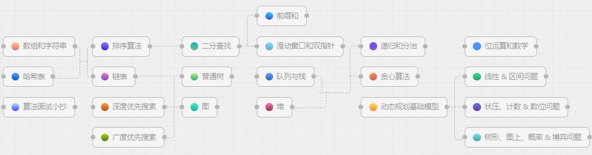
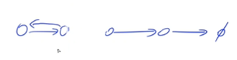

```
for (int a : A) result += a;
```

# 1 数组

## 1.0 数组理论基础

- 数组是非常基础的数据结构，面试中，考察数组的题目一般在思维上都不难，**主要是考察对代码的掌控能力**。想法很简单，但实现可能不是那么回事
- 要知道数组在内存中的存储方式，这样才能真正理解数组相关的面试题
- **数组是存放在连续内存空间上的相同类型数据的集合**，数组可以方便的通过下标索引的方式获取到下标对应的数据

举一个字符数组的例子，如图所示：


需要两点注意的是

- **数组下标都是从0开始**
- **数组内存空间的地址是连续的**

**因为数组的在内存空间的地址是连续的，所以在删除或者增添元素的时候，难免要移动其他元素的地址**

例如删除下标为3的元素，需要对下标为3的元素后面的所有元素都要做移动操作，如图所示：


- 大家如果使用C++的话，要注意vector 和 array的区别，vector的底层实现是array，严格来讲vector是容器，不是数组。**数组的元素是不能删的，只能覆盖**

那么二维数组直接上图，大家应该就知道怎么回事


**二维数组在内存的空间地址是连续的么？**

不同编程语言的内存管理是不一样的，以C++为例，在C++中二维数组是连续分布的，C++测试代码如下：

```cpp
void test_arr() {
    int array[2][3] = {
		{0, 1, 2},
		{3, 4, 5}
    };
    cout << &array[0][0] << " " << &array[0][1] << " " << &array[0][2] << endl;
    cout << &array[1][0] << " " << &array[1][1] << " " << &array[1][2] << endl;
}

int main() {
    test_arr();
}
```

测试地址为

```text
0x7ffee4065820 0x7ffee4065824 0x7ffee4065828
0x7ffee406582c 0x7ffee4065830 0x7ffee4065834
```

- 注意地址为16进制，可以看出**二维数组地址是连续一条线**
- 可能看不懂内存地址，我就简单介绍一下， 0x7ffee4065820 与 0x7ffee4065824 差了一个4，就是4个字节，因为这是一个int型的数组，所以两个相邻数组元素地址差4个字节
- 0x7ffee4065828 与 0x7ffee406582c 也是差了4个字节，在16进制里8 + 4 = c，c就是12

如图：


- **可以看出在C++中二维数组在地址空间上是连续的**
- 像Java是没有指针的，同时也不对程序员暴露其元素的地址，寻址操作完全交给虚拟机
- 所以看不到每个元素的地址情况，这里我以Java为例，也做一个实验

```java
public static void test_arr() {
    int[][] arr = {{1, 2, 3}, {3, 4, 5}, {6, 7, 8}, {9,9,9}};
    System.out.println(arr[0]);
    System.out.println(arr[1]);
    System.out.println(arr[2]);
    System.out.println(arr[3]);
}
```

输出的地址为：

```text
[I@7852e922
[I@4e25154f
[I@70dea4e
[I@5c647e05
```

- 这里的数值也是16进制，这不是真正的地址，而是经过处理过后的数值，可以看出，二维数组的每一行头结点的地址是没有规则的，更谈不上连续，所以Java的二维数组可能是如下排列的方式：


## 题目1：704.二分查找
[704.二分查找](https://leetcode-cn.com/problems/binary-search/)
[视频讲解](https://www.acwing.com/video/2563/)

## 1.1 题目描述

给定一个n个元素有序的(升序)整型数组 nums 和一个目标值 target ，写一个函数搜索 nums 中的 target，如果目标值存在返回下标，否则返回 -1。

示例 1:

```text
输入: nums = [-1,0,3,5,9,12], target = 9     
输出: 4       
解释: 9 出现在 nums 中并且下标为 4     
```

示例 2:

```text
输入: nums = [-1,0,3,5,9,12], target = 2     
输出: -1        
解释: 2 不存在 nums 中因此返回 -1        
```

提示：

- 可以假设 nums 中的所有元素是不重复
- n 将在 [1, 10000]之间
- nums的每个元素都将在 [-9999, 9999]之间

## 1.2 思路分析

- **这道题目的前提是数组为有序数组**，同时题目还强调**数组中无重复元素**，因为一旦有重复元素，使用二分查找法返回的元素下标可能不是唯一的，这些都是使用二分法的前提条件，当大家看到题目描述满足如上条件的时候，可要想一想是不是可以用二分法
- 二分查找涉及的很多的边界条件，逻辑比较简单，但就是写不好。例如到底是 `while(left < right)` 还是 `while(left <= right)`，到底是`right = middle`呢，还是要`right = middle - 1`呢？经常写错主要是因为**对区间的定义没有想清楚，区间的定义就是不变量**。要在二分查找的过程中，保持不变量，就是在while寻找中每一次边界的处理都要坚持根据区间的定义来操作，这就是**循环不变量**规则
- 写二分法，区间的定义一般为两种，左闭右闭即[left, right]，或者左闭右开即[left, right)

### 1.2.1 二分写法1(左闭右闭)

定义 target 是在一个在左闭右闭的区间里，**就是[left, right] (这个很重要非常重要)**

区间的定义决定二分法的代码应该如何写，**因为定义target在[left, right]区间，所以有如下两点：**

- 因为left == right是有意义的，所以在while (left <= right) 要使用 <=
- 如果nums[middle] 大于 target，更新搜索范围右下标 right 要赋值为 middle - 1，因为当前这个nums[middle]一定不是target，那么接下来要查找的左区间结束下标位置就是 middle - 1

例如在数组[1,2,3,4,7,9,10]中查找元素2，如图所示：


代码如下：（详细注释）

```cpp
// 版本一
class Solution {
public:
    int search(vector<int>& nums, int target) {
        int left = 0;
        int right = nums.size() - 1; // 定义target在左闭右闭的区间里，[left, right]
        while (left <= right) { // 当left==right，区间[left, right]依然有效，所以用 <=
            int middle = left + ((right - left) / 2);// 防止溢出 等同于(left + right)/2
            if (nums[middle] > target) {
                right = middle - 1; // target 在左区间，所以[left, middle - 1]，因为是大于，所以middle-1
            } else if (nums[middle] < target) {
                left = middle + 1; // target 在右区间，所以[middle + 1, right]
            } else { // nums[middle] == target
                return middle; // 数组中找到目标值，直接返回下标
            }
        }
        // 未找到目标值
        return -1;
    }
};
```

- 时间复杂度：O(log n)
- 空间复杂度：O(1)

### 1.2.2 二分写法2(左闭右开)

如果说定义 target 是在一个在左闭右开的区间里，也就是[left, right) ，那么二分法的边界处理方式则截然不同。

有如下两点：

- while (left < right)，这里使用 < ,因为left == right在区间[left, right)是没有意义的
- 如果nums[middle] 大于 target，right 更新为 middle，因为当前nums[middle]不等于target，去左区间继续寻找，而寻找区间是左闭右开区间，所以right更新为middle，即下一个查询区间不会去比较nums[middle]

在数组：1,2,3,4,7,9,10中查找元素2，如图所示：（**注意和方法一的区别**）


代码如下：（详细注释）

```cpp
// 版本二
class Solution {
public:
    int search(vector<int>& nums, int target) {
        int left = 0;
        int right = nums.size(); // 定义target在左闭右开的区间里，即：[left, right)
        while (left < right) { // 因为left == right的时候，在[left, right)是无效的空间，所以使用 <
            int middle = left + ((right - left) >> 1);
            if (nums[middle] > target) {
                right = middle; // target 在左区间，在[left, middle)中
            } else if (nums[middle] < target) {
                left = middle + 1; // target 在右区间，在[middle + 1, right)中
            } else { // nums[middle] == target
                return middle; // 数组中找到目标值，直接返回下标
            }
        }
        // 未找到目标值
        return -1;
    }
};
```

- 时间复杂度：O(log n)
- 空间复杂度：O(1)

### 1.2.3 二分写法3(Acwing)

 - 如果遇到相同的数字，**模板1可以求出数字的起始位置，模板2可以求出数字的终止位置**。如果没有遇到数字重复的情况，则模板1和2均可以求出位置所在
 - 确定check(mid)条件，默写模板
 - 最后的结果中 **l = r**，就是说**左右会集合到同一个点**


#### 1.2.3.1 模板1

- **r = mid, mid = l + r >> 1, q[mid] >= x**

 - 条件是左边**红色区域**，x是初始比较的值，加判断条件**q[mid] >= x**，true的话说明想查找的数字在mid的左边，那么**true为 r = mid**，**否则 l = mid + 1**。可以求出数字的起始位置
   

```cpp
bool check(int x) {/* ... */} // 检查x是否满足某种性质
// 模板1
// 区间[l, r]被划分成[l, mid]和[mid + 1, r]时使用：
int bsearch_1(int l, int r)
{
    while (l < r)
    {
        // check()判断mid是否满足性质
        int mid = l + r >> 1;// int是向下取整
        if (check(mid)) r = mid;//  check条件是q[mid] >= x
        else l = mid + 1;
    }
    return l;
}
```

#### 1.2.3.2 模板2

- **l = mid, mid = l + r + 1 >> 1, q[mid] <= x**

 - 条件是**绿色区域**，x是初始比较的值，加入判断条件**q[mid] <= x**，true的话说明x在mid的右边，那么**true为 l = mid**，**否则 r = mid - 1**。可以求出位置的终止位置
   

```cpp
// 模板2
// 区间[l, r]被划分成[l, mid - 1]和[mid, r]时使用：
int bsearch_2(int l, int r)
{
    while (l < r)
    {
        int mid = l + r + 1 >> 1;
        if (check(mid)) l = mid;// check条件是q[mid] <= x
        else r = mid - 1;
    }
    return l;
}
```

## 1.3 解题方法

### 1.3.1 随想录-方法1
```cpp
class Solution {
public:
    int search(vector<int>& nums, int target) {
        int left = 0;
        int right = nums.size() - 1; // 定义target在左闭右闭的区间里，[left, right]
        while (left <= right) { // 当left==right，区间[left, right]依然有效，所以用 <=
            int middle = left + ((right - left) / 2);// 防止溢出 等同于(left + right)/2
            if (nums[middle] > target) {
                right = middle - 1; // target 在左区间，所以[left, middle - 1]
            } else if (nums[middle] < target) {
                left = middle + 1; // target 在右区间，所以[middle + 1, right]
            } else { // nums[middle] == target
                return middle; // 数组中找到目标值，直接返回下标
            }
        }
        // 未找到目标值
        return -1;
    }
};
```
### 1.3.2 随想录-方法2
```cpp
class Solution {
public:
    int search(vector<int>& nums, int target) {
        int left = 0;
        int right = nums.size(); // 定义target在左闭右开的区间里，即：[left, right)
        while (left < right) { // 因为left == right的时候，在[left, right)是无效的空间，所以使用 <
            int middle = left + ((right - left) >> 1);
            if (nums[middle] > target) {
                right = middle; // target 在左区间，在[left, middle)中
            } else if (nums[middle] < target) {
                left = middle + 1; // target 在右区间，在[middle + 1, right)中
            } else { // nums[middle] == target
                return middle; // 数组中找到目标值，直接返回下标
            }
        }
        // 未找到目标值
        return -1;
    }
};
```
### 1.3.3 Acwing-方法3
[参考这里的二分查找做法](https://blog.csdn.net/qq_42731062/article/details/128015388)
- 注意边界条件
```cpp
class Solution {
public:
    int search(vector<int>& nums, int target) {
        int l = 0, r = nums.size() - 1;
        while(l < r)
        {
            int mid = l + r >> 1;// 这里mid = l + r >> 1则必须使用nums[mid] >= target进行判断
            if(nums[mid] >= target) r = mid;// 符合模板1
            else l = mid + 1;
        }
        if(nums[r] != target) return -1;
        return r;
    }
};
```
## 题目2 27.移除元素

[27.移除元素](https://leetcode.cn/problems/remove-element/)
[视频讲解](https://www.acwing.com/video/1349/)

## 2.1 题目描述

给你一个数组 nums 和一个值 val，需要原地移除所有数值等于 val 的元素，并返回移除后数组的新长度size()。不要使用额外的数组空间，必须仅使用 O(1) 额外空间并**原地**修改输入数组

示例 1: 

```
给定 nums = [3,2,2,3], val = 3, 函数应该返回新的长度 2, 并且 nums 中的前两个元素均为 2。 不需要考虑数组中超出新长度后面的元素。
```

示例 2: 

```
给定 nums = [0,1,2,2,3,0,4,2], val = 2, 函数应该返回新的长度 5, 并且 nums 中的前五个元素为 0, 1, 3, 0, 4。
```

元素的顺序可以改变。你不需要考虑数组中超出新长度后面的元素

## 2.2 思路分析

**数组的元素在内存地址中是连续的，不能单独删除数组中的某个元素，只能覆盖**

## 2.3 解题方法

### 2.3.1 随想录-方法1(暴力)

暴力的解法就是两层for循环，一个for循环遍历数组元素 ，第二个for循环更新数组。

删除过程如下：


```cpp
class Solution {
public:
    int removeElement(vector<int>& nums, int val) {
        int size = nums.size();
        for(int i = 0; i < size; i++)
        {
            if(nums[i] == val)
            {
                for(int j = i + 1; j < size; j++)
                {
                 // 发现需要移除的元素就将元素整体向前移动一位
                    nums[j - 1] = nums[j];
                }
         // 因为i所指的元素都向前移动一位，所以i也要向前移动一位
                i--;
                size--;// 数组长度-1
            }
        }
        return size;
    }
};
```
### 2.3.2 随想录-方法2(双指针)

- 双指针法(快慢指针法)：**通过一个快指针和慢指针在一个for循环下完成两个for循环的工作**

定义快慢指针

- **快指针：寻找新数组的元素，新数组是不含有目标元素的数组**
- **慢指针：指向更新新数组下标的位置**

删除过程如下：


- **双指针法(快慢指针法)在数组和链表的操作中是非常常见，很多考察数组、链表、字符串等操作的面试题，都使用双指针法**

```
// 时间复杂度：O(n)
// 空间复杂度：O(1)
// 注意这些实现方法并没有改变元素的相对位置！
class Solution {
public:
    int removeElement(vector<int>& nums, int val) {
        int slowIndex = 0;// 慢指针指向新的数组
        for (int fastIndex = 0; fastIndex < nums.size(); fastIndex++) {
            if (nums[fastIndex] != val) {
                nums[slowIndex++] = nums[fastIndex];
            }
        }
        return slowIndex;
    }
};
```

### 2.3.3 Acwing-方法3(双指针)


```cpp
class Solution {
public:
    int removeElement(vector<int>& nums, int val) {
        int k = 0;
        for(int i = 0; i < nums.size(); i++)
        {
            if(nums[i] != val)// 遇到不相同的元素，就将其加入到nums[k++]
            nums[k++] = nums[i];
        }
        return k;
    }
};
```
## 题目3 209.长度最小的子数组
[209.长度最小的子数组](https://leetcode.cn/problems/minimum-size-subarray-sum/)
[视频讲解](https://www.acwing.com/video/1587/)

## 3.1 题目描述

给定一个含有 n 个正整数的数组和一个正整数 s ，找出该数组中满足其和 ≥大于或等于s 的长度最小的连续子数组，并返回其长度。如果不存在符合条件的子数组，返回 0

示例1：

```
输入：s = 7, nums = [2,3,1,2,4,3]
输出：2
解释：子数组 [4,3] 是该条件下的长度最小的子数组
```

示例2：

```
输入：s = 12, nums = [4,6,2,4,9,8,7]
输出：2
解释：连续子数组 [4,9]、[9,8]、[8,7] 是该条件下的长度最小的子数组
```

提示：

- 1 <= target <= 10^9
- 1 <= nums.length <= 10^5
- 1 <= nums[i] <= 10^5

## 3.2 解决方法

### 3.2.1 随想录-暴力法(INT32_MAX)

这道题目暴力解法当然是 两个for循环，然后不断的寻找符合条件的子序列，时间复杂度很明显是O(n^2)。

```cpp
时间复杂度：O(n^2)
空间复杂度：O(1)
class Solution {
public:
    int minSubArrayLen(int s, vector<int>& nums) {
        int result = INT32_MAX; // 最终的结果
        int sum = 0; // 子序列的数值之和
        int subLength = 0; // 子序列的长度
        for (int i = 0; i < nums.size(); i++) { // 设置子序列起点为i
            sum = 0;
            for (int j = i; j < nums.size(); j++) { // 设置子序列终止位置为j
                sum += nums[j];
                if (sum >= s) { // 一旦发现子序列和超过了s，更新result
                    subLength = j - i + 1; // 取子序列的长度
                    result = result < subLength ? result : subLength;
                    break; // 因为我们是找符合条件最短的子序列，所以一旦符合条件就break
                }
            }
        }
        // 如果result没有被赋值的话，就返回0，说明没有符合条件的子序列
        return result == INT32_MAX ? 0 : result;
    }
};
```

### 3.2.2 随想录-滑动窗口法(重点)

- 暴力解法中，是一个for循环滑动窗口的起始位置，一个for循环为滑动窗口的终止位置，用两个for循环 完成了一个不断搜索区间的过程

- **滑动窗口就是不断的调节子序列的起始位置和终止位置**，从而得出我们要想的结果
- 那么滑动窗口如何用一个for循环来完成这个操作呢？首先要思考：如果用一个for循环，那么应该表示滑动窗口的起始位置，还是终止位置。如果只用一个for循环来表示滑动窗口的起始位置，那么如何遍历剩下的终止位置？此时难免再次陷入暴力解法的怪圈。所以**只用一个for循环，这个循环的索引，一定是表示滑动窗口的终止位置**
- 那么滑动窗口的起始位置如何移动呢？

这里还是以题目中的示例来举例，s=7， 数组是 2，3，1，2，4，3，来看一下查找的过程，最后找到 4，3 是最短距离：


从动画中可以发现滑动窗口也可以理解为双指针法的一种，只不过这种解法更像是一个窗口的移动，所以叫做滑动窗口更适合一些

在本题中实现滑动窗口，主要确定如下三点：

- 窗口内是什么？
- 如何移动窗口的起始位置？
- 如何移动窗口的结束位置？

**窗口就是满足其和大于等于s的长度最小的连续子数组**

- 窗口的起始位置如何移动：**如果当前窗口的值大于s，窗口就要向前移动(该缩小)**
- 窗口的结束位置如何移动：**窗口的结束位置就是遍历数组的指针，也就是for循环里的索引**

解题的关键在于窗口的起始位置如何移动，如图所示：


- **滑动窗口的精妙之处在于根据当前子序列和大小的情况，不断调节子序列的起始位置。从而将O(n^2)暴力解法降为O(n)**

```
时间复杂度：O(n)
空间复杂度：O(1)
class Solution {
public:
    int minSubArrayLen(int s, vector<int>& nums) {
        int result = INT32_MAX;
        int sum = 0; // 滑动窗口数值之和
        int i = 0; // 滑动窗口起始位置
        int subLength = 0; // 滑动窗口的长度
        for (int j = 0; j < nums.size(); j++) {
            sum += nums[j];
// 这里使用while，每次更新i(起始位置)，并不断比较子序列是否符合条件
            while (sum >= s) {
                subLength = (j - i + 1); // 取子序列的长度
                result = result < subLength ? result : subLength;// 更新result，和subLength比较
                sum -= nums[i++]; // 这里体现出滑动窗口的精髓之处，不断变更i(子序列的起始位置)
            }
        }
     // 如果result没有被赋值的话，就返回0，说明没有符合条件的子序列
        return result == INT32_MAX ? 0 : result;
    }
};
```

### 3.2.3 Acwing-双指针法(重点)


[INT_MAX解释](https://blog.csdn.net/weixin_43152897/article/details/125870528)

```cpp
class Solution {
public:
    int minSubArrayLen(int target, vector<int>& nums) {
        int res = INT_MAX;
        int sum = 0;
        for(int i = 0, j = 0; i < nums.size(); i++)
        {
            sum += nums[i];
            while(sum - nums[j] >= target) 
                sum -= nums[j++];// 减去当前的nums[j]
            // 这里必须是>=
            if(sum >= target) res = min(res, i - j + 1);
        }
        if(res == INT_MAX) res = 0;// 无解
        return res;
    }
};
```
## 题目4 59.螺旋矩阵II(难题)
[59.螺旋矩阵II](https://leetcode.cn/problems/spiral-matrix-ii/)
[视频讲解](https://www.acwing.com/video/1396/)

## 4.0 vector初始化

[vector的初始化](https://blog.csdn.net/qq_27538633/article/details/123784913)

- **一维数组vector使用**

```
#include<iostream>
#include<vector>
using namespace std;

int main() {
	int n;
	cin >> n;
	int number;
	vector<int> res(n,0); //初始化一个含有n个元素的一维数组，初始元素为0
	//看初始化为0是否成功，进行打印输出
	for (int i = 0; i < n; i++) {
		cout << res[i] << " ";
	}
	cout << endl;

for (int i = 0; i < n; i++) {
	cin >> number;
	res[i] = number;
}
for (int i = 0; i < n; i++) {
	cout << res[i] << " ";
}
cout << endl;
return 0;
```

- **二维数组vector使用**

可以直接初始化，这样在往数组中存值时，就可以用赋值运算符等号，不需要用push_back函数

```
vector<vector<int>> res(n,vector<int>(m,0));
//初始化一个n行、m列，初始元素为0的二维数组

在向二维数组进行输入时
for (int i = 0; i < n; i++) {
		for (int j = 0; j < m; j++) {
			cin >> number;
			res[i][j]=number;
		}
	}
```

完整的代码：

```
#include<iostream>
#include<vector>
using namespace std;

int main() {
	int n, m;
	cin >> n >> m;
	vector<vector<int>> res(n, vector<int>(m, 0)); //初始化一个n行、m列，初始元素为0的二维数组
	//看初始化为0是否成功，进行打印输出
	for (int i = 0; i < n; i++) {
		for (int j = 0; j < m; j++) {
			cout << res[i][j] << " ";
		}
		cout << endl;
	}
	cout << endl;

for (int i = 0; i < n; i++) {
	for (int j = 0; j < m; j++) {
		cin >> res[i][j];
	}
}
for (int i = 0; i < n; i++) {
	for (int j = 0; j < m; j++) {
		cout << res[i][j] << " ";
	}
	cout << endl;
}
return 0;
```

## 4.1 题目描述

给定一个正整数 n，生成一个包含 1 到 n^2 所有元素，且元素按顺时针顺序螺旋排列的正方形矩阵。

示例:

```
输入: 3 
输出: [[ 1, 2, 3 ], 
       [ 8, 9, 4 ], 
       [ 7, 6, 5 ]]
```

## 4.2 思路分析

- **本题不涉及到什么算法，就是模拟过程，却十分考察对代码的掌控能力**
- 要如何画出这个螺旋排列的正方形矩阵呢？刚开始做这种题目的时候，上来一波判断猛如虎。结果运行的时候各种问题，然后开始各种修修补补，最后发现改了这里那里有问题，改那里这里又跑不起来
- 在前面提到如果要写出正确的二分法一定要坚持**循环不变量原则**，而求解本题依然是要**坚持循环不变量原则**

模拟顺时针画矩阵的过程

- 填充上行从左到右
- 填充右列从上到下
- 填充下行从右到左
- 填充左列从下到上

由外向内一圈一圈这么画下去。可以发现这里的边界条件非常多，在一个循环中，如此多的边界条件，如果不按照固定规则来遍历，那就是**一进循环深似海，从此offer是路人**

这里一圈下来，要画每四条边，这四条边怎么画，每画一条边都要坚持一致的左闭右开，或者左开右闭的原则，这样这一圈才能按照统一的规则画下来

按照**左闭右开**的原则，来画一圈，大家看一下：


这里每一种颜色，代表一条边，遍历的长度，可以看出每一个拐角处的处理规则，拐角处让给新的一条边来继续画.这也是坚持每条边左闭右开的原则

## 4.3 解题方法

### 4.3.1 随想录-方法1

代码如下，已经详细注释每一步的目的，可以看出while循环里判断的情况是很多的，代码里处理的原则也是统一的左闭右开

```
时间复杂度 O(n^2): 模拟遍历二维矩阵的时间
空间复杂度 O(1)
class Solution {
public:
    vector<vector<int>> generateMatrix(int n) {
        vector<vector<int>> res(n, vector<int>(n, 0)); // 使用vector定义一个二维数组
        int startx = 0, starty = 0; // 定义每循环一个圈的起始位置
        int loop = n / 2; // 每个圈循环几次，例如n为奇数3，那么loop = 1 只是循环一圈，矩阵中间的值需要单独处理
        int mid = n / 2; // 矩阵中间的位置，例如：n为3， 中间的位置就是(1，1)，n为5，中间位置为(2, 2)
        int count = 1; // 用来给矩阵中每一个空格赋值
        int offset = 1; // 需要控制每一条边遍历的长度，每次循环右边界收缩一位
        int i,j;
        while (loop --) {
            i = startx;
            j = starty;

            // 下面开始的四个for就是模拟转一圈
// 模拟填充上行从左到右(左闭右开)，行不变，列变化
           for (j = starty; j < n - offset; j++) {
                res[i][j] = count++;
            }
// 模拟填充右列从上到下(左闭右开)，列不变(j是n-offset)，行变化
            for (i = startx; i < n - offset; i++) {
                res[i][j] = count++;
            }
// 模拟填充下行从右到左(左闭右开)，行不变，列变化
            for (; j > starty; j--) {
                res[i][j] = count++;
            }
// 模拟填充左列从下到上(左闭右开)，列不变，行变化
            for (; i > startx; i--) {
                res[i][j] = count++;
            }

// 第二圈开始的时候，起始位置要各自加1， 例如：第一圈起始位置是(0, 0)，第二圈起始位置是(1, 1)
            startx++;
            starty++;

            // offset 控制每一圈里每一条边遍历的长度
            offset += 1;
        }

        // 如果n为奇数的话，需要单独给矩阵最中间的位置赋值
        if (n % 2) {
            res[mid][mid] = count;
        }
        return res;
    }
};
```

### 4.3.2 Acwing-方法2

```cpp
class Solution {
public:
    vector<vector<int>> generateMatrix(int n) {
        // 初始化一个n行、n列，初始元素为0的二维数组
        vector<vector<int>> res(n, vector<int>(n,0));
        // 右->下->左->上的顺序，而且x坐标是垂直向下，y坐标是水平向右
        int dx[] = {0, 1, 0, -1}, dy[] = {1, 0, -1, 0};
        // 当i = 1时，对应(x,y)是(0,0)，d表示选择哪种模式，d=0，表示向右，d=1表示向下
        for(int i = 1, x = 0, y = 0, d = 0; i <= n*n; i++){
            res[x][y] = i;// 坐标[x][y]
            int a = x + dx[d], b = y + dy[d];// a表示x坐标，b表示y坐标，最大值是n-1(从0开始)
            if(a < 0 || a >= n || b < 0 || b >= n || res[a][b])// 最后res[a][b]表示这个格子已经填了数
            {
                d = (d + 1) % 4;// 更改方向
                a = x + dx[d], b = y + dy[d];// 继续往下走
            }
            x = a, y = b;// 更新a和b
        }
        return res;
    }
};
```

## 题目5 977.有序数组的平方

[977.有序数组的平方](https://leetcode.cn/problems/squares-of-a-sorted-array/description/)

## 5.1 题目描述

给你一个按**非递减顺序** 排序的整数数组 `nums`，返回**每个数字的平方** 组成的新数组，要求也按**非递减顺序** 排序

**示例 1：**

```
输入：nums = [-4,-1,0,3,10]
输出：[0,1,9,16,100]
解释：平方后，数组变为 [16,1,0,9,100]
排序后，数组变为 [0,1,9,16,100]
```

**示例 2：**

```
输入：nums = [-7,-3,2,3,11]
输出：[4,9,9,49,121]
```

**提示：**

- `1 <= nums.length <= 104`
- `-104 <= nums[i] <= 104`
- `nums` 已按 **非递减顺序** 排序

## 5.2 解题方法

### 5.2.1 随想录-暴力法

每个数平方之后，排个序，代码如下：

```cpp
class Solution {
public:
    vector<int> sortedSquares(vector<int>& A) {
        for (int i = 0; i < A.size(); i++) {
            A[i] *= A[i];
        }
        sort(A.begin(), A.end()); // 快速排序
        return A;
    }
};
```

- 这个时间复杂度是 O(n + nlogn)， 可以说是O(nlogn)的时间复杂度，但为了和下面双指针法算法时间复杂度有鲜明对比，我记为 O(n + nlog n)

### 5.2.2 随想录-双指针法(重点)

- 数组其实是有序的， 只不过负数平方之后可能成为最大数了。那么数组平方的最大值就在数组的两端，不是最左边就是最右边，不可能是中间。此时可以考虑双指针法了，i指向起始位置，j指向终止位置
- 定义一个新数组result，和A数组一样的大小，让k指向result数组终止位置

- 如果`A[i] * A[i] < A[j] * A[j]` 那么`result[k--] = A[j] * A[j];` 
- 如果`A[i] * A[i] >= A[j] * A[j]` 那么`result[k--] = A[i] * A[i];` 

如动画所示：


不难写出如下代码：

```cpp
class Solution {
public:
    vector<int> sortedSquares(vector<int>& A) {
        int k = A.size() - 1;
        vector<int> result(A.size(), 0);// 初始化
        for (int i = 0, j = A.size() - 1; i <= j;) // 这里i<=j加封号
        { // 注意这里要i <= j，因为最后要处理两个元素
            if (A[i] * A[i] < A[j] * A[j])  {
                result[k--] = A[j] * A[j];
                j--;
            }
            else {
                result[k--] = A[i] * A[i];
                i++;
            }
        }
        return result;
    }
};
```

- 此时的时间复杂度为O(n)，相对于暴力排序的解法O(n + nlog n)还是提升不少的

## 题目6 53.最大子数组和(难题)

[53.最大子数组和](https://leetcode.cn/problems/maximum-subarray/description/)

## 5.1 题目描述

给你一个整数数组 `nums` ，请你找出一个具有最大和的连续子数组（子数组最少包含一个元素），返回其最大和。**子数组** 是数组中的一个连续部分

**示例 1：**

```
输入：nums = [-2,1,-3,4,-1,2,1,-5,4]
输出：6
解释：连续子数组 [4,-1,2,1] 的和最大，为 6 。
```

**示例 2：**

```
输入：nums = [1]
输出：1
```

**示例 3：**

```
输入：nums = [5,4,-1,7,8]
输出：23
```

**提示：**

- `1 <= nums.length <= 105`
- `-104 <= nums[i] <= 104`

- **进阶：**如果你已经实现复杂度为 `O(n)` 的解法，尝试使用更为精妙的**分治法**求解

## 5.2 解题方法

### 5.2.1 嵌入式-暴力法(超时)

遍历两次，记下max的值，在内层循环和累加值比较

```
class Solution {
public:
    int maxSubArray(vector<int>& nums) {
    //暴力算法
    int k = nums.size();
    int max = nums[0];
    for(int i = 0; i < k; i++)
    {
        int tmp = 0;
        for(int j = i; j < k;j++)
        {
            tmp += nums[j];
            if(tmp > max)
            {
                max = tmp;
            }
        }
    }
    return max;
    }
};
```

### 5.2.2 嵌入式-分治法(重点)

- 结束条件，当numsSize ==1时直接返回当前值
- 处理左支求Max_Left
- 处理右支求Max_Right
- 处理本身，向左求最大值和Max_l，然后向右求最大和Max_r
- 最终结果是MAX(Max_Left，Max_Right，Max_r)

# 2 链表

## 2.0 链表理论基础

- 链表是一种通过指针串联在一起的线性结构，每一个节点由两部分组成，一个是**数据域**，一个是**指针域**(**存放指向下一个节点的指针**)，**最后一个节点的指针域指向null(空指针的意思)**

- 链表的**入口节点称为链表的头结点也就是head**


如图所示： 

### 2.0.1 链表的类型

接下来说一下链表的几种类型

#### 2.0.1.1 单链表

刚刚说的就是单链表

#### 2.0.1.2 双链表

- **单链表中的指针域只能指向节点的下一个节点**
- 双链表：**每一个节点有两个指针域，一个指向下一个节点，一个指向上一个节点**

- 双链表既可以向前查询也可以向后查询


如图所示： 

#### 2.0.1.3 循环链表

- 循环链表，顾名思义，就是链表首尾相连

- 循环链表可以用来解决约瑟夫环问题


### 2.0.2 链表存储方式

- 数组是在内存中是连续分布的，但是链表在内存中可不是连续分布的

- 链表是通过指针域的指针链接在内存中各个节点

- 所以链表中的节点在内存中不是连续分布的 ，而是散乱分布在内存中的某地址上，分配机制取决于操作系统的内存管理


如图所示：


- 这个链表起始节点为2， 终止节点为7， 各个节点分布在内存的不同地址空间上，通过指针串联在一起


### 2.0.3 链表的定义

链表节点的定义，很多同学在面试时都写不好。这是因为平时在刷leetcode的时候，链表的节点都默认定义好了，直接用就行了，所以同学们都没有注意到链表的节点是如何定义的。而在面试的时候，一旦要自己手写链表，就写的错漏百出。

这里给出C/C++的定义链表节点方式，如下所示：

```cpp
// 单链表
struct ListNode {
    int val;  // 节点上存储的元素
    ListNode *next;  // 指向下一个节点的指针
    ListNode(int x) : val(x), next(NULL) {}  // 节点的构造函数
};
```

有同学说不定义构造函数行不行，答案是可以的，C++默认生成一个构造函数。

但是这个构造函数不会初始化任何成员变量，下面我来举两个例子：

**通过自己定义构造函数初始化节点**：

```cpp
ListNode* head = new ListNode(5);
```

**使用默认构造函数初始化节点**：

```cpp
ListNode* head = new ListNode();
head->val = 5;
```

- 所以如果不定义构造函数使用默认构造函数的话，在初始化的时候就不能直接给变量赋值！


### 2.0.4 链表的操作

#### 2.0.4.1 删除节点(delete)

删除D节点，如图所示：


- 只要将C节点的next指针 指向E节点就可以。
- 那有同学说D节点不是依然存留在内存里么？只不过是没有在这个链表里而已。所以**在C++里最好是再手动释放这个D节点，释放这块内存**，delete掉
- 其他语言例如Java、Python，就有自己的内存回收机制，就不用自己手动释放


#### 2.0.4.2 添加节点

如图所示：


可以看出链表的增添和删除都是O(1)操作，也不会影响到其他节点。

但是要注意，要是删除第五个节点，需要从头节点查找到第四个节点通过next指针进行删除操作，查找的时间复杂度是O(n)

#### 2.0.4.3 删除插入节点

删除链表节点： 

```
p->next = p->next->next;
或者
q = p->next;
p->next = q->next;
或者
q = p->next;
q = q->next;
```

添加链表节点： 

```
// 插入节点s
s->next = p->next;// 将p的后继结点赋值给s的后继
p->next = s;// 将s赋值给p的后继
```

## 

### 2.0.5 性能分析

再把链表的特性和数组的特性进行一个对比，如图所示：


- 数组在定义的时候，长度就是固定的，如果想改动数组的长度，就需要重新定义一个新的数组

- 链表的长度可以是不固定的，并且可以动态增删， 适合数据量不固定，频繁增删，较少查询的场景

## 题目1 203.移除链表元素

[203.移除链表元素](https://leetcode.cn/problems/remove-linked-list-elements/description/)

[视频讲解](https://www.acwing.com/video/1562/)

## 1.1 题目描述

题意：删除链表中等于给定值 val 的所有节点。

**示例 1：**

```
输入：head = [1,2,6,3,4,5,6], val = 6 输出：[1,2,3,4,5]
```

**示例 2：** 

```
输入：head = [], val = 1 输出：[]
```

**示例 3：** 

```
输入：head = [7,7,7,7], val = 7 输出：[]
```

## 1.2 思路分析

- 这里以链表 1 4 2 4 来举例，移除元素4


- 如果使用C，C++编程语言的话，不要忘还要从内存中删除这两个移除的节点， 清理节点内存之后如图：


- **当然如果使用java ，python的话就不用手动管理内存**
- 还要说明一下，就算使用C++来做leetcode，如果移除一个节点之后，没有手动在内存中删除这个节点，leetcode依然也是可以通过的，只不过，内存使用的空间大一些而已，但建议依然要养成手动清理内存的习惯。
- 这种情况下的移除操作，就是让节点next指针直接指向下下一个节点就可以了，那么因为单链表的特殊性，只能指向下一个节点，刚刚删除的是链表的中第二个，和第四个节点，那么如果删除的是头结点又该怎么办呢？

这里就涉及如下链表操作的两种方式：

- **直接使用原来的链表来进行删除操作**
- **设置一个虚拟头结点在进行删除操作**

## 1.3 解题方法

### 1.3.1 随想录-方法2(直接用原来链表)

来看第一种操作：**直接使用原来的链表来进行移除**


- 移除头结点和移除其他节点的操作是不一样的，因为链表的其他节点都是通过前一个节点来移除当前节点，而头结点没有前一个节点
- 所以头结点如何移除呢，其实**只要将头结点向后移动一位就可以，这样就从链表中移除一个头结点**


- 依然别忘将原头结点从内存中删掉 

- 这样移除一个头结点，是不是发现，在单链表中移除头结点和移除其他节点的操作方式是不一样，其实在写代码的时候也会发现，需要单独写一段逻辑来处理移除头结点的情况。那么可不可以以一种统一的逻辑来移除 链表的节点呢？

```
时间复杂度: O(n)
空间复杂度: O(1)
class Solution {
public:
    ListNode* removeElements(ListNode* head, int val) {
        // 删除头结点
        while (head != NULL && head->val == val) { // 注意这里不是if
            ListNode* tmp = head;
            head = head->next;// 当前头结点的下一个节点作为头结点
            delete tmp;
        }

        // 删除非头结点
        ListNode* cur = head;
        while (cur != NULL && cur->next!= NULL) {
            if (cur->next->val == val) {
                ListNode* tmp = cur->next;
                cur->next = cur->next->next;
                delete tmp;
            } else {
                cur = cur->next;
            }
        }
        return head;
    }
};
```

### 1.3.2 随想录-方法2(虚拟头结点-推荐)

- **可以设置一个虚拟头结点**，这样原链表的所有节点就都可以按照统一的方式进行移除

- 来看看如何设置一个虚拟头。依然还是在这个链表中，移除元素1


- 这里来给链表添加一个虚拟头结点为新的头结点，此时要移除这个旧头结点元素1。这样就可以使用和移除链表其他节点的方式统一。
- 来看一下，如何移除元素1 呢，还是熟悉的方式，然后从内存中删除元素1。最后在题目中，return 头结点的时候，别忘 `return dummyNode->next;`， 这才是新的头结点

```
class Solution {
public:
    ListNode* removeElements(ListNode* head, int val) {
    ListNode* dummyHead = new ListNode(0);// 设置虚拟头结点
    dummyHead->next = head;// 虚拟头结点的下一个作为头结点
    ListNode* cur = dummyHead;// 设置cur为当前头节点
    while(cur->next != NULL){
    	if(cur->next->val == val){
    		ListNode* tmp = cur->next;
    		cur->next = cur->next->next;
    		delete tmp;// 删除符合条件的节点(最好删除，否则会占用内存)。如果最后一个元素是4，cur指向倒数第2个数，cur->next指向倒数第1个数
    	}
    	else{
    		cur = cur->next;// 移动到下一个
    	}
    }
    head = dummyHead->next;
    delete dummyHead;// 删除虚拟头结点
    return head;// 实际头结点
    // return dummyHead->next;
    }
};
```

### 1.3.3 Acwing-方法3(虚拟头结点)

```
class Solution {
public:
    ListNode* removeElements(ListNode* head, int val) {
    auto dummy = new ListNode(-1);// 设置dummy为虚拟头结点，这里的auto就是ListNode*
    dummy->next = head;// 虚拟头结点的下一个作为头结点
    for(auto p = dummy;p;p = p->next)// 中间表示p不为空
    {
        auto q = p->next;
        while(q && q->val == val)// q不为空节点，且值为val
        {
    // 跳过该节点，可以理解为p->next = p->next->next，q = p->next
            q = q->next;
        }
        p->next = q;// 这句是移动语句，要求当前的q赋值成p->next，这样for语句中p就可以变成q，实现移动
    }
    return dummy->next;// 实际头结点
    }
};
```

## 题目2 707.设计链表(重点)

[707.设计链表](https://leetcode.cn/problems/design-linked-list/description/)

## 2.1 题目描述

在链表类中实现这些功能：

- get(index)：获取链表中第 index 个节点的值。如果索引无效，则返回-1。
- addAtHead(val)：在链表的第一个元素之前添加一个值为 val 的节点。插入后，新节点将成为链表的第一个节点
- addAtTail(val)：将值为 val 的节点追加到链表的最后一个元素
- addAtIndex(index,val)：在链表中的第 index 个节点之前添加值为 val 的节点。如果index等于链表的长度，该节点将附加到链表的末尾。如果 index 大于链表长度，则不会插入节点。如果index小于0，则在头部插入节点
- deleteAtIndex(index)：如果索引 index 有效，则删除链表中的第 index 个节点


## 2.2 解题方法

### 2.2.1 随想录-方法1(虚拟头结点)

这道题目设计链表的五个接口：

- 获取链表第index个节点的数值
- 在链表的最前面插入一个节点
- 在链表的最后面插入一个节点
- 在链表第index个节点前面插入一个节点
- 删除链表的第index个节点

可以说这五个接口，已经覆盖链表的常见操作，是练习链表操作非常好的一道题目

**链表操作的两种方式：**

1. 直接使用原来的链表来进行操作
2. **设置一个虚拟头结点在进行操作**

下面采用设置一个虚拟头结点(这样更方便一些，大家看代码就会感受出来)

```cpp
时间复杂度: 涉及 `index` 的相关操作为 O(index), 其余为 O(1)
空间复杂度: O(n)
class MyLinkedList {
public:
    // 定义链表节点结构体
    struct LinkedNode {
        int val;
        LinkedNode* next;
        LinkedNode(int val):val(val), next(nullptr){}
    };

    // 初始化链表
    MyLinkedList() {
        _dummyHead = new LinkedNode(0); // 这里定义的头结点 是一个虚拟头结点，而不是真正的链表头结点
        _size = 0;
    }

    // 获取到第index个节点数值，如果index是非法数值直接返回-1， 注意index是从0开始的，第0个节点就是头结点
    int get(int index) {
        if (index > (_size - 1) || index < 0) {
            return -1;
        }
        LinkedNode* cur = _dummyHead->next;
        while(index--){ // 如果--index 就会陷入死循环
            cur = cur->next;
        }
        return cur->val;
    }

    // 在链表最前面插入一个节点，插入完成后，新插入的节点为链表的新的头结点
    void addAtHead(int val) {
        LinkedNode* newNode = new LinkedNode(val);
        newNode->next = _dummyHead->next;
        _dummyHead->next = newNode;
        _size++;
    }

    // 在链表最后面添加一个节点
    void addAtTail(int val) {
        LinkedNode* newNode = new LinkedNode(val);
        LinkedNode* cur = _dummyHead;
        while(cur->next != nullptr){
            cur = cur->next;
        }
        cur->next = newNode;
        _size++;
    }

    // 在第index个节点之前插入一个新节点，例如index为0，那么新插入的节点为链表的新头节点。
    // 如果index 等于链表的长度，则说明是新插入的节点为链表的尾结点
    // 如果index大于链表的长度，则返回空
    // 如果index小于0，则在头部插入节点
    void addAtIndex(int index, int val) {

        if(index > _size) return;
        if(index < 0) index = 0;        
        LinkedNode* newNode = new LinkedNode(val);
        LinkedNode* cur = _dummyHead;
        while(index--) {
            cur = cur->next;
        }
        newNode->next = cur->next;
        cur->next = newNode;
        _size++;
    }

    // 删除第index个节点，如果index 大于等于链表的长度，直接return，注意index是从0开始的
    void deleteAtIndex(int index) {
        if (index >= _size || index < 0) {
            return;
        }
        LinkedNode* cur = _dummyHead;
        while(index--) {
            cur = cur ->next;
        }
        LinkedNode* tmp = cur->next;
        cur->next = cur->next->next;
        delete tmp;
        //delete命令指示释放了tmp指针原本所指的那部分内存，
        //被delete后的指针tmp的值（地址）并非就是NULL，而是随机值。也就是被delete后，
        //如果不再加上一句tmp=nullptr,tmp会成为乱指的野指针
        //如果之后的程序不小心使用了tmp，会指向难以预想的内存空间
        tmp=nullptr;
        _size--;
    }

    // 打印链表
    void printLinkedList() {
        LinkedNode* cur = _dummyHead;
        while (cur->next != nullptr) {
            cout << cur->next->val << " ";
            cur = cur->next;
        }
        cout << endl;
    }
private:
    int _size;
    LinkedNode* _dummyHead;

};
```

### 2.2.2 Acwing-方法1(虚拟头结点)

```
class MyLinkedList {
public:
    struct Node{// 结点结构体
        int val;
        Node* next;
        Node(int _val):val(_val),next(NULL){}// 构造函数value用int构造
    }*head;// 头结点

    MyLinkedList() {
        head = NULL;// 头结点初始化为空
    }
    
    int get(int index) {// 获取链表中下标为 index 的节点的值
        if(index < 0) return -1;
        auto p = head;
        for(int i = 0; i < index && p;i++) p = p->next;// 下标小于index不断向后遍历，这里因为p为p->next，所以i<index，最终获取的是位置在index的p
        if(!p) return -1;// p为空返回-1
        return p->val;
    }
    
    void addAtHead(int val) { // 头插元素
        auto cur = new Node(val);
        cur->next = head;// 当前节点的下一个节点赋值为当前的head
        head = cur;// 将当前节点cur设置为新的头结点
    }
    
    void addAtTail(int val) { // 尾插元素
        if(!head) head = new Node(val);// 如果链表为空，头结点为new的新节点
        else{
            auto p = head;
            while(p->next) p = p->next;// 如果p->next存在，就一直执行后面语句
            p->next = new Node(val);
        }
    }
    
    void addAtIndex(int index, int val) {
        if(index <= 0) addAtHead(val);// index<=0, 头插
        else{
            int len = 0;
            for(auto p = head;p;p = p->next)len++;// 中间表示p不为空，遍历链表，求链表长度len
            if(index == len) addAtTail(val);// index等于len, 尾插
            else if(index < len){// 这里必须要判断下
                auto p = head;
                for(int i = 0; i < index - 1;i++) p = p->next;// 获取index前一个位置
                auto cur = new Node(val);
                cur->next = p->next;// 这两句表示插入元素
                p->next = cur;
            }
        }
    }
    
    void deleteAtIndex(int index) {
        int len = 0;
        for(auto p = head; p; p = p->next) len++;// 中间表示链表不为空
        if(index >= 0 && index < len){
            if(!index) head = head->next;// 如果只有一个节点(头结点)，直接删除
            else{// 删除第index个点，需要先找到第index-1个点
                auto p = head;
                for(int i = 0; i < index - 1; i++) p = p->next;// p指向index-1的点
                p->next = p->next->next;// 删除第index的点，记得把删掉的节点delete
            }
        }
    }
};
```

## 题目3 206.反转链表

[206.反转链表](https://leetcode.cn/problems/reverse-linked-list/description/)

## 3.1 题目描述

题意：反转一个单链表

示例: 

```
输入：head = [1,2,3,4,5]
输出：[5,4,3,2,1]
```

## 3.2 思路分析

- 如果再定义一个新的链表，实现链表元素的反转，这是对内存空间的浪费
- 其实**只需要改变链表的next指针的指向，直接将链表反转** ，而不用重新定义一个新的链表，如图所示


- 之前链表的头节点是元素1， 反转之后头结点就是元素5 ，这里并没有添加或者删除节点，仅仅是**改变next指针的方向**
- 那么接下来看一看是如何反转的呢？我们拿有示例中的链表来举例，如动画所示(纠正：动画应该是先移动pre，在移动cur)


- 首先定义一个cur指针，指向头结点，再定义一个pre指针，初始化为null
- 然后就要开始反转，首先要**把 cur->next 节点用tmp指针保存一下，也就是保存一下这个节点。为什么要保存一下这个节点呢，因为接下来要改变 cur->next 的指向，将cur->next 指向pre ，此时已经反转第一个节点**
- 接下来，就是循环走如下代码逻辑了，继续移动pre和cur指针。
- 最后，cur 指针已经指向null，循环结束，链表也反转完毕。 此时我们return pre指针就可以，pre指针就指向新的头结点

## 3.3 解题方法

### 3.3.1 随想录-方法1(双指针)

```
class Solution {
public:
    ListNode* reverseList(ListNode* head) {
        ListNode* tmp;
        ListNode* cur = head;// 头结点，比如1
        ListNode* pre = nullptr;
        while(cur)
        {
            tmp = cur->next;// 保存cur->next节点，保存没有反转之前cur->next点，为后面cur进行移动
            cur->next = pre;// cur->next指向pre，此时执行反转操作，cur的下一个点反转为pre
            pre = cur;// pre移动到当前节点
            cur = tmp;// cur向下移动
        }
        return pre;
    }
};
```

### 3.3.2 随想录-方法2(递归)

```
class Solution {
public:
    ListNode* reverse(ListNode* pre,ListNode* cur){
        if(cur == NULL) return pre;
        ListNode* temp = cur->next;
        cur->next = pre;
        // 可以和双指针法的代码进行对比，如下递归的写法，其实就是做了这两步
        // pre = cur;
        // cur = temp;
        return reverse(cur,temp);
    }
    ListNode* reverseList(ListNode* head) {
        // 和双指针法初始化是一样的逻辑
        // ListNode* cur = head;
        // ListNode* pre = NULL;
        return reverse(NULL, head);
    }
};
```

### 3.3.3 Acwing-方法3(双指针)



```
class Solution {
public:
    ListNode* reverseList(ListNode* head) {
        if(!head) return NULL;
        auto a = head, b = head->next;
        while(b){
        	auto c = b->next;// 保存未反转之前b的下一个点
        	b->next = a;// 执行反转操作
        	a = b;// 指针a移动到指针b的位置
        	b = c;// 指针b移动到c的位置
        }
        head->next = NULL;
        return a;
    }
};
```

## 题目4 24.两两交换链表中的节点

[24.两两交换链表节点](https://leetcode.cn/problems/swap-nodes-in-pairs/description/)

## 4.1 题目描述

给定一个链表，两两交换其中相邻的节点，并返回交换后的链表。不能只是单纯的改变节点内部的值，而是需要实际的进行节点交换。


## 4.2 思路分析

**建议使用虚拟头结点，这样会方便很多，要不然每次针对头结点(没有前一个指针指向头结点)，还要单独处理**

接下来就是交换相邻两个元素，**此时一定要画图，不画图，操作多个指针很容易乱，而且要操作的先后顺序**

- 初始时，cur指向虚拟头结点，然后进行如下三步：


- 操作之后，链表如下，这里节点1和节点3都是临时节点


- 看这个可能就更直观一些：


## 4.3 解题方法

### 4.3.1 随想录-方法1(虚拟头结点)


```
class Solution {
public:
    ListNode* swapPairs(ListNode* head) {
        ListNode* dummyHead = new ListNode(0); // 设置一个虚拟头结点
        dummyHead->next = head; // 将虚拟头结点指向head，这样方便后面做删除操作
        ListNode* cur = dummyHead;
        while(cur->next != nullptr && cur->next->next != nullptr) {
            ListNode* tmp = cur->next; // 记录临时节点1
            ListNode* tmp1 = cur->next->next->next; // 记录临时节点3

            cur->next = cur->next->next;//步骤一
            cur->next->next = tmp;     // 步骤二
            cur->next->next->next = tmp1;//步骤三
            cur = cur->next->next; // cur移动两位，准备下一轮交换
        }
        return dummyHead->next;
    }
};
```

- 跟原来程序比有所改良，将cur->next->next设置为临时节点tmp2


```
class Solution {
public:
    ListNode* swapPairs(ListNode* head) {
        ListNode* dummyHead = new ListNode(0); // 设置一个虚拟头结点
        dummyHead->next = head; // 将虚拟头结点指向head，这样方便后面做删除操作
        ListNode* cur = dummyHead;
        while(cur->next != nullptr && cur->next->next != nullptr) {
            ListNode* tmp1 = cur->next; // 记录临时节点1
            ListNode* tmp2 = cur->next->next; // 记录临时节点2
            ListNode* tmp3 = cur->next->next->next; // 记录临时节点3

            cur->next = tmp2;//步骤一，让cur->next赋值给临时节点2
            cur->next->next = tmp1;    // 步骤二
            cur->next->next->next = tmp3;//步骤三
            cur = cur->next->next; // cur移动两位，准备下一轮交换
        }
        return dummyHead->next;
    }
};
```

## 题目5 19.删除链表倒数第N个节点(虚拟头结点)

[19.删除链表倒数第n个节点](https://leetcode.cn/problems/remove-nth-node-from-end-of-list/description/)

## 5.1 题目描述

给一个链表，删除链表的倒数第 n 个结点，并且返回链表的头结点


```
示例 1：
输入：head = [1,2,3,4,5], n = 2 
输出：[1,2,3,5] 
示例 2：
输入：head = [1], n = 1 
输出：[] 
示例 3：
输入：head = [1,2], n = 1 输出：[1]
```

## 5.2 思路分析

双指针经典应用，**如果要删除倒数第n个节点，让fast移动n步，然后让fast和slow同时移动，直到fast指向链表末尾**。删掉slow所指向的节点就可以。思路是这样，但要注意一些细节

分为如下几步：

- 首先推荐使用**虚拟头结点**，这样**方便处理删除实际头结点的逻辑**
- 定义fast指针和slow指针，**初始值为虚拟头结点**，如图：


- **fast首先走n+1步，为什么是n+1呢，因为只有这样同时移动时候slow才能指向删除节点的上一个节点(方便做删除操作)**，如图： 


- **fast和slow同时移动，直到fast指向末尾**null，如题：


- **删除slow指向的下一个节点**，如图： 


- 解释下为什么fast要走n+1步，**因为fast走到NULL时，slow走到倒数第n+1步，slow的下一个结点就是需要删除的倒数第n个**

## 5.3 解题方法

### 5.3.1 随想录-方法1(双指针)

```
class Solution {
public:
    ListNode* removeNthFromEnd(ListNode* head, int n) {
        ListNode* dummyHead = new ListNode(0);// 新建一个虚拟节点
        dummyHead->next = head;// 将虚拟头结点指向head，这样方便后面做删除操作
        ListNode* fast = dummyHead;
        auto slow = dummyHead;// auto就是ListNode*
        while(n-- && fast!=NULL){
            fast = fast->next;// 向前移动n个节点
        }
        fast = fast->next;// 再向前移动一个节点，一共移动n+1个节点
        // fast和slow一起移动
        while(fast!=NULL)
        {
            fast = fast->next;
            slow = slow->next;
        }
        // 此时slow所在位置是倒数第n+1个位置，只需要删除下一个位置即可
        slow->next = slow->next->next;
        return dummyHead->next;// 返回真实头结点
        // 或者delete虚拟头结点，修改return部分
        // head = dummyHead->next;
        // delete dummyHead;
        // return head;
    }
};
```

## 题目6 160.链表相交

[160.链表相交](https://leetcode.cn/problems/intersection-of-two-linked-lists-lcci/description/)

## 6.1 题目描述

给你两个单链表的头节点 headA 和 headB ，请你找出并返回两个单链表相交的起始节点。如果两个链表没有交点，返回 null 。

图示两个链表在节点 c1 开始相交：


题目数据保证整个链式结构中不存在环。

注意，函数返回结果后，链表必须 保持其原始结构 。

示例 1：


示例 2：


示例 3：


## 6.2 思路分析(尾对齐)

简单来说，就是求两个链表交点节点的**指针**。 这里同学们要注意，交点不是数值相等，而是指针相等。

为了方便举例，假设节点元素数值相等，则节点指针相等。

看如下两个链表，目前curA指向链表A的头结点，curB指向链表B的头结点：


我们求出两个链表的长度，并求出两个链表长度的差值，然后让curA移动到，和curB 末尾对齐的位置，如图：


此时我们就可以比较curA和curB是否相同，如果不相同，同时向后移动curA和curB，如果遇到curA == curB，则找到交点。否则循环退出返回空指针。

## 6.3 解题方法

### 6.3.1 随想录-方法1

```
时间复杂度：O(n + m)
空间复杂度：O(1)
class Solution {
public:
    ListNode *getIntersectionNode(ListNode *headA, ListNode *headB) {
        ListNode* curA = headA;
        ListNode* curB = headB;
        int lenA = 0, lenB = 0;
        // 计算链表a和b的长度
        while(curA != NULL){
            lenA++;
            curA = curA->next;
        }
        while(curB != NULL){
            lenB++;
            curB = curB->next;
        }
        // 将cur重新指向链表头
        curA = headA;
        curB = headB;
        // 让curA为最长链表的头，lenA为其长度
        if(lenB > lenA){
            swap(lenA,lenB);
            swap(curA,curB);
        }
        // 计算链表长度差
        int gap = lenA - lenB;
        // 让curA和curB在同一起点上（末尾位置对齐）
        while(gap--){
            curA = curA->next;
        }
        // 遍历curA 和 curB，遇到相同则直接返回
        while(curA != NULL){
            // 是指针相等不是值相等
            if(curA == curB){
                return curA;
            }
            else{
                curA = curA->next;
                curB = curB->next;
            }
        }
        return NULL;
    }
};
```

## 题目7 环形链表II

# 3 哈希

## 3.0 哈希理论基础

### 3.0.1 哈希表

什么是哈希表，哈希表(英文名字为Hash table，国内也有一些算法书籍翻译为散列表，大家看到这两个名称知道都是指hash table就可以)

> 哈希表是根据关键码的值而直接进行访问的数据结构

- 这么官方的解释可能有点懵，直白来讲其实**数组就是一张哈希表**
- **哈希表中关键码就是数组的索引下标，然后通过下标直接访问数组中的元素**，如下图所示：


- 那么哈希表能解决什么问题呢，**一般哈希表都是用来快速判断一个元素是否出现集合里**
- 例如要查询一个名字是否在这所学校里。要枚举的话时间复杂度是O(n)，但如果使用哈希表的话， 只需要O(1)就可以做到
- 我们只需要初始化把这所学校里学生的名字都存在哈希表里，在查询的时候通过索引直接就可以知道这位同学在不在这所学校里
- 将**学生姓名映射到哈希表**上就涉及到**hash function就是哈希函数**

### 3.0.2 哈希函数

- 哈希函数把学生的姓名直接映射为哈希表上的索引，然后就可以通过查询索引下标快速知道这位同学是否在这所学校里
- 哈希函数如下图所示，通过hashCode把名字转化为数值，一般hashcode是通过特定编码方式，可以将其他数据格式转化为不同的数值，这样就把学生名字映射为哈希表上的索引数字


- 如果hashCode得到的数值大于哈希表的大小，也就是大于哈希表的最大边界tableSize -1，怎么办呢？
- 此时为保证映射出来的索引数值都落在哈希表上，我们会在再次对数值做一个取模的操作，这样就保证学生姓名一定可以映射到哈希表上
- 此时问题又来，哈希表刚刚说过，就是一个数组。
- 如果学生的数量大于哈希表的大小怎么办，此时就算哈希函数计算的再均匀，也避免不会有几位学生的名字同时映射到哈希表 同一个索引下标的位置。
- 接下来**哈希碰撞**登场

### 3.0.3 哈希碰撞

- 如图所示，小李和小王都映射到索引下标 1 的位置，**这一现象叫做哈希碰撞**


一般哈希碰撞有两种解决方法， **拉链法**和**线性探测法**

#### 3.0.3.1 拉链法

- 刚刚小李和小王在索引1的位置发生冲突，发生冲突的元素都被存储在链表中。 这样我们就可以通过索引找到小李和小王


- **数据规模是dataSize， 哈希表的大小为tableSize**
- **拉链法就是要选择适当的哈希表的大小，这样既不会因为数组空值而浪费大量内存，也不会因为链表太长而在查找上浪费太多时间**

#### 3.0.3.2 线性探测法

- 使用**线性探测法，一定要保证tableSize大于dataSize**。 需要依靠哈希表中的空位来解决碰撞问题
- 例如冲突的位置，放了小李，那么就向下找一个空位放置小王的信息。所以要求tableSize一定要大于dataSize ，要不然哈希表上就没有空置的位置来存放冲突的数据。如图所示：


### 3.0.4 常见三种哈希结构

当我们想使用哈希法来解决问题的时候，我们一般会选择如下三种数据结构。

- **数组**
- **set(集合)**
- **map(映射)**

我们来看一下set，在C++中，set 和 map 分别提供以下三种数据结构，其底层实现以及优劣如下表所示：

|     集合      | 底层实现 | 是否有序 | 数值是否可以重复 | 能否更改数值 | 查询效率 | 增删效率 |
| :-----------: | :------: | :------: | :--------------: | :----------: | :------: | :------: |
|      set      |  红黑树  |   有序   |        否        |      否      | O(log n) | O(log n) |
|   multiset    |  红黑树  |   有序   |        是        |      否      | O(logn)  | O(logn)  |
| unordered_set |  哈希表  |   无序   |        否        |      否      |   O(1)   |   O(1)   |

- **unordered_set底层实现为哈希表，std::set 和std::multiset 的底层实现是红黑树，红黑树是一种平衡二叉搜索树，所以key值是有序，但key不可以修改，改动key值会导致整棵树的错乱，所以只能删除和增加**

|     映射      | 底层实现 | 是否有序 | 数值是否可以重复 | 能否更改数值 | 查询效率 | 增删效率 |
| :-----------: | -------- | -------- | ---------------- | ------------ | -------- | -------- |
|      map      | 红黑树   | key有序  | key不可重复      | key不可修改  | O(logn)  | O(logn)  |
|   multimap    | 红黑树   | key有序  | key可重复        | key不可修改  | O(log n) | O(log n) |
| unordered_map | 哈希表   | key无序  | key不可重复      | key不可修改  | O(1)     | O(1)     |

- **unordered_map底层实现为哈希表，map和multimap的底层实现是红黑树**。同理，**map 和multimap 的key也是有序的**(这个问题也经常作为面试题，考察对语言容器底层的理解)
- **当要使用集合来解决哈希问题的时候，优先使用unordered_set，因为它的查询和增删效率是最优的。如果需要集合是有序的，那么就用set，如果要求不仅有序还要有重复数据的话，那么就用multiset**
- 再来看一下map ，在**map 是一个key value 的数据结构**，map中对key是有限制，对value没有限制的，因为**key的存储方式使用红黑树实现**
- **虽然set、multiset 的底层实现是红黑树，不是哈希表，std::set、std::multiset 使用红黑树来索引和存储，不过给我们的使用方式，还是哈希法的使用方式，即key和value。所以使用这些数据结构来解决映射问题的方法，依然称之为哈希法。 map也是一样的道理**
- 这里在说一下，一些C++的经典书籍上 例如STL源码剖析，说到hash_setz、hash_map，这个与unordered_set，unordered_map又有什么关系呢？
- 实际上功能都是一样一样的， 但是unordered_set在C++11的时候被引入标准库，而hash_set并没有，所以建议还是使用unordered_set比较好，这就好比一个是官方认证的，hash_set，hash_map 是C++11标准之前民间高手自发造的轮子


- 总结一下，**当我们遇到要快速判断一个元素是否出现集合里的时候，就要考虑哈希法**
- 但是哈希法也是**牺牲空间换取时间**，因为我们要使用额外的数组，set或者是map来存放数据，才能实现快速的查找
- **如果在做面试题目的时候遇到需要判断一个元素是否出现过的场景也应该第一时间想到哈希法**！

## 题目1 242.有效的字母异位词

[242.有效的字母异位词](https://leetcode.cn/problems/valid-anagram/description/)

## 1.1 题目描述

给定两个字符串 s 和 t ，编写一个函数来判断 t 是否是 s 的字母异位词。**注意：**若 s和 t中每个字符出现的次数都相同，则称互为字母异位词。

示例 1: 

```
输入: s = "anagram", t = "nagaram" 输出: true
```

示例 2: 

```
输入: s = "rat", t = "car" 输出: false
```

**说明:** 你可以假设字符串只包含小写字母

## 1.2 思路分析(数组为哈希表)

- **数组就是一个简单哈希表**，而且这道题目中字符串只有小写字符，那么就**可以定义一个数组，来记录字符串s里字符出现的次数**
- 需要定义一个多大的数组呢，定一个数组叫做record，大小为26就可以，初始化为0，因为字符a到字符z的ASCII也是26个连续的数值
- 为了方便举例，判断一下字符串s= "aee", t = "eae"

操作动画如下：


- **定义一个数组叫做record用来上记录字符串s里字符出现的次数**
- 需要**把字符映射到数组也就是哈希表的索引下标**，**因为字符a到字符z的ASCII是26个连续的数值，所以字符a映射为下标0，相应的字符z映射为下标25**
- 再遍历字符串s时，**只需要将 s[i] - ‘a’ 所在的元素做+1 操作即可，并不需要记住字符a的ASCII，只要求出一个相对数值就可以**。这样就将字符串s中字符出现的次数，统计出来
- 看一下如何检查字符串t中是否出现这些字符，同样在遍历字符串t的时候，对t中出现的字符映射哈希表索引上的数值再做-1的操作
- 最后检查一下，**record数组如果有的元素不为零0，说明字符串s和t一定是谁多字符或者谁少字符，return false**。最后如果record数组所有元素都为零0，说明字符串s和t是字母异位词return true
- 时间复杂度为O(n)，空间上因为定义是的一个常量大小的辅助数组，所以空间复杂度为O(1)

## 1.3 解题方法

### 1.3.1 随想录

```
class Solution {
public:
    bool isAnagram(string s, string t) {
    int record[26] = {0};// 注意数组赋值加{}
    for(int i = 0; i < s.size(); i++){
        record[s[i]-'a']++;
    }
    for(int i = 0; i < t.size(); i++){
        record[t[i]-'a']--;// t[i]-'a'表示ASCII值差
    }
    for(int i = 0; i < 26; i++){
        if(record[i]!=0){
            return false;
        }
    }
    return true;
    }
};
```

## 题目2 349.两个数组的交集

[349.两个数组的并集](https://leetcode.cn/problems/intersection-of-two-arrays/description/)

## 2.0 set查找find统计count

- **s.find(x) 在集合s中查找等于x的元素，并返回指向该元素的迭代器**。若不存在，则返回s.end()。时间复杂度为O(logn)

**功能描述：**

* 对set容器进行查找数据以及统计数据

**函数原型：**

* `find(key);`   查找key是否存在，若存在，返回该键的元素的迭代器；若**不存在，返回set.end()**
* `count(key);`   统计key的元素个数

**总结：**

* 查找：**find(返回的是迭代器)**
* 统计：**count(对于set，结果为0或者1)**

```cpp
#include<iostream>
#include<set>
using namespace std;

// 查找
void test01()
{
	// s1插入数据
	set<int>s1;
	s1.insert(10);
	s1.insert(30);
	s1.insert(20);
	s1.insert(40);

	set<int>::iterator pos = s1.find(30);// 查找

	if (pos != s1.end()){
		cout << "找到元素：" << *pos << endl;// 找到迭代器的位置
	}
	else{
		cout << "未找到元素" << endl;
	}
}

// 统计
void test02()
{
	set<int>s2;

	// 插入数据
	s2.insert(10);
	s2.insert(30);
	s2.insert(20);
	s2.insert(40);
	s2.insert(30);
	s2.insert(30);

	// 统计30 的个数
	int num = s2.count(30);
	// 对于set而言 统计的结果要么是0，要么是1，对于重复的数只算一次。
	cout << "num = " << num << endl;
}

int main()
{
	test01();
	test02();
	system("pause");
	return 0;
}
```

	

## 2.1 题目描述

题意：给定两个数组，编写一个函数来计算它们的**交集**(重复元素)


**说明：** 输出结果中的每个元素一定是唯一的。 我们可以不考虑输出结果的顺序

## 2.2 思路分析(unordered_set哈希表)

- 这道题学会使用一种**哈希数据结构：unordered_set**，这个数据结构可以解决很多类似的问题
- 注意题目特意说明：**输出结果中的每个元素一定是唯一的，也就是说输出的结果的去重的， 同时可以不考虑输出结果的顺序**
- **使用数组来做哈希的题目，是因为题目都限制数值的大小**。而这道题目没有限制数值的大小，就无法使用数组来做哈希表
- **如果哈希值比较少、特别分散、跨度非常大，使用数组造成空间的极大浪费**

此时就要使用另一种结构体set ，关于set，C++ 提供如下三种可用的数据结构：

- **set**
- **multiset**
- **unordered_set**

**set和multiset底层实现都是红黑树**，**unordered_set的底层实现是哈希表，使用unordered_set 读写效率是最高**，并不需要对数据进行排序，而且还不要让数据重复，所以选择unordered_set，就是说**unordered_set具有去重功能**，set和unordered_set都具有去重功能

思路如图所示，nums1先在set里进行去重，再和nums2比较


## 2.3 解题方法

### 2.3.1 随想录-方法1(unordered_set重点)

```
// 时间复杂度: O(n + m) m是最后要把 set转成vector
// 空间复杂度: O(n)
class Solution {
public:
    vector<int> intersection(vector<int>& nums1, vector<int>& nums2) {
    unordered_set<int> result;// 存放结果，之所以用set是给结果集去重
    unordered_set<int> nums1_set(nums1.begin(),nums1.end());// 将nums1进行元素去重
    for(int num:nums2){//发现nums2的元素在nums1_set里又出现过
// s.find(x)在集合s中查找等于x的元素，并返回指向该元素的迭代器。若不存在，则返回s.end()。所以不等于s.end()，说明找到了
        if(nums1_set.find(num) != nums1_set.end()){
            result.insert(num);
        }
    }
    return vector<int>(result.begin(),result.end());// 把set转成vector
    }
};
```

**直接使用set 不仅占用空间比数组大，而且速度要比数组慢，set把数值映射到key上都要做hash计算的**。不要小瞧这个耗时，在数据量大的情况，差距是很明显的

### 2.3.2 随想录-方法2(哈希)

那有同学可能问，遇到哈希问题直接都用set不就得了，用什么数组。直接使用set 不仅占用空间比数组大，而且速度要比数组慢，set把数值映射到key上都要做hash计算的，不要小瞧这个耗时，在数据量大的情况，差距是很明显的

本题后面力扣改了题目描述 和 后台测试数据，增添数值范围：

- 1 <= nums1.length, nums2.length <= 1000
- 0 <= nums1[i], nums2[i] <= 1000

所以**就可以使用数组来做哈希表**， 因为数组都是1000以内的

对应C++代码如下：

```
// 时间复杂度: O(m + n)
// 空间复杂度: O(n)
class Solution {
public:
    vector<int> intersection(vector<int>& nums1, vector<int>& nums2) {
        unordered_set<int> result_set; // 存放结果，之所以用set是为了给结果集去重
        int hash[1005] = {0}; // 默认数值为0
        for (int num : nums1) { // nums1中出现的字母在hash数组中做记录
            hash[num] = 1;// num既是数字也是下标
        }
        for (int num : nums2) { // nums2中页出现的话，result记录
            if (hash[num] == 1) {
                result_set.insert(num);
            }
        }
 return vector<int>(result_set.begin(),result_set.end());
    }
};
```

## 题目3 1.两数之和(经典哈希)

[1.两数之和](https://leetcode.cn/problems/two-sum/description/)

## 3.0 map 查找find统计count

**功能描述：**

- 对map容器进行查找数据以及统计数据

**函数原型：**

- `find(key);`   查找key是否存在,若存在，返回该键的元素的迭代器；若不存在，返回map.end()
- `count(key);`  统计key的元素个数

```cpp
#include<iostream>
#include<map>
using namespace std;

// map容器 查找和统计，根据key值进行统计和查找
void test01()
{
	map<int, int>m;
	m.insert(pair<int, int>(1, 10));
	m.insert(pair<int, int>(2, 20));
	m.insert(pair<int, int>(3, 30));

	map<int, int>::iterator pos = m.find(3);// 找key=3,返回的是迭代器。无论是否找到都返回迭代器

	if (pos != m.end())// 迭代器的位置是否为end，迭代器可以理解为是指针
	{
		cout << "查到了元素 key = " << (*pos).first << " value = " << pos->second << endl;
	}
	else{
		cout << "未找到元素" << endl;
	}

	// 统计
	// map不允许插入重复key元素，count统计而言，结果要么是1，要么是0
	// multimap的count统计可能大于1
	int num = m.count(3);
	cout << "num = " << num << endl;
}

int main()
{
	test01();
	system("pause");
	return 0;
}
```

	

## 3.1 题目描述

给定一个整数数组 nums 和一个目标值 target，请你在该数组中找出和为目标值的那两个整数，并返回他们的数组下标

你可以假设每种输入只会对应一个答案。但是数组中同一个元素不能使用两遍

**示例:**

```
给定 nums = [2, 7, 11, 15], target = 9
因为 nums[0] + nums[1] = 2 + 7 = 9
所以返回 [0, 1]
```

## 3.2 思路分析(unordered_map哈希表)

[242. 有效的字母异位词](https://www.programmercarl.com/0242.有效的字母异位词.html)这道题目是用数组作为哈希表来解决哈希问题，[349. 两个数组的交集](https://www.programmercarl.com/0349.两个数组的交集.html)这道题目是通过set作为哈希表来解决哈希问题。

- 首先强调一下**什么时候使用哈希法**：**需要查询一个元素是否出现过，或者一个元素是否在集合里时**，就要第一时间想到哈希法
- 本题**需要一个集合来存放遍历过的元素，然后在遍历数组的时候去询问这个集合，某元素是否遍历过，也就是是否出现在这个集合**。那么我们就应该想到使用哈希法
- 因为本题，不仅要知道元素有没有遍历过，还要知道这个元素对应的下标，**需要使用 key value结构来存放，key来存元素，value来存下标，那么使用map正合适**

再来看一下使用数组和set来做哈希法的局限

- 数组的大小是受限制的，而且如果元素很少，而哈希值太大会造成内存空间的浪费
- set是一个集合，里面放的元素只能是一个key，而两数之和这道题目，不仅要判断y是否存在而且还要记录y的下标位置，因为要返回x和y的下标。所以set 也不能用

- 此时选择另一种数据结构：map ，**map是一种key value的存储结构，可以用key保存数值，用value再保存数值所在的下标**

C++中map，有三种类型：

| 映射          | 底层实现 | 是否有序 | 数值是否可以重复 | 能否更改数值 | 查询效率 | 增删效率 |
| ------------- | -------- | -------- | ---------------- | ------------ | -------- | -------- |
| map           | 红黑树   | key有序  | key不可重复      | key不可修改  | O(log n) | O(log n) |
| multimap      | 红黑树   | key有序  | key可重复        | key不可修改  | O(log n) | O(log n) |
| unordered_map | 哈希表   | key无序  | key不可重复      | key不可修改  | O(1)     | O(1)     |

**unordered_map底层实现为哈希表，map和multimap底层实现是红黑树**。**map 和multimap 的key是有序的**

**这道题目中不需要key有序，选择unordered_map 效率更高** 

接下来需要明确两点：

- **map用来做什么**
- **map中key和value分别表示什么**

map目的用来存放访问过的元素，因为遍历数组的时候，需要记录之前遍历过哪些元素和对应的下标，这样才能找到与当前元素相匹配的(相加等于target)

- 接下来是map中key和value分别表示什么。这道题**需要给出一个元素，判断这个元素是否出现过，如果出现过，返回这个元素的下标**
- 那么判断元素是否出现，这个元素就要作为key，**所以数组中的元素作为key，有key对应的就是value，value用来存下标**(重点)
- 所以 map中的存储结构为 {key：数据元素，value：数组元素对应的下标}
- 在遍历数组的时候，只需要向map去查询是否有和目前遍历元素匹配的数值，如果有，就找到的匹配对，如果没有，就把目前遍历的元素放进map中，因为**map存放的就是访问过的元素**

过程如下：


这里key指的是上面的值，value指的是值的下标


## 3.3 解题方法

### 3.3.1 随想录-unordered_map哈希

```
class Solution {
public:
    vector<int> twoSum(vector<int>& nums, int target) {
        unordered_map <int,int> map;
        for(int i = 0; i < nums.size(); i++) {
            // 遍历当前元素，并在map中寻找是否有匹配的key
            auto iter = map.find(target - nums[i]); 
            if(iter != map.end()) {
                return {iter->second, i};// 返回两个数的下标
            }
  // 如果没找到匹配对，就把访问过的元素和下标加入到map中，这里nums[i]是key,下标i是value
            map.insert(pair<int, int>(nums[i], i)); 
        }
        // map<int, int>m;哈希表的插入方式
	    // m.insert(pair<int, int>(1, 10));
        return {};
    }
};
```

### 3.3.2 Acwing-unordered_map哈希(重点)

```
class Solution {
public:
    vector<int> twoSum(vector<int>& nums, int target) {
        // 定义哈希表，把每个数值映射到下标，使用unordered_map
        unordered_map<int,int> heap;
        int n = nums.size();
        for(int i = 0; i < n; i++) // 从前往后遍历每个数
        {
            // 需要查询的数
            int r = target - nums[i];
            if(heap.count(r)) return{heap[r],i};// 哈希表中如果找到r，则返回r和i对应的下标
            heap[nums[i]] = i;//如果查询不到就把当前的数插入到哈希表，哈希表第1个int表示值，第2个int是下标
        }
        return {};// 需要有，但一定不会执行
    }
};
```

- if 语句做个修改，如果在哈希表中找到r，返回两个数的下标，找不到就把当前的数i插入到哈希表中

```
class Solution {
public:
    vector<int> twoSum(vector<int>& nums, int target) {
    unordered_map<int,int> heap;
    int n = nums.size();
    for(int i = 0; i < n; i++){
        int r = target - nums[i];
        // 还有一种写法if(heap.count(r)){}表示如果能找到r,count就不为0
        if(heap.find(r) != heap.end()){
            return {heap[r],i};
        }
        else{
            heap[nums[i]] = i;// 判断这个元素是否出现过，如果出现过，返回这个元素的下标，所以key为元素值，value为下标
        }
    }
    return {};
    }
};
```

## 题目4 15.三数之和(难点)

[15.三数之和](https://leetcode.cn/problems/3sum/description/)

## 4.1 题目描述

给你一个包含 n 个整数的数组 nums，判断 nums 中是否存在三个元素 a，b，c ，使得 a + b + c = 0 ？请你找出所有满足条件且不重复的三元组

**注意：** 答案中不可以包含重复的三元组

示例：

```
给定数组 nums = [-1, 0, 1, 2, -1, -4]，
满足要求的三元组集合为： [ [-1, 0, 1], [-1, -1, 2]]
```

## 4.2 解题方法

### 4.2.1 随想录-双指针法(vector\<int>用法)

**这道题目使用双指针法要比哈希法高效一些**，讲解一下具体实现的思路

动画效果如下：


- 以这个nums数组来举例，首先**将数组排序**，然后有一层for循环，i从下标0的地方开始，同时定一个下标left 定义在i+1的位置上，定义下标right 在数组结尾的位置上
- 依然是在数组中找到 abc 使得a + b +c =0，这里相当于 **a = nums[i]，b = nums[left]，c = nums[right]**
- 接下来如何移动left 和right呢，如果nums[i] + nums[left] + nums[right] > 0 就说明此时**三数之和大**，因为数组是排序后，所以**right下标就应该向左移动，这样才能让三数之和小一些**
- 如果 nums[i] + nums[left] + nums[right] < 0 说明 此时**三数之和小**，**left 就向右移动，才能让三数之和大一些，直到left与right相遇为止**

```
时间复杂度：O(n^2)
class Solution {
public:
    vector<vector<int>> threeSum(vector<int>& nums) {
    vector<vector<int>> result;
    sort(nums.begin(),nums.end());// 排序
    for(int i = 0; i < nums.size(); i++){
        if(nums[i] > 0){
            return result;
        }
        if(i > 0 && nums[i] == nums[i-1]){
            continue;// 如果出现这种情况，直接跳过本次循环，开始下一轮循环，意思是nums[i]不能和前一个nums[i-1]相同，不然循环就没有意义，题目要求不能包括重复的三元组。这里是对a进行去重
        }
        int left = i + 1;
        int right = nums.size() - 1;
        while(right > left){
            if(nums[i] + nums[left] + nums[right] < 0) left++;
            else if(nums[i] + nums[left] + nums[right] > 0) right--;
            else{
                result.push_back(vector<int>{nums[i],nums[left],nums[right]});// 重点，插入元素
              // 去重逻辑应该放在找到一个三元组之后，对b和c去重
                while (right > left && nums[right] == nums[right - 1]) right--;
                while (right > left && nums[left] == nums[left + 1]) left++;
                // 找到答案时，双指针同时收缩
                right--;
                left++;
        }
        }
    }
    return result;
    }
};
```

随想录代码

```
class Solution {
public:
    vector<vector<int>> threeSum(vector<int>& nums) {
        vector<vector<int>> result;
        sort(nums.begin(), nums.end());
        // 找出a + b + c = 0
        // a = nums[i], b = nums[left], c = nums[right]
        for (int i = 0; i < nums.size(); i++) {
            // 排序之后如果第一个元素已经大于零，那么无论如何组合都不可能凑成三元组，直接返回结果就可以了
            if (nums[i] > 0) {
                return result;
            }
            // 错误去重a方法，将会漏掉-1,-1,2 这种情况
            /*
            if (nums[i] == nums[i + 1]) {
                continue;
            }
            */
            // 正确去重a方法
            if (i > 0 && nums[i] == nums[i - 1]) {
                continue;
            }
            int left = i + 1;
            int right = nums.size() - 1;
            while (right > left) {
                // 去重复逻辑如果放在这里，0，0，0 的情况，可能直接导致 right<=left 了，从而漏掉了 0,0,0 这种三元组
                /*
                while (right > left && nums[right] == nums[right - 1]) right--;
                while (right > left && nums[left] == nums[left + 1]) left++;
                */
                if (nums[i] + nums[left] + nums[right] > 0) right--;
                else if (nums[i] + nums[left] + nums[right] < 0) left++;
                else {
                    result.push_back(vector<int>{nums[i], nums[left], nums[right]});
                    // 去重逻辑应该放在找到一个三元组之后，对b 和 c去重
                    while (right > left && nums[right] == nums[right - 1]) right--;
                    while (right > left && nums[left] == nums[left + 1]) left++;

                    // 找到答案时，双指针同时收缩
                    right--;
                    left++;
                }
            }

        }
        return result;
    }
};
```

### 4.2.2 去重逻辑的思考(难在去重)

#### 4.2.2.1 a的去重

- 说到去重，其实主要考虑三个数的去重。 a, b ,c, 对应的就是 nums[i]，nums[left]，nums[right]
- a 如果重复怎么办，**a是nums里遍历的元素，应该直接跳过去**
- 但这里有一个问题，是判断 nums[i] 与 nums[i + 1]是否相同，还是判断 nums[i] 与 nums[i-1] 是否相同。有同学可能想，这不都一样吗。其实不一样！
- 都是和 nums[i]进行比较，是比较它的前一个，还是比较它的后一个

如果我们的写法是这样：

```text
if (nums[i] == nums[i + 1]) { // 去重操作
    continue;// 跳过当前循环，进入下一个循环
}
```

- 那就把 三元组中出现重复元素的情况直接pass掉。 例如{-1, -1 ,2} 这组数据，当遍历到第一个-1 的时候，判断 下一个也是-1，那这组数据就pass
- **要做的是不能有重复的三元组，但三元组内的元素是可以重复的**
- 所以这里是有两个重复的维度

那么应该这么写：

```text
if (i > 0 && nums[i] == nums[i - 1]) {
    continue;
}
```

- 这么写就是当前使用 nums[i]，我们判断前一位是不是一样的元素，在看 {-1, -1 ,2} 这组数据，当遍历到 第一个 -1 的时候，只要前一位没有-1，那么 {-1, -1 ,2} 这组数据一样可以收录到结果集里

#### 4.2.2.2 b与c的去重

很多同学写本题的时候，去重的逻辑多加了 对right 和left 的去重：（代码中注释部分）

```text
while (right > left) {
    if (nums[i] + nums[left] + nums[right] > 0) {
        right--;
        // 去重 right
        while (left < right && nums[right] == nums[right + 1]) right--;
    } else if (nums[i] + nums[left] + nums[right] < 0) {
        left++;
        // 去重 left
        while (left < right && nums[left] == nums[left - 1]) left++;
    } else {
    }
}
```

- 但细想一下，这种去重其实对提升程序运行效率是没有帮助的。拿right去重为例，即使不加这个去重逻辑，依然根据 `while (right > left)` 和 `if (nums[i] + nums[left] + nums[right] > 0)` 完成right-- 的操作
- 多加 `while (left < right && nums[right] == nums[right + 1]) right--;` 这一行代码，其实就是把 需要执行的逻辑提前执行，但并没有减少判断的逻辑
- 最直白的思考过程，就是right还是一个数一个数的减下去的，所以在哪里减的都是一样的。所以这种去重 是可以不加的。 仅仅是 把去重的逻辑提前而已

## 题目5 202.快乐数

[202.快乐数](https://leetcode.cn/problems/happy-number/description/)

## 5.1 题目描述

编写一个算法来判断一个数 n 是不是快乐数。

「快乐数」定义为：对于一个正整数，每一次将该数替换为它每个位置上的数字的平方和，然后重复这个过程直到这个数变为 1，也可能是无限循环但始终变不到 1。如果可以变为 1，那么这个数就是快乐数。如果 n 是快乐数就返回 True ；不是，则返回 False 。

**示例：**

输入：19
输出：true
解释：
1^2 + 9^2 = 82
8^2 + 2^2 = 68
6^2 + 8^2 = 100
1^2 + 0^2 + 0^2 = 1

## 5.2 思路分析

这道题目看上去貌似一道数学问题，其实并不是！题目中说会 **无限循环**，那么也就是说**求和的过程中，sum会重复出现，这对解题很重要！**

**当我们遇到要快速判断一个元素是否出现集合里的时候，就要考虑哈希法。**

所以这道题目使用哈希法，来判断这个sum是否重复出现，如果重复了就是return false， 否则一直找到sum为1为止。

**判断sum是否重复出现就可以使用unordered_set**。

**还有一个难点就是求和的过程，如果对取数值各个位上的单数操作不熟悉的话，做这道题也会比较艰难。**

## 5.3 解题方法

### 5.3.1 随想录-方法1

```
class Solution {
public:
    // 取数值各个位上的单数之和
    int getSum(int n) {
        int sum = 0;
        while (n) {
            sum += (n % 10) * (n % 10);
            n /= 10;
        }
        return sum;
    }
    bool isHappy(int n) {
        unordered_set<int> set;
        while(1) {
            int sum = getSum(n);
            if (sum == 1) {
                return true;
            }
            // 如果这个sum曾经出现过，说明已经陷入无限循环，立刻return false
            if (set.find(sum) != set.end()) {
                return false;
            } else {
                set.insert(sum);
            }
            n = sum;
        }
    }
};
```

## 题目6 454.四数相加II(经典哈希)

[454.四数相加II](https://leetcode.cn/problems/4sum-ii/description/)

## 6.1 题目描述

给定四个包含整数的数组列表 A , B , C , D ,计算有多少个元组 (i, j, k, l) ，使得 A[i] + B[j] + C[k] + D[l] = 0。

为了使问题简单化，所有的 A, B, C, D 具有相同的长度 N，且 0 ≤ N ≤ 500 。所有整数的范围在 -2^28 到 2^28 - 1 之间，最终结果不会超过 2^31 - 1 。

**例如:**

输入:

- A = [ 1, 2]
- B = [-2,-1]
- C = [-1, 2]
- D = [ 0, 2]

输出:

2

**解释:**

两个元组如下:

1. (0, 0, 0, 1) -> A[0] + B[0] + C[0] + D[1] = 1 + (-2) + (-1) + 2 = 0
2. (1, 1, 0, 0) -> A[1] + B[1] + C[0] + D[0] = 2 + (-1) + (-1) + 0 = 0

## 6.2 思路分析

**本题是使用哈希法的经典题目，而[0015.三数之和](https://programmercarl.com/0015.三数之和.html)，[0018.四数之和](https://programmercarl.com/0018.四数之和.html)并不合适使用哈希法**，因为三数之和和四数之和这两道题目使用哈希法在不超时的情况下做到对结果去重是很困难的，很有多细节需要处理。

**而这道题目是四个独立的数组，只要找到A[i] + B[j] + C[k] + D[l] = 0就可以，不用考虑有重复的四个元素相加等于0的情况，所以相对于题目18. 四数之和，题目15.三数之和，还是简单不少！**

如果本题想难度升级：就是给出一个数组(而不是四个数组)，在这里找出四个元素相加等于0，答案中不可以包含重复的四元组，大家可以思考一下，后续的文章我也会讲到的。

本题解题步骤：

1. 首先定义 一个unordered_map，key放a和b两数之和，value 放a和b两数之和出现的次数。
2. 遍历大A和大B数组，统计两个数组元素之和，和出现的次数，放到map中。
3. 定义int变量count，用来统计 a+b+c+d = 0 出现的次数。
4. 在遍历大C和大D数组，找到如果 0-(c+d) 在map中出现过的话，就用count把map中key对应的value也就是出现次数统计出来。
5. 最后返回统计值 count 就可以

## 6.3 解题方法

### 6.3.1 随想录-方法1(哈希)

```
时间复杂度: O(n^2)
空间复杂度: O(n^2)，最坏情况下A和B的值各不相同，相加产生的数字个数为 n^2
class Solution {
public:
    int fourSumCount(vector<int>& A, vector<int>& B, vector<int>& C, vector<int>& D) {
        unordered_map<int, int> umap; //key:a+b的数值，value:a+b数值出现的次数
        // 遍历大A和大B数组，统计两个数组元素之和，和出现的次数，放到map中
        for (int a : A) {
            for (int b : B) {
            // key是a+b的值，value是次数
                umap[a + b]++;
            }
        }
        int count = 0; // 统计a+b+c+d = 0 出现的次数
        // 在遍历大C和大D数组，找到如果 0-(c+d) 在map中出现过的话，就把map中key对应的value也就是出现次数统计出来。
        for (int c : C) {
            for (int d : D) {
                if (umap.find(0 - (c + d)) != umap.end()) {// 不等于说明找得到
                    count += umap[0 - (c + d)];
                }
            }
        }
        return count;
    }
};
```


# 4 字符串

## 4.0 字符串与数组区别

### 4.0.1 什么是字符串

- **字符串是若干字符组成的有限序列，也可以理解为是一个字符数组，但是很多语言对字符串做特殊的规定，接下来我来说一说C/C++中的字符串**
- **C语言中，把一个字符串存入一个数组时，也把结束符 '\0'存入数组，并以此作为该字符串是否结束的标志**

例如这段代码：

```text
char a[5] = "asd";
for (int i = 0; a[i] != '\0'; i++) {}
```

- **C++中，提供一个string类，string类会提供size接口，可以用来判断string类字符串是否结束，就不用'\0'来判断是否结束**

例如这段代码:

```text
string a = "asd";
for (int i = 0; i < a.size(); i++) { }
```

- 那么vector\<char> 和 string 又有什么区别呢？
- 其实在基本操作上没有区别，但是**string提供更多的字符串处理的相关接口，例如string 重载+，而vector却没有**
- 所以想处理字符串，我们还是会定义一个string类型

### 4.0.2 是否使用库函数

- 在文章[344.反转字符串](https://programmercarl.com/0344.反转字符串.html)中强调**打基础的时候，不要太迷恋于库函数**
- 甚至一些同学习惯于调用substr，split，reverse之类的库函数，却不知道其实现原理，也不知道其时间复杂度，这样实现出来的代码，如果在面试现场，面试官问：“分析其时间复杂度”的话，一定会一脸懵逼！
- 所以建议**如果题目关键的部分直接用库函数就可以解决，建议不用库函数**
- **如果库函数仅仅是解题过程中的一小部分，并且你已经很清楚这个库函数的内部实现原理的话，可以考虑使用库函数**

### 4.0.3 双指针法

- 在[344.反转字符串 ](https://programmercarl.com/0344.反转字符串.html)，使用双指针法实现反转字符串的操作，**双指针法在数组，链表和字符串中很常用**
- 接着在[字符串: 替换空格](https://programmercarl.com/剑指Offer05.替换空格.html)，同样还是使用双指针法在时间复杂度O(n)的情况下完成替换空格
- **很多数组填充类的问题，都可以先预先给数组扩容带填充后的大小，然后在从后向前进行操作**
- 针对数组删除操作的问题，在[27. 移除元素](https://programmercarl.com/0027.移除元素.html)中就已经提到使用双指针法进行移除操作
- 同样的道理在[151.翻转字符串里的单词](https://programmercarl.com/0151.翻转字符串里的单词.html)中我们使用O(n)的时间复杂度，完成删除冗余空格
- 一些同学会使用for循环里调用库函数erase来移除元素，这其实是O(n^2)的操作，因为erase就是O(n)的操作，所以这也是典型的不知道库函数的时间复杂度，上来就用的案例

### 4.0.4 反转系列

- 在反转上还可以在加一些玩法，其实考察的是对代码的掌控能力。

- [541. 反转字符串II](https://programmercarl.com/0541.反转字符串II.html)中，一些同学可能为处理逻辑：每隔2k个字符的前k的字符，写一堆逻辑代码或者再搞一个计数器，来统计2k，再统计前k个字符
- **当需要固定规律一段一段去处理字符串的时候，要想想在在for循环的表达式上做做文章**
- 只要让 i += (2 * k)，i 每次移动 2 * k 就可以了，然后判断是否需要有反转的区间，因为要找的也就是每2 * k 区间的起点，这样写程序会高效很多

- 在[151.翻转字符串里的单词](https://programmercarl.com/0151.翻转字符串里的单词.html)中要求翻转字符串里的单词，这道题目可以说是综合考察了字符串的多种操作。是考察字符串的好题。这道题目通过**先整体反转再局部反转**，实现反转字符串里的单词

- 后来发现反转字符串还有一个牛逼的用处，就是达到左旋的效果

- 在[字符串：反转个字符串还有这个用处](https://programmercarl.com/剑指Offer58-II.左旋转字符串.html)中，通过**先局部反转再整体反转**达到左旋的效果


### 4.0.5 KMP

KMP的主要思想是**当出现字符串不匹配时，可以知道一部分之前已经匹配的文本内容，可以利用这些信息避免从头再去做匹配**

**KMP的精髓所在就是前缀表**，在[KMP精讲](https://programmercarl.com/0028.实现strStr.html)中提到，什么是KMP，什么是前缀表，以及为什么要用前缀表

**前缀表：起始位置到下标i之前(包括i)的子串中，有多大长度的相同前缀后缀**

那么使用KMP可以解决两类经典问题：

1. 匹配问题：[28. 实现 strStr()](https://programmercarl.com/0028.实现strStr.html)
2. 重复子串问题：[459.重复的子字符串](https://programmercarl.com/0459.重复的子字符串.html)

再一次强调什么是前缀，什么是后缀，什么又是最长相等前后缀

- **前缀**：**指不包含最后一个字符的所有以第一个字符开头的连续子串**
- **后缀**：**指不包含第一个字符的所有以最后一个字符结尾的连续子串**

然后**针对前缀表到底要不要减一，这其实是不同KMP实现的方式**，我们在[KMP精讲](https://programmercarl.com/0028.实现strStr.html)中针对之前两个问题，分别给出了两个不同版本的的KMP实现

- 其中主要**理解 j = next[x]这一步最为关键**

### 4.0.6 总结

- 字符串类型的题目，往往想法比较简单，但是实现起来并不容易，**复杂的字符串题目非常考验对代码的掌控能力**
- **双指针法是字符串处理的常客**
- **KMP算法是字符串查找最重要的算法**，但彻底理解KMP并不容易，我们已经写了五篇KMP的文章，不断总结和完善，最终才把KMP讲清楚

## 题目1 344.反转字符串

[344.反转字符串](https://leetcode.cn/problems/reverse-string/)

## 1.1 题目描述

编写一个函数，其作用是将输入的字符串反转过来。输入字符串以字符数组 char[] 的形式给出

不要给另外的数组分配额外的空间，你必须原地修改输入数组、使用 O(1) 的额外空间解决这一问题

你可以假设数组中的所有字符都是 ASCII 码表中的可打印字符

示例 1：

```
输入：["h","e","l","l","o"]
输出：["o","l","l","e","h"]
```

示例 2：

```
输入：["H","a","n","n","a","h"]
输出：["h","a","n","n","a","H"]
```

## 1.2 思路分析

- **如果题目关键的部分直接用库函数就可以解决，建议不要使用库函数**
- 毕竟面试官一定不是考察你对库函数的熟悉程度， 若用python和java 的同学更需要注意这一点，因为python、java提供的库函数十分丰富
- **如果库函数仅仅是解题过程中的一小部分，并且你已经很清楚这个库函数的内部实现原理的话，可以考虑使用库函数**
- 建议平时在leetcode上练习算法的时候本着这样的原则去练习，这样才有助于我们对算法的理解。不要沉迷于使用库函数一行代码解决题目之类的技巧，不是说这些技巧不好，而是说这些技巧可以用来娱乐一下，真正自己写的时候，要保证理解可以实现是相应的功能
- 接下来再来讲一下如何解决反转字符串的问题
- 大家应该还记得，我们已经讲过[206.反转链表](https://programmercarl.com/0206.翻转链表.html)
- 反转链表中，使用双指针的方法，那么**反转字符串依然是使用双指针的方法**，只不过对于字符串的反转，其实要比链表简单一些
- 因为**字符串也是一种数组，所以元素在内存中是连续分布，这就决定反转链表和反转字符串方式上还是有所差异**
- 对于字符串，**定义两个指针(也可以说是索引下标)，一个从字符串前面，一个从字符串后面，两个指针同时向中间移动，并交换元素**

以字符串`hello`为例，过程如下：


写出如下C++代码:

```cpp
void reverseString(vector<char>& s) {
    for (int i = 0, j = s.size() - 1; i < s.size()/2; i++, j--) {
        swap(s[i],s[j]);
    }
}
```

- 循环里只要做交换s[i] 和s[j]操作就可以，那这里使用swap 这个库函数
- 因为相信大家都知道交换函数如何实现，而且这个库函数仅仅是解题中的一部分， 所以这里使用库函数也是可以的
- swap可以有两种实现

一种是**常见的交换数值**：

```cpp
int tmp = s[i];
s[i] = s[j];
s[j] = tmp;
```

一种是**通过位运算**：

```cpp
s[i] ^= s[j];
s[j] ^= s[i];
s[i] ^= s[j];
```

- 这道题目还是比较简单的，但是我正好可以通过这道题目说一说在刷题的时候，使用库函数的原则

- 如果题目关键的部分直接用库函数就可以解决，建议不要使用库函数

- 如果库函数仅仅是 解题过程中的一小部分，并且你已经很清楚这个库函数的内部实现原理的话，可以考虑使用库函数

- 本着这样的原则，我没有使用reverse库函数，而使用swap库函数

- **在字符串相关的题目中，库函数对大家的诱惑力是非常大的，因为会有各种反转，切割取词之类的操作**，这也是为什么字符串的库函数这么丰富的原因

## 1.3 解题方法

### 1.3.1 随想录-方法1

```cpp
- 时间复杂度: O(n)
- 空间复杂度: O(1)
class Solution {
public:
    void reverseString(vector<char>& s) {
        for (int i = 0, j = s.size() - 1; i < s.size()/2; i++, j--) {
            swap(s[i],s[j]);// swap函数是标准库中
        }
    }
};
```

## 题目2 541.反转字符串II

[541.反转字符串II](https://leetcode.cn/problems/reverse-string-ii/description/)

## 2.0 reverse 翻转(\<algorithm>)

 - 翻转一个vector

```cpp
reverse(a.begin(), a.end());
```

 - 翻转一个数组，元素存放在下标1~n：

```cpp
reverse(a + 1, a + 1 + n);// 存放在a[1]~a[n]，右边返回的是最后一个元素的下一个位置
```

```cpp
#include<iostream>
#include<vector>
#include<algorithm>
using namespace std;

int main()
{
	vector<int> a({1,2,3,4,5});
	reverse(a.begin(),a.end());

	int b[] = {1, 2, 3, 4, 5};
	reverse(b, b + 5);// 右边是返回的是最后一个元素的下一个位置,左闭右开,a[0] —— a[5]

	for(int x : b) cout << x << ' ' ;// 5 4 3 2 1
	cout << endl;
	return 0;
}
```

## 2.1 题目描述

- 给定一个字符串 s 和一个整数 k，从字符串开头算起, 每计数至 2k 个字符，就反转这 2k 个字符中的前 k 个字符
- 如果**剩余字符少于 k 个**，则将剩余字符全部反转
- 如果**剩余字符小于 2k 但大于或等于 k 个**，则反转前 k 个字符，其余字符保持原样

示例：

```
输入: s = "abcdefg", k = 2
输出: "bacdfeg"
```

## 2.2 解题方法

### 2.2.1 随想录-reverse函数翻转string(重点)

- 在遍历字符串的过程中，只要让 i += (2 * k)，i 每次移动 2 * k 就可以，然后判断是否需要有反转的区间
- 因为要找的也就是每2 * k 区间的起点，这样写，程序会高效很多
- **所以当需要固定规律一段一段去处理字符串的时候，要想想在for循环的表达式上做做文章**
- 那么这里具体反转的逻辑我们要不要使用库函数呢，其实用不用都可以，使用reverse来实现反转也没毛病，毕竟不是解题关键部分

```
class Solution {
public:
    string reverseStr(string s, int k) {
    for(int i = 0; i < s.size(); i += 2*k){
    // 1. 每隔 2k 个字符的前 k 个字符进行反转
    // 2. 剩余字符小于 2k 但大于或等于 k 个，则反转前 k 个字符
        if(i + k <= s.size()){
            reverse(s.begin()+i,s.begin()+i+k);// 这句话包括两种情况，返回s[i]和s[i+k-1]之间k个数，i指向反转的k个数的第1个
        }
        else{
    // 3. 剩余字符少于 k 个，则将剩余字符全部反转
            reverse(s.begin()+i,s.end());
        }
    }
    return s;
    }
};
```

- 那么我们也可以实现自己的reverse函数，其实和题目344. 反转字符串道理是一样的

- 下面实现的reverse函数区间是左闭右闭区间，代码如下

```
时间复杂度: O(n)
空间复杂度: O(1)或O(n), 取决于使用的语言中字符串是否可以修改
class Solution {
public:
    void reverse(string& s, int start, int end) {
        for (int i = start, j = end; i < j; i++, j--) {
            swap(s[i], s[j]);
        }
    }
    string reverseStr(string s, int k) {
        for (int i = 0; i < s.size(); i += (2 * k)) {
            // 1. 每隔 2k 个字符的前 k 个字符进行反转
            // 2. 剩余字符小于 2k 但大于或等于 k 个，则反转前 k 个字符
            if (i + k <= s.size()) {
                reverse(s, i, i + k - 1);// 使用函数
                continue;
            }
            // 3. 剩余字符少于 k 个，则将剩余字符全部反转
            reverse(s, i, s.size() - 1);
        }
        return s;
    }
};
```

## 题目3 28.找到字符串中第一个匹配项的下标(KMP经典)

## 3.0 KMP算法

- KMP的经典思想就是：**当出现字符串不匹配时，可以记录一部分之前已经匹配的文本内容，利用这些信息避免从头再去做匹配**

### 3.0.1 KMP有什么用

- 先说下KMP这个名字是怎么来的，为什么叫做KMP，因为是由这三位学者发明的：Knuth，Morris和Pratt，所以取三位学者名字的首字母，所以叫做KMP

- KMP主要应用在**字符串匹配**上。KMP的主要思想是**当出现字符串不匹配时，可以知道一部分之前已经匹配的文本内容，利用这些信息避免从头再去做匹配**
- 所以**如何记录已经匹配的文本内容，是KMP的重点也是next数组肩负的重任**
- 其实KMP的代码不好理解，一些同学甚至直接把KMP代码的模板背下来。没有彻底搞懂，懵懵懂懂就把代码背下来太容易忘。不仅面试的时候可能写不出来，如果面试官问：**next数组里的数字表示的是什么，为什么这么表示**

### 3.0.2 什么是前缀表

写过KMP的同学，一定都写过next数组，那么这个next数组究竟是个啥呢？**next数组就是一个前缀表(prefix table)**

前缀表有什么作用呢？**前缀表是用来回退的，它记录模式串与主串(文本串)不匹配的时候，模式串应该从哪里开始重新匹配**

为清楚地了解前缀表的来历，我们来举一个例子：

要在文本串：aabaabaafa 中查找是否出现过一个模式串：aabaaf

请记住文本串和模式串的作用，对于理解下文很重要，要不然容易看懵

要在文本串：aabaabaafa 中查找是否出现过一个模式串：aabaaf

如动画所示：


- 动画里，特意把子串`aa` 标记上，这是有原因的，大家先注意一下，后面还会说到
- 可以看出，**文本串中第六个字符b和模式串的第六个字符f，不匹配。如果暴力匹配，发现不匹配，此时就要从头匹配**
- 但如果使用前缀表，就不会从头匹配，而是从上次已经匹配的内容开始匹配，找到模式串中第三个字符b继续开始匹配
- 此时就要问**前缀表是如何记录的呢？**首先要知道**前缀表的任务是当前位置匹配失败，找到之前已经匹配上的位置，再重新匹配，也意味着在某个字符失配时，前缀表会告诉你下一步匹配中，模式串应该跳到哪个位置**
- 那什么是前缀表：**记录下标i之前(包括i)的字符串中，有多大长度的相同前缀后缀**

### 3.0.3 最长公共前后缀

- 字符串的**前缀是指不包含最后一个字符的所有以第一个字符开头的连续子串**
- **后缀是指不包含第一个字符的所有以最后一个字符结尾的连续子串**
- **正确理解什么是前缀什么是后缀很重要**！
- 那网上清一色都说 “kmp 最长公共前后缀” 又是什么回事呢？我查一遍算法导论和算法4里KMP的章节，都没有提到 “最长公共前后缀”这个词，也不知道从哪里来，我理解是用“最长相等前后缀” 更准确一些
- **因为前缀表要求的就是相同前后缀的长度**
- 而最长公共前后缀里面的“公共”，更像是说前缀和后缀公共的长度。这其实并不是前缀表所需要的。所以**字符串a的最长相等前后缀为0，字符串aa的最长相等前后缀为1，字符串aaa的最长相等前后缀为2**

### 3.0.4 为什么一定要用前缀表(重点)

- 这就是前缀表，那为啥就能告诉我们上次匹配的位置，并跳过去呢？
- 回顾下刚刚匹配的过程在下标5的地方遇到不匹配，模式串是指向f，aabaa的最长相等前后缀是2，如图： 

- 然后就找到**下标2，指向b**，继续匹配，如图： 

以下这句话，对于理解为什么使用前缀表可以告诉我们匹配失败之后跳到哪里重新匹配非常重要！

- **下标5之前这部分的字符串(字符串aabaa)的最长相等的前缀和后缀字符串是子字符串aa，因为找到最长相等的前缀和后缀，匹配失败的位置是后缀子串的后面，那么找到与其相同的前缀的后面重新匹配就可以**。所以前缀表具有告诉**当前位置匹配失败，跳到之前已经匹配过的地方的能力**
- 自己解释下，**到f才发现和文本串b不匹配，那么前面的aabaa是相匹配的，只要计算出前面字符串的最长前后缀，文本串的后缀和模式串的前缀是一样的，那就从模式串前缀的后一位再进行匹配**

- **很多介绍KMP的文章或者视频并没有把为什么要用前缀表？这个问题说清楚，而是直接默认使用前缀表**

### 3.0.5 如何计算前缀表(重点)

接下来就要说一说怎么计算前缀表

- 字符串的**前缀是指不包含最后一个字符的所有以第一个字符开头的连续子串**。**后缀是指不包含第一个字符的所有以最后一个字符结尾的连续子串**

如图：


- 长度为前1个字符的子串`a`，最长相同前后缀的长度为0


- 长度为前2个字符的子串`aa`，最长相同前后缀的长度为1


- 长度为前3个字符的子串`aab`，最长相同前后缀的长度为0。前缀有a,aa(不包含最后一个字符)，后缀有b,ab(不包含第1个字符)

- 以此类推： 长度为前4个字符的子串`aaba`，最长相同前后缀的长度为1。 长度为前5个字符的子串`aabaa`，最长相同前后缀的长度为2。 长度为前6个字符的子串`aabaaf`，最长相同前后缀的长度为0
- 以前5个字符aabaa为例，前缀有a,aa,aab,aaba(**不包含最后一个字符的所有以第一个字符开头的连续子串**)，后缀有a,aa,baa,abaa(**不包含第一个字符的所有以最后一个字符结尾的连续子串**)，所以最长相同前后缀是aa，长度为2

那么把**求得的最长相同前后缀的长度就是对应前缀表的元素**，如图： 

- 可以看出**模式串与前缀表对应位置的数字**表示的就是：**下标i之前(包括i)的字符串中，有多大长度的相同前缀后缀**

再来看一下如何**利用前缀表找到当字符不匹配的时候应该指针应该移动的位置**，如动画所示：


- 找到的不匹配的位置， 那么此时我们要看它的前一个字符的前缀表的数值是多少。为什么要前一个字符的前缀表的数值呢？因为**要找前面字符串的最长相同的前缀和后缀**，**所以要看前一位的前缀表的数值**
- **前一个字符的前缀表数值是2， 所以把下标移动到下标2的位置继续比配**。 可以再反复看一下上面的动画。最后就在文本串中找到和模式串匹配的子串

### 3.0.6 前缀表与next数组

- 很多**KMP算法的实现都是使用next数组来做回退操作**，那么next数组与前缀表有什么关系呢？
- **next数组就可以是前缀表，但很多实现都是把前缀表统一减一(右移一位，初始位置为-1)之后作为next数组**。为什么这么做呢，其实也是很多文章视频没有解释清楚的地方
- **这并不涉及到KMP的原理，而是具体实现，next数组既可以就是前缀表，也可以是前缀表统一减一(右移一位，初始位置为-1)**。后面我会提供两种不同的实现代码，大家就明白

### 3.0.7 使用next数组来匹配

- **以下我们以前缀表统一减一之后的next数组来做演示**
- 有next数组，就可以根据next数组来匹配文本串s和模式串t

- 注意**next数组是新前缀表(旧前缀表统一减一)**


匹配过程动画如下：


### 3.0.8 时间复杂度分析

- n为文本串长度，m为模式串长度，因为在匹配的过程中，根据前缀表不断调整匹配的位置，可以看出匹配的过程是O(n)，之前还要单独生成next数组，时间复杂度是O(m)。所以整个KMP算法的时间复杂度是O(n+m)
- 暴力的解法显而易见是O(n × m)，所以**KMP在字符串匹配中极大地提高搜索的效率**
- 为和力扣题目28.实现strStr保持一致，方便大家理解，以下文章统称haystack为文本串, needle为模式串
- 使用KMP算法**一定要构造next数组**

### 3.0.9 构造next数组(难点)

- **定义一个函数getNext来构建next数组，函数参数为指向next数组的指针和一个字符串**。 代码如下：

```text
void getNext(int* next, const string& s)
```

**构造next数组其实就是计算模式串s前缀表的过程**，主要有如下三步：

1. 初始化
2. 处理前后缀不相同的情况
3. 处理前后缀相同的情况

#### 3.0.9.1 初始化


- **定义两个指针i和j，j指向前缀表末尾位置，i指向后缀表末尾位置**，然后还要对next数组进行初始化赋值，如下：

```cpp
int j = -1;
next[0] = j;// 这里面i指的是模式串s的下标，next[i]=j, j指的是i之前包括i的最长相同前后缀长度
```

- j 为什么要初始化为 -1呢，**之前说过前缀表要统一减一的操作仅仅是其中的一种实现，这里选择j初始化为-1**，下文我还会给出j不初始化为-1的实现代码
- **next[i]表示i(包括i)之前最长相等前后缀长度(其实就是j)，所以初始化next[0] = j**。自己的解释：**第1个元素的最长相等前后缀长度为-1**(0-1，前缀表统一减一)

#### 3.0.9.2 处理前后缀不相同的情况

- 因为**j初始化为-1，那么i就从1开始(i=0时，j=-1)，进行s[i]与s[j+1]的比较**(为何j+1，因为这样才能体现出j是前缀表的末尾位置)。所以**遍历模式串s的循环下标i要从1开始**(i=0时,j=-1)，代码：

```cpp
for (int i = 1; i < s.size(); i++) {// s是模式串
```

- 如果s[i]与s[j+1]不相同，也就是遇到前后缀末尾不相同的情况，就要向前回退。怎么回退呢？
- **next[j]就是记录着j(包括j)之前的子串的相同前后缀的长度**
- **s[i]与s[j+1]不相同，就要找j+1前一个元素在next数组里的值(即next[j])**

所以，处理前后缀不相同的情况代码如下：

```cpp
while (j >= 0 && s[i] != s[j + 1]) { // 前后缀不相同
    j = next[j]; // 向前回退，回退到j之前字符串的前后缀长度
}
```

#### 3.0.9.3 处理前后缀相同的情况

- **若s[i]与s[j + 1]相同，那就同时向后移动i和j，说明找到相同的前后缀**

代码如下：

```text
if (s[i] == s[j + 1]) { // 找到相同的前后缀
    j++;
}
```

- **同时还要将j(前缀的长度)赋给next[i]，因为next[i]要记录相同前后缀的长度**

```
next[i] = j;
```

#### 3.0.9.4 next函数

如果就直接使用前缀表可以换一种回退方式，找j=next[j-1] 来进行回退。

主要就是j=next[x]这一步最为关键

#### 前缀表减一

getNext的实现，**整体构建next数组的函数**代码如下：

```cpp
void getNext(int* next, const string& s){
    int j = -1;
    next[0] = j;
    for(int i = 1; i < s.size(); i++) { // 注意i从1开始
         //前后缀不相同，j是大于等于0，因为next从0开始
        while (j >= 0 && s[i] != s[j + 1]) {
            j = next[j]; // 向前回退
        }
        // 找到相同的前后缀
        if (s[i] == s[j + 1]) { 
            j++;// 相等之后j++结果指向前缀表的末尾位置
        }
        next[i] = j; // 将j(前缀的长度)赋给next[i]
    }
}
```

- j+1是因为j初始化为-1，所以后面都需要+1。代码构造next数组的逻辑流程动画如下：


- 得到next数组之后，就要用这个来做匹配，如果输入的模式串为aabaaf，对应的next为-1 0 -1 0 1 -1，这里**j和next[0]初始化为-1**，整个next数组是以前缀表减一之后的效果来构建的

#### 前缀表不减一

```
void getNext(int* next, const string& s) {
        int j = 0;
        next[0] = 0;
        for(int i = 1; i < s.size(); i++) {
            while (j > 0 && s[i] != s[j]) { // j要保证大于0，因为下面有取j-1作为数组下标的操作
                j = next[j - 1]; // 注意这里，是要找前一位的对应的回退位置了
            }
            if (s[i] == s[j]) {
                j++;
            }
            next[i] = j;
        }
    }
```

- 此时如果输入的模式串为aabaaf，对应的next为 0 1 0 1 2 0，（其实这就是前缀表的数值了）

### 3.0.10 使用next数组来做匹配

- 在文本串s里找是否出现过模式串t
- **定义两个下标j指向模式串t起始位置，i指向文本串s起始位置**
- 那么j初始值依然为-1，为什么呢？ **依然因为next数组里记录的起始位置为-1**
- **i就从0开始，遍历文本串**

代码如下：

```cpp
for (int i = 0; i < s.size(); i++) 
```

- 接下来**s[i]与t[j + 1]\(因为j从-1开始的)进行比较**
- **如果 s[i]与t[j + 1]不相同，j就要从next数组里寻找下一个匹配的位置**

代码如下：

```cpp
while(j >= 0 && s[i] != t[j + 1]) {
    j = next[j];// s为文本串，t为模式串
}
```

- **如果 s[i]与t[j + 1] 相同，那么i和 j同时向后移动**

 代码如下：

```cpp
if (s[i] == t[j + 1]) {
    j++; // i的增加在for循环里
}
```

- 如何判断在**文本串s**里出现模式串t呢，**如果j指向模式串t的末尾，那么就说明模式串t完全匹配文本串s里的某个子串**
- 本题要在**文本串字符串中找出模式串出现的第一个位置 (从0开始)，所以返回当前在文本串匹配模式串的位置i减去模式串的长度，就是文本串字符串中出现模式串的第一个位置**

代码如下：

```cpp
if (j == (t.size() - 1) ) {
    return (i - t.size() + 1);// i-(t.size()-1)，t.size()-1表示文本串的长度
}
```

那么使用next数组，用模式串匹配文本串的整体代码如下：

```cpp
int j = -1; // 因为next数组里记录的起始位置为-1
for (int i = 0; i < s.size(); i++) { // 注意i就从0开始
    while(j >= 0 && s[i] != t[j + 1]) { // 不匹配
        j = next[j]; // j 寻找之前匹配的位置
    }
    if (s[i] == t[j + 1]) { // 匹配，j和i同时向后移动
        j++; // i的增加在for循环里
    }
    if (j == (t.size() - 1) ) { // 文本串s里出现模式串t
        return (i - t.size() + 1);
    }
}
```

此时所有逻辑的代码都已经写出来

## 3.1 题目描述

[28.找到字符串中第一个匹配项的下标](https://leetcode.cn/problems/find-the-index-of-the-first-occurrence-in-a-string/)

实现 strStr() 函数，给定一个 haystack 字符串和一个 needle 字符串，在 haystack 字符串中找出 needle 字符串出现的第一个位置 (从0开始)。如果不存在，则返回 -1

示例 1: 

```
输入: haystack = "hello", needle = "ll" 
输出: 2
```

示例 2: 

```
输入: haystack = "aaaaa", needle = "bba" 
输出: -1
```

说明: 当 needle 是空字符串时，我们应当返回什么值呢？这是一个在面试中很好的问题。 本题而言，**当 needle 是空字符串时我们应当返回 0 。这与C语言的 strstr() 以及 Java的 indexOf() 定义相符**。

## 3.2 解题方法(难点)

### 3.2.1 随想录-前缀表减一

```
时间复杂度: O(n + m)
空间复杂度: O(m), 只需要保存字符串needle的前缀表
class Solution {
public:
    void getNext(int* next, const string& s) {
        int j = -1;
        next[0] = j;
        for(int i = 1; i < s.size(); i++) { // 注意i从1开始
            while (j >= 0 && s[i] != s[j + 1]) { // 前后缀不相同了
                j = next[j]; // 向前回退
            }
            if (s[i] == s[j + 1]) { // 找到相同的前后缀
                j++;
            }
            next[i] = j; // 将j（前缀的长度）赋给next[i]
        }
    }
    int strStr(string haystack, string needle) {
        if (needle.size() == 0) {
            return 0;
        }
        int next[needle.size()];
        getNext(next, needle);
        int j = -1; // // 因为next数组里记录的起始位置为-1
        for (int i = 0; i < haystack.size(); i++) { // 注意i就从0开始
            while(j >= 0 && haystack[i] != needle[j + 1]) { // 不匹配
                j = next[j]; // j 寻找之前匹配的位置
            }
            if (haystack[i] == needle[j + 1]) { // 匹配，j和i同时向后移动
                j++; // i的增加在for循环里
            }
            if (j == (needle.size() - 1) ) { // 文本串s里出现了模式串t
                return (i - needle.size() + 1);
            }
        }
        return -1;
    }
};
```

### 3.2.2 随想录-前缀表不减一

```
class Solution {
public:
    void getNext(int* next, const string& s) {
        int j = 0;
        next[0] = 0;
        for(int i = 1; i < s.size(); i++) {
            while (j > 0 && s[i] != s[j]) {
                j = next[j - 1];
            }
            if (s[i] == s[j]) {
                j++;
            }
            next[i] = j;
        }
    }
    int strStr(string haystack, string needle) {
        if (needle.size() == 0) {
            return 0;
        }
        int next[needle.size()];
        getNext(next, needle);
        int j = 0;
        for (int i = 0; i < haystack.size(); i++) {
            while(j > 0 && haystack[i] != needle[j]) {
                j = next[j - 1];
            }
            if (haystack[i] == needle[j]) {
                j++;
            }
            // 先执行j++，所以j = size()
            if (j == needle.size() ) {
                return (i - needle.size() + 1);
            }
        }
        return -1;
    }
};
```

## 题目4 151.反转字符串里的单词(难点)

[151.反转字符串里的单词](https://leetcode.cn/problems/reverse-words-in-a-string/description/)

## 4.1 题目描述

给定一个字符串，逐个翻转字符串中的每个单词。

示例 1：

```
输入: "the sky is blue"
输出: "blue is sky the"
```

示例 2：

```
输入: "  hello world!  "
输出: "world! hello"
解释: 输入字符串可以在前面或者后面包含多余的空格，但是反转后的字符不能包括。
```

示例 3：

```
输入: "a good  example"
输出: "example good a"
解释: 如果两个单词间有多余的空格，将反转后单词间的空格减少到只含一个
```

## 4.2 思路分析

### 4.2.1 erase函数

```
string& erase(int pos, int n = npos); 删除从Pos开始的n个字符
erase(const_iterator pos);            删除迭代器指向的元素
erase(const_iterator start, const_iterator end);删除迭代器从start到end之间的元素
erase(pos,n); 删除从pos开始的n个字符，比如erase(0,1)就是删除第一个字符
erase(position);删除position处的一个字符(position是个string类型的迭代器)
erase(first,last);删除从first到last之间的字符（first和last都是迭代器）

#include<string>
#include<iostream>
using namespace std;
int main ()
{

string str ("This is an example phrase.");
string::iterator it;

//第（1）种方法
str.erase (10,8);// 包括空格，str[10]开始删除8个字符
cout << str << endl;        // "This is an phrase."

//第（2）种方法
it = str.begin()+9;// 从str[9]位置删除(第10个字符)
str.erase (it);
cout << str << endl;        // "This is a phrase."

//第（3）种方法
str.erase (str.begin()+5, str.end()-7);
cout << str << endl;        // "This phrase."
return 0;
}
```

 - **设it是一个迭代器，s.erase(it) 从s中删除迭代器it指向的元素，时间复杂度为 O(logn)**
 - **设x是一个元素，s.erase(x) 从s中删除所有等于x的元素，时间复杂度为 O(k+logn)，k是被删除的元素个数**

**这道题目可以说是综合考察字符串的多种操作。**一些同学会使用split库函数，分隔单词，然后定义一个新的string字符串，最后再把单词倒序相加，那么这道题题目就失去它的意义。

所以这里我还是提高一下本题的难度：**不要使用辅助空间，空间复杂度要求为O(1)**。不能使用辅助空间之后，那么只能在原字符串上下功夫。

想一下，我们将整个字符串都反转过来，那么单词的顺序指定是倒序了，只不过单词本身也倒序，那么再把单词反转一下，单词不就正过来。

所以解题思路如下：

- 移除多余空格
- 将整个字符串反转
- 将每个单词反转

举个例子，源字符串为："the sky is blue "

- **移除多余空格** : "the sky is blue"
- **字符串反转**："eulb si yks eht"
- **单词反转**："blue is sky the"

这样我们就完成翻转字符串里的单词。思路很明确，说一说代码的实现细节，就拿移除多余空格来说，一些同学会上来写如下代码：

```cpp
void removeExtraSpaces(string& s) {
    for (int i = s.size() - 1; i > 0; i--) {
        if (s[i] == s[i - 1] && s[i] == ' ') {
            s.erase(s.begin() + i);
        }
    }
    // 删除字符串最后面的空格
    if (s.size() > 0 && s[s.size() - 1] == ' ') {
        s.erase(s.begin() + s.size() - 1);
    }
    // 删除字符串最前面的空格
    if (s.size() > 0 && s[0] == ' ') {
        s.erase(s.begin());
    }
}
```

逻辑很简单，从前向后遍历，遇到空格就erase。如果不仔细琢磨一下erase的时间复杂度，还以为以上的代码是O(n)的时间复杂度呢。想一下真正的时间复杂度是多少，**一个erase本来就是O(n)的操作**。

erase操作上面还套一个for循环，那么以上代码移除冗余空格的代码时间复杂度为O(n^2)。

那么**使用双指针法来去移除空格**，最后resize（重新设置）一下字符串的大小，就可以做到O(n)的时间复杂度

```
//版本一 
void removeExtraSpaces(string& s) {
    int slowIndex = 0, fastIndex = 0; // 定义快指针，慢指针
    // 去掉字符串前面的空格
    while (s.size() > 0 && fastIndex < s.size() && s[fastIndex] == ' ') {
        fastIndex++;
    }
    for (; fastIndex < s.size(); fastIndex++) {
        // 去掉字符串中间部分的冗余空格
        if (fastIndex - 1 > 0
                && s[fastIndex - 1] == s[fastIndex]
                && s[fastIndex] == ' ') {
            continue;
        } else {
            s[slowIndex++] = s[fastIndex];
        }
    }
    if (slowIndex - 1 > 0 && s[slowIndex - 1] == ' ') { // 去掉字符串末尾的空格
        s.resize(slowIndex - 1);
    } else {
        s.resize(slowIndex); // 重新设置字符串大小
    }
}
```

## 4.3 解题方法

### 4.3.1 随想录-方法1(双指针)

有的同学可能发现用erase来移除空格，在leetcode上性能也还行。主要是以下几点：

1. leetcode上的测试集里，字符串的长度不够长，如果足够长，性能差距会非常明显。
2. leetcode的测程序耗时不是很准确的。

版本一的代码是一般的思考过程，就是 先移除字符串前的空格，再移除中间的，再移除后面部分。

不过其实还可以优化，这部分和[27.移除元素](https://programmercarl.com/0027.移除元素.html)的逻辑是一样一样的，本题是移除空格，而 27.移除元素 就是移除元素。

所以代码可以很精简，可以看如下代码 removeExtraSpaces 函数的实现：

- **移除多余空格** : "the sky is blue"
- **字符串反转**："eulb si yks eht"
- **单词反转**："blue is sky the"

```cpp
// 版本二 
void removeExtraSpaces(string& s) {//去除所有空格并在相邻单词之间添加空格, 快慢指针。
    int slow = 0;   //整体思想参考27.移除元素
    for (int i = 0; i < s.size(); ++i) { //
        if (s[i] != ' ') { //遇到非空格就处理，即删除所有空格。
            if (slow != 0) s[slow++] = ' '; //手动控制空格，给单词之间添加空格。slow != 0说明不是第一个单词，需要在单词前添加空格。
            while (i < s.size() && s[i] != ' ') { //补上该单词，遇到空格说明单词结束。
                s[slow++] = s[i++];
            }
        }
    }
    s.resize(slow); //slow的大小即为去除多余空格后的大小。
}
```

如果以上代码看不懂，建议先把 [27.移除元素](https://programmercarl.com/0027.移除元素.html)这道题目做了，或者看视频讲解：[数组中移除元素并不容易！LeetCode：27. 移除元素](https://www.bilibili.com/video/BV12A4y1Z7LP)。

此时已经实现removeExtraSpaces函数来移除冗余空格。还要实现反转字符串的功能，支持反转字符串子区间，这个实现分别在[344.反转字符串](https://programmercarl.com/0344.反转字符串.html)和[541.反转字符串II](https://programmercarl.com/0541.反转字符串II.html)里已经讲过。

代码如下：

```cpp
// 反转字符串s中左闭右闭的区间[start, end]
void reverse(string& s, int start, int end) {
    for (int i = start, j = end; i < j; i++, j--) {
        swap(s[i], s[j]);
    }
}
```

整体代码如下：

```cpp
class Solution {
public:
// 步骤2：字符串反转。翻转，区间写法：左闭右闭 []
    void reverse(string& s, int start, int end){ 
        for (int i = start, j = end; i < j; i++, j--) {
            swap(s[i], s[j]);
        }
    }
    
// 步骤1：移除多余的空格。去除所有空格并在相邻单词之间添加空格, 快慢指针
    void removeExtraSpaces(string& s) {
        int slow = 0;   //整体思想参考27.移除元素
        for (int i = 0; i < s.size(); ++i) { //
            if (s[i] != ' ') { //遇到非空格就处理，即删除所有空格。
                if (slow != 0) s[slow++] = ' '; //手动控制空格，给单词之间添加空格。slow != 0说明不是第一个单词，需要在单词前添加空格。
                while (i < s.size() && s[i] != ' ') { //补上该单词，遇到空格说明单词结束。
                    s[slow++] = s[i++];
                }
            }
        }
        s.resize(slow); //slow的大小即为去除多余空格后的大小。
    }

    string reverseWords(string s) {
        removeExtraSpaces(s); //去除多余空格，保证单词之间之只有一个空格，且字符串首尾没空格。
        reverse(s, 0, s.size() - 1);
        int start = 0; //removeExtraSpaces后保证第一个单词的开始下标一定是0。
        for (int i = 0; i <= s.size(); ++i) {
            if (i == s.size() || s[i] == ' ') { //到达空格或者串尾，说明一个单词结束。进行翻转。
                reverse(s, start, i - 1); //翻转，注意是左闭右闭 []的翻转。
                start = i + 1; //更新下一个单词的开始下标start
            }
        }
        return s;
    }
};
```

自己解释

```
class Solution {
public:
    void reverse(string& s,int start, int end){
        for(int i = start,j  = end; i < j; i++,j--){
            swap(s[i],s[j]);
        }
    }

    void removeExtraSapces(string& s){
        int slow = 0;// 慢指针
        for(int i = 0; i < s.size(); i++){// 
            if(s[i] != ' '){ // 遇到字母不是空格，如果是空格for循环i++
                if(slow != 0) s[slow++] = ' ';// 单词前添加空格，slow不等于0说明不是第1个单词
                while(i < s.size() && s[i] != ' '){// 对于不是空格的字母复制到s[slow]，while遍历的是一个单词，当遇到单词之间的空格时while循环结束进入for循环，再判断s[i]是否为空格，同时在slow位置添加空格
                    s[slow++] = s[i++];
                }
            }
        }
        s.resize(slow);// slow大小即为去重
    }

    string reverseWords(string s) {
        removeExtraSapces(s);// 移除字符串多余的空格
        reverse(s,0,s.size()-1);// 翻转整个字符串
        int start = 0;
        for(int i = 0; i <= s.size(); i++){
            if(i == s.size() || s[i] == ' '){ // 到达空格或者串尾，说明一个单词结束。进行翻转
                reverse(s,start,i-1);// 因为这里是i-1，所以i==size()
                start = i + 1;// 翻转结束，start移到i+1位置，然后i++直到满足if条件
            }
        }
        return s;
    }
};
```

# 5 栈和队列

## 5.0 栈和队列理论基础

栈提供push和pop等等接口，所有元素必须符合先进后出规则，所以**栈不提供走访功能，也不提供迭代器(iterator)**。 不像是set 或者map 提供迭代器iterator来遍历所有元素

- **队列是先进先出，栈是先进后出**

如图所示：


这里再列出四个关于栈的问题，大家可以思考一下。以下是以C++为例，使用其他编程语言的同学也对应思考一下，自己使用的编程语言里栈和队列是什么样的

1. C++中stack是容器么？
2. 使用的stack是属于哪个版本的STL？
3. 使用的STL中stack是如何实现的？
4. stack提供迭代器来遍历stack空间么？

相信这四个问题并不那么好回答， 因为一些同学使用数据结构会停留在非常表面上的应用，稍稍往深一问，就会有好像懂，好像也不懂的感觉。

- 有的同学可能仅仅知道有栈和队列这么个数据结构，却不知道底层实现，也不清楚所使用栈和队列和STL是什么关系。所以这里我再给大家扫一遍基础知识
- 首先大家要知道**栈和队列是STL(C++标准库)里面的两个数据结构**
- C++标准库是有多个版本的，要知道使用的STL是哪个版本，才能知道对应的栈和队列的实现原理

那么来介绍一下，三个最为普遍的STL版本：

1. **HP STL**：其他版本的C++ STL，一般是以HP STL为蓝本实现出来的，HP STL是C++ STL的第一个实现版本，而且开放源代码
2. **P.J.Plauger STL**：由P.J.Plauger参照HP STL实现出来的，被Visual C++编译器所采用，不是开源的
3. **SGI STL**：由Silicon Graphics Computer Systems公司参照HP STL实现，**被Linux的C++编译器GCC所采用，SGI STL是开源软件，源码可读性甚高**

接下来介绍的栈和队列也是SGI STL里面的数据结构， 知道使用版本，才知道对应的底层实现

来说一说栈，栈先进后出，如图所示：


- 栈提供push和pop等接口，所有元素必须符合先进后出规则，所以**栈不提供走访功能，也不提供迭代器(iterator)**。 不像是set 或者map 提供迭代器iterator来遍历所有元素
- **栈是以底层容器完成其所有的工作，对外提供统一的接口，底层容器是可插拔的(也就是说可以控制使用哪种容器来实现栈的功能)**
- 所以**STL中栈往往不被归类为容器，而被归类为container adapter(容器适配器)**
- STL 中栈是用什么容器实现的？从下图中可以看出，栈的内部结构，**栈的底层实现可以是vector，deque，list 都是可以的， 主要就是数组和链表的底层实现**


- **常用的SGI STL，如果没有指定底层实现的话，默认是以deque为缺省情况下栈的底层结构**
- deque是一个双向队列，只要封住一段，只开通另一端就可以实现栈的逻辑
- **SGI STL中 队列底层实现缺省情况下一样使用deque实现的**

也可以指定vector为栈的底层实现，初始化语句如下：

```cpp
std::stack<int, std::vector<int> > third;  // 使用vector为底层容器的栈
```

- 刚刚讲过栈的特性，对应的队列的情况是一样的
- 队列中先进先出的数据结构，同样不允许有遍历行为，不提供迭代器, **SGI STL中队列一样是以deque为缺省情况下的底部结构**

也可以指定list 为起底层实现，初始化queue的语句如下：

```cpp
std::queue<int, std::list<int>> third; // 定义以list为底层容器的队列
```

- 所以STL 队列也不被归类为容器，而被归类为container adapter(容器适配器)
- 这里讲的都是C++ 语言中的情况， 使用其他语言的同学也要思考栈与队列的底层实现问题， 不要对数据结构的使用浅尝辄止，而要深挖其内部原理，才能夯实基础

## 题目1 232.用栈实现队列(重点stack)

[232.用栈实现队列](https://leetcode.cn/problems/implement-queue-using-stacks/description/)

## 1.0 stack常用函数

- stack.pop()：移除栈顶元素
- stack.top()：返回栈顶元素
- satck.push()：压入元素

## 1.1 题目描述

仅使用两个栈实现先入先出队列。队列应当支持一般队列支持的所有操作（`push`、`pop`、`peek`、`empty`）

实现 `MyQueue` 类：

- `void push(int x)` 将**元素 x 推到队列的末尾**，尾部插入
- `int pop()` 从**队列的开头移除并返回元素**
- `int peek()` 返回**队列开头的元素**
- `boolean empty()` 如果队列为空，返回 `true` ；否则，返回 `false`

示例:

```cpp
输入：
["MyQueue", "push", "push", "peek", "pop", "empty"]
[[], [1], [2], [], [], []]
输出：
[null, null, null, 1, 1, false]

解释：
MyQueue myQueue = new MyQueue();
myQueue.push(1); // queue is: [1]
myQueue.push(2); // queue is: [1, 2] (leftmost is front of the queue)，最左边是队列的前面
myQueue.peek(); // return 1，队列开头
myQueue.pop(); // return 1, queue is [2]
myQueue.empty(); // return false
```

说明:

- 只能使用标准的栈操作，也就是只有 push to top, peek/pop from top, size, 和 is empty 操作是合法的
- 所使用的语言也许不支持栈。你可以使用 list 或者 deque(双端队列)来模拟一个栈，只要是标准的栈操作即可
- 假设所有操作都是有效的(例如，一个空的队列不会调用 pop 或者 peek 操作)

## 1.2 思路分析

这是一道模拟题，不涉及到具体算法，考察的就是对栈和队列的掌握程度

使用栈来模式队列的行为，如果仅仅用一个栈，是一定不行的，所以需要两个栈**一个输入栈，一个输出栈**，这里要注意输入栈和输出栈的关系

下面动画模拟以下队列的执行过程：

执行语句：

```
queue.push(1);
queue.push(2);
queue.pop(); 注意此时的输出栈的操作
queue.push(3);
queue.push(4);
queue.pop();
queue.pop(); 注意此时的输出栈的操作
queue.pop();
queue.empty();
```


- push数据的时候，只要数据放进输入栈就好，**但在pop的时候，操作就复杂一些，输出栈如果为空，就把进栈数据全部导入进来(注意全部导入)**，再从出栈弹出数据，如果输出栈不为空，则直接从出栈弹出数据就可以
- 最后如何判断队列为空呢？**如果进栈和出栈都为空的话，说明模拟的队列为空**
- 在代码实现的时候，会发现pop() 和 peek()两个函数功能类似，代码实现上也是类似的，可以思考一下如何把代码抽象一下

## 1.3 解题方法

- stack.pop()：移除栈顶元素
- stack.top()：返回栈顶元素
- satck.push()：压入元素

### 1.3.1 随想录

```
时间复杂度: push和empty为O(1), pop和peek为O(n)
空间复杂度: O(n)
class MyQueue {
public:
    stack<int> stIn;// 输入栈
    stack<int> stOut;// 输出栈
    /** Initialize your data structure here. */
    MyQueue() {

    }
    /** Push element x to the back of queue. */
    void push(int x) {
        stIn.push(x);
    }

    /** Removes the element from in front of queue and returns that element. */
    int pop() {
        // 只有当stOut为空的时候，再从stIn里导入数据(导入stIn全部数据)
        if (stOut.empty()) {
            // 从stIn导入数据直到stIn为空
            while(!stIn.empty()) {// stIn不为空执行下面操作
                stOut.push(stIn.top());//先将栈顶压入输出栈
                stIn.pop();//将栈顶移除输入栈，循环压入新的栈顶
            }
        }
        int result = stOut.top();// 输出栈的栈顶作为结果
        stOut.pop();// 模拟队列开头移除
        return result;
    }

    /** Get the front element. */
    int peek() {
        int res = this->pop(); // 直接使用已有的pop函数
        stOut.push(res); // 因为pop函数弹出元素res，所以再添加回去
        return res;
    }

    /** Returns whether the queue is empty. */
    bool empty() {
        return stIn.empty() && stOut.empty();
    }
};
```

## 1.4 拓展

可以看出peek()的实现，直接复用pop()， 要不然，对stOut判空的逻辑又要重写一遍

再多说一些代码开发上的习惯问题，在工业级别代码开发中，最忌讳的就是实现一个类似的函数，直接把代码粘过来改一改就完事。

这样的项目代码会越来越乱，**一定要懂得复用，功能相近的函数要抽象出来，不要大量的复制粘贴，很容易出问题！（踩过坑的人自然懂）**

工作中如果发现某一个功能自己要经常用，同事们可能也会用到，自己就花点时间把这个功能抽象成一个好用的函数或者工具类，不仅自己方便，也方便了同事们。

同事们就会逐渐认可你的工作态度和工作能力，自己的口碑都是这么一点一点积累起来的！在同事圈里口碑起来了之后，你就发现自己走上了一个正循环，以后的升职加薪才少不了你！

## 题目2 225.用队列实现栈(queue)

[225.用队列实现栈](https://leetcode.cn/problems/implement-stack-using-queues/description/)

## 2.0 queue常用函数

```
q.empty() 如果队列为空返回true，否则返回false
q.size() 返回队列中元素的个数
q.pop() 删除队列首元素但不返回其值
q.push(x) 在队尾压入新元素
q.front() 返回队首元素的值，但不删除该元素
q.back() 返回队列尾元素的值，但不删除该元素
queue.push(): 队尾添加元素
queue.pop(): 队头移除第一个元素
queue.back(): 返回最后一个元素，即队尾元素
queue.front(): 返回第一个元素(区别于stack是top函数)，即队首元素
push_back(): 函数将一个新的元素加到vector的最后面，位置为当前最后一个元素的下一个元素
pop_back():移除数组vector最后一个元素
```

## 2.1 题目描述

使用队列实现栈的下列操作：

- push(x) -- 元素 x 入栈
- pop() -- 移除栈顶元素
- top() -- 获取栈顶元素
- empty() -- 返回栈是否为空

注意:

- 只能使用队列的基本操作，也就是 push to back, peek/pop from front, size, 和 is empty 这些操作是合法的
- 所使用的语言也许不支持队列。 你可以使用 list 或者 deque(双端队列)来模拟一个队列 , 只要是标准的队列操作即可
- 可以假设所有操作都是有效的(例如, 对一个空的栈不会调用 pop 或者 top 操作)

## 2.2 思路分析

- **队列模拟栈，其实一个队列就够**，那么先说一说两个队列来实现栈的思路
- **队列是先进先出的规则，把一个队列中的数据导入另一个队列中，数据的顺序并没有变，并没有变成先进后出的顺序**
- 所以用栈实现队列和用队列实现栈的思路还是不一样的，这取决于这两个数据结构的性质
- 但依然还是要用两个队列来模拟栈，只不过没有输入和输出的关系，而是另一个队列完全用来备份
- 如下面动画所示，**用两个队列que1和que2实现队列的功能，que2其实完全就是一个备份的作用**，**把que1最后面的元素以外的元素都备份到que2，然后弹出最后面的元素，再把其他元素从que2导回que1**

模拟的队列执行语句如下：

```cpp
queue.push(1);        
queue.push(2);        
queue.pop();   // 注意弹出的操作       
queue.push(3);        
queue.push(4);       
queue.pop();  // 注意弹出的操作    
queue.pop();    
queue.pop();    
queue.empty();    
```


## 2.2 解题方法

```
q.empty() 如果队列为空返回true，否则返回false
q.size() 返回队列中元素的个数
q.pop() 删除队列首元素但不返回其值
q.front() 返回队首元素的值，但不删除该元素
q.push(x) 在队尾压入新元素
q.back() 返回队列尾元素的值，但不删除该元素
queue.push()：队尾添加元素
queue.pop()：队头移除第一个元素
queue.back()：返回最后一个元素，即队尾元素
queue.front()：返回第一个元素(区别于stack是top函数)，即队首元素
```

### 2.2.1 随想录-方法1(两个队列模拟)

```
class MyStack {
public:
    queue<int> que1;
    queue<int> que2; // 辅助队列，用来备份
    /** Initialize your data structure here. */
    MyStack() {

    }

    /** Push element x onto stack. */
    void push(int x) {
        que1.push(x);
    }

    /** Removes the element on top of the stack and returns that element. */
    int pop() {
    // 移除栈顶元素，所以后面需要将que2赋值给que1，原来栈顶元素被移除。因为队列只能尾插和头删。这里模仿stack元素不断插入的过程
        int size = que1.size();
        size--;// 这里相当于做size-1
        while (size--) { // 将que1导入que2，但要留下最后一个元素，原因是queue中最后插入的元素在stack会被最先插入。这里是将que1复制到que2的过程
            que2.push(que1.front());// 将que1的第一个元素插入到que2队尾
            que1.pop();// 不断移除que1的队头元素
        }

        int result = que1.front(); // que1留下的最后一个元素就是要返回的值
        que1.pop();// 移除que1最后一个值
        que1 = que2;            // 再将que2赋值给que1
        while (!que2.empty()) { // 清空que2
            que2.pop();
        }
        return result;
    }

    /** Get the top element. */
    int top() { //  获取栈顶元素
        return que1.back();// 栈顶元素对应队列最后元素，队列是尾插，stack是头插
    }

    /** Returns whether the stack is empty. */
    bool empty() {
        return que1.empty();
    }
};
```

### 2.2.2 随想录-方法2-一个队列模拟

```

```

## 题目3 20.有效的括号(经典-stack)

[有效的括号](https://leetcode.cn/problems/valid-parentheses/description/)

## 3.1 题目描述

给定一个只包括 '('，')'，'{'，'}'，'['，']' 的字符串，判断字符串是否有效。

有效字符串需满足：

- 左括号必须用相同类型的右括号闭合。
- 左括号必须以正确的顺序闭合。
- 注意空字符串可被认为是有效字符串。

示例 1:

```
输入: "()"
输出: true
```

示例 2:

```
输入: "()[]{}"
输出: true
```

示例 3:

```
输入: "(]"
输出: false
```

示例 4:

```
输入: "([)]"
输出: false
```

示例 5:

```
输入: "{[]}"
输出: true
```

## 3.2 思路分析

**括号匹配是使用栈解决的经典问题。**

题意其实就像我们在写代码的过程中，要求括号的顺序是一样的，有左括号，相应的位置必须要有右括号。

如果还记得编译原理的话，编译器在词法分析的过程中处理括号、花括号等这个符号的逻辑，也是使用了栈这种数据结构。

再举个例子，linux系统中，cd这个进入目录的命令我们应该再熟悉不过。

```text
cd a/b/c/../../
```

这个命令最后进入a目录，系统是如何知道进入a目录呢 ，这就是栈的应用(其实可以出一道相应的面试题)

所以栈在计算机领域中应用是非常广泛的。

有的同学经常会想学的这些数据结构有什么用，也开发不了什么软件，大多数同学说的软件应该都是可视化的软件例如APP、网站之类的，那都是非常上层的应用，**底层很多功能的实现都是基础的数据结构和算法**。

**所以数据结构与算法的应用往往隐藏在我们看不到的地方！**

这里我就不过多展开了，先来看题。

**由于栈结构的特殊性，非常适合做对称匹配类的题目**。

首先要弄清楚，字符串里的括号不匹配有几种情况。

**一些同学，在面试中看到这种题目上来就开始写代码，然后就越写越乱。**

建议在写代码之前要分析好有哪几种不匹配的情况，如果不在动手之前分析好，写出的代码也会有很多问题。

先来分析一下这里有三种不匹配的情况，

1. 第一种情况，字符串里**左方向的括号多余** ，所以不匹配
2. 第二种情况，**括号没有多余，但是括号的类型没有匹配上**
3. 第三种情况，字符串里**右方向的括号多余**，所以不匹配

我们的代码只要覆盖这三种不匹配的情况，就不会出问题，可以看出动手之前分析好题目的重要性。

动画如下：


第一种情况：**已经遍历完字符串，但是栈不为空，说明有相应的左括号没有右括号来匹配**，所以return false

第二种情况：**遍历字符串匹配的过程中，发现栈里没有要匹配的字符**，所以return false

第三种情况：**遍历字符串匹配的过程中，栈已经为空，没有匹配的字符，说明右括号没有找到对应的左括号**，所以return false

那么什么时候说明左括号和右括号全都匹配呢，就是字符串遍历完之后，栈是空的，就说明全都匹配。

分析完之后，代码其实就比较好写了，但还有一些技巧，在匹配左括号的时候，右括号先入栈，就只需要比较当前元素和栈顶相不相等就可以了，比左括号先入栈代码实现要简单的多！

## 3.3 解题方法

### 3.3.1 随想录

代码只要覆盖这三种不匹配的情况，就不会出问题，可以看出动手之前分析好题目的重要性。

动画如下：


第一种情况：**已经遍历完字符串，但是栈不为空，说明有相应的左括号没有右括号来匹配**，所以return false

第二种情况：**遍历字符串匹配的过程中，发现栈里没有要匹配的字符**，所以return false

第三种情况：**遍历字符串匹配的过程中，栈已经为空，没有匹配的字符，说明右括号没有找到对应的左括号**，所以return false

什么时候说明左括号和右括号全都匹配呢，就是字符串遍历完之后，栈是空的，就说明全都匹配。

```
时间复杂度: O(n)
空间复杂度: O(n)
class Solution {
public:
    bool isValid(string s) {
        if (s.size() % 2 != 0) return false; // 如果s的长度为奇数，一定不符合要求
        stack<char> st;
        for (int i = 0; i < s.size(); i++) {
            if (s[i] == '(') st.push(')');
            else if (s[i] == '{') st.push('}');
            else if (s[i] == '[') st.push(']');
            // 第三种情况：遍历字符串匹配的过程中，栈已经为空了，没有匹配的字符了，说明右括号没有找到对应的左括号 return false
            // 第二种情况：遍历字符串匹配的过程中，发现栈里没有我们要匹配的字符。所以return false。这里只判断top()元素是否和s[i]相等，相等才移除top()元素
            else if (st.empty() || st.top() != s[i]) return false;
            else st.pop(); // st.top() 与 s[i]相等，栈弹出元素
        }
        // 第一种情况：此时我们已经遍历完了字符串，但是栈不为空，说明有相应的左括号没有右括号来匹配，所以return false，否则就return true
        return st.empty();// 为空则为真，不空为假
    }
};
```

## 题目4 150. 逆波兰表达式求值(stack)

[150. 逆波兰表达式求值](https://leetcode.cn/problems/evaluate-reverse-polish-notation/description/)

## 4.1 题目描述

根据 逆波兰表示法，求表达式的值。

有效的运算符包括 + , - , * , / 。每个运算对象可以是整数，也可以是另一个逆波兰表达式。

说明：

整数除法只保留整数部分。 给定逆波兰表达式总是有效的。换句话说，表达式总会得出有效数值且不存在除数为 0 的情况。

示例 1：

```
输入: ["2", "1", "+", "3", " * "]
输出: 9
解释: 该算式转化为常见的中缀算术表达式为：((2 + 1) * 3) = 9
```

示例 2：

```
输入: ["4", "13", "5", "/", "+"]
输出: 6
解释: 该算式转化为常见的中缀算术表达式为：(4 + (13 / 5)) = 6
```

示例 3：

```
输入: ["10", "6", "9", "3", "+", "-11", " * ", "/", " * ", "17", "+", "5", "+"]
输出: 22
解释:该算式转化为常见的中缀算术表达式为：
```

```text
((10 * (6 / ((9 + 3) * -11))) + 17) + 5       
= ((10 * (6 / (12 * -11))) + 17) + 5       
= ((10 * (6 / -132)) + 17) + 5     
= ((10 * 0) + 17) + 5     
= (0 + 17) + 5    
= 17 + 5    
= 22    
```

逆波兰表达式：是一种后缀表达式，所谓后缀就是指运算符写在后面。

平常使用的算式则是一种中缀表达式，如 ( 1 + 2 ) * ( 3 + 4 ) 。

该算式的逆波兰表达式写法为 ( ( 1 2 + ) ( 3 4 + ) * ) 。

**逆波兰表达式**主要有以下两个优点：

- 去掉括号后表达式无歧义，上式即便写成 1 2 + 3 4 + * 也可以依据次序计算出正确结果。
- **适合用栈操作运算：遇到数字则入栈，遇到运算符则取出栈顶两个数字进行计算，并将结果压入栈中**

## 4.2 思路分析

在上一篇文章中[1047.删除字符串中的所有相邻重复项](https://programmercarl.com/1047.删除字符串中的所有相邻重复项.html)提到递归就是用栈来实现的。

**栈与递归之间在某种程度上是可以转换的** ，这一点在后续讲解二叉树的时候，会更详细的讲解到。

那么来看一下本题，**其实逆波兰表达式相当于是二叉树中的后序遍历**。 大家可以把运算符作为中间节点，按照后序遍历的规则画出一个二叉树。

但我们没有必要从二叉树的角度去解决这个问题，**只要知道逆波兰表达式是用后序遍历的方式把二叉树序列化**就可以。

在进一步看，本题中每一个子表达式要得出一个结果，然后拿这个结果再进行运算，那么**这岂不就是一个相邻字符串消除的过程，和[1047.删除字符串中的所有相邻重复项](https://programmercarl.com/1047.删除字符串中的所有相邻重复项.html)中的对对碰游戏是不是就非常像。**

如动画所示： 

相信看完动画大家应该知道，这和[1047. 删除字符串中的所有相邻重复项 ](https://programmercarl.com/1047.删除字符串中的所有相邻重复项.html)是差不多的，只不过本题不要相邻元素做消除，而是做运算！

## 4.3 解题方法

### 4.3.1 随想录

```
stoll：此函数将在函数调用中作为参数提供的字符串转换为long long int
这里+、-、*、/均使用双引号
class Solution {
public:
    int evalRPN(vector<string>& tokens) {
        // 力扣修改后台测试数据，需要用longlong
        stack<long long> st; 
        for (int i = 0; i < tokens.size(); i++) {
        // 遇到数字则入栈，遇到运算符则取出栈顶两个数字进行计算，并将结果压入栈中
            if (tokens[i] == "+" || tokens[i] == "-" || tokens[i] == "*" || tokens[i] == "/") {
                long long num1 = st.top();
                st.pop();
                long long num2 = st.top();
                st.pop();
                if (tokens[i] == "+") st.push(num2 + num1);// 这里是num2在前，num1在后
                if (tokens[i] == "-") st.push(num2 - num1);
                if (tokens[i] == "*") st.push(num2 * num1);
                if (tokens[i] == "/") st.push(num2 / num1);
            } else {
                st.push(stoll(tokens[i]));// stoll此函数将在函数调用中作为参数提供的字符串转换为long long int
            }
        }

        int result = st.top();
        st.pop(); // 把栈里最后一个元素弹出（其实不弹出也没事）
        return result;
    }
};
```

## 题目5 239. 滑动窗口最大值(经典-单调队列-难点)

[239. 滑动窗口最大值](https://leetcode.cn/problems/sliding-window-maximum/description/)

## 5.0 单调队列(滑动窗口)

### 5.0.1 模板

```cpp
常见模型：找出滑动窗口中的最大值/最小值
int hh = 0, tt = -1;// hh表示队头，tt表示队尾。
for (int i = 0; i < n; i ++ )
{
    while (hh <= tt && check_out(q[hh])) hh ++ ;  // 判断队头是否滑出窗口
    while (hh <= tt && check(q[tt], i)) tt -- ;
    q[ ++ tt] = i;
}
```

### 5.0.2 习题 — 154.滑动窗口

[Acwing 154.滑动窗口](https://www.acwing.com/problem/content/156/)

- 前面的一个点比后面的一个点大(紧挨着的两个点)，在求最小值时，前面大的点没用的，就会被弹出去。就是出现有前面一个点大于后面一个点这样的逆序对，就把大的点删掉。这样**数列变成严格单调上升的队列**。队头就是最小值
  
- i是枚举的右端点，k是区间的长度，队列q[hh]存的是下标
  
 - 队头是指滑动窗口左边，队尾是滑动窗口右边。每次移动把新元素插到队尾，队头弹出滑出去的元素

```cpp
#include<iostream>
using namespace std;

const int N = 1000010;
int n, k;// n表示数组长度，k表示滑动窗格大小
int q[N], a[N];// 数组a存原来的值，q存单调队列

int main()
{
    scanf("%d%d", &n, &k);
    for(int i = 0; i < n; i++) scanf("%d",&a[i]);// 先把所有字符读进来
    
    // 求最小值
    int hh = 0, tt = -1;// hh表示队头，tt表示队尾(-1表示空)
    for(int i = 0; i < n; i++)
    {
        // 判断队头是否已经滑出窗口(队列里面存的是下标), 下面true的话表示已经滑出
        // 队头小于队尾，且i - k + 1表示窗格队头下标，q[hh](队列)存的是最小值的下标，如果小于就说明上一次的最小值在窗格内
        if (hh <= tt && i - k + 1 > q[hh]) hh ++;
        
        while (hh <= tt && a[q[tt]] >= a[i]) tt --;// q[tt]里面存的是下标，如果队尾的值大于当前值，则弹出队尾值
        
        q[++tt] = i;// 把当前数的下标插入到队列, 因为i有可能是最小值，所以需要先进行添加
        if(i >= k - 1) printf("%d ",a[q[hh]]);// 前k-1个数之后开始输出，如果i>=k-1，才开始输出，队头是最小值
        
        // 输出队列数据，看是否符合预期
        // for(int j = hh; j <= tt;j ++) printf("%d ",a[q[j]]);
        // puts("");
    }
    puts("");// 换行
    
    // 求最大值
    hh = 0, tt = -1;// hh表示队头，tt表示队尾(-1表示空)
    for(int i = 0; i < n; i++)
    {
        // 判断队头是否已经滑出窗口(队列里面存的是下标), 下面true的话表示已经滑出
        // 队头小于队尾，且i - k + 1表示窗格队头下标
        if (hh <= tt && i - k + 1 > q[hh]) hh ++;
        
        while (hh <= tt && a[q[tt]] <= a[i]) tt --;// q[tt]里面存的是下标，如果队尾的值大于当前值，则弹出队尾值
        
        q[++tt] = i;// 把当前数的下标插入到队列, 因为i有可能是最小值，所以需要先进行添加
        if(i >= k - 1) printf("%d ",a[q[hh]]);// 队头是最大值
    }
    puts("");// 换行
    return 0;
}
```

## 

## 5.1 题目描述

给定一个数组 nums，有一个大小为 k 的滑动窗口从数组的最左侧移动到数组的最右侧。你只可以看到在滑动窗口内的 k 个数字。滑动窗口每次只向右移动一位。**返回滑动窗口中的最大值**。

进阶：你能在线性时间复杂度内解决此题吗？


提示：

- 1 <= nums.length <= 10^5
- -10^4 <= nums[i] <= 10^4
- 1 <= k <= nums.length

## 5.2 思路分析

这是使用单调队列的经典题目。难点是如何求一个区间里的最大值呢？

暴力方法，遍历一遍的过程中每次从窗口中再找到最大的数值，这样很明显是O(n × k)的算法。

有的同学可能会想用一个大顶堆(优先级队列)来存放这个窗口里的k个数字，这样就可以知道最大的最大值是多少， **但问题是这个窗口是移动的，而大顶堆每次只能弹出最大值，无法移除其他数值，这样就造成大顶堆维护的不是滑动窗口里面的数值，所以不能用大顶堆。**

此时我们需要一个队列，这个队列呢，放进去窗口里的元素，然后随着窗口的移动，队列也一进一出，每次移动之后，队列告诉我们里面的最大值是什么。

这个队列应该长这个样子：

```cpp
class MyQueue {
public:
    void pop(int value) {
    }
    void push(int value) {
    }
    int front() {
        return que.front();
    }
};
```

每次窗口移动时，调用**que.pop(滑动窗口中移除元素的数值)，que.push(滑动窗口添加元素的数值)，然后que.front()就返回要的最大值**。

其实在C++中，可以使用 multiset 来模拟这个过程，文末提供这个解法仅针对C++，以下讲解我们还是靠自己来实现这个单调队列。

然后再分析一下，队列里的元素一定是要排序的，而且要最大值放在出队口，要不然怎么知道最大值呢。

但如果把窗口里的元素都放进队列里，窗口移动的时候，队列需要弹出元素。

那么问题来了，已经排序之后的队列怎么能把窗口要移除的元素(这个元素可不一定是最大值)弹出呢?

**其实队列没有必要维护窗口里的所有元素，只需要维护有可能成为窗口里最大值的元素就可以，同时保证队列里的元素数值是由大到小的。**

那么这个维护元素单调递减的队列就叫做**单调队列，即单调递减或单调递增的队列。C++中没有直接支持单调队列，需要我们自己来实现一个单调队列**

**不要以为实现的单调队列就是对窗口里面的数进行排序，如果排序的话，那和优先级队列没有什么区别。**

来看一下**单调队列如何维护队列里的元素**。

动画如下：


对于窗口里的元素{2, 3, 5, 1 ,4}，单调队列里只维护{5, 4} 就够了，**保持单调队列里单调递减，此时队列出口元素就是窗口里最大元素**。

此时大家应该怀疑单调队列里维护着{5, 4} 怎么配合窗口进行滑动呢？

**设计单调队列**的时候，pop和push操作要保持如下规则：

1. **pop(value)：如果窗口移除的元素value等于单调队列的出口元素，那么队列弹出元素，否则不用任何操作**
2. **push(value)：如窗口插入的元素value大于单调队列的入口元素，那就将队列入口的元素弹出，直到push元素的数值小于等于队列入口元素的数值为止**

保持如上规则，每次窗口移动的时候，只要问que.front()就可以返回当前窗口的最大值。

为了更直观的感受到单调队列的工作过程，以题目示例为例，输入: nums = [1,3,-1,-3,5,3,6,7], 和 k = 3，动画如下：


那么我们用什么数据结构来实现这个单调队列呢？使用deque最为合适，在前面理论部分提到常用的queue在没有指定容器的情况下，deque就是默认底层容器。

基于刚刚说过的单调队列pop和push的规则，代码不难实现，如下：

滑动窗口往后移一位，前面的数就被pop删除，后面的数被push插入

```cpp
// deque函数用法
push_back(elem);  //在容器尾部添加一个数据，尾插
push_front(elem);  //在容器头部插入一个数据，头插
pop_back();  //删除容器最后一个数据，尾删
pop_front();  //删除容器第一个数据，头删

// 保持单调队列的元素是递减的
class MyQueue { //单调队列（从大到小）
public:
    deque<int> que; // 使用deque来实现单调队列
    // 每次弹出的时候，比较当前要弹出的数值是否等于队列出口元素(头删front)的数值，如果相等则弹出。front在左，back在右。从front出，back入
    // 同时pop之前判断队列当前是否为空。
    void POP(int value) {
        if (!que.empty() && value == que.front()) {
            que.pop_front();// 如果删除的等于front元素，说明此时front元素就是当前滑动窗口最大值
        }
    }
    
    // 如果push的数值大于入口元素(尾插back)的数值，那么就将队列后端的数值弹出，直到push的数值小于等于队列入口元素的数值为止。
    // 这样就保持队列里的数值是单调从大到小的。
    void PUSH(int value) {
        while (!que.empty() && value > que.back()) {
            que.pop_back();// 删除队列中小于等于尾插的数
        }// 如果新插入的数大于back()就一直删除，然后将新的数值尾插
        que.push_back(value);// 尾插新的值

    }
    // 查询当前队列里的最大值 直接返回队列前端也就是front就可以了。
    int FRONT() {
        return que.front();
    }
};
```

这样我们就用deque实现一个单调队列，接下来解决滑动窗口最大值的问题就很简单。

## 5.3 解题方法

### 5.3.1 随想录-方法1

```
class Solution {
public:
    class MyQueue { //单调队列（从大到小）
    public:
        deque<int> que; // 使用deque来实现单调队列
        // 每次弹出的时候，比较当前要弹出的数值是否等于队列出口元素的数值，如果相等则弹出。
        // 同时pop之前判断队列当前是否为空。
        void POP(int value) {
            if (!que.empty() && value == que.front()) {
                que.pop_front();
            }
        }
        // 如果push的数值大于入口元素的数值，那么就将队列后端的数值弹出，直到push的数值小于等于队列入口元素的数值为止。
        // 这样就保持了队列里的数值是单调从大到小的了。
        void PUSH(int value) {
            while (!que.empty() && value > que.back()) {
                que.pop_back();
            }
            que.push_back(value);

        }
        // 查询当前队列里的最大值 直接返回队列前端也就是front就可以
        int FRONT() {
            return que.front();
        }
    };
public:
    vector<int> maxSlidingWindow(vector<int>& nums, int k) {
        MyQueue que;
        vector<int> result;
        for (int i = 0; i < k; i++) { // 先将前k的元素放进队列
            que.PUSH(nums[i]);
        }
        result.push_back(que.FRONT()); // result 记录前k的元素的最大值
        for (int i = k; i < nums.size(); i++) {
            que.POP(nums[i - k]); // 滑动窗口移除最前面元素
            que.PUSH(nums[i]); // 滑动窗口前加入最后面的元素
            result.push_back(que.FRONT()); // 记录对应的最大值
        }
        return result;
    }
};
```

# 6 二叉树

## 6.0 二叉树理论基础

### 6.0.1 题目分类


### 6.0.2 二叉树种类

- 解题过程中二叉树有两种主要的形式：**满二叉树和完全二叉树**

#### 6.0.2.1 满二叉树

- 满二叉树：**如果一棵二叉树只有度为0的结点和度为2的结点，并且度为0的结点在同一层上，则这棵二叉树为满二叉树**

如图所示：


- 这棵二叉树为满二叉树，也可以说**深度为k，有2^k-1个节点的二叉树**

#### 6.0.2.2 完全二叉树

- 完全二叉树的定义如下：**完全二叉树中，除最底层节点可能没填满外，其余每层节点数都达到最大值，并且最下面一层的节点都集中在该层最左边的若干位置。若最底层为第 h 层（h从1开始），则该层包含 1~ 2^(h-1) 个节点**

**大家要自己看完全二叉树的定义，很多同学对完全二叉树其实不是真正的懂**

我来举一个典型的例子如题：


相信不少同学最后一个二叉树是不是完全二叉树都中招了。**之前我们刚刚讲过优先级队列其实是一个堆，堆就是一棵完全二叉树，同时保证父子节点的顺序关系**

#### 6.0.2.3 二叉搜索树

前面介绍的树，都没有数值的，而二叉搜索树是有数值的，**二叉搜索树是一个有序树**

- **若它的左子树不空，则左子树上所有结点的值均小于它的根结点的值**
- **若它的右子树不空，则右子树上所有结点的值均大于它的根结点的值**
- **它的左、右子树也分别为二叉排序树**

下面这两棵树都是搜索树


#### 6.0.2.4 平衡二叉搜索树(AVL)

- 平衡二叉搜索树：**又被称为AVL(Adelson-Velsky and Landis)树**
- 具有以下性质：**它是一棵空树或它的左右两个子树的高度差的绝对值不超过1，并且左右两个子树都是一棵平衡二叉树**

如图：


- 最后一棵不是平衡二叉树，因为它的左右两个子树高度差的绝对值超过1
- **C++中map、set、multimap，multiset的底层实现都是平衡二叉搜索树**，所以map、set的增删操作时间时间复杂度是logn，注意这里没有说unordered_map、unordered_set，unordered_map、unordered_set底层实现是哈希表
- **所以大家使用自己熟悉的编程语言写算法，一定要知道常用的容器底层都是如何实现的，最基本的就是map、set等等，否则自己写的代码，自己对其性能分析都分析不清楚**

### 6.0.3 二叉树存储方式(链式/顺序)

**二叉树可以链式存储，也可以顺序存储。链式存储方式就用指针， 顺序存储的方式就是用数组**。

顾名思义就是**顺序存储的元素在内存是连续分布的，而链式存储则是通过指针把分布在各个地址的节点串联一起**。

链式存储如图：


链式存储是大家很熟悉的一种方式，那么我们来看看如何顺序存储呢？

其实就是用**数组来存储二叉树**，顺序存储的方式如图：


用数组来存储二叉树如何遍历的呢？

**如果父节点的数组下标是 i，那么它的左孩子就是 i \* 2 + 1，右孩子就是 i \* 2 + 2。**

但是用链式表示的二叉树，更利于理解，所以一般都是用链式存储二叉树。

**所以大家要了解，用数组依然可以表示二叉树。**

### 6.0.4 二叉树遍历方式(深度优先/广度优先)

关于二叉树的遍历方式，要知道二叉树遍历的基本方式都有哪些。

一些同学用做很多二叉树的题目，可能知道前中后序遍历，可能知道层序遍历，但是却没有框架。

我这里把二叉树的几种遍历方式列出来，大家就可以一一串起来了。

二叉树主要有两种遍历方式：

1. **深度优先遍历**：先往深走，遇到叶子节点再往回走。
2. **广度优先遍历**：一层一层的去遍历。

**这两种遍历是图论中最基本的两种遍历方式**，后面在介绍图论的时候还会介绍

那么从深度优先遍历和广度优先遍历进一步拓展，才有如下遍历方式：

- **深度优先遍历**
  - **前序遍历**(递归法，迭代法)
  - **中序遍历**(递归法，迭代法)
  - **后序遍历**(递归法，迭代法)
- **广度优先遍历**
  - **层次遍历**(迭代法)

在深度优先遍历中：**有三个顺序，前中后序遍历**。**这里前中后其实指的就是中间节点的遍历顺序**，只要记住**前中后序指的就是中间节点的位置就可以**。

看如下中间节点的顺序，就可以发现中间节点的顺序就是所谓的遍历方式

- **前序遍历：中左右**
- **中序遍历：左中右**
- **后序遍历：左右中**

大家可以对着如下图，看看自己理解的前后中序有没有问题。


最后再说一说二叉树中深度优先和广度优先遍历实现方式，做二叉树相关题目，经常会使用递归的方式来实现深度优先遍历，也就是实现前中后序遍历，使用递归是比较方便的。

**之前我们讲栈与队列的时候，就说过栈其实就是递归的一种实现结构**，也就说**前中后序遍历的逻辑其实都是可以借助栈使用递归的方式来实现**。

而广度优先遍历的实现一般使用队列来实现，这也是队列先进先出的特点所决定的，因为需要先进先出的结构，才能一层一层的来遍历二叉树。

**这里其实我们又了解了栈与队列的一个应用场景。**

具体的实现我们后面都会讲的，这里大家先要清楚这些理论基础。

### 6.0.5 二叉树定义

刚刚说过二叉树有两种存储方式**顺序存储和链式存储**，顺序存储就是用数组来存，来看看链式存储的二叉树节点的定义方式。

C++代码如下：

```cpp
struct TreeNode {
    int val;
    TreeNode *left;
    TreeNode *right;
    TreeNode(int x) : val(x), left(NULL), right(NULL) {}
};
```

大家会发现二叉树的定义和链表是差不多的，相对于链表 ，**二叉树的节点里多一个指针， 有两个指针，指向左右孩子**。这里要提醒大家要注意二叉树节点定义的书写方式。

**在现场面试的时候面试官可能要求手写代码，所以数据结构的定义以及简单逻辑的代码一定要锻炼白纸写出来。**

因为在刷leetcode的时候，节点的定义默认都定义好，真到面试的时候，需要自己写节点定义的时候，有时候会一脸懵逼！

### 6.0.6 总结

二叉树是一种基础数据结构，在算法面试中都是常客，也是众多数据结构的基石。

本篇我们介绍二叉树的种类、存储方式、遍历方式以及定义，比较全面的介绍了二叉树各个方面的重点，帮助大家扫一遍基础。

**说到二叉树，就不得不说递归，很多同学对递归都是又熟悉又陌生，递归的代码一般很简短，但每次都是一看就会，一写就废**。

## 6.1 题型1-二叉树前中后遍历

### 6.1.1 二叉树递归遍历(前中后)

在深度优先遍历中：**有三个顺序，前中后序遍历**。**这里前中后其实指的就是中间节点的遍历顺序**，只要记住**前中后序指的就是中间节点的位置就可以**。

看如下中间节点的顺序，就可以发现中间节点的顺序就是所谓的遍历方式

- **前序遍历：中左右**
- **中序遍历：左中右**
- **后序遍历：左右中**

大家可以对着如下图，看看自己理解的前后中序有没有问题。


为什么很多同学看递归算法都是“一看就会，一写就废”。主要是对递归不成体系，没有方法论，**每次写递归算法 ，都是靠玄学来写代码**，代码能不能编过都靠运气。

**本篇将介绍前后中序的递归写法，一些同学可能会感觉很简单，其实不然，我们要通过简单题目把方法论确定下来，有了方法论，后面才能应付复杂的递归。**

这里帮助大家确定下来递归算法的三个要素。**每次写递归，都按照这三要素来写，可以保证大家写出正确的递归算法！**

1. **确定递归函数的参数和返回值：** 确定哪些参数是递归的过程中需要处理的，那么就在递归函数里加上这个参数， 并且还要明确每次递归的返回值是什么进而确定递归函数的返回类型。
2. **确定终止条件：** 写完递归算法，运行的时候，**经常会遇到栈溢出的错误，就是没写终止条件或者终止条件写的不对**，操作系统也是用一个栈的结构来保存每一层递归的信息，如果递归没有终止，操作系统的内存栈必然就会溢出。
3. **确定单层递归的逻辑：** 确定每一层递归需要处理的信息。在这里也就会重复调用自己来实现递归的过程。

确认递归的三要素，接下来就来练练手

**以下以前序遍历为例：**

- **确定递归函数的参数和返回值**：**因为要打印出前序遍历节点的数值，所以参数里需要传入vector来放节点的数值**，除这一点就不需要再处理什么数据也不需要有返回值，所以递归函数返回类型是void，代码如下：

```cpp
void traversal(TreeNode* cur, vector<int>& vec)
```

- **确定终止条件**：在递归的过程中，如何算是递归结束呢，当然是**当前遍历的节点是空，那么本层递归就要结束**，所以如果当前遍历的这个节点是空，就直接return，代码如下：

```cpp
if (cur == NULL) return;
```

- **确定单层递归的逻辑**：前序遍历是中左右的循序，所以**在单层递归的逻辑，是要先取中节点的数值**，代码如下：

```cpp
vec.push_back(cur->val);    // 中
traversal(cur->left, vec);  // 左
traversal(cur->right, vec); // 右
```

**单层递归的逻辑就是按照中左右的顺序来处理的**，这样二叉树的前序遍历，基本就写完，再看一下完整代码：

**前序遍历**：

```cpp
class Solution {
public:
    void traversal(TreeNode* cur, vector<int>& vec) {
        if (cur == NULL) return;
        vec.push_back(cur->val);    // 中
        traversal(cur->left, vec);  // 左
        traversal(cur->right, vec); // 右
    }
    vector<int> preorderTraversal(TreeNode* root) {// 前序
        vector<int> result;
        traversal(root, result);
        return result;
    }
};
```

前序遍历写出来之后，中序和后序遍历就不难理解，代码如下：

**中序遍历**：

```cpp
void traversal(TreeNode* cur, vector<int>& vec) {
    if (cur == NULL) return;
    traversal(cur->left, vec);  // 左
    vec.push_back(cur->val);    // 中
    traversal(cur->right, vec); // 右
}
```

**后序遍历**：

```cpp
void traversal(TreeNode* cur, vector<int>& vec) {
    if (cur == NULL) return;
    traversal(cur->left, vec);  // 左
    traversal(cur->right, vec); // 右
    vec.push_back(cur->val);    // 中
}
```

### 6.1.2 二叉树迭代遍历

为什么可以用迭代法(非递归的方式)来实现二叉树的前后中序遍历呢？

在[栈与队列：匹配问题都是栈的强项](https://programmercarl.com/1047.删除字符串中的所有相邻重复项.html)中提到，**递归的实现就是：每一次递归调用都会把函数的局部变量、参数值和返回地址等压入调用栈中**，然后递归返回的时候，从栈顶弹出上一次递归的各项参数，所以这就是递归为什么可以返回上一层位置的原因。

此时大家应该知道**用栈也可以是实现二叉树的前后中序遍历**。具体实现看后面的题解。

### 6.1.3 二叉树统一迭代法(前中后)

我们发现**迭代法实现的先中后序，其实风格也不是那么统一，除了先序和后序，有关联，中序完全就是另一个风格了，一会用栈遍历，一会又用指针来遍历。**

实践过的同学，也会发现使用迭代法实现先中后序遍历，很难写出统一的代码，不像是递归法，实现其中的一种遍历方式，其他两种只要稍稍改一下节点顺序就可以。**针对三种遍历方式，使用迭代法可以写出统一风格的代码！**

**重头戏来了，接下来介绍一下统一写法。**

我们以中序遍历为例，在[二叉树：听说递归能做的，栈也能做](https://programmercarl.com/二叉树的迭代遍历.html)中提到说使用栈的话，**无法同时解决访问节点(遍历节点)和处理节点(将元素放进结果集)不一致的情况。那就将访问的节点放入栈中，把要处理的节点也放入栈中但是要做标记。如何标记呢，就是要处理的节点放入栈之后，紧接着放入一个空指针作为标记。** 这种方法也可以叫做标记法。

**迭代法中序遍历**

中序遍历代码如下：

```cpp
class Solution {
public:
    vector<int> inorderTraversal(TreeNode* root) {
        vector<int> result;
        stack<TreeNode*> st;
        if (root != NULL) st.push(root);
        while (!st.empty()) {
            TreeNode* node = st.top();
            if (node != NULL) {
                st.pop(); // 将该节点弹出，避免重复操作，下面再将右中左节点添加到栈中
                if (node->right) st.push(node->right);  // 添加右节点（空节点不入栈）

                st.push(node);                          // 添加中节点
                st.push(NULL); // 中节点访问过，但是还没有处理，加入空节点做为标记。

                if (node->left) st.push(node->left);    // 添加左节点（空节点不入栈）
            } else { // 只有遇到空节点的时候，才将下一个节点放进结果集
                st.pop();           // 将空节点弹出
                node = st.top();    // 重新取出栈中元素
                st.pop();
                result.push_back(node->val); //加入到结果集
            }
        }
        return result;
    }
};
```

看代码有点抽象我们来看一下动画(中序遍历)：


动画中，result数组就是最终结果集。可以看出我们将访问的节点直接加入到栈中，但如果是处理的节点则后面放入一个空节点， 这样只有空节点弹出的时候，才将下一个节点放进结果集。此时我们再来看前序遍历代码。

**迭代法前序遍历**

迭代法前序遍历代码如下： **注意此时我们和中序遍历相比仅仅改变两行代码的顺序**

```cpp
class Solution {
public:
    vector<int> preorderTraversal(TreeNode* root) {
        vector<int> result;
        stack<TreeNode*> st;
        if (root != NULL) st.push(root);
        while (!st.empty()) {
            TreeNode* node = st.top();
            if (node != NULL) {
                st.pop();
                if (node->right) st.push(node->right);//右
                if (node->left) st.push(node->left); // 左
                st.push(node);                      // 中
                st.push(NULL);
            } else {
                st.pop();
                node = st.top();
                st.pop();
                result.push_back(node->val);
            }
        }
        return result;
    }
};
```

**迭代法后序遍历**

后续遍历代码如下： **注意此时我们和中序遍历相比仅仅改变了两行代码的顺序**

```cpp
class Solution {
public:
    vector<int> postorderTraversal(TreeNode* root) {
        vector<int> result;
        stack<TreeNode*> st;
        if (root != NULL) st.push(root);
        while (!st.empty()) {
            TreeNode* node = st.top();
            if (node != NULL) {
                st.pop();
                st.push(node);  // 中
                st.push(NULL);

                if (node->right) st.push(node->right);//右
                if (node->left) st.push(node->left); // 左
            } else {
                st.pop();
                node = st.top();
                st.pop();
                result.push_back(node->val);
            }
        }
        return result;
    }
};
```

**总结**

此时我们写出统一风格的迭代法，不用在纠结于前序写出来了，中序写不出来的情况了。但是统一风格的迭代法并不好理解，而且想在面试直接写出来还有难度的。所以大家根据自己的个人喜好，对于二叉树的前中后序遍历，选择一种自己容易理解的递归和迭代法

## 题目1 144.二叉树的前序遍历(中左右)

[144.二叉树的前序遍历](https://leetcode.cn/problems/binary-tree-preorder-traversal/)

## 1.1 题目描述

给你二叉树的根节点 `root` ，返回它节点值的**前序**遍历。

**示例 1：**


```
输入：root = [1,null,2,3]
输出：[1,2,3]
```

**示例 2：**

```
输入：root = []
输出：[]
```

**示例 3：**

```
输入：root = [1]
输出：[1]
```

**示例 4：**


```
输入：root = [1,2]
输出：[1,2]
```

**示例 5：**


```
输入：root = [1,null,2]
输出：[1,2]
```

## 1.2 解题方法

### 1.2.1 随想录-方法1(递归)

```
class Solution {
public:
    void traversal(TreeNode* cur, vector<int>& vec) {
        if (cur == NULL) return;
        vec.push_back(cur->val);    // 中
        traversal(cur->left, vec);  // 左
        traversal(cur->right, vec); // 右
    }
    vector<int> preorderTraversal(TreeNode* root) {// 前序
        vector<int> result;
        traversal(root, result);
        return result;
    }
};
```

### 1.2.2 随想录-方法2(迭代)

前序遍历是中左右，每次先处理的是中间节点，那么**先将根节点放入栈中，然后将右孩子加入栈，再加入左孩子**。**为什么要先加入右孩子，再加入左孩子呢？ 因为这样出栈的时候才是中左右的顺序**。5 4 1 2 6 

动画如下：

**注意代码中空节点不入栈**：

```cpp
class Solution {
public:
    vector<int> preorderTraversal(TreeNode* root) {
        stack<TreeNode*> st;
        vector<int> result;
        if (root == NULL) return result;
        st.push(root);
        while (!st.empty()) {
            TreeNode* node = st.top();// 中
            st.pop();
            result.push_back(node->val);
            if (node->right) st.push(node->right);//右(空节点不入栈)
            if (node->left) st.push(node->left);//左(空节点不入栈)
        }
        return result;
    }
};
```

此时会发现貌似使用迭代法写出前序遍历并不难，确实不难。

**此时是不是想改一点前序遍历代码顺序就把中序遍历搞出来了？**其实还真不行！

但接下来，**再用迭代法写中序遍历的时候，会发现套路又不一样，目前的前序遍历的逻辑无法直接应用到中序遍历上**

## 题目2 145.二叉树的后序遍历(左右中)

[145.二叉树的后序遍历](https://leetcode.cn/problems/binary-tree-postorder-traversal/)

## 2.1 题目描述

给你一棵二叉树的根节点 `root` ，返回其节点值的**后序遍历** 

**示例 1：**


```
输入：root = [1,null,2,3]
输出：[3,2,1]
```

**示例 2：**

```
输入：root = []
输出：[]
```

**示例 3：**

```
输入：root = [1]
输出：[1]
```

**提示：**

- 树中节点的数目在范围 `[0, 100]` 内
- `-100 <= Node.val <= 100`

## 2.2 解题方法


### 2.2.1 随想录-方法1(递归)

```
class Solution {
public:
    void traversal(TreeNode* cur, vector<int>& vec){
        if(cur == NULL) return;
        traversal(cur->left,vec);// 左
        traversal(cur->right,vec);// 右
        vec.push_back(cur->val);// 中
    }
    vector<int> postorderTraversal(TreeNode* root) {
        vector<int>result;
        traversal(root,result);
        return result;
    }
};
```

### 2.2.2 随想录-方法2(迭代)

为了解释清楚，说明一下刚刚在迭代的过程中，其实我们有两个操作：

1. **处理：将元素放进result数组中**
2. **访问：遍历节点**

分析一下为什么刚刚写的前序遍历的代码，不能和中序遍历通用呢，因为前序遍历的顺序是中左右，先访问的元素是中间节点，要处理的元素也是中间节点，所以刚刚才能写出相对简洁的代码，**因为要访问的元素和要处理的元素顺序是一致的，都是中间节点。**

那么再看看中序遍历，中序遍历是左中右，先访问的是二叉树顶部的节点，然后一层一层向下访问，直到到达树左面的最底部，再开始处理节点(也就是在把节点的数值放进result数组中)，这就造成**处理顺序和访问顺序是不一致的。**

那么**在使用迭代法写中序遍历，就需要借用指针的遍历来帮助访问节点，栈则用来处理节点上的元素。**

动画如下：


**中序遍历，可以写出如下代码：**

```cpp
class Solution {
public:
    vector<int> inorderTraversal(TreeNode* root) {
        vector<int> result;
        stack<TreeNode*> st;
        TreeNode* cur = root;
        while (cur != NULL || !st.empty()) {
            if (cur != NULL) { // 指针来访问节点，访问到最底层
                st.push(cur); // 将访问的节点放进栈
                cur = cur->left;                // 左
            } else {
                cur = st.top(); // 从栈里弹出的数据，就是要处理的数据（放进result数组里的数据）
                st.pop();
                result.push_back(cur->val);     // 中
                cur = cur->right;               // 右
            }
        }
        return result;
    }
};
```

## 题目3 94.二叉树的中序遍历(左中右)

[94.二叉树的中序遍历](https://leetcode.cn/problems/binary-tree-inorder-traversal/)

## 3.1 题目描述

给定一个二叉树的根节点 `root` ，返回 它的 **中序** 遍历。

**示例 1：**


```
输入：root = [1,null,2,3]
输出：[1,3,2]
```

**示例 2：**

```
输入：root = []
输出：[]
```

**示例 3：**

```
输入：root = [1]
输出：[1]
```

**提示：**

- 树中节点数目在范围 `[0, 100]` 内
- `-100 <= Node.val <= 100`

## 3.2 解题方法

### 3.2.1 随想录-方法1(递归)

```
class Solution {
public:
    void traversal(TreeNode* cur, vector<int>& vec){
        if(cur == NULL) return;
        traversal(cur->left, vec);// 左
        vec.push_back(cur->val);// 中
        traversal(cur->right, vec);// 右
    }
    vector<int> inorderTraversal(TreeNode* root) {
        vector<int> result;
        traversal(root, result);
        return result;
    }
};
```

### 3.2.2 随想录-方法2(迭代)

再来看后序遍历，先序遍历是中左右，后续遍历是左右中，那么我们只需要调整一下先序遍历的代码顺序，就变成中右左的遍历顺序，然后在反转result数组，输出的结果顺序就是左右中了，如下图：


**所以后序遍历只需要前序遍历的代码稍作修改就可以了，代码如下：**

```cpp
class Solution {
public:
    vector<int> postorderTraversal(TreeNode* root) {
        stack<TreeNode*> st;
        vector<int> result;
        if (root == NULL) return result;
        st.push(root);
        while (!st.empty()) {
            TreeNode* node = st.top();
            st.pop();
            result.push_back(node->val);
            if (node->left) st.push(node->left); // 相对于前序遍历，这更改一下入栈顺序 （空节点不入栈）
            if (node->right) st.push(node->right); // 空节点不入栈
        }
        reverse(result.begin(), result.end()); // 将结果反转之后就是左右中的顺序了
        return result;
    }
};
```

## 6.2 题型2-二叉树层序遍历(广度优先遍历)

## 题目1 102.二叉树的层序遍历

[102.二叉树的层序遍历](https://leetcode.cn/problems/binary-tree-level-order-traversal/description/)

## 1.1 题目描述

给你一个二叉树，请你返回其按**层序遍历**得到的节点值。(即逐层地，从左到右访问所有节点)。


## 2.2 思路分析

接下来我们再来介绍二叉树的另一种遍历方式：层序遍历。**层序遍历一个二叉树。就是从左到右一层一层的去遍历二叉树**。这种遍历的方式和我们之前讲过的都不太一样。

需要借用一个辅助数据结构即**队列来实现**，**队列先进先出，符合一层一层遍历的逻辑，而用栈先进后出适合模拟深度优先遍历也就是递归的逻辑。**

**而这种层序遍历方式就是图论中的广度优先遍历，只不过我们应用在二叉树上。使用队列实现二叉树广度优先遍历**，动画如下：


这样就实现了层序从左到右遍历二叉树。**这份代码也可以作为二叉树层序遍历的模板，打十个就靠它了**。

## 2.3 解题方法

```
q.empty() 如果队列为空返回true，否则返回false
q.size() 返回队列中元素的个数
q.pop() 删除队列首元素但不返回其值
q.push(x) 在队尾压入新元素
q.front() 返回队首元素的值，但不删除该元素
q.back() 返回队列尾元素的值，但不删除该元素
queue.push(): 队尾添加元素
queue.pop(): 队头移除第一个元素
queue.back(): 返回最后一个元素，即队尾元素
queue.front(): 返回第一个元素(区别于stack是top函数)，即队首元素
push_back(): 函数将一个新的元素加到vector的最后面，位置为当前最后一个元素的下一个元素
pop_back():移除数组vector最后一个元素
```

### 2.3.1 随想录-方法1(队列-重点)

```
class Solution {
public:
    vector<vector<int>> levelOrder(TreeNode* root) {
        queue<TreeNode*> que;
        if(root != NULL) que.push(root);// 尾插根节点
        vector<vector<int>> result;
        while(!que.empty()){  // 如果que不为空
            int size = que.size();// 当前队列长度
            vector<int> vec;// 存储每一层遍历的元素
            // 这里一定要使用固定大小size，不要使用que.size()，因为que.size是不断变化的
            for(int i = 0; i < size; i++){
                TreeNode* node = que.front();//获取队头元素
                que.pop();// 删除队头元素
                vec.push_back(node->val);//数组vec尾插节点值
                if(node->left) que.push(node->left);// 当前node节点右左节点，que尾插左节点
                if(node->right) que.push(node->right);
            }
            result.push_back(vec);// 将数组vec尾插到result
        }
        return result;
    }
};
```

### 2.3.2 随想录-方法2(递归)

```
class Solution {
public:
    void order(TreeNode* cur, vector<vector<int>>& result, int depth)
    {
        if (cur == nullptr) return;
        if (result.size() == depth) result.push_back(vector<int>());
        result[depth].push_back(cur->val);
        order(cur->left, result, depth + 1);
        order(cur->right, result, depth + 1);
    }
    vector<vector<int>> levelOrder(TreeNode* root) {
        vector<vector<int>> result;
        int depth = 0;
        order(root, result, depth);
        return result;
    }
};
```

## 题目2 107.二叉树的层次遍历II

[107.二叉树的层次遍历II](https://leetcode.cn/problems/binary-tree-level-order-traversal-ii/description/)

## 2.1 题目描述

给定一个二叉树，**返回其节点值自底向上的层次遍历**。 （即按从叶子节点所在层到根节点所在的层，逐层从左向右遍历）


## 2.2 思路分析

相对于102.二叉树的层序遍历，就是最后把result数组反转一下就可以了

## 2.3 解题方法

### 2.3.1 随想录-方法1

```
class Solution {
public:
    vector<vector<int>> levelOrderBottom(TreeNode* root) {
        queue<TreeNode*> que;
        if(root != NULL) que.push(root);
        vector<vector<int>> result;
        while(!que.empty()){// 如果que不为空
            int size = que.size();// 记录当前que的大小
            vector<int> vec;// 记录每一层遍历的值
            for(int i = 0; i < size; i++){
                TreeNode* node = que.front();//记录队头的元素
                que.pop();// 删除队头元素
                vec.push_back(node->val);// 记录队头元素的值
                if(node->left) que.push(node->left);
                if(node->right) que.push(node->right);
            }
            result.push_back(vec);
        }
        reverse(result.begin(),result.end());// 在这里反转一下数组即可
        return result;
    }
};
```

## 题目3 199.二叉树的右视图

[199.二叉树的右视图](https://leetcode.cn/problems/binary-tree-right-side-view/description/)

## 3.1 题目描述

给定一棵二叉树，想象自己站在它的右侧，按照从顶部到底部的顺序，返回从右侧所能看到的节点值。


## 3.2 思路分析

层序遍历的时候，**判断是否遍历到单层的最后面的元素，如果是，就放进result数组中**，随后返回result就可以。

## 3.3 解题方法

### 3.3.1 随想录-方法1

```
class Solution {
public:
    vector<int> rightSideView(TreeNode* root) {
        queue<TreeNode*> que;
        if(root != NULL) que.push(root);
        vector<int> result;
        while(!que.empty()){// 如果que不为空
            int size = que.size();
            for(int i = 0; i < size; i++){
                TreeNode* node = que.front();
                que.pop();
                if(i == (size - 1)) result.push_back(node->val);// 将每一层的最后元素放入result数组
                if(node->left) que.push(node->left);
                if(node->right) que.push(node->right);
            }
        }
        return result;
    }
};
```

## 6.3 题型3-二叉树属性

## 题目1 101.对称二叉树

[101.对称二叉树](https://leetcode.cn/problems/symmetric-tree/description/)

## 1.1 题目描述

给定一个二叉树，检查它是否是镜像对称的。


## 1.2 思路分析

**首先想清楚，判断对称二叉树要比较的是哪两个节点，要比较的可不是左右节点！**

对于二叉树是否对称，**要比较的是根节点的左子树与右子树是不是相互翻转的**，理解这一点就知道**其实要比较的是两个树(这两个树是根节点的左右子树)**，所以在递归遍历的过程中，也是要同时遍历两棵树。

那么如何比较呢？**比较的是两个子树的里侧和外侧的元素是否相等**。如图所示：

那么遍历的顺序应该是什么样的呢？本题遍历**只能是“后序遍历”，因为要通过递归函数的返回值来判断两个子树的内侧节点和外侧节点是否相等**。

**正是因为要遍历两棵树而且要比较内侧和外侧节点，所以准确的来说是一个树的遍历顺序是左右中，一个树的遍历顺序是右左中。**


但都可以理解算是后序遍历，尽管已经不是严格上在一个树上进行遍历的后序遍历。其实后序也可以理解为是一种回溯，当然这是题外话，讲回溯的时候会重点讲的。我说的这些在下面的代码讲解中都有身影。那么我们先来看看递归法的代码应该怎么写。

## 1.3 解题方法

### 1.3.1 随想录-方法1(递归法)

递归三部曲

- **第1：确定递归函数的参数和返回值**

因为要比较的是根节点的两个子树是否是相互翻转的，进而判断这个树是不是对称树，**所以要比较的是两个树，参数自然是左子树节点和右子树节点**。

返回值自然是bool类型。代码如下：

```text
bool compare(TreeNode* left, TreeNode* right)
```

- **第2：确定终止条件**(四种情况)

要比较两个节点数值相不相同，首先要把两个节点为空的情况弄清楚！否则后面比较数值的时候就会操作空指针了。

节点为空的情况有：**注意我们比较的其实不是左孩子和右孩子，所以如下称之为左节点右节点**

- **左节点为空，右节点不为空**，不对称，return false
- **左不为空，右为空**，不对称 return false
- **左右都为空**，对称，返回true

此时已经排除掉节点为空的情况，那么剩下的就是左右节点不为空：

- **左右都不为空，比较节点数值**，不相同就return false

此时左右节点不为空，且数值也不相同的情况我们也处理了。代码如下：

```cpp
if (left == NULL && right != NULL) return false;
else if (left != NULL && right == NULL) return false;
else if (left == NULL && right == NULL) return true;
else if (left->val != right->val) return false; // 注意这里我没有使用else
```

注意上面最后一种情况，我没有使用else，而是else if， 因为我们把以上情况都排除之后，**剩下的就是左右节点都不为空，且数值相同**的情况。

- **第3：确定单层递归的逻辑**(三种比较)

此时才进入单层递归的逻辑，单层递归的逻辑就是**处理左右节点都不为空，且数值相同的情况**。然后再比较左右节点各自的左右孩子情况

- 比较**二叉树外侧是否对称**：传入的是左节点的左孩子，右节点的右孩子
- 比较**二叉树内侧是否对称**，传入左节点的右孩子，右节点的左孩子
- 如果**左右都对称就返回true** ，有一侧不对称就返回false

代码如下：

```cpp
bool outside = compare(left->left, right->right);   // 左子树：左、 右子树：右
bool inside = compare(left->right, right->left);    // 左子树：右、 右子树：左
bool isSame = outside && inside;                    // 左子树：中、 右子树：中（逻辑处理）
return isSame;
```

如上代码中，可以看出使用的遍历方式，**左子树左右中，右子树右左中**，所以我把这个遍历顺序也称之为“后序遍历”(尽管不是严格的后序遍历)

```
class Solution {
public:
    bool compare(TreeNode* left, TreeNode* right) {//首先确定是bool类型
        // 首先排除空节点的情况，也就是终止条件
        if (left == NULL && right != NULL) return false;
        else if (left != NULL && right == NULL) return false;
        else if (left == NULL && right == NULL) return true;
        // 排除空节点，再排除数值不相同的情况
        else if (left->val != right->val) return false;

        // 此时就是：左右节点都不为空，且数值相同的情况
        // 此时才做递归，做下一层的判断
        bool outside = compare(left->left, right->right);   // 左子树：左、 右子树：右
        bool inside = compare(left->right, right->left);    // 左子树：右、 右子树：左
        bool isSame = outside && inside;                    // 左子树：中、 右子树：中 （逻辑处理）
        return isSame;

    }
    bool isSymmetric(TreeNode* root) {
        if (root == NULL) return true;
        return compare(root->left, root->right);
    }
};
```

**我给出的代码并不简洁，但是把每一步判断的逻辑都清楚的描绘出来了。**

如果上来就看网上各种简洁的代码，看起来真的很简单，但是很多逻辑都掩盖掉了，而题解可能也没有把掩盖掉的逻辑说清楚。

**盲目的照着抄，结果就是：发现这是一道“简单题”，稀里糊涂的就过了，但是真正的每一步判断逻辑未必想到清楚。**

当然我可以把如上代码整理如下：

```cpp
class Solution {
public:
    bool compare(TreeNode* left, TreeNode* right) {
        if (left == NULL && right != NULL) return false;
        else if (left != NULL && right == NULL) return false;
        else if (left == NULL && right == NULL) return true;
        else if (left->val != right->val) return false;
        else return compare(left->left, right->right) && compare(left->right, right->left);

    }
    bool isSymmetric(TreeNode* root) {
        if (root == NULL) return true;
        return compare(root->left, root->right);
    }
};
```

### 1.3.2 随想录-方法2(迭代法)

这道题目我们也可以使用迭代法，但要注意，这里的迭代法可不是前中后序的迭代写法，因为本题的本质是判断两个树是否是相互翻转的，其实已经不是所谓二叉树遍历的前中后序的关系。

这里我们可以使用队列来比较两个树（根节点的左右子树）是否相互翻转，(**注意这不是层序遍历**)

#### 1.3.2.1 使用队列

通过队列来判断根节点的左子树和右子树的内侧和外侧是否相等，如动画所示：


如下的条件判断和递归的逻辑是一样的。

代码如下：

```cpp
class Solution {
public:
    bool isSymmetric(TreeNode* root) {
        if (root == NULL) return true;
        queue<TreeNode*> que;
        que.push(root->left);   // 将左子树头结点加入队列
        que.push(root->right);  // 将右子树头结点加入队列
        
        while (!que.empty()) {  // 接下来就要判断这两个树是否相互翻转
            TreeNode* leftNode = que.front(); que.pop();
            TreeNode* rightNode = que.front(); que.pop();
            if (!leftNode && !rightNode) {  // 左节点为空、右节点为空，此时说明是对称的
                continue;
            }

            // 左右一个节点不为空，或者都不为空但数值不相同，返回false
            if ((!leftNode || !rightNode || (leftNode->val != rightNode->val))) {
                return false;
            }
            que.push(leftNode->left);   // 加入左节点左孩子
            que.push(rightNode->right); // 加入右节点右孩子
            que.push(leftNode->right);  // 加入左节点右孩子
            que.push(rightNode->left);  // 加入右节点左孩子
        }
        return true;
    }
};
```

#### 1.3.2.2 使用栈

细心的话，其实可以发现，这个迭代法，其实是把左右两个子树要比较的元素顺序放进一个容器，然后成对成对的取出来进行比较，那么其实使用栈也是可以的。

只要把队列原封不动的改成栈就可以了，我下面也给出了代码。

```cpp
class Solution {
public:
    bool isSymmetric(TreeNode* root) {
        if (root == NULL) return true;
        stack<TreeNode*> st; // 这里改成了栈
        st.push(root->left);
        st.push(root->right);
        while (!st.empty()) {
            TreeNode* leftNode = st.top(); st.pop();
            TreeNode* rightNode = st.top(); st.pop();
            if (!leftNode && !rightNode) {
                continue;
            }
            if ((!leftNode || !rightNode || (leftNode->val != rightNode->val))) {
                return false;
            }
            st.push(leftNode->left);
            st.push(rightNode->right);
            st.push(leftNode->right);
            st.push(rightNode->left);
        }
        return true;
    }
};
```

**总结**

这次我们又深度剖析了一道二叉树的“简单题”，大家会发现，真正的把题目搞清楚其实并不简单，leetcode上accept了和真正掌握了还是有距离的。

我们介绍了递归法和迭代法，递归依然通过递归三部曲来解决了这道题目，如果只看精简的代码根本看不出来递归三部曲是如何解题的。

在迭代法中我们使用了队列，需要注意的是这不是层序遍历，而且仅仅通过一个容器来成对的存放我们要比较的元素，知道这一本质之后就发现，用队列，用栈，甚至用数组，都是可以的。

如果已经做过这道题目的同学，读完文章可以再去看看这道题目，思考一下，会有不一样的发现！

## 题目2 104.二叉树的最大深度(重点)

[104.二叉树的最大深度](https://leetcode.cn/problems/maximum-depth-of-binary-tree/description/)

## 2.1 题目描述

给定一个二叉树，找出其最大深度。

二叉树的深度为根节点到最远叶子节点的最长路径上的节点数。

说明: 叶子节点是指没有子节点的节点。

示例： 给定二叉树 [3,9,20,null,null,15,7]，返回它的最大深度 3 。


## 2.2 解题方法

### 2.2.1 随想录-方法1(递归法)

本题可以使用前序(中左右)，也可以使用后序遍历(左右中)，**使用前序求的就是深度，使用后序求的是高度**。

- **二叉树节点的深度**：指从根节点到该节点的最长简单路径边的条数或者节点数(取决于深度从0开始还是从1开始)
- **二叉树节点的高度**：指从该节点到叶子节点的最长简单路径边的条数或者节点数(取决于高度从0开始还是从1开始)

**而根节点的高度就是二叉树的最大深度**，所以本题中我们**通过后序求得根节点高度来求的二叉树最大深度**。这一点其实是很多同学没有想清楚的，很多题解同样没有讲清楚。我先用**后序遍历(左右中)来计算树的高度**。

- **确定递归函数的参数和返回值**：参数就是传入树的根节点，返回就返回这棵树的深度，所以返回值为int类型。代码如下

```cpp
int getdepth(TreeNode* node)
```

- **确定终止条件**：如果为空节点的话，就返回0，表示高度为0。代码如下

```cpp
if (node == NULL) return 0;
```

- **确定单层递归的逻辑**：先求它的左子树的深度，再求右子树的深度，最后取左右深度最大的数值再+1(加1是因为算上当前中间节点)，就是目前节点为根节点的树的深度。代码如下：

```cpp
int leftdepth = getdepth(node->left);       // 左
int rightdepth = getdepth(node->right);     // 右
int depth = 1 + max(leftdepth, rightdepth); // 中
return depth;
```

所以整体C++代码如下：

```cpp
class solution {
public:
    int getdepth(TreeNode* node) {
        if (node == NULL) return 0;
        int leftdepth = getdepth(node->left);       // 左
        int rightdepth = getdepth(node->right);     // 右
        int depth = 1 + max(leftdepth, rightdepth); // 中
        return depth;
    }
    int maxDepth(TreeNode* root) {
        return getdepth(root);
    }
};
```

代码精简之后c++代码如下：

```cpp
class solution {
public:
    int maxDepth(TreeNode* root) {
        if (root == null) return 0;
        return 1 + max(maxDepth(root->left), maxDepth(root->right));
    }
};
```

1
2
3
4
5
6
7
8

**精简之后的代码根本看不出是哪种遍历方式，也看不出递归三部曲的步骤，所以如果对二叉树的操作还不熟练，尽量不要直接照着精简代码来学。**

本题当然也可以使用前序，代码如下：(**充分表现出求深度回溯的过程**)

```cpp
class solution {
public:
    int result;
    void getdepth(TreeNode* node, int depth) {
        result = depth > result ? depth : result; // 中

        if (node->left == NULL && node->right == NULL) return ;

        if (node->left) { // 左
            depth++;    // 深度+1
            getdepth(node->left, depth);
            depth--;    // 回溯，深度-1
        }
        if (node->right) { // 右
            depth++;    // 深度+1
            getdepth(node->right, depth);
            depth--;    // 回溯，深度-1
        }
        return ;
    }
    int maxDepth(TreeNode* root) {
        result = 0;
        if (root == NULL) return result;
        getdepth(root, 1);
        return result;
    }
};
```

1
2
3
4
5
6
7
8
9
10
11
12
13
14
15
16
17
18
19
20
21
22
23
24
25
26
27

**可以看出使用了前序（中左右）的遍历顺序，这才是真正求深度的逻辑！**

注意以上代码是为了把细节体现出来，简化一下代码如下：

```cpp
class solution {
public:
    int result;
    void getdepth(TreeNode* node, int depth) {
        result = depth > result ? depth : result; // 中
        if (node->left == NULL && node->right == NULL) return ;
        if (node->left) { // 左
            getdepth(node->left, depth + 1);
        }
        if (node->right) { // 右
            getdepth(node->right, depth + 1);
        }
        return ;
    }
    int maxDepth(TreeNode* root) {
        result = 0;
        if (root == 0) return result;
        getdepth(root, 1);
        return result;
    }
};
```

### 2.2.2 随想录-方法2(迭代法-重点)

使用迭代法的话，使用层序遍历是最为合适的，因为最大的深度就是二叉树的层数，和层序遍历的方式极其吻合。

在二叉树中，一层一层的来遍历二叉树，记录一下遍历的层数就是二叉树的深度，如图所示：


所以这道题的迭代法就是一道模板题，可以使用二叉树层序遍历的模板来解决的。

如果对层序遍历还不清楚的话，可以看这篇：[二叉树：层序遍历登场](https://programmercarl.com/0102.二叉树的层序遍历.html)，C++代码如下：

```cpp
class solution {
public:
    int maxDepth(TreeNode* root) {
        if (root == NULL) return 0;
        int depth = 0;
        queue<TreeNode*> que;
        que.push(root);
        while(!que.empty()) {
            int size = que.size();
            depth++; // 记录深度
            for (int i = 0; i < size; i++) {
                TreeNode* node = que.front();
                que.pop();
                if (node->left) que.push(node->left);
                if (node->right) que.push(node->right);
            }
        }
        return depth;
    }
};
```

那么我们可以顺便解决一下n叉树的最大深度问题

## 6.4 题型4-二叉树修改与构造

## 题目1 226.翻转二叉树

# 7 贪心

## 7.0 贪心理论基础

### 7.0.1 题目分类


### 7.0.2 什么是贪心

**贪心的本质是选择每一阶段的局部最优，从而达到全局最优**。

这么说有点抽象，来举一个例子：例如，有一堆钞票，你可以拿走十张，如果想达到最大的金额，你要怎么拿？

指定每次拿最大的，最终结果就是拿走最大数额的钱。

每次拿最大的就是局部最优，最后拿走最大数额的钱就是推出全局最优。

再举一个例子如果是有一堆盒子，你有一个背包体积为n，如何把背包尽可能装满，如果还每次选最大的盒子，就不行。这时候就需要动态规划，动态规划的问题在下一个系列会详细讲解。

### 7.0.3 贪心的套路(什么时候用贪心)

很多同学做贪心的题目的时候，想不出来是贪心，想知道有没有什么套路可以一看就看出来是贪心。

**说实话贪心算法并没有固定的套路**。所以唯一的难点就是如何通过局部最优，推出整体最优。

那么如何能看出局部最优是否能推出整体最优呢？有没有什么固定策略或者套路呢？

**不好意思，也没有！** 靠自己手动模拟，如果模拟可行，就可以试一试贪心策略，如果不可行，可能需要动态规划。

有同学问了如何验证可不可以用贪心算法呢？

**最好用的策略就是举反例，如果想不到反例，那么就试一试贪心吧**。

可有同学认为手动模拟，举例子得出的结论不靠谱，想要严格的数学证明。一般数学证明有如下两种方法：

- 数学归纳法
- 反证法

看教科书上讲解贪心可以是一堆公式，估计大家连看都不想看，所以数学证明就不在我要讲解的范围内了，大家感兴趣可以自行查找资料。

**面试中基本不会让面试者现场证明贪心的合理性，代码写出来跑过测试用例即可，或者自己能自圆其说理由就行了**。

举一个不太恰当的例子：我要用一下1+1 = 2，但我要先证明1+1 为什么等于2。严谨是严谨，但没必要。

虽然这个例子很极端，但可以表达这么个意思：**刷题或者面试的时候，手动模拟一下感觉可以局部最优推出整体最优，而且想不到反例，那么就试一试贪心**。

**例如刚刚举的拿钞票的例子，就是模拟一下每次拿做大的，最后就能拿到最多的钱，这还要数学证明的话，其实就不在算法面试的范围内，可以看看专业的数学书籍！**

所以这也是为什么很多同学通过(accept)贪心的题目，但都不知道自己用贪心算法，**因为贪心有时就是常识性的推导，所以会认为本应该就这么做！**

**那么刷题的时候什么时候真的需要数学推导呢？**

例如这道题目：[链表：环找到了，那入口呢？](https://programmercarl.com/0142.环形链表II.html)，这道题不用数学推导一下，就找不出环的起始位置，想试一下就不知道怎么试，这种题目确实需要数学简单推导一下。

### 7.0.4 贪心一般解题步骤

贪心算法一般分为如下四步：

- **将问题分解为若干个子问题**
- **找出适合的贪心策略**
- **求解每一个子问题的最优解**
- **将局部最优解堆叠成全局最优解**

这个四步其实过于理论化，我们平时在做贪心类的题目很难去按照这四步去思考，真是有点“鸡肋”。

做题时候，只要想清楚局部最优是什么，如何推导出全局最优，就够了。

本篇给出什么是贪心以及大家关心的贪心算法固定套路。

**不好意思，贪心没有套路，说白就是常识性推导加上举反例**。

最后给出贪心的一般解题步骤，大家可以发现这个解题步骤也是比较抽象的，不像是二叉树，回溯算法，给出那么具体的解题套路和模板。

## 7.1 题型1-简单题

## 题目1 455.分发饼干

[455.分发饼干](https://leetcode.cn/problems/assign-cookies/description/)

## 1.1 题目描述

假设你是一位很棒的家长，想要给你的孩子们一些小饼干。但是，每个孩子最多只能给一块饼干。

对每个孩子 i，都有一个胃口值  g[i]，这是能让孩子们满足胃口的饼干的最小尺寸；并且每块饼干 j，都有一个尺寸 s[j] 。如果 s[j] >= g[i]，我们可以将这个饼干 j 分配给孩子 i ，这个孩子会得到满足。你的目标是尽可能满足越多数量的孩子，并输出这个最大数值。

示例  1:

```
输入: g = [1,2,3], s = [1,1]
输出: 1 
解释:你有三个孩子和两块小饼干，3 个孩子的胃口值分别是：1,2,3。虽然你有两块小饼干，由于他们的尺寸都是 1，你只能让胃口值是 1 的孩子满足。所以你应该输出 1。
```

示例  2:

```
输入: g = [1,2], s = [1,2,3]
输出: 2
解释:你有两个孩子和三块小饼干，2 个孩子的胃口值分别是 1,2。你拥有的饼干数量和尺寸都足以让所有孩子满足。所以你应该输出 2.
```

提示：

- 1 <= g.length <= 3 * 10^4
- 0 <= s.length <= 3 * 10^4
- 1 <= g[i], s[j] <= 2^31 - 1

## 1.2 思路分析

为了满足更多的小孩，就不要造成饼干尺寸的浪费。

**大尺寸的饼干既可以满足胃口大的孩子也可以满足胃口小的孩子，那么就应该优先满足胃口大的**。

**这里的局部最优就是大饼干喂给胃口大的，充分利用饼干尺寸喂饱一个，全局最优就是喂饱尽可能多的小孩**。

可以尝试**使用贪心策略，先将饼干数组和小孩数组排序。然后从后向前遍历小孩数组，用大饼干优先满足胃口大的，并统计满足小孩数量**。

如图：


这个例子可以看出饼干 9 只有喂给胃口为 7 的小孩，这样才是整体最优解，并想不出反例。

## 1.3 解题方法

### 1.3.1 随想录-方法1(index自减)

```
时间复杂度：O(nlogn)
空间复杂度：O(1)

class Solution {
public:
    int findContentChildren(vector<int>& g, vector<int>& s){
        // g是胃口，s是饼干
        sort(g.begin(),g.end());
        sort(s.begin(),s.end());// 从小到大排序
        int result = 0;// 结果-人数
        int index = s.size() - 1;// 饼干下标，从最大值开始遍历
        for(int i = g.size() - 1; i >= 0; i--){//遍历胃口
            if(index >= 0 && s[index] >= g[i]){//饼干>=胃口
                index--;
                result++;
            }
        }
        return result;
    }
};
```

- 从代码中可以看出用一个 **index 来控制饼干数组的遍历**，遍历饼干并没有再起一个 for 循环，而是采用自减的方式，这也是常用的技巧。

- 有的同学看到要遍历两个数组，就想到用两个 for 循环，那样逻辑其实就复杂。

上述代码中**先遍历的胃口，再遍历的饼干，那么可不可以先遍历饼干，再遍历胃口**呢？其实是不可以的。

**外面的 for 是里的下标 i 是固定移动的，而 if 里面的下标 index 是符合条件才移动的**。如果 for 控制的是饼干， if 控制胃口，就是出现如下情况 ：


if 里的 index 指向 胃口 10， for 里的 i 指向饼干 9，因为 饼干 9 满足不了 胃口 10，所以 i 持续向前移动，而 index 走不到`s[index] >= g[i]` 的逻辑，所以 index 不会移动，那么当 i 持续向前移动，最后所有的饼干都匹配不上。所以 一定要 for 控制胃口，里面的 if 控制饼干。

## 题目2 1005.K次取反后最大化的数组和

[1005.K次取反后最大化的数组和](https://leetcode.cn/problems/maximize-sum-of-array-after-k-negations/description/)

## 2.1 题目描述

给定一个整数数组 A，我们只能用以下方法修改该数组：我们选择某个索引 i 并将 A[i] 替换为 -A[i]，然后总共重复这个过程 K 次。(我们可以多次选择同一个索引 i)，以这种方式修改数组后，返回数组可能的最大和。

示例 1：

```
输入：A = [4,2,3], K = 1
输出：5
解释：选择索引 (1,) ，然后 A 变为 [4,-2,3]
```

示例 2：

```
输入：A = [3,-1,0,2], K = 3
输出：6
解释：选择索引 (1, 2, 2) ，然后 A 变为 [3,1,0,2]
解释索引1变换1次，索引2变换2次，一共3次
```

示例 3：

```
输入：A = [2,-3,-1,5,-4], K = 2
输出：13
解释：选择索引 (1, 4) ，然后 A 变为 [2,3,-1,5,4]。
```

提示：

- 1 <= A.length <= 10000
- 1 <= K <= 10000
- -100 <= A[i] <= 100

## 2.2 思路分析

本题思路其实比较好想了，如何可以让数组和最大呢？

第1次贪心：**局部最优：让绝对值大的负数变为正数，当前数值达到最大，整体最优，整个数组和达到最大。局部最优可以推出全局最优**。

第2次贪心：**如果将负数都转变为正数，K依然大于0，此时的问题是一个有序正整数序列，如何转变K次正负，让数组和达到最大。又是一个贪心，局部最优：只找数值最小的正整数进行反转，当前数值和可以达到最大(例如正整数数组{5, 3, 1}，反转1得到-1比反转5得到的-5 大多了)，全局最优：整个 数组和达到最大**。

虽然这道题目大家做的时候，可能都不会去想什么贪心算法。

**我这里其实是为了给大家展现出来 经常被大家忽略的贪心思路，这么一道简单题，就用了两次贪心！**

那么本题的解题步骤为：

- 第一步：**将数组按照绝对值大小从大到小排序**，**注意要按照绝对值的大小**
- 第二步：**从前向后遍历，遇到负数将其变为正数，同时K--**
- 第三步：**如果K还大于0，那么反复转变数值最小的元素，将K用完**
- 第四步：**求和**

## 2.3 解题方法

### 2.3.1 随想录-方法1(sort自定义排序-重点)

[sort函数用法, 重点是自定义排序](https://blog.csdn.net/qq_41575507/article/details/105936466)

```
class Solution {
    static bool cmp(int a, int b){
        return abs(a) > abs(b);
    }
public:
    int largestSumAfterKNegations(vector<int>& nums, int k) {
        sort(nums.begin(),nums.end(),cmp);// 按照绝对值大小从大到小排列，第1步
        for(int i = 0; i < nums.size(); i++){// 第2步
            if(nums[i] < 0 && k > 0){
                nums[i] *= -1;
                k--;// 如果有负数，就将其变成正数，如果没有负数，就反复变换绝对值最小的即可
            }
        }
        // 假如负数都变成正数，k还有多余，此时nums是按照从大到小的顺序排列，因为绝对值大的负数都变成正数(所以前面时按照绝对值从大到小排列)
        // 这里只要判断k是否为奇数，若为奇数则变换绝对值最小的一次，若为偶数，则反复变换绝对值最小的
        if(k % 2 == 1) nums[nums.size() - 1] *= -1;//第3步
        int result = 0;
        for(int num: nums) result += num;//第4步
        return result;
    }
};
```

## 题目3 860.柠檬水找零(难点)

[860.柠檬水找零](https://leetcode.cn/problems/lemonade-change/description/)

## 3.1 题目描述

在柠檬水摊上，每一杯柠檬水的售价为 5 美元。

顾客排队购买你的产品，（按账单 bills 支付的顺序）一次购买一杯。

每位顾客只买一杯柠檬水，然后向你付 5 美元、10 美元或 20 美元。你必须给每个顾客正确找零，也就是说净交易是每位顾客向你支付 5 美元。

注意，一开始你手头没有任何零钱。

如果你能给每位顾客正确找零，返回 true ，否则返回 false 。

示例 1：

```
输入：[5,5,5,10,20]
输出：true
解释：
前 3 位顾客那里，我们按顺序收取 3 张 5 美元的钞票。
第 4 位顾客那里，我们收取一张 10 美元的钞票，并返还 5 美元。
第 5 位顾客那里，我们找还一张 10 美元的钞票和一张 5 美元的钞票。
由于所有客户都得到了正确的找零，所以我们输出 true。
```

示例 2：

```
输入：[5,5,10]
输出：true
```

示例 3：

```
输入：[10,10]
输出：false
```

示例 4：

```
输入：[5,5,10,10,20]
输出：false
解释：
前 2 位顾客那里，我们按顺序收取 2 张 5 美元的钞票。
对于接下来的 2 位顾客，我们收取一张 10 美元的钞票，然后返还 5 美元。
对于最后一位顾客，我们无法退回 15 美元，因为我们现在只有两张 10 美元的钞票。
由于不是每位顾客都得到了正确的找零，所以答案是 false。
```

提示：

- 0 <= bills.length <= 10000
- bills[i] 不是 5 就是 10 或是 20

## 3.2 思路分析

这是前几天的leetcode每日一题，感觉不错，给大家讲一下。

这道题目刚一看，可能会有点懵，这要怎么找零才能保证完成全部账单的找零呢？

**但仔细一琢磨就会发现，可供我们做判断的空间非常少！**

只需要维护三种金额的数量，5，10和20。

有如下三种情况：

- 情况一：账单是5，直接收下。
- 情况二：账单是10，消耗一个5，增加一个10
- 情况三：账单是20，优先消耗一个10和一个5，如果不够，再消耗三个5

此时大家就发现 情况一，情况二，都是固定策略，都不用我们来做分析了，而唯一不确定的其实在情况三。而情况三逻辑也不复杂甚至感觉纯模拟就可以，其实情况三这里是有贪心。

账单是20的情况，为什么要优先消耗一个10和一个5呢？

**因为美元10只能给账单20找零，而美元5可以给账单10和账单20找零，美元5更万能！**

所以局部最优：遇到账单20，优先消耗美元10，完成本次找零。全局最优：完成全部账单的找零。

局部最优可以推出全局最优，并找不出反例，那么就试试贪心算法！

## 3.3 解题方法

### 3.3.1 随想录-方法1(三种情况讨论)

```
class Solution {
public:
    bool lemonadeChange(vector<int>& bills) {
        int five = 0, ten = 0, twenty = 0;
        for (int bill : bills) {
            // 情况一
            if (bill == 5) five++;
            // 情况二
            if (bill == 10) {
                if (five <= 0) return false;
                ten++;
                five--;
            }
            // 情况三
            if (bill == 20) {
                // 优先消耗10美元，因为5美元的找零用处更大，能多留着就多留着
                if (five > 0 && ten > 0) {
                    five--;
                    ten--;
                    twenty++; // 其实这行代码可以删了，因为记录20已经没有意义了，不会用20来找零
                } else if (five >= 3) {
                    five -= 3;
                    twenty++; // 同理，这行代码也可以删了
                } else return false;
            }
        }
        return true;
    }
};
```

## 7.2 题型2-序列问题

## 题目1 376.摆动序列

[376.摆动序列](https://leetcode.cn/problems/wiggle-subsequence/description/)

## 1.1 题目描述

## 1.2 思路分析

## 1.3 解题方法

# 8 动态规划

## 8.0 动态规划理论基础

### 8.0.1 题目分类


### 8.0.2 什么是动态规划

动态规划，英文：Dynamic Programming，简称DP，如果某一问题有很多重叠子问题，使用动态规划是最有效的。

所以**动态规划中每一个状态一定是由上一个状态推导出来**，**这一点就区分于贪心**，**贪心没有状态推导，而是从局部直接选最优**。

在[关于贪心算法，你该了解这些](https://programmercarl.com/贪心算法理论基础.html)中我举一个背包问题的例子。

例如：有N件物品和一个最多能背重量为W 的背包。第i件物品的重量是weight[i]，得到的价值是value[i] 。**每件物品只能用一次**，求解将哪些物品装入背包里物品价值总和最大。

**动态规划中dp[j]是由dp[j-weight[i]]推导出来的，然后取max(dp[j], dp[j - weight[i]] + value[i])**。但如果是贪心，每次拿物品选一个最大的或者最小的就完事，和上一个状态没有关系。所以贪心解决不了动态规划问题。

**其实大家也不用死扣动规和贪心的理论区别，后面做题目自然就知道**。

而且很多讲解动态规划的文章都会讲最优子结构啊和重叠子问题这些，这些东西都是教科书的上定义，晦涩难懂而且不实用。

**大家知道动规是由前一个状态推导出来的，而贪心是局部直接选最优，对于刷题来说就够用**。上述提到的背包问题，后序会详细讲解。

### 8.0.3 动态规划的解题步骤(重点)

做动规题目的时候，很多同学会陷入一个误区，以为把状态转移公式背下来，照葫芦画瓢改改，就开始写代码，甚至把题目AC之后，都不太清楚dp[i]表示的是什么。

**这就是一种朦胧的状态，然后就把题给过，遇到稍稍难一点的，可能直接就不会，然后看题解，然后继续照葫芦画瓢陷入这种恶性循环中**。

状态转移公式(递推公式)是很重要，但动规不仅仅只有递推公式。

**对于动态规划问题，我将拆解为如下五步曲，这五步都搞清楚了，才能说把动态规划真的掌握了！**

1. **确定dp数组(dp table)以及下标的含义**
2. **确定递推公式**
3. **dp数组如何初始化**
4. **确定遍历顺序**
5. **举例推导dp数组**

一些同学可能想为什么要先确定递推公式，然后在考虑初始化呢？

**因为一些情况是递推公式决定dp数组要如何初始化！**后面的讲解中我都是围绕着这五点来进行讲解。

可能刷过动态规划题目的同学可能都知道递推公式的重要性，感觉确定递推公式这道题目就解出来了。其实确定递推公式仅仅是解题里的一步！

**一些同学知道递推公式，但搞不清楚dp数组应该如何初始化，或者正确的遍历顺序，以至于记下来公式，但写的程序怎么改都通过不了**。后序的讲解大家就会慢慢感受到这五步的重要性。

### 8.0.4动态规划应该如何debug

相信动规的题目，很大部分同学都是这样做的：看一下题解，感觉看懂，然后照葫芦画瓢，如果能正好画对了，万事大吉，一旦要是没通过，就怎么改都通过不了，对 dp数组的初始化，递推公式，遍历顺序，处于一种黑盒的理解状态。写动规题目，代码出问题很正常！

**找问题的最好方式就是把dp数组打印出来，看看究竟是不是按照自己思路推导的！**

一些同学对于dp的学习是黑盒的状态，就是不清楚dp数组的含义，不懂为什么这么初始化，递推公式背下来了，遍历顺序靠习惯就是这么写的，然后一鼓作气写出代码，如果代码能通过万事大吉，通过不了的话就凭感觉改一改。这是一个很不好的习惯！

**做动规的题目，写代码之前一定要把状态转移在dp数组的上具体情况模拟一遍，心中有数，确定最后推出的是想要的结果**。然后再写代码，如果代码没通过就打印dp数组，看看是不是和自己预先推导的哪里不一样。

如果打印出来和自己预先模拟推导是一样的，那么就是自己的递归公式、初始化或者遍历顺序有问题。如果和自己预先模拟推导的不一样，那么就是代码实现细节有问题。

**这样才是一个完整的思考过程，而不是一旦代码出问题，就毫无头绪的东改改西改改，最后过不了，或者说是稀里糊涂的过了**。

这也是为什么在动规五步曲里**强调推导dp数组的重要性**。

举个例子哈：在「代码随想录」刷题小分队微信群里，一些录友可能代码通过不了，会把代码抛到讨论群里问：我这里代码都已经和题解一模一样了，为什么通过不了呢？

发出这样的问题之前，其实可以自己先思考这三个问题：

- **这道题目我举例推导状态转移公式了么**？
- **我打印dp数组的日志了么**？
- **打印出来的dp数组和我想的一样么**？

**如果这灵魂三问自己都做到了，基本上这道题目也就解决了**，或者更清晰的知道自己究竟是哪一点不明白，是状态转移不明白，还是实现代码不知道该怎么写，还是不理解遍历dp数组的顺序。

然后再问问题，目的性就很强了，群里的小伙伴也可以快速知道提问者的疑惑了。**注意这里不是说不让大家问问题哈， 而是说问问题之前要有自己的思考，问题要问到点子上！**

**大家工作之后就会发现，特别是大厂，问问题是一个专业活，问问题也要体现出专业！**如果问同事很不专业的问题，同事们会懒的回答，领导也会认为你缺乏思考能力，这对职场发展是很不利的。

所以**大家在刷题的时候，就锻炼自己养成专业提问的好习惯**。

### 8.0.5 总结

这一篇是动态规划的整体概述，讲解什么是动态规划，动态规划的解题步骤，以及如何debug。

动态规划是一个很大的领域，今天这一篇讲解的内容是整个动态规划系列中都会使用到的一些理论基础。

**在后序讲解中针对某一具体问题，还会讲解其对应的理论基础，例如背包问题中的01背包，leetcode上的题目都是01背包的应用，而没有纯01背包的问题，那么就需要在把对应的理论知识讲解一下**。

大家会发现，我讲解的理论基础并不是教科书上各种动态规划的定义，错综复杂的公式。

这里理论基础篇已经是非常偏实用的，每个知识点都是在解题实战中非常有用的内容，大家要重视起来哈。

## 8.1 题型1-简单问题

## 题目1 509.斐波那契数

[509.斐波那契数](https://leetcode.cn/problems/fibonacci-number/description/)

## 1.1 题目描述

斐波那契数，通常用 F(n) 表示，形成的序列称为斐波那契数列 。该数列由 0 和 1 开始，后面的每一项数字都是前面两项数字的和。也就是： F(0) = 0，F(1) = 1 F(n) = F(n - 1) + F(n - 2)，其中 n > 1 给你n ，请计算 F(n) 。

示例 1：

```
输入：2
输出：1
解释：F(2) = F(1) + F(0) = 1 + 0 = 1
```

示例 2：

```
输入：3
输出：2
解释：F(3) = F(2) + F(1) = 1 + 1 = 2
```

示例 3：

```
输入：4
输出：3
解释：F(4) = F(3) + F(2) = 2 + 1 = 3
```

提示：

- 0 <= n <= 30

## 1.2 思路分析(动态规划五部曲)

斐波那契数列大家应该非常熟悉不过，非常适合作为动规第一道题目来练练手。

因为这道题目比较简单，可能一些同学并不需要做什么分析，直接顺手一写就过了。

**但「代码随想录」的风格是：简单题目是用来加深对解题方法论的理解**

通过这道题目让大家可以初步认识到，按照动规五部曲是如何解题的。

对于动规，如果没有方法论的话，可能简单题目可以顺手一写就过，难一点就不知道如何下手。

所以我总结的动规五部曲，是要用来贯穿整个动态规划系列的，就像之前讲过[二叉树系列的递归三部曲](https://www.programmercarl.com/二叉树的递归遍历.html)，[回溯法系列的回溯三部曲](https://programmercarl.com/回溯算法理论基础.html)一样。后面慢慢大家就会体会到，动规五部曲方法的重要性。

动规五部曲：

这里我们**要用一个一维dp数组来保存递归的结果**

- **确定dp数组以及下标的含义**

dp[i]的定义为：第i个数的斐波那契数值是dp[i]

- **确定递推公式**

为什么这是一道非常简单的入门题目呢？**因为题目已经把递推公式直接给我们了：状态转移方程 dp[i] = dp[i - 1] + dp[i - 2];**

- **dp数组如何初始化**

**题目中把如何初始化也直接给我们了，如下：**

```text
dp[0] = 0;
dp[1] = 1;
```

- **确定遍历顺序**

从递归公式dp[i] = dp[i - 1] + dp[i - 2]中可以看出，**dp[i]是依赖 dp[i - 1] 和 dp[i - 2]，那么遍历的顺序一定是从前到后遍历**

- **举例推导dp数组**

按照这个递推公式dp[i] = dp[i - 1] + dp[i - 2]，我们来推导一下，当N为10的时候，dp数组应该是如下的数列：

0 1 1 2 3 5 8 13 21 34 55

如果代码写出来，发现结果不对，就把dp数组打印出来看看和我们推导的数列是不是一致的。

## 1.3 解题方法

### 1.3.1 随想录-方法1

```
时间复杂度：O(n)
空间复杂度：O(1)
class Solution {
public:
    int fib(int n) {
        if(n <= 1) return n;
        vector<int> dp(n+1);// 一共n+1个数
        dp[0] = 0;
        dp[1] = 1;
        for(int i = 2; i<=n; i++){
            dp[i] = dp[i-1] + dp[i-2];
        }
        return dp[n];
    }
};
```

### 1.3.2 随想录-方法2(递归法)

```
时间复杂度：O(2^n)
空间复杂度：O(n)，算上了编程语言中实现递归的系统栈所占空间
class Solution {
public:
    int fib(int N) {
        if (N < 2) return N;
        return fib(N - 1) + fib(N - 2);
    }
};
```

## 题目2 70.爬楼梯

[70.爬楼梯](https://leetcode.cn/problems/climbing-stairs/description/)

## 2.1 题目描述

假设你正在爬楼梯。需要 n 阶你才能到达楼顶。

每次你可以爬 1 或 2 个台阶。你有多少种不同的方法可以爬到楼顶呢？

注意：给定 n 是一个正整数。

示例 1：

```
输入： 2
输出： 2

解释： 有两种方法可以爬到楼顶。
1 阶 + 1 阶
2 阶
```

示例 2：

```
输入： 3
输出： 3

解释： 有三种方法可以爬到楼顶。
1 阶 + 2 阶
1 阶 + 1 阶 + 1 阶
2 阶 + 1 阶
```

## 2.2 思路分析

本题大家如果没有接触过的话，会感觉比较难，多举几个例子，就可以发现其规律。

爬到第一层楼梯有一种方法，爬到二层楼梯有两种方法。那么第一层楼梯再跨两步就到第三层 ，第二层楼梯再跨一步就到第三层。所以**到第三层楼梯的状态可以由第二层楼梯和到第一层楼梯状态推导出来，那么就可以想到动态规划**。

我们来分析一下，动规五部曲：

定义一个一维数组来记录不同楼层的状态

- **确定dp数组及下标的含义**：**dp[i]表示爬到第i层楼梯，有dp[i]种方法**

- **确定递推公式**

如何可以推出dp[i]呢？从dp[i]定义可以看出，dp[i]可以由两个方向推出。

首先是dp[i - 1]，上i-1层楼梯，有dp[i - 1]种方法，那么再一步跳一个台阶就是dp[i]。还有就是dp[i - 2]，上i-2层楼梯，有dp[i - 2]种方法，那么再一步跳两个台阶就是dp[i]。那么**dp[i]就是 dp[i - 1]与dp[i - 2]之和！所以dp[i] = dp[i - 1] + dp[i - 2]** 。

**在推导dp[i]的时候，一定要时刻想着dp[i]的定义**，否则容易跑偏。这体现出确定dp数组以及下标的含义的重要性！

- **dp数组如何初始化**

再回顾一下dp[i]的定义：爬到第i层楼梯，有dp[i]种方法。

那么i为0，dp[i]应该是多少呢，这个可以有很多解释，但基本都是直接奔着答案去解释的。例如强行安慰自己爬到第0层，也有一种方法，什么都不做也就是一种方法即：dp[0] = 1，相当于直接站在楼顶。但总有点牵强的成分。

那还这么理解呢：我就认为跑到第0层，方法就是0啊，一步只能走一个台阶或者两个台阶，然而楼层是0，直接站楼顶上了，就是不用方法，dp[0]就应该是0.

**其实这么争论下去没有意义，大部分解释说dp[0]应该为1的理由其实是因为dp[0]=1的话在递推的过程中i从2开始遍历本题就能过，然后就往结果上靠去解释dp[0] = 1**。

从dp数组定义的角度上来说，dp[0] = 0 也能说得通。需要注意的是：题目中说n是一个正整数，题目根本就没说n有为0的情况。所以本题其实就不应该讨论dp[0]的初始化！我相信dp[1] = 1，dp[2] = 2，这个初始化大家应该都没有争议的。

所以我的原则是：不考虑dp[0]如何初始化，**只初始化dp[1] = 1，dp[2] = 2，然后从i = 3开始递推，这样才符合dp[i]的定义**。

- **确定遍历顺序**

从递推公式dp[i] = dp[i - 1] + dp[i - 2];中可以看出，遍历顺序一定是从前向后遍历的

- **举例推导dp数组**

举例当n为5的时候，dp table(dp数组)应该是这样的


如果代码出问题了，就把dp table 打印出来，看看究竟是不是和自己推导的一样。**此时大家应该发现了，这不就是斐波那契数列么！**

唯一的区别是，没有讨论dp[0]应该是什么，因为dp[0]在本题没有意义！

## 2.3 解题方法

### 2.3.1 随想录-方法1

```
时间复杂度：O(n)
空间复杂度：O(n)
class Solution {
public:
    int climbStairs(int n) {
    if(n <= 2) return n;
    vector<int> dp(n+1);
    dp[1] = 1;
    dp[2] = 2;
    for(int i = 3; i <= n; i++){
        dp[i] = dp[i-1] + dp[i - 2];
    }
    return dp[n];
    }
};
```

### 2.3.1 随想录-方法2

```
时间复杂度：O(n)
空间复杂度：O(1)
class Solution {
public:
    int climbStairs(int n) {
        if (n <= 1) return n;
        int dp[3];
        dp[1] = 1;
        dp[2] = 2;
        for (int i = 3; i <= n; i++) {
            int sum = dp[1] + dp[2];
            dp[1] = dp[2];
            dp[2] = sum;
        }
        return dp[2];
    }
};
```

## 题目3 746.使用最小花费爬楼梯(难点)

[746.使用最小花费爬楼梯](https://leetcode.cn/problems/min-cost-climbing-stairs/description/)

## 3.1 题目描述

给你一个整数数组 cost ，其中 **cost[i] 是从楼梯第 i 个台阶向上爬需要支付的费用**。一旦你支付此费用，即可**选择向上爬一个或者两个台阶**。你可以选择从下标为 0 或下标为 1 的台阶开始爬楼梯。

请你计算并返回达到楼梯顶部的最低花费。


##  3.2 思路分析

题目说 “可以选择从下标为0或下标为1的台阶开始爬楼梯” 也就是相当于**跳到下标 0 或者下标 1 是不花费体力**， **从下标 0下标1开始跳就要花费体力**。

- **确定dp数组以及下标的含义**

使用动态规划要有一个数组来记录状态，本题只需要一个一维数组dp[i]就可以。**dp[i]的定义：到达第i台阶所花费的最少体力为dp[i]**。**对于dp数组的定义，大家一定要清晰。就是说跳到第i台阶，不算第i台阶的体力，如果从i跳到i+1，则计算第i台阶体力。**

- **确定递推公式**

**可以有两个途径得到dp[i]，一个是dp[i-1]，一个是dp[i-2]**。dp[i - 1] 跳到 dp[i] 需要花费 dp[i - 1] + cost[i - 1]。dp[i - 2] 跳到 dp[i] 需要花费 dp[i - 2] + cost[i - 2]。那么究竟是选从dp[i - 1]跳还是从dp[i - 2]跳呢？一定是选最小的，所以**dp[i] = min(dp[i - 1] + cost[i - 1], dp[i - 2] + cost[i - 2]**

- **dp数组如何初始化**

看一下递归公式，dp[i]由dp[i - 1]，dp[i - 2]推出，既然初始化所有的dp[i]是不可能的，那么只初始化dp[0]和dp[1]就够，其他的最终都是dp[0]和dp[1]推出。

那么 dp[0] 应该是多少呢？ **根据dp数组的定义，到达第0台阶所花费的最小体力为dp[0]**，那么有同学可能想，那dp[0] 应该是 cost[0]，例如 cost = [1, 100, 1, 1, 1, 100, 1, 1, 100, 1] 的话，dp[0] 就是 cost[0] 应该是1。

新题目描述中明确说 “你可以选择从下标为 0 或下标为 1 的台阶开始爬楼梯。” 就是说**到达第0个台阶是不花费的，但从第0个台阶往上跳的话，需要花费 cost[0]**。**所以初始化 dp[0] = 0，dp[1] = 0**。

- **确定遍历顺序**

最后一步，递归公式有了，初始化有了，如何遍历呢？本题的遍历顺序其实比较简单，简单到很多同学都忽略思考这一步直接就把代码写出来了。

因为是模拟台阶，而且dp[i]由dp[i-1]dp[i-2]推出，所以是从前到后遍历cost数组就可以了。

> **但是稍稍有点难度的动态规划，其遍历顺序并不容易确定下来**。 例如：01背包，都知道两个for循环，一个for遍历物品嵌套一个for遍历背包容量，那么为什么不是一个for遍历背包容量嵌套一个for遍历物品呢？ 以及在使用一维dp数组的时候遍历背包容量为什么要倒序呢？

**这些都与遍历顺序息息相关。当然背包问题后续「代码随想录」都会重点讲解的！**

- **举例推导dp数组**

拿示例2：cost = [1, 100, 1, 1, 1, 100, 1, 1, 100, 1] ，来模拟一下dp数组的状态变化，如下：


如果大家代码写出来有问题，就把dp数组打印出来，看看和如上推导的是不是一样的。

## 3.3 解题方法

### 3.3.1 随想录-方法1

```
时间复杂度：O(n)
空间复杂度：O(n)
class Solution {
public:
// 到达第0个台阶是不花费的，但从第0个台阶往上跳的话，需要花费 cost[0]**。**所以初始化 dp[0] = 0，dp[1] = 0
    int minCostClimbingStairs(vector<int>& cost) {
        vector<int> dp(cost.size() + 1);
        dp[0] = 0; // 默认第一步都是不花费体力的
        dp[1] = 0;
        //这里第cost.size()台阶就是最后跳上去的楼梯顶部
        for (int i = 2; i <= cost.size(); i++) {
        // 从i-1台阶或者i-2台阶往i台阶跳
            dp[i] = min(dp[i - 1] + cost[i - 1], dp[i - 2] + cost[i - 2]);
        }
        return dp[cost.size()];
    }
};
```

### 3.3.2 随想录-方法2

可以优化空间复杂度，因为dp[i]就是由前两位推出来的，那么也不用dp数组了，C++代码如下：

```
时间复杂度：O(n)
空间复杂度：O(1)
class Solution {
public:
    int minCostClimbingStairs(vector<int>& cost) {
        int dp0 = 0;
        int dp1 = 0;
        for (int i = 2; i <= cost.size(); i++) {
            int dpi = min(dp1 + cost[i - 1], dp0 + cost[i - 2]);
            dp0 = dp1; // 记录一下前两位
            dp1 = dpi;
        }
        return dp1;
    }
};
```

## 题目4 62.不同路径

[62.不同路径](https://leetcode.cn/problems/unique-paths/description/)

## 4.1 题目描述

一个机器人位于一个 m x n 网格的左上角 （起始点在下图中标记为 “Start” ）。

机器人每次只能向下或者向右移动一步。机器人试图达到网格的右下角（在下图中标记为 “Finish” ）。

问总共有多少条不同的路径？

示例 1：


- 输入：m = 3, n = 7
- 输出：28

示例 2：

- 输入：m = 2, n = 3
- 输出：3

解释： 从左上角开始，总共有 3 条路径可以到达右下角。

1. 向右 -> 向右 -> 向下
2. 向右 -> 向下 -> 向右
3. 向下 -> 向右 -> 向右

示例 3：

- 输入：m = 7, n = 3
- 输出：28

示例 4：

- 输入：m = 3, n = 3
- 输出：6

提示：

- 1 <= m, n <= 100
- 题目数据保证答案小于等于 2 * 10^9

## 4.2 思路分析

[根节点、子节点、叶子节点概念](https://blog.csdn.net/SeniorShen/article/details/110100969)

根节点：树的最顶端的节点。（根节点只有一个）

子节点：除根节点之外，并且本身下面还连接有节点的节点。

叶子结点：**自己下面不再连接有节点的节点(即末端)，称为叶子节点(又称为终端结点)，度为0**

## 4.3 解题方法

### 4.3.1 随想录-方法1(动态规划)

机器人从(0 , 0) 位置出发，到(m - 1, n - 1)终点。

按照动规五部曲来分析：

- **确定dp数组(dp table)以及下标的含义**

dp\[i][j]：表示从(0,0)出发，到(i, j) 有dp\[i][j]条不同的路径。

- **确定递推公式**

想要求dp\[i][j]，只能有两个方向来推导出来，即dp\[i - 1][j] 和 dp\[i][j - 1]。

此时在回顾一下 dp\[i - 1][j] 表示啥，是从(0, 0)的位置到(i - 1, j)有几条路径，dp\[i][j - 1]同理。很自然，**dp\[i][j] = dp\[i - 1][j] + dp\[i][j - 1]，因为dp\[i][j]只有这两个方向过来**。

- **dp数组的初始化**

如何初始化呢，首先dp\[i][0]一定都是1，因为从(0, 0)的位置到(i, 0)的路径只有一条，那么dp\[0][j]也同理。

所以初始化代码为：

```text
for (int i = 0; i < m; i++) dp[i][0] = 1;
for (int j = 0; j < n; j++) dp[0][j] = 1;
```

- **确定遍历顺序**

这里要看一下递推公式dp\[i][j] = dp\[i - 1][j] + dp\[i][j - 1]，dp[i][j]都是从其上方和左方推导而来，那么从左到右一层一层遍历就可以。

这样可以保证推导dp\[i][j]的时候，dp\[i - 1][j] 和 dp\[i][j - 1]一定是有数值。

- **举例推导dp数组**

如图所示：


以上动规五部曲分析完毕，C++代码如下：

```cpp
class Solution {
public:
    int uniquePaths(int m, int n) {
        vector<vector<int>> dp(m, vector<int>(n, 0));
        for (int i = 0; i < m; i++) dp[i][0] = 1;
        for (int j = 0; j < n; j++) dp[0][j] = 1;
        for (int i = 1; i < m; i++) {
            for (int j = 1; j < n; j++) {
                dp[i][j] = dp[i - 1][j] + dp[i][j - 1];
            }
        }
        return dp[m - 1][n - 1];
    }
};
```

- 时间复杂度：O(m × n)
- 空间复杂度：O(m × n)

## 题目5 63.不同路径II

## 5.1 题目描述

## 5.2 思路分析

## 5.3 解题方法

## 题目6 343.整数拆分

## 6.1 题目描述

## 6.2 思路分析

## 6.3 解题方法

## 题目7 96.不同的二叉搜索树

## 7.1 题目描述

## 7.2 思路分析

## 7.3 解题方法

# 9 双指针

## 题目1 27.移除元素

[27.移除元素](https://leetcode.cn/problems/remove-element/)
[视频讲解](https://www.acwing.com/video/1349/)

## 1.1 题目描述

给你一个数组 nums 和一个值 val，需要原地移除所有数值等于 val 的元素，并返回移除后数组的新长度size()。不要使用额外的数组空间，必须仅使用 O(1) 额外空间并**原地**修改输入数组

示例 1: 

```
给定 nums = [3,2,2,3], val = 3, 函数应该返回新的长度 2, 并且 nums 中的前两个元素均为 2。 不需要考虑数组中超出新长度后面的元素。
```

示例 2: 

```
给定 nums = [0,1,2,2,3,0,4,2], val = 2, 函数应该返回新的长度 5, 并且 nums 中的前五个元素为 0, 1, 3, 0, 4。
```

元素的顺序可以改变。你不需要考虑数组中超出新长度后面的元素

## 1.2 思路分析

**数组的元素在内存地址中是连续的，不能单独删除数组中的某个元素，只能覆盖**

## 1.3 解题方法

### 1.3.1 随想录-方法1(暴力)

暴力的解法就是两层for循环，一个for循环遍历数组元素 ，第二个for循环更新数组。

删除过程如下：


```cpp
class Solution {
public:
    int removeElement(vector<int>& nums, int val) {
        int size = nums.size();
        for(int i = 0; i < size; i++)
        {
            if(nums[i] == val)
            {
                for(int j = i + 1; j < size; j++)
                {
                 // 发现需要移除的元素就将元素整体向前移动一位
                    nums[j - 1] = nums[j];
                }
         // 因为i所指的元素都向前移动一位，所以i也要向前移动一位
                i--;
                size--;// 数组长度-1
            }
        }
        return size;
    }
};
```

### 1.3.2 随想录-方法2(双指针)

- 双指针法(快慢指针法)：**通过一个快指针和慢指针在一个for循环下完成两个for循环的工作**

定义快慢指针

- **快指针：寻找新数组的元素，新数组是不含有目标元素的数组**
- **慢指针：指向更新新数组下标的位置**

删除过程如下：


- **双指针法(快慢指针法)在数组和链表的操作中是非常常见，很多考察数组、链表、字符串等操作的面试题，都使用双指针法**

```
// 时间复杂度：O(n)
// 空间复杂度：O(1)
// 注意这些实现方法并没有改变元素的相对位置！
class Solution {
public:
    int removeElement(vector<int>& nums, int val) {
        int slowIndex = 0;// 慢指针指向新的数组
        for (int fastIndex = 0; fastIndex < nums.size(); fastIndex++) {
            if (nums[fastIndex] != val) {
                nums[slowIndex++] = nums[fastIndex];
            }
        }
        return slowIndex;
    }
};
```

- 相向双指针法

```
/**
* 相向双指针方法，基于元素顺序可以改变的题目描述改变了元素相对位置，确保了移动最少元素
* 时间复杂度：O(n)
* 空间复杂度：O(1)
*/
class Solution {
public:
    int removeElement(vector<int>& nums, int val) {
        int leftIndex = 0;
        int rightIndex = nums.size() - 1;
        while (leftIndex <= rightIndex) {
            // 找左边等于val的元素
            while (leftIndex <= rightIndex && nums[leftIndex] != val){
                ++leftIndex;
            }
            // 找右边不等于val的元素
            while (leftIndex <= rightIndex && nums[rightIndex] == val) {
                -- rightIndex;
            }
            // 将右边不等于val的元素覆盖左边等于val的元素
            if (leftIndex < rightIndex) {
                nums[leftIndex++] = nums[rightIndex--];
            }
        }
        return leftIndex;   // leftIndex一定指向了最终数组末尾的下一个元素
    }
};
```

### 1.3.3 Acwing-方法3(双指针)


```cpp
class Solution {
public:
    int removeElement(vector<int>& nums, int val) {
        int k = 0;
        for(int i = 0; i < nums.size(); i++)
        {
            if(nums[i] != val)// 遇到不相同的元素，就将其加入到nums[k++]
            nums[k++] = nums[i];// 双指针
        }
        return k;
    }
};
```

## 题目2 344.反转字符串

[344.反转字符串](https://leetcode.cn/problems/reverse-string/)

## 2.1 题目描述

编写一个函数，其作用是将输入的字符串反转过来。输入字符串以字符数组 char[] 的形式给出

不要给另外的数组分配额外的空间，你必须原地修改输入数组、使用 O(1) 的额外空间解决这一问题

你可以假设数组中的所有字符都是 ASCII 码表中的可打印字符

示例 1：

```
输入：["h","e","l","l","o"]
输出：["o","l","l","e","h"]
```

示例 2：

```
输入：["H","a","n","n","a","h"]
输出：["h","a","n","n","a","H"]
```

## 2.2 思路分析

- **如果题目关键的部分直接用库函数就可以解决，建议不要使用库函数**
- 毕竟面试官一定不是考察你对库函数的熟悉程度， 若用python和java 的同学更需要注意这一点，因为python、java提供的库函数十分丰富
- **如果库函数仅仅是解题过程中的一小部分，并且你已经很清楚这个库函数的内部实现原理的话，可以考虑使用库函数**
- 建议平时在leetcode上练习算法的时候本着这样的原则去练习，这样才有助于我们对算法的理解。不要沉迷于使用库函数一行代码解决题目之类的技巧，不是说这些技巧不好，而是说这些技巧可以用来娱乐一下，真正自己写的时候，要保证理解可以实现是相应的功能
- 接下来再来讲一下如何解决反转字符串的问题。大家应该还记得，我们已经讲过[206.反转链表](https://programmercarl.com/0206.翻转链表.html)
- 反转链表中，使用双指针的方法，那么**反转字符串依然是使用双指针的方法**，只不过对于字符串的反转，其实要比链表简单一些
- 因为**字符串也是一种数组，所以元素在内存中是连续分布，这就决定反转链表和反转字符串方式上还是有所差异**
- 对于字符串，**定义两个指针(也可以说是索引下标)，一个从字符串前面，一个从字符串后面，两个指针同时向中间移动，并交换元素**

以字符串`hello`为例，过程如下：


写出如下C++代码:

```cpp
void reverseString(vector<char>& s) {
    for (int i = 0, j = s.size() - 1; i < s.size()/2; i++, j--) {
        swap(s[i],s[j]);
    }
}
```

- 循环里只要做交换s[i] 和s[j]操作就可以，那这里使用swap 这个库函数
- 因为相信大家都知道交换函数如何实现，而且这个库函数仅仅是解题中的一部分， 所以这里使用库函数也是可以的
- swap可以有两种实现

一种是**常见的交换数值**：

```cpp
int tmp = s[i];
s[i] = s[j];
s[j] = tmp;
```

一种是**通过位运算**：

```cpp
s[i] ^= s[j];
s[j] ^= s[i];
s[i] ^= s[j];
```

- 这道题目还是比较简单的，但是我正好可以通过这道题目说一说在刷题的时候，使用库函数的原则

- 如果题目关键的部分直接用库函数就可以解决，建议不要使用库函数

- 如果库函数仅仅是 解题过程中的一小部分，并且你已经很清楚这个库函数的内部实现原理的话，可以考虑使用库函数

- 本着这样的原则，我没有使用reverse库函数，而使用swap库函数

- **在字符串相关的题目中，库函数对大家的诱惑力是非常大的，因为会有各种反转，切割取词之类的操作**，这也是为什么字符串的库函数这么丰富的原因

## 2.3 解题方法

### 2.3.1 随想录-方法1

```cpp
- 时间复杂度: O(n)
- 空间复杂度: O(1)
class Solution {
public:
    void reverseString(vector<char>& s) {
        for (int i = 0, j = s.size() - 1; i < s.size()/2; i++, j--) {
            swap(s[i],s[j]);// swap函数是标准库中
        }
    }
};
```

## 题目3 151.反转字符串里的单词(难点)

[151.反转字符串里的单词](https://leetcode.cn/problems/reverse-words-in-a-string/description/)

## 3.1 题目描述

给定一个字符串，逐个翻转字符串中的每个单词。

示例 1：

```
输入: "the sky is blue"
输出: "blue is sky the"
```

示例 2：

```
输入: "  hello world!  "
输出: "world! hello"
解释: 输入字符串可以在前面或者后面包含多余的空格，但是反转后的字符不能包括。
```

示例 3：

```
输入: "a good  example"
输出: "example good a"
解释: 如果两个单词间有多余的空格，将反转后单词间的空格减少到只含一个
```

## 3.2 思路分析

### 3.2.1 erase函数

```
string& erase(int pos, int n = npos); 删除从Pos开始的n个字符
erase(const_iterator pos);            删除迭代器指向的元素
erase(const_iterator start, const_iterator end);删除迭代器从start到end之间的元素
erase(pos,n); 删除从pos开始的n个字符，比如erase(0,1)就是删除第一个字符
erase(position);删除position处的一个字符(position是个string类型的迭代器)
erase(first,last);删除从first到last之间的字符（first和last都是迭代器）

#include<string>
#include<iostream>
using namespace std;
int main ()
{

string str ("This is an example phrase.");
string::iterator it;

//第（1）种方法
str.erase (10,8);// 包括空格，str[10]开始删除8个字符
cout << str << endl;        // "This is an phrase."

//第（2）种方法
it = str.begin()+9;// 从str[9]位置删除(第10个字符)
str.erase (it);
cout << str << endl;        // "This is a phrase."

//第（3）种方法
str.erase (str.begin()+5, str.end()-7);
cout << str << endl;        // "This phrase."
return 0;
}
```

 - **设it是一个迭代器，s.erase(it) 从s中删除迭代器it指向的元素，时间复杂度为 O(logn)**
 - **设x是一个元素，s.erase(x) 从s中删除所有等于x的元素，时间复杂度为 O(k+logn)，k是被删除的元素个数**

### 3.2.2 思路讲解

**这道题目可以说是综合考察字符串的多种操作。**一些同学会使用split库函数，分隔单词，然后定义一个新的string字符串，最后再把单词倒序相加，那么这道题题目就失去它的意义。

所以这里我还是提高一下本题的难度：**不要使用辅助空间，空间复杂度要求为O(1)**。不能使用辅助空间之后，那么只能在原字符串上下功夫。

想一下，我们将整个字符串都反转过来，那么单词的顺序指定是倒序了，只不过单词本身也倒序，那么再把单词反转一下，单词不就正过来。

所以解题思路如下：

- 移除多余空格
- 将整个字符串反转
- 将每个单词反转

举个例子，源字符串为："the sky is blue "

- **移除多余空格** : "the sky is blue"
- **字符串反转**："eulb si yks eht"
- **单词反转**："blue is sky the"

这样我们就完成翻转字符串里的单词。思路很明确，说一说代码的实现细节，就拿移除多余空格来说，一些同学会上来写如下代码：

```cpp
void removeExtraSpaces(string& s) {
    for (int i = s.size() - 1; i > 0; i--) {
        if (s[i] == s[i - 1] && s[i] == ' ') {
            s.erase(s.begin() + i);
        }
    }
    // 删除字符串最后面的空格
    if (s.size() > 0 && s[s.size() - 1] == ' ') {
        s.erase(s.begin() + s.size() - 1);
    }
    // 删除字符串最前面的空格
    if (s.size() > 0 && s[0] == ' ') {
        s.erase(s.begin());
    }
}
```

逻辑很简单，从前向后遍历，遇到空格就erase。如果不仔细琢磨一下erase的时间复杂度，还以为以上的代码是O(n)的时间复杂度呢。想一下真正的时间复杂度是多少，**一个erase本来就是O(n)的操作**。

erase操作上面还套一个for循环，那么以上代码移除冗余空格的代码时间复杂度为O(n^2)。

那么**使用双指针法来去移除空格**，最后resize（重新设置）一下字符串的大小，就可以做到O(n)的时间复杂度

```
//版本一 
void removeExtraSpaces(string& s) {
    int slowIndex = 0, fastIndex = 0; // 定义快指针，慢指针
    // 去掉字符串前面的空格
    while (s.size() > 0 && fastIndex < s.size() && s[fastIndex] == ' ') {
        fastIndex++;
    }
    for (; fastIndex < s.size(); fastIndex++) {
        // 去掉字符串中间部分的冗余空格
        if (fastIndex - 1 > 0
                && s[fastIndex - 1] == s[fastIndex]
                && s[fastIndex] == ' ') {
            continue;
        } else {
            s[slowIndex++] = s[fastIndex];
        }
    }
    if (slowIndex - 1 > 0 && s[slowIndex - 1] == ' ') { // 去掉字符串末尾的空格
        s.resize(slowIndex - 1);
    } else {
        s.resize(slowIndex); // 重新设置字符串大小
    }
}
```

## 3.3 解题方法

### 3.3.1 随想录-方法1(双指针)

有的同学可能发现用erase来移除空格，在leetcode上性能也还行。主要是以下几点：

1. leetcode上的测试集里，字符串的长度不够长，如果足够长，性能差距会非常明显。
2. leetcode的测程序耗时不是很准确的。

版本一的代码是一般的思考过程，就是 先移除字符串前的空格，再移除中间的，再移除后面部分。

不过其实还可以优化，这部分和[27.移除元素](https://programmercarl.com/0027.移除元素.html)的逻辑是一样一样的，本题是移除空格，而 27.移除元素 就是移除元素。

所以代码可以很精简，可以看如下代码 removeExtraSpaces 函数的实现：

- **移除多余空格** : "the sky is blue"
- **字符串反转**："eulb si yks eht"
- **单词反转**："blue is sky the"

```cpp
// 版本二 
void removeExtraSpaces(string& s) {//去除所有空格并在相邻单词之间添加空格, 快慢指针。
    int slow = 0;   //整体思想参考27.移除元素
    for (int i = 0; i < s.size(); ++i) { //
        if (s[i] != ' ') { //遇到非空格就处理，即删除所有空格。
            if (slow != 0) s[slow++] = ' '; //手动控制空格，给单词之间添加空格。slow != 0说明不是第一个单词，需要在单词前添加空格。
            while (i < s.size() && s[i] != ' ') { //补上该单词，遇到空格说明单词结束。
                s[slow++] = s[i++];
            }
        }
    }
    s.resize(slow); //slow的大小即为去除多余空格后的大小。
}
```

如果以上代码看不懂，建议先把 [27.移除元素](https://programmercarl.com/0027.移除元素.html)这道题目做了，或者看视频讲解：[数组中移除元素并不容易！LeetCode：27. 移除元素](https://www.bilibili.com/video/BV12A4y1Z7LP)。

此时已经实现removeExtraSpaces函数来移除冗余空格。还要实现反转字符串的功能，支持反转字符串子区间，这个实现分别在[344.反转字符串](https://programmercarl.com/0344.反转字符串.html)和[541.反转字符串II](https://programmercarl.com/0541.反转字符串II.html)里已经讲过。

代码如下：

```cpp
// 反转字符串s中左闭右闭的区间[start, end]
void reverse(string& s, int start, int end) {
    for (int i = start, j = end; i < j; i++, j--) {
        swap(s[i], s[j]);
    }
}
```

整体代码如下：

```cpp
class Solution {
public:
// 步骤2：字符串反转。翻转，区间写法：左闭右闭 []
    void reverse(string& s, int start, int end){ 
        for (int i = start, j = end; i < j; i++, j--) {
            swap(s[i], s[j]);
        }
    }
    
// 步骤1：移除多余的空格。去除所有空格并在相邻单词之间添加空格, 快慢指针
    void removeExtraSpaces(string& s) {
        int slow = 0;   //整体思想参考27.移除元素
        for (int i = 0; i < s.size(); ++i) { //
            if (s[i] != ' ') { //遇到非空格就处理，即删除所有空格。
                if (slow != 0) s[slow++] = ' '; //手动控制空格，给单词之间添加空格。slow != 0说明不是第一个单词，需要在单词前添加空格。
                while (i < s.size() && s[i] != ' ') { //补上该单词，遇到空格说明单词结束。
                    s[slow++] = s[i++];
                }
            }
        }
        s.resize(slow); //slow的大小即为去除多余空格后的大小。
    }

    string reverseWords(string s) {
        removeExtraSpaces(s); //去除多余空格，保证单词之间之只有一个空格，且字符串首尾没空格。
        reverse(s, 0, s.size() - 1);
        int start = 0; //removeExtraSpaces后保证第一个单词的开始下标一定是0。
        for (int i = 0; i <= s.size(); ++i) {
            if (i == s.size() || s[i] == ' ') { //到达空格或者串尾，说明一个单词结束。进行翻转。
                reverse(s, start, i - 1); //翻转，注意是左闭右闭 []的翻转。
                start = i + 1; //更新下一个单词的开始下标start
            }
        }
        return s;
    }
};
```

自己解释

```
class Solution {
public:
    void reverse(string& s,int start, int end){
        for(int i = start,j  = end; i < j; i++,j--){
            swap(s[i],s[j]);
        }
    }

    void removeExtraSapces(string& s){
        int slow = 0;// 慢指针
        for(int i = 0; i < s.size(); i++){// 
            if(s[i] != ' '){ // 遇到字母不是空格，如果是空格for循环i++
                if(slow != 0) s[slow++] = ' ';// 单词前添加空格，slow不等于0说明不是第1个单词
                while(i < s.size() && s[i] != ' '){// 对于不是空格的字母复制到s[slow]，while遍历的是一个单词，当遇到单词之间的空格时while循环结束进入for循环，再判断s[i]是否为空格，同时在slow位置添加空格
                    s[slow++] = s[i++];
                }
            }
        }
        s.resize(slow);// slow大小即为去重
    }

    string reverseWords(string s) {
        removeExtraSapces(s);// 移除字符串多余的空格
        reverse(s,0,s.size()-1);// 翻转整个字符串
        int start = 0;
        for(int i = 0; i <= s.size(); i++){
            if(i == s.size() || s[i] == ' '){ // 到达空格或者串尾，说明一个单词结束。进行翻转
                reverse(s,start,i-1);// 因为这里是i-1，所以i==size()
                start = i + 1;// 翻转结束，start移到i+1位置，然后i++直到满足if条件
            }
        }
        return s;
    }
};
```

## 题目4 206.反转链表

[206.反转链表](https://leetcode.cn/problems/reverse-linked-list/description/)

## 4.1 题目描述

题意：反转一个单链表

示例: 

```
输入：head = [1,2,3,4,5]
输出：[5,4,3,2,1]
```

## 4.2 思路分析

- 如果再定义一个新的链表，实现链表元素的反转，这是对内存空间的浪费。其实**只需要改变链表的next指针的指向，直接将链表反转** ，而不用重新定义一个新的链表，如图所示


- 之前链表的头节点是元素1， 反转之后头结点就是元素5 ，这里并没有添加或者删除节点，仅仅是**改变next指针的方向**
- 那么接下来看一看是如何反转的呢？我们拿有示例中的链表来举例，如动画所示(纠正：动画应该是先移动pre，在移动cur)


- 首先定义一个cur指针，指向头结点，再定义一个pre指针，初始化为null
- 然后就要开始反转，首先要**把 cur->next 节点用tmp指针保存一下，也就是保存一下这个节点。为什么要保存一下这个节点呢，因为接下来要改变 cur->next 的指向，将cur->next 指向pre ，此时已经反转第一个节点**
- 接下来，就是循环走如下代码逻辑了，继续移动pre和cur指针。
- 最后，cur 指针已经指向null，循环结束，链表也反转完毕。 此时我们return pre指针就可以，pre指针就指向新的头结点

## 4.3 解题方法

### 4.3.1 随想录-双指针法

```
class Solution {
public:
    ListNode* reverseList(ListNode* head) {
   // 初始三个节点，tmp临时节点，cur当前节点，pre节点
        ListNode* tmp;
        ListNode* pre = nullptr;
        ListNode* cur = head;// 头结点，比如1
        while(cur)
        {
            tmp = cur->next;// 保存没有反转之前cur->next点，为后面cur进行移动
            cur->next = pre;// cur->next指向pre，此时执行反转操作，cur的下一个点反转为pre
            pre = cur;// pre移动到当前节点
            cur = tmp;// cur向后一个点移动
        }
        return pre;
    }
};
```

### 4.3.2 随想录-递归法

```
class Solution {
public:
    ListNode* reverse(ListNode* pre,ListNode* cur){
        if(cur == NULL) return pre;
        ListNode* temp = cur->next;
        cur->next = pre;
        // 可以和双指针法的代码进行对比，如下递归的写法，其实就是做了这两步
        // pre = cur;
        // cur = temp;
        return reverse(cur,temp);
    }
    ListNode* reverseList(ListNode* head) {
        // 和双指针法初始化是一样的逻辑
        // ListNode* cur = head;
        // ListNode* pre = NULL;
        return reverse(NULL, head);
    }
};
```

### 4.3.3 Acwing-双指针法


```
class Solution {
public:
    ListNode* reverseList(ListNode* head) {
        if(!head) return NULL;
        auto a = head, b = head->next;
        while(b){
        	auto c = b->next;// 保存未反转之前b的下一个点
        	b->next = a;// 执行反转操作
        	a = b;// 指针a移动到指针b的位置
        	b = c;// 指针b移动到c的位置
        }
        head->next = NULL;
        return a;
    }
};
```

## 题目5 19.删除链表倒数第N个节点(虚拟头结点)

[19.删除链表倒数第n个节点](https://leetcode.cn/problems/remove-nth-node-from-end-of-list/description/)

## 5.1 题目描述

给一个链表，删除链表的倒数第 n 个结点，并且返回链表的头结点


```
示例 1：
输入：head = [1,2,3,4,5], n = 2 
输出：[1,2,3,5] 
示例 2：
输入：head = [1], n = 1 
输出：[] 
示例 3：
输入：head = [1,2], n = 1 
输出：[1]
```

## 5.2 思路分析

双指针经典应用，**如果要删除倒数第n个节点，让fast移动n步，然后让fast和slow同时移动，直到fast指向链表末尾**。删掉slow所指向的节点就可以。思路是这样，但要注意一些细节

分为如下几步：

- 首先推荐使用**虚拟头结点**，这样**方便处理删除实际头结点的逻辑**
- 定义fast指针和slow指针，**初始值为虚拟头结点**，如图：


- **fast首先走n+1步，为什么是n+1呢，因为只有这样同时移动时候slow才能指向删除节点的上一个节点(方便做删除操作)**，如图： 


- **fast和slow同时移动，直到fast指向末尾**，如题：


- **删除slow指向的下一个节点**，如图： 


- 解释下为什么fast要走n+1步，**因为fast走到NULL时，slow走到倒数第n+1步，slow的下一个结点就是需要删除的倒数第n个**。因为fast和slow始终位置相差n+1，所以fast走到最后null，slow走到倒数n+1位置

## 5.3 解题方法

### 5.3.1 随想录-方法1(双指针)

```
class Solution {
public:
    ListNode* removeNthFromEnd(ListNode* head, int n) {
        ListNode* dummyHead = new ListNode(0);// 新建一个虚拟节点
        dummyHead->next = head;// 将虚拟头结点指向head，这样方便后面做删除操作
        // 将fast和slow都初始化到dummyHead
        ListNode* fast = dummyHead;
        auto slow = dummyHead;// auto就是ListNode*
        while(n-- && fast!=NULL){
            fast = fast->next;// 向前移动n个节点
        }
        fast = fast->next;// 再向前移动一个节点，一共移动n+1个节点
        // fast和slow一起移动
        while(fast!=NULL)
        {
            fast = fast->next;
            slow = slow->next;
        }
        // 此时slow所在位置是倒数第n+1个位置，只需要删除下一个位置即可
        slow->next = slow->next->next;
        return dummyHead->next;// 返回真实头结点
    }
};
```

## 题目6 160.链表相交

[160.链表相交](https://leetcode.cn/problems/intersection-of-two-linked-lists-lcci/description/)

## 6.1 题目描述

给你两个单链表的头节点 headA 和 headB ，请你找出并返回两个单链表相交的起始节点。如果两个链表没有交点，返回 null 。

图示两个链表在节点 c1 开始相交：


题目数据保证整个链式结构中不存在环。

注意，函数返回结果后，链表必须 保持其原始结构 。

示例 1：


示例 2：


示例 3：


## 6.2 思路分析(尾对齐)

简单来说，就是求两个链表交点节点的**指针**。 这里同学们要注意，交点不是数值相等，而是指针相等。

为了方便举例，假设节点元素数值相等，则节点指针相等。

看如下两个链表，目前curA指向链表A的头结点，curB指向链表B的头结点：


我们求出两个链表的长度，并求出两个链表长度的差值，然后让curA移动到，和curB 末尾对齐的位置，如图：


此时就可以比较curA和curB是否相同，如果不相同，同时向后移动curA和curB，如果遇到curA == curB，则找到交点。否则循环退出返回空指针。

## 6.3 解题方法

### 6.3.1 随想录-方法1

```
时间复杂度：O(n + m)
空间复杂度：O(1)
class Solution {
public:
    ListNode *getIntersectionNode(ListNode *headA, ListNode *headB) {
        ListNode* curA = headA;
        ListNode* curB = headB;
        int lenA = 0, lenB = 0;
        // 计算链表a和b的长度
        while(curA != NULL){
            lenA++;
            curA = curA->next;
        }
        while(curB != NULL){
            lenB++;
            curB = curB->next;
        }
        // 将cur重新指向链表头
        curA = headA;
        curB = headB;
        // 让curA为最长链表的头，lenA为其长度(重点)
        if(lenB > lenA){
            swap(lenA,lenB);
            swap(curA,curB);
        }
        // 计算链表长度差
        int gap = lenA - lenB;
        // 让curA和curB在同一起点上（末尾位置对齐）
        while(gap--){
            curA = curA->next;
        }
        // 遍历curA 和 curB，遇到相同则直接返回
        while(curA != NULL){
            // 是指针相等不是值相等
            if(curA == curB){
                return curA;
            }
            else{
                curA = curA->next;
                curB = curB->next;
            }
        }
        return NULL;
    }
};
```

## 题目7 142.环形链表II

## 题目8 15.三数之和(难点)

[15.三数之和](https://leetcode.cn/problems/3sum/description/)

## 8.1 题目描述

给你一个包含 n 个整数的数组 nums，判断 nums 中是否存在三个元素 a，b，c ，使得 a + b + c = 0 ？请你找出所有满足条件且不重复的三元组

**注意：** 答案中不可以包含重复的三元组

示例：

```
给定数组 nums = [-1, 0, 1, 2, -1, -4]，
满足要求的三元组集合为： [ [-1, 0, 1], [-1, -1, 2]]
```

## 8.2 解题方法

### 8.2.1 随想录-双指针法(vector\<int>用法)

**这道题目使用哈希法并不十分合适**，因为在去重的操作中有很多细节需要注意，在面试中很难直接写出没有bug的代码。

而且使用哈希法 在使用两层for循环的时候，能做的剪枝操作很有限，虽然时间复杂度是O(n^2)，也是可以在leetcode上通过，但是程序的执行时间依然比较长 。

接下来我来介绍另一个解法：双指针法，**这道题目使用双指针法要比哈希法高效一些**，那么来讲解一下具体实现的思路。

动画效果如下：


- 以这个nums数组来举例，首先**将数组排序**，然后有一层for循环，i从下标0的地方开始，同时定一个下标left 定义在i+1的位置上，定义下标right 在数组结尾的位置上
- 依然是在数组中找到 abc 使得a + b +c =0，这里相当于 **a = nums[i]，b = nums[left]，c = nums[right]**
- 接下来移动left 和right，**如果nums[i] + nums[left] + nums[right] > 0 就说明此时三数之和大**，因为数组是排序后，所以**right下标就应该向左移动，这样才能让三数之和小一些**
- 如果 nums[i] + nums[left] + nums[right] < 0 说明 此时**三数之和小，left 就向右移动，才能让三数之和大一些，直到left与right相遇为止**

```
时间复杂度：O(n^2)
class Solution {
public:
    vector<vector<int>> threeSum(vector<int>& nums) {
    vector<vector<int>> result;
    sort(nums.begin(),nums.end());// 排序
    for(int i = 0; i < nums.size(); i++){
        if(nums[i] > 0){
            return result;
        }
        if(i > 0 && nums[i] == nums[i-1]){
            continue;// 如果出现这种情况，直接跳过本次循环，开始下一轮循环，意思是nums[i]不能和前一个nums[i-1]相同，不然循环就没有意义，题目要求不能包括重复的三元组。这里是对a进行去重
        }
        int left = i + 1;
        int right = nums.size() - 1;
        while(right > left){
            if(nums[i] + nums[left] + nums[right] < 0) left++;
            else if(nums[i] + nums[left] + nums[right] > 0) right--;
            else{
                result.push_back(vector<int>{nums[i],nums[left],nums[right]});//重点插入元素
    // 去重逻辑应该放在找到一个三元组之后，对b和c去重
                while (right > left && nums[right] == nums[right - 1]) right--;
                while (right > left && nums[left] == nums[left + 1]) left++;
                // 找到答案时，双指针同时收缩
                right--;
                left++;
        }
        }
    }
    return result;
    }
};
```

随想录代码

```
class Solution {
public:
    vector<vector<int>> threeSum(vector<int>& nums) {
        vector<vector<int>> result;
        sort(nums.begin(), nums.end());
        // 找出a + b + c = 0
        // a = nums[i], b = nums[left], c = nums[right]
        for (int i = 0; i < nums.size(); i++) {
            // 排序之后如果第一个元素已经大于零，那么无论如何组合都不可能凑成三元组，直接返回结果就可以
            if (nums[i] > 0) {
                return result;
            }
            // 错误去重a方法，将会漏掉-1,-1,2 这种情况
            /*
            if (nums[i] == nums[i + 1]) {
                continue;
            }
            */
            // 正确去重a方法
            if (i > 0 && nums[i] == nums[i - 1]) {
                continue;
            }
            int left = i + 1;
            int right = nums.size() - 1;
            while (right > left) {
                // 去重复逻辑如果放在这里，0，0，0 的情况，可能直接导致 right<=left 了，从而漏掉了 0,0,0 这种三元组
                /*
                while (right > left && nums[right] == nums[right - 1]) right--;
                while (right > left && nums[left] == nums[left + 1]) left++;
                */
                if (nums[i] + nums[left] + nums[right] > 0) right--;
                else if (nums[i] + nums[left] + nums[right] < 0) left++;
                else {
                    result.push_back(vector<int>{nums[i], nums[left], nums[right]});
                    // 去重逻辑应该放在找到一个三元组之后，对b 和 c去重
                    while (right > left && nums[right] == nums[right - 1]) right--;
                    while (right > left && nums[left] == nums[left + 1]) left++;

                    // 找到答案时，双指针同时收缩
                    right--;
                    left++;
                }
            }

        }
        return result;
    }
};
```

### 8.2.2 去重逻辑的思考(难在去重)

#### 8.2.2.1 a的去重

- 说到去重，其实主要考虑三个数的去重。 a, b ,c, 对应的就是 nums[i]，nums[left]，nums[right]
- a 如果重复怎么办，**a是nums里遍历的元素，应该直接跳过去**
- 但这里有一个问题，是判断 nums[i] 与 nums[i + 1]是否相同，还是判断 nums[i] 与 nums[i-1] 是否相同。有同学可能想，这不都一样吗。其实不一样！
- 都是和 nums[i]进行比较，是比较它的前一个，还是比较它的后一个

如果我们的写法是这样：

```text
if (nums[i] == nums[i + 1]) { // 去重操作
    continue;// 跳过当前循环，进入下一个循环
}
```

- 那就把 三元组中出现重复元素的情况直接pass掉。 例如{-1, -1 ,2} 这组数据，当遍历到第一个-1 的时候，判断下一个也是-1，那这组数据就pass
- **要做的是不能有重复的三元组，但三元组内的元素是可以重复的**
- 所以这里是有两个重复的维度

那么应该这么写：

```text
if (i > 0 && nums[i] == nums[i - 1]) {
    continue;
}
```

- 这么写就是当前使用nums[i]，我们判断前一位是不是一样的元素，在看 {-1, -1 ,2} 这组数据，当遍历到 第一个 -1 的时候，只要前一位没有-1，那么 {-1, -1 ,2} 这组数据一样可以收录到结果集里

#### 8.2.2.2 b与c的去重

很多同学写本题的时候，去重的逻辑多加了 对right 和left 的去重：（代码中注释部分）

```text
while (right > left) {
    if (nums[i] + nums[left] + nums[right] > 0) {
        right--;
        // 去重 right
        while (left < right && nums[right] == nums[right + 1]) right--;
    } else if (nums[i] + nums[left] + nums[right] < 0) {
        left++;
        // 去重 left
        while (left < right && nums[left] == nums[left - 1]) left++;
    } else {
    }
}
```

- 但细想一下，这种去重其实对提升程序运行效率是没有帮助的
- right去重为例，即使不加这个去重逻辑，依然根据 `while (right > left)` 和 `if (nums[i] + nums[left] + nums[right] > 0)` 完成right-- 的操作
- 多加 `while (left < right && nums[right] == nums[right + 1]) right--;` 这一行代码，其实就是把 需要执行的逻辑提前执行，但并没有减少 判断的逻辑
- 最直白的思考过程，就是right还是一个数一个数的减下去的，所以在哪里减的都是一样的，所以这种去重是可以不加的。 仅仅是把去重的逻辑提前而已

## 题目9 18.四数之和


# 10 回溯

# 11 图论
